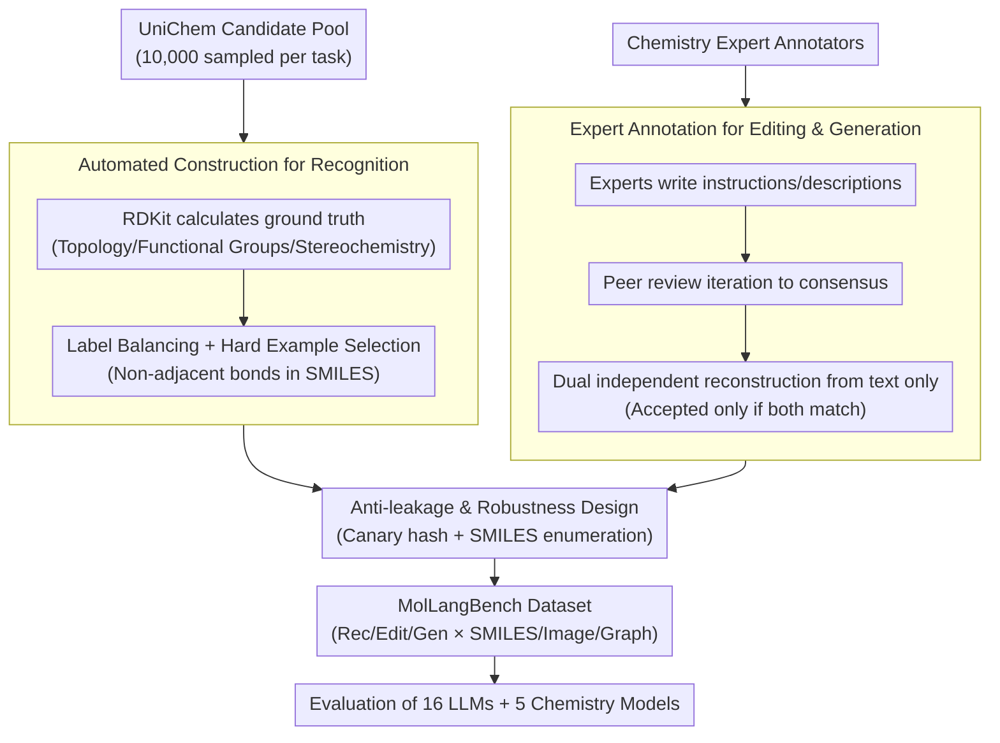

# MolLangBench: A Comprehensive Benchmark for Language-Prompted Molecular Structure Recognition, Editing, and Generation

**Conference**: ICLR 2026  
**arXiv**: [2505.15054](https://arxiv.org/abs/2505.15054)  
**Code**: [GitHub](https://github.com/TheLuoFengLab/MolLangBench) / [HuggingFace](https://huggingface.co/datasets/ChemFM/MolLangBench)  
**Area**: AI for Chemistry  
**Keywords**: molecular recognition, molecule editing, molecule generation, molecule-language alignment, benchmark

## TL;DR

This work proposes MolLangBench, a high-quality, unambiguous molecule-language interface benchmark constructed via automated tools and expert annotation. It covers recognition, editing, and generation tasks across SMILES, image, and graph modalities. Evaluations of 16+ commercial LLMs and 5 chemistry-specific models reveal that even GPT-5 remains significantly deficient in basic molecular operations (e.g., achieving only 43% in generation).

## Background & Motivation

**Background**: Recent research has attempted to align molecules with language. However, these methods typically target downstream mathematical tasks (e.g., property or reaction prediction), bypassing fundamental structural capabilities. Analogous to the success of vision-language modeling—where VLMs align text with visually observable content—current molecule-language models attempt to align symbolic molecular structures with unobservable chemical properties. This mismatch complicates alignment.  
**Limitations of Prior Work**: (1) Lack of systematic benchmarks to evaluate AI capabilities in basic molecular structural operations (recognition, editing, generation); (2) Existing benchmarks focus on high-level tasks (drug design, property prediction) while ignoring the prerequisite—whether the model truly "understands" molecular structure; (3) Existing datasets vary in quality and may contain ambiguity.  
**Key Challenge**: If AI cannot perform basic recognition and manipulation of molecular structures, complex chemical reasoning tasks (drug discovery, material design) remain untrustworthy. A chemist's workflow always begins with structural understanding.  
**Goal**: Provide the first systematic, high-quality assessment tool for fundamental molecule-language capabilities.  
**Key Insight**: Follow the actual workflow of chemists—progressing from structure recognition to manipulation and then to generation.  
**Core Idea**: Use deterministic, unambiguous, high-quality data to evaluate foundational molecular structural capabilities and expose current model deficiencies.

## Method

### Overall Architecture

MolLangBench aims to answer a prerequisite question bypassed by existing benchmarks: Can AI stably recognize, edit, and generate molecular structures? It decomposes this into three tasks of increasing difficulty: Molecular Structure Recognition (answering structural questions given a molecule: neighbor atoms, bond types, functional groups, ring structures, stereochemistry), Molecule Editing (modifying structures based on language instructions), and Molecule Generation (generating molecules from scratch based solely on text descriptions). Each task supports SMILES strings, molecular images (2D structures), and molecular graphs.

The primary challenge lies not in task definition but in constructing unambiguous datasets with unique answers. Recognition tasks rely on RDKit for automated ground-truth generation. Editing and generation tasks require a three-stage expert annotation pipeline. All data undergo anti-leakage and robustness checks before evaluating 16 commercial LLMs and 5 chemistry models. The overall process is as follows:

### Key Designs

**1. Automated Construction for Recognition: Using RDKit for Ground Truth to Eliminate Subjectivity**

Recognition tasks must avoid ambiguity. MolLangBench delegates answer generation to RDKit rather than humans. Ground truths for all recognition questions (single-hop neighbors, bond types, functional group identification, ring structures, stereochemistry) are automatically calculated. To ensure discriminative power, label-balanced sampling is performed from 10,000 candidates, specifically selecting harder examples—such as bonds connecting atoms that are non-adjacent in the SMILES string—forcing models to understand structure rather than relying on character proximity.

**2. Expert Annotation for Editing & Generation: Unambiguous Verification via Text-only Reconstruction**

Editing and generation cannot be automated via RDKit because they require precise mappings between high-quality language instructions/descriptions and structures. The team designed a three-stage pipeline: first, annotators with chemical backgrounds write instructions; second, peer reviewers iterate until consensus; third, two independent validators reconstruct the structure looking *only* at the text. A data point is accepted only if both independent reconstructions match the original molecule. This cost over 500 hours of expert effort.

**3. Anti-leakage & Robustness Design: Preventing Data Contamination and String Artifacts**

To ensure credibility, the benchmark excludes data leakage (where models have seen test data during pre-training) using unique hash canary strings. Robustness is verified via SMILES enumeration: the same molecule is represented by multiple equivalent SMILES strings starting from different atoms. Results showed an editing accuracy of $0.773 \pm 0.027$ across five augmentations, indicating that model capability is based on structure rather than specific string spelling.

### Loss & Training

MolLangBench does not perform model training. Evaluation metrics include: Exact Match (EM) accuracy for recognition and editing; Accuracy (whether the generated molecule meets all conditions) for generation, supplemented by Tanimoto similarity (molecular fingerprints) and $pass@k$ metrics.

## Key Experimental Results

### Main Results

**Evaluation of 16 Commercial LLMs** (SMILES modality, core test set):

| Model | Recognition Acc | Editing (Valid/Sim/Acc) | Generation (Valid/Sim/Acc) |
|------|----------|-------------------|-------------------|
| GPT-5 | 0.862 | 0.960/0.923/**0.855** | 0.920/0.741/**0.430** |
| o3 | 0.918 | 0.945/0.903/0.785 | 0.670/0.546/0.290 |
| o4-mini | 0.872 | 0.930/0.885/0.740 | 0.820/0.651/0.350 |
| Gemini-2.5-Pro | 0.852 | 0.930/0.881/0.745 | 0.865/0.737/0.430 |
| Claude-Opus-4.1 | 0.814 | 0.950/0.884/0.705 | 0.920/0.725/0.330 |
| Llama-4-Maverick | 0.614 | 0.895/0.772/0.545 | 0.875/0.511/0.115 |
| Qwen3-Max | 0.486 | 0.690/0.561/0.360 | 0.465/0.104/0.000 |

### Ablation Study

**Specialist Models vs. General LLMs**:

| Model Type | Recognition | Editing Acc | Generation Acc |
|---------|------|----------|----------|
| ChemDFM-13B | 0.300 | 0.025 | 0.000 |
| Galactica-120B | 0.290 | 0.040 | 0.000 |
| HIGHT (Graph-Lang) | 0.127 | 0.000 | 0.000 |
| GPT-4o (General) | 0.593 | 0.525 | 0.115 |

**SMILES vs. SELFIES Representation** (o3 model):

| Representation | Recognition | Editing Acc | Generation Acc |
|------|------|----------|----------|
| SMILES | 0.918 | 0.785 | 0.290 |
| SELFIES | 0.528 | 0.195 | 0.000 |

**$pass@k$ Results** (o3 model):

| Task | $pass@1$ | $pass@3$ | $pass@5$ |
|------|--------|--------|--------|
| Editing (Core) | 0.785 | 0.856 | 0.900 |
| Generation (Core) | 0.290 | 0.485 | 0.545 |

### Key Findings

1. **Generation task is extremely challenging**: The strongest model, GPT-5, achieved only 43.0% accuracy ($pass@5$ only 54.5%), indicating current AI capabilities in constructing structures from text are severely lacking.
2. **Error Analysis of o3**: Logic errors include invalid SMILES syntax, stereochemistry errors, chain length mismatches, substituent displacement, and ring structure errors. BPE tokenization issues in atom counting and enumeration are fundamental causes.
3. **SELFIES is inferior to SMILES**: Using the same o3 model, SELFIES generation accuracy was 0% due to the scarcity of SELFIES in LLM training data.
4. **Specialist models lag behind**: ChemDFM and Galactica perform significantly worse than general GPT-4o, suggesting scaling effects outweigh domain-specific pre-training.
5. **Structural understanding facilitates downstream reasoning**: Having GPT-4o describe a structure before predicting properties improved performance by approximately 5% (e.g., BBBP: 0.551 $\rightarrow$ 0.603).

## Highlights & Insights

- **Fills a critical gap**: Provides the first systematic benchmark for fundamental molecule-language structural capabilities based on the chemist's workflow.
- **High-quality data construction**: 500+ hours of expert annotation and a three-stage verification process ensure lack of ambiguity, which constitutes a core contribution.
- **Identifies path deviation**: Suggests that current research may be misdirected by skipping structural understanding for property prediction, similar to attempting reasoning in VLMs without object recognition.
- **Ecosystem support**: MolLangData provides large-scale training data to accompany the benchmark.

## Limitations & Future Work

- The core set for editing/generation consists of 200 samples each, which is relatively small due to the high cost of manual annotation.
- Molecules are restricted to < 40 heavy atoms (covering 93% of UniChem) and do not include biomacromolecules.
- Reliability on Mathpix API for image-to-SMILES conversion introduces an external error source during image modality evaluation.
- Evaluation focuses heavily on OpenAI models; coverage of open-source models could be expanded.

## Related Work & Insights

- **vs MoleculeNet**: While MoleculeNet focuses on property prediction, MolLangBench focuses on the language-molecular structure interface.
- **vs MolX/Uni-MRL**: These focus on property prediction and captioning, skipping the prerequisite of structural understanding.
- **Analogy to GPQA**: High-quality "diamond sets" (like GPQA's 198 samples) serve as gold standards for scientific reasoning; quality prevails over scale.
- **Insight**: AI for Science requires foundational testing before high-level task evaluation—this is the "GLUE moment" for chemistry.

## Rating

- Novelty: ⭐⭐⭐⭐ First comprehensive benchmark for the molecule-language structural interface, well-defined and aligned with real chemical workflows.
- Experimental Thoroughness: ⭐⭐⭐⭐⭐ Extremely comprehensive evaluation involving 16+ LLMs, 5 specialist models, 3 modalities, SELFIES, $pass@k$, error analysis, and downstream experiments.
- Writing Quality: ⭐⭐⭐⭐ Clear structure, well-motivated, and thoroughly argued.
- Value: ⭐⭐⭐⭐⭐ Provides a much-needed standardized tool for AI in chemistry and may shift research focus within the field.

<!-- RELATED:START -->

## Related Papers

- [\[ICLR 2026\] Memory, Benchmark & Robots: A Benchmark for Solving Complex Tasks with Reinforcement Learning](memory_benchmark_robots_a_benchmark_for_solving_complex_tasks_with_reinforcement.md)
- [\[ICLR 2026\] Capturing Visual Environment Structure Correlates with Control Performance](capturing_visual_environment_structure_correlates_with_control_performance.md)
- [\[ICLR 2026\] CoNavBench: Collaborative Long-Horizon Vision-Language Navigation Benchmark](conavbench_collaborative_long-horizon_vision-language_navigation_benchmark.md)
- [\[CVPR 2026\] Towards Training-Free Scene Text Editing](../../CVPR2026/robotics/towards_training-free_scene_text_editing.md)
- [\[ICLR 2026\] Self-Improving Vision-Language-Action Models with Data Generation via Residual RL](self-improving_vision-language-action_models_with_data_generation_via_residual_r.md)

<!-- RELATED:END -->
