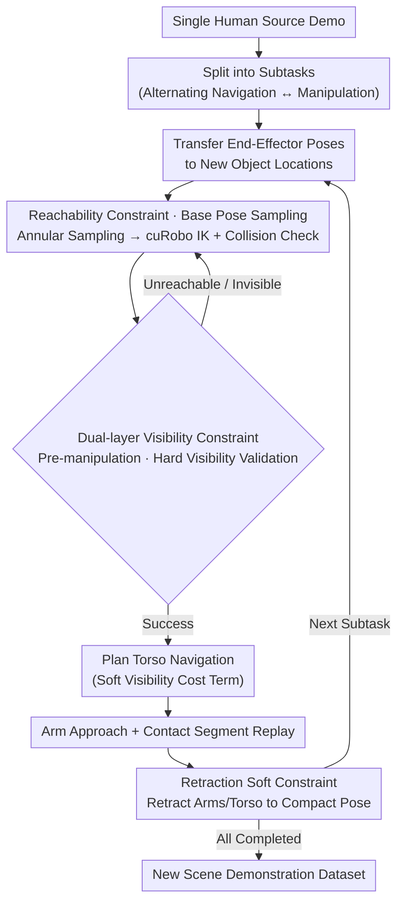

# MoMaGen: Generating Demonstrations under Soft and Hard Constraints for Multi-Step Bimanual Mobile Manipulation

**Conference**: ICLR 2026  
**arXiv**: [2510.18316](https://arxiv.org/abs/2510.18316)  
**Code**: [Project Page](https://momagen.github.io)  
**Area**: Reinforcement Learning  
**Keywords**: Mobile manipulation, bimanual coordination, constrained optimization, automated data generation, imitation learning

## TL;DR

MoMaGen models demonstration data generation for bimanual mobile manipulation as a constrained optimization problem. By synergizing hard constraints (reachability, collision-free, visibility) and soft constraints (object visibility during navigation, compact retracted poses), it automatically generates large-scale diverse datasets from a single human teleoperated demonstration. The trained visuo-motor policy can be deployed on physical robots with fine-tuning on only 40 real-world demonstrations.

## Background & Motivation

- **Background**: Learning from large-scale human teleoperation data (imitation learning) has proven to be an effective paradigm for training robot manipulation skills. The X-Gen series (MimicGen, SkillMimicGen, DexMimicGen, etc.) significantly reduces data collection costs by automatically generating 25x~350x data variants in simulation using a few human demonstrations as seeds. However, these methods primarily target tabletop manipulation with fixed bases.
- **Limitations of Prior Work**: Bimanual mobile manipulation faces two core new challenges: (1) **Reachability**—A mobile base means the base position needs to be re-planned in new scenarios. Directly replaying the navigation segments of source demonstrations often results in the arms being unable to reach targets after object positions change; (2) **Visibility**—Mobile bases use moving cameras. Naive data augmentation can cause task-relevant objects to move out of the camera's field of view, preventing the visuo-motor policy from making correct decisions.
- **Key Challenge**: Human teleoperation for bimanual mobile manipulation is extremely difficult (simultaneous control of the base plus two high-DOF arms), making data collection costly. Existing automated data generation methods cannot handle base motion and camera visibility, rendering them applicable only to simple tabletop tasks.
- **Goal**: Design a general automated data generation framework for bimanual mobile manipulation capable of generating high-quality, diverse demonstration data even under aggressive scene randomization (object positions, distractors, obstacles).
- **Key Insight**: Unify data generation as an optimization problem with hard and soft constraints. This abstraction not only applies to new mobile manipulation scenarios but also incorporates previous X-Gen methods into the same framework—differing only in the choice of constraints.
- **Core Idea**: Introduce four types of constraints: reachability (hard), object visibility during manipulation (hard), object visibility during navigation (soft), and compact retracted poses (soft). Use a sampling-validation loop to automatically discover base poses and whole-body trajectories that satisfy all constraints.

## Method

### Overall Architecture

MoMaGen decomposes a single human source demonstration into several subtasks (alternating navigation and manipulation segments) and regenerates trajectories for each subtask in randomized new scenes. For each subtask, the "end-effector relative to target object" pose from the source demo is first mapped to the object's new position. Then, a base pose is sampled within an annular region around the target, ensuring arm reachability and camera visibility. Subsequently, the system plans torso navigation, arm approach, contact segment replay, and finally arm retraction. If any validation step fails, the system backtracks and resamples until the entire trajectory satisfies all constraints. This pipeline essentially **solves an optimization problem with hard and soft constraints**—each validation step in the following diagram checks if a specific class of constraints is satisfied.

### Key Designs

**1. Constrained Optimization Formalization: Fitting all data generation methods into one framework**

The core abstraction of MoMaGen is formulating automated data generation as a constrained optimization problem. The optimization variables are the action sequence $\{a_t\}_{t \in [T]}$, which must satisfy system dynamics $s_{t+1} = f(s_t, a_t)$, kinematic feasibility $\mathcal{G}_{\mathrm{kin}}(s_t, a_t) \leq 0$, collision avoidance $\mathcal{G}_{\mathrm{coll}}(s_t, a_t) \geq 0$, visibility $\mathcal{G}_{\mathrm{vis}}(s_t, a_t, o_{i(t)}) \leq 0$, relative pose maintenance during contact segments $\mathbf{T}_W^{E_k} = \mathbf{T}_W^{o_i} (\mathbf{T}_W^{o_{i,\text{src}}})^{-1} \mathbf{T}_W^{E_k}$, and task success. The objective function $\mathcal{L}(\cdot)$ encodes user-specified soft constraints like trajectory length and smoothness. The value of this perspective is that previous methods like MimicGen, SkillMimicGen, and DexMimicGen are shown to be solving the same class of problem, just with different (and insufficient) subsets of constraints. Once unified, the differences between methods become clear, and extending capabilities only requires adding terms to the constraint set.

**2. Reachability Constraints and Base Pose Sampling: Replaying trajectories fails when the base moves**

Fixed-base methods can directly replay the base trajectory of a source demo. However, once objects are randomized to arbitrary locations on furniture (D1) or obstacles are added (D2), original base positions often make the target unreachable for the arms. MoMaGen instead randomly samples base poses $\mathbf{T}^{\mathrm{base}}$ in an annular region around the target object. It then uses inverse kinematics (IK) to verify that each segment of the transferred end-effector trajectories $\{\mathbf{T}_W^{E_k}\}$ falls within the arm's workspace, while using collision detection to prune candidates conflicting with furniture or obstacles. The entire IK solving and collision-free path planning is handled by the GPU-accelerated motion generator cuRobo, making massive sampling-validation cycles affordable—this is fundamentally why MoMaGen generates data in D1/D2 scenarios where baselines fail completely.

**3. Dual-layer Visibility Constraints: Must see during manipulation, try to see during navigation**

Mobile bases carry mobile cameras, and naive augmentation can easily throw target objects out of view. Since visuo-motor policies rely on RGB images, frequent object invisibility prevents learning reliable visual servoing. MoMaGen splits visibility into two intensity levels: before the manipulation phase begins, a **hard constraint** validates that the sampled base pose and head camera orientation can see the target object without occlusion (i.e., satisfying $\mathcal{G}_{\mathrm{vis}}(s_t, a_t, o_{i(t)}) \leq 0$); if not, it resamples. During navigation, a **soft constraint** adds a cost term to the motion planner that prefers camera orientations facing the target, encouraging but not forcing visibility. This hierarchy ensures data quality at critical moments without collapsing the generation success rate through over-constraint. Ablations show that removing all visibility constraints drops policy success in Tidy Table from 0.40 to 0.05.

**4. Retraction as a Soft Constraint: Retracting arms to clear the path for navigation**

After each manipulation subtask, the robot retracts its arms and torso to predefined "compact" joint angles to minimize its footprint. This step exists as a soft constraint to reduce the probability of collisions between the robot and the environment (especially ground obstacles in D2 scenes) during subsequent navigation segments, making long-horizon multi-step tasks easier to complete globally.

### Loss & Training

The data generation phase is a constraint sampling-validation loop (non-gradient optimization). For policy training, standard behavior cloning is used: $\arg\min_\theta \mathbb{E}_{(s,a) \sim \mathcal{D}} [-\log \pi_\theta(a|s)]$. Two policy learning methods are compared: WB-VIMA, trained from scratch using proprioception and three-channel RGB (fused into egocentric point clouds) to output target joint angles; and $\pi_0$, fine-tuned from pre-trained weights using LoRA (rank=32).

## Key Experimental Results

### Main Results

Four household tasks: Pick Cup, Tidy Table, Put Dishes Away, and Clean Frying Pan. Three randomization levels: D0 (±15cm/±15°), D1 (anywhere on furniture), and D2 (D1 + extra distractors and ground obstacles).

**Data Generation Success Rate Comparison**:

| Method | Pick Cup | Tidy Table | Put Dishes Away | Clean Frying Pan |
|------|----------|------------|-----------------|------------------|
| MoMaGen (D0) | 0.86 | 0.80 | 0.38 | 0.51 |
| SkillMimicGen (D0) | 1.00 | 0.69 | 0.38 | 0.40 |
| DexMimicGen (D0) | 1.00 | 0.72 | 0.38 | 0.35 |
| MoMaGen (D1) | 0.60 | 0.64 | 0.34 | 0.20 |
| MoMaGen (D2) | 0.47 | 0.22 | 0.07 | 0.16 |

Note: Baseline success rates in D1/D2 are zero (due to base pose replay placing objects out of reach) and are thus omitted.

**Task-Relevant Object Visibility Comparison**:

| Method | Pick Cup | Tidy Table | Put Dishes Away | Clean Frying Pan |
|------|----------|------------|-----------------|------------------|
| MoMaGen (D0) | 1.00 | 0.86 | 0.79 | 0.69 |
| SkillMimicGen (D0) | 1.00 | 0.40 | 0.71 | 0.65 |
| DexMimicGen (D0) | 1.00 | 0.39 | 0.71 | 0.67 |
| MoMaGen w/o vis. (D0) | 0.90 | 0.46 | 0.40 | 0.35 |
| MoMaGen (D1) | 0.93 | 0.89 | 0.78 | 0.80 |
| MoMaGen (D2) | 0.94 | 0.79 | 0.75 | 0.81 |

### Ablation Study

**Impact of Visibility Constraints on Policy Performance (WB-VIMA, 1000 demos, D0)**:

| Method | Pick Cup Success | Tidy Table Success |
|------|----------------|-------------------|
| MoMaGen (Full) | 0.75 | 0.40 |
| w/o Soft Visibility | ~0.55 | ~0.05 |
| w/o Hard Visibility | ~0.50 | ~0.05 |
| w/o All Visibility | ~0.45 | ~0.05 |

**$\pi_0$ Data Scaling Effect (Pick Cup D1)**:

| Num Demos | 500 | 1000 | 2000 |
|---------|-----|------|------|
| Success Rate Trend | Lower | Medium | Higher |

Increasing data volume under D1 randomization brings significant performance gains by covering larger state-action spaces.

**Sim-to-Real Results (Pick Cup D0, 40 real demos fine-tune)**:

| Method | With Sim Pre-training | Without Sim Pre-training |
|------|---------|---------|
| WB-VIMA | 10% | 0% |
| $\pi_0$ | 60% | 0% |

### Key Findings

- MoMaGen achieves an average generation success rate of 63% (D0) and is the only method capable of handling D1/D2 randomization.
- Visibility constraints significantly impact policy quality: In Tidy Table, success rate drops from 0.40 to 0.05 (87.5% decrease) after removing all visibility constraints.
- Data diversity is key: MoMaGen's D1 data covers entire tabletops rather than small corners; PCA projections show its joint angle distributions are far wider than baselines.
- $\pi_0$, despite having strong pre-trained weights (10k+ hours of robot data), still benefits significantly from simulation pre-training—improving from 0% to 60% success.

## Highlights & Insights

- **Insightful Unified Framework**: Unifying X-Gen methods under the "constrained optimization" perspective provides a clear theoretical basis for comparison and future extension. Defining new capabilities simply requires adding constraints to the set.
- **Dual-layer Visibility Design**: The distinction between manipulation (hard) and navigation (soft) phases demonstrates deep understanding of visual policy training. The 8x performance gap observed shows that visibility is a fundamental requirement, not an optional feature.
- **Complete Sim-to-Real Pipeline**: The progression from 1 human demo → 1000 sim variants → policy training → 40 real demo fine-tuning → 60% success demonstrates the practical utility of the X-Gen paradigm in complex bimanual mobile scenarios.

## Limitations & Future Work

- **Dependence on Full Scene Knowledge**: Data generation assumes full state information (exact object poses/geometry), which is available in simulation but requires external perception (e.g., SAM2) for real-world application.
- **Alternating Navigation-Manipulation**: The framework currently assumes these phases alternate and does not support whole-body coordinated manipulation (e.g., moving the base while opening a door).
- **High GPU Resource Requirements**: Reliance on cuRobo for motion generation is computationally intensive; simulation execution dominates the time (18s base planning vs 100s simulation execution).
- **Base Sampling Efficiency**: Uniform random sampling in annular regions can be slow when feasible poses are sparse; smarter sampling strategies (e.g., targeting large free spaces) could be introduced.
- **Success Rate in D2**: Success rates drop significantly under heavy obstacles (e.g., 7% for Put Dishes Away), indicating room for improvement in highly cluttered scenes.

## Related Work & Insights

- **vs MimicGen**: MimicGen pioneered the X-Gen series but only supports single-arm fixed-base tasks by replaying base trajectories. MoMaGen breaks this limitation via reachability constraints and base sampling.
- **vs SkillMimicGen**: SkillMimicGen added kinematic and collision constraints for obstacle scenes but remained limited to single-arm fixed bases. MoMaGen extends this to bimanual mobile bases with active cameras.
- **vs DexMimicGen**: DexMimicGen supports bimanual dexterous manipulation but lacks a mobile base and visibility considerations. MoMaGen adds mobile navigation, visibility constraints, and obstacle handling.
- **vs DemoGen/PhysicsGen**: These introduced collision-free and system dynamics constraints respectively, but neither supports mobile bases or active perception. MoMaGen is the first to satisfy all six classes of constraints simultaneously.

## Rating

- Novelty: ⭐⭐⭐⭐ The constrained optimization framework perspective is novel and the dual-layer visibility design is highly original, though underlying tools (IK, cuRobo) are existing technologies.
- Experimental Thoroughness: ⭐⭐⭐⭐⭐ Comprehensive coverage across four tasks, three randomization levels, multiple baselines, ablations, diversity analysis, and real-world deployment.
- Writing Quality: ⭐⭐⭐⭐ Clear formalization of the framework; logical experimental design and rich visualizations.
- Value: ⭐⭐⭐⭐ Addresses a critical need for automated data in bimanual mobile manipulation with a generalizable framework, though real-world reliance on full scene knowledge is a minor hurdle.

<!-- RELATED:START -->

## Related Papers

- [\[CVPR 2026\] AffordGen: Generating Diverse Demonstrations for Generalizable Object Manipulation with Affordance Correspondence](../../CVPR2026/robotics/affordgen_generating_diverse_demonstrations_for_generalizable_object_manipulatio.md)
- [\[ICLR 2026\] Differentiable Simulation of Hard Contacts with Soft Gradients for Learning and Control](differentiable_simulation_of_hard_contacts_with_soft_gradients_for_learning_and_.md)
- [\[ICLR 2026\] Robotic Manipulation by Imitating Generated Videos Without Physical Demonstrations](robotic_manipulation_by_imitating_generated_videos_without_physical_demonstratio.md)
- [\[ICML 2025\] Learning Dynamics under Environmental Constraints via Measurement-Induced Bundle Structures](../../ICML2025/robotics/learning_dynamics_under_environmental_constraints_via_measurement-induced_bundle.md)
- [\[CVPR 2026\] Scalable Trajectory Generation for Whole-Body Mobile Manipulation](../../CVPR2026/robotics/scalable_trajectory_generation_for_whole-body_mobile_manipulation.md)

<!-- RELATED:END -->
