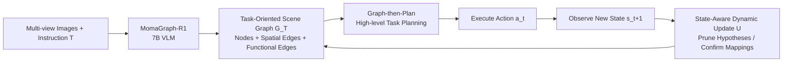

# MomaGraph: State-Aware Unified Scene Graphs with Vision-Language Models for Embodied Task Planning

**Conference**: ICLR 2026  
**OpenReview**: [https://openreview.net/forum?id=3eTr9dGwJv](https://openreview.net/forum?id=3eTr9dGwJv)  
**Project Page**: [https://HybridRobotics.github.io/MomaGraph/](https://HybridRobotics.github.io/MomaGraph/)  
**Code**: TBD  
**Area**: Robotics / Embodied AI, Scene Graphs, Vision-Language Models  
**Keywords**: Scene Graphs, Embodied Task Planning, Mobile Manipulation, Spatial-Functional Relationships, Reinforcement Learning, Graph-then-Plan  

## TL;DR
MomaGraph unifies spatial relationships, functional relationships, and part-level interaction nodes into a **task-oriented** scene graph. By training a 7B VLM with reinforcement learning to "graph then plan," it achieves a 71.6% accuracy on a self-built benchmark, surpassing the strongest baseline by 11.4 points.

## Background & Motivation
**Background**: Residential mobile manipulation robots require a compact, semantically rich scene representation to answer "where objects are, how to use them, and which parts are movable" for both navigation and manipulation. Scene graphs are naturally suited for this and have shown potential in downstream tasks like navigation, manipulation, and spatial intelligence.

**Limitations of Prior Work**: Three major flaws are identified in existing scene graphs. First, edges only encode a **single type** of relationship—either purely spatial (geometric layout) or purely functional (remote controls TV, knob adjusts parameters). Ignoring operability misses constraints, while ignoring space loses geometric grounding, leading to incomplete or non-executable representations. Second, most methods model **static snapshots**, failing to adapt to dynamic environments where object positions or states change. Third, they lack **task relevance**, failing to distinguish information useful for the current task, which reduces planning efficiency.

**Key Challenge**: Cognitive science indicates that human perception in new environments is **dynamic and task-oriented**—similar to viewing a map on an iPad, zooming from coarse localization to fine details. Existing scene graphs treat all information equally and in isolation. The core challenge is creating a representation that simultaneously accounts for "spatial layout + functional operability + part-level granularity + task alignment + state updates."

**Goal**: To construct a unified representation that integrates spatial-functional relationships and part-level interaction nodes, is compact and dynamically updatable, and is highly aligned with task instructions for embodied task planning.

**Core Idea**:
- **Unified Scene Graph Representation**: Merges spatial and functional relationships into a single graph for the first time, introducing part-level (handle/knob/button) interaction nodes to produce fine-grained, compact, and task-relevant structures.
- **Graph-then-Plan Paradigm**: Enables a single VLM to first generate a task-oriented scene graph as an intermediate structural representation, followed by high-level planning based on this graph to improve reasoning reliability and interpretability.
- **RL Training + Graph Alignment Reward**: Employs Reinforcement Learning (DAPO) with a specifically designed graph alignment reward to teach the VLM to actively "explore and reason" an accurate task-oriented graph rather than memorizing templates.

## Method

### Overall Architecture
Given a set of multi-view images $\{I_i\}_{i=1}^n$ and a natural language instruction $T$, MomaGraph constructs an instruction-conditioned task-oriented scene graph $G_T=(N_T, E^T_s, E^T_f)$. $N_T$ denotes task-relevant object nodes (including part-level nodes if necessary), $E^T_s$ encodes spatial relationships, and $E^T_f$ encodes functional relationships. Both types are directed edges from the "triggering object" to the "affected object." The pipeline consists of three steps: predicting the graph from multi-view observations using an RL-trained 7B VLM (MomaGraph-R1), performing Graph-then-Plan high-level planning using the graph as an intermediate representation, and dynamically updating the graph based on observed state changes during execution.

### Key Designs

**1. Unified Spatial-Functional Task-Oriented Scene Graph: Integrating "where" and "how to use."** In MomaGraph, nodes are not just coarse objects; they are a minimal set of task-relevant objects including part-level nodes like handles, knobs, or buttons when interaction is required (e.g., "opening a fridge" involves both the fridge and its handle). Edges carry two semantic sets: functional relationships define "the ability of one object to change the state of another," categorized into `[OPEN OR CLOSE]`, `[ADJUST]`, `[CONTROL]`, `[ACTIVATE]`, `[POWER BY]`, and `[PAIR WITH]` (the latter for assembly tasks affecting spatial configuration). Spatial relationships include 9 types across directional (left/right/front/back/higher/lower) and distance (near/far/touching) categories. Instructions deliberately **do not name** all relevant objects, forcing the model to ground natural language into the correct sets of objects and relationships.

**2. RL + Graph Alignment Reward: Teaching VLMs "how to draw" via feedback.** Since open-source VLMs often struggle to generate accurate task graphs directly, the DAPO algorithm is used to train Qwen2.5-VL-7B-Instruct on MomaGraph-Scenes with a three-part graph alignment reward $R(G^{pred}_T, G^{gt}_T)$. An action type term ensures correct action prediction $R_{action}=\mathbb{I}[a^{pred}=a^{gt}]$; a spatial-functional edge integration term aligns predicted edges with ground truth using semantic similarity $R_{edges}=\frac{1}{|E^T_{gt}|}\sum_{e_j\in E^T_{gt}}\max_{e_i\in E^T_{pred}}S_{edge}(e_i,e_j)$; and a node integrity term uses IoU to measure the overlap of task-relevant node sets $R_{nodes}=\frac{|N^{pred}_T\cap N^{gt}_T|}{|N^{pred}_T\cup N^{gt}_T|}$. The final reward includes JSON formatting checks $R_{format}$ and length penalties $R_{length}$: $R=w_a\cdot(R_{action}+R_{edges}+R_{nodes})+w_f\cdot R_{format}+w_l\cdot R_{length}$.

**3. State-Aware Dynamic Update: Converging one-to-many ambiguous edges via interaction.** In real environments, identical objects often coexist, and functional mappings are initially uncertain (e.g., several knobs on a stove where only one controls the target burner). MomaGraph focuses on absorbing observed state changes into the graph for disambiguation. At time $t$, functional edges in $G^{(t)}_T$ may contain one-to-many hypothesis mappings. After executing action $a_t$ and observing state $s_{t+1}$, the update function $G^{(t+1)}_T=U(G^{(t)}_T, a_t, s_{t+1})$ prunes inconsistent hypotheses and strengthens confirmed mappings.

## Key Experimental Results

### Main Results (Accuracy % on MomaGraph-Bench, w/ Graph setting)

| Type | Model | T1 | T2 | T3 | T4 | Overall |
|------|------|----|----|----|----|---------|
| Closed-source | Claude-4.5-Sonnet | 83.7 | 70.3 | 72.3 | 69.5 | 73.9 |
| Closed-source | GPT-5 | 79.8 | 68.2 | 75.0 | 63.6 | 71.6 |
| Closed-source | Gemini-2.5-Pro | 79.0 | 69.5 | 72.7 | 65.2 | 71.6 |
| Open-source | DeepSeek-VL2 (4.5B) | 56.9 | 53.6 | 61.3 | 45.4 | 54.3 |
| Open-source | **MomaGraph-R1 (7B)** | **76.4** | **71.9** | **70.1** | **68.1** | **71.6** |

MomaGraph-R1 achieves SOTA among open-source models at the 7B scale, with an Overall accuracy of 71.6% (+11.4 over the best baseline), matching or approaching closed-source models like GPT-5 and Gemini-2.5-Pro. All models perform better in the w/ Graph setting compared to w/o Graph, verifying the universal benefit of Graph-then-Plan.

### Ablation Study (Unified vs. Single Relationship, Overall %)

| Model | Spatial-only | Functional-only | Unified |
|------|-----------|-----------|----------------|
| MomaGraph-R1 | 59.9 | 64.9 | **71.6** |
| LLaVA-Onevision | 54.0 | 57.0 | **66.0** |

In fair comparisons with fixed graph topologies, the unified spatial-functional representation significantly outperforms either single-relationship variant across different base models, proving that the unified representation is the primary source of performance.

### Key Findings
- **Graph-then-Plan is generally effective**: Even strong models like GPT-5 miss prerequisite steps (e.g., forgetting to "plug in before turning on") when planning directly; generating a structural graph first ensures action sequences consistent with ground truth logic.
- **Single-relationship graphs are insufficient**: Neither spatial nor functional graphs alone can support embodied planning effectively; unified modeling is essential.
- **RL > Imitation**: DAPO with graph alignment rewards enables the 7B open-source model to gain robust generalization across environments and task configurations, which transfers to real robot experiments.
- The MomaGraph-Scenes dataset contains ~1,050 task subgraphs and 6,278 multi-view images, covering 350+ home scenes and 93 instructions. MomaGraph-Bench includes 294 scenes and 352 task graphs across 6 reasoning abilities and 4 difficulty tiers.

## Highlights & Insights
- **Unifying two disparate graph types** is the true conceptual contribution: The three-in-one (spatial + functional + part-level) approach allows the scene graph to "know where things are, how to use them, and which parts move," aligning with the dual "navigation + manipulation" requirements of mobile manipulation.
- **Decoupled Architecture**: Splitting "scene understanding" and "action generation" using an explicit intermediate structure improves reliability and interpretability, allowing a single VLM to handle both tasks without assuming pre-existing 3D graphs.
- **State-Aware Dynamic Updates**: Addresses the real-world pain point of ambiguity among identical objects through interaction feedback, formalizing "trial-and-error pruning" into a graph update function.
- **Comprehensive Infrastructure**: Providing the dataset, benchmark, and model fills a gap in this research direction, with the tiered benchmark design serving as a valuable reference for future work.

## Limitations & Future Work
- **Excludes low-level interaction policies**: State updates depend on the assumption that "actions are executed and states are correctly observed." The paper does not address the manipulation policy itself or handling observation noise and action failure.
- **Data Scale**: With ~1,050 subgraphs and 93 instructions primarily from AI2-THOR simulations, instruction diversity and real-world scene coverage remain limited.
- **Multiple-choice VQA Format**: Evaluating planning via multiple-choice simplifies scoring but leaves a gap between the benchmark and open-ended real-world planning.
- **Implementation of $U(\cdot)$**: Details on how the update function determines consistency and accumulates confidence are relatively brief, requiring further validation for robustness and scalability.

## Related Work & Insights
- **Scene Graphs**: Works like ConceptGraphs focus on spatial layouts and open-vocabulary geometric relations, while others focus on functional affordances. MomaGraph's contribution is the unification of these with part-level nodes and state modeling.
- **Zero-shot Embodied Planning with VLMs**: Standard VLMs are sensitive to visual noise and lack structural object-relation representations. Methods like SayPlan assume reliable 3D scene graphs exist, which is often unrealistic. MomaGraph enables a single VLM to perform both graph construction and planning jointly.
- **Insight**: For any task requiring structural intermediate representations before decision-making, using "RL + structure alignment rewards" to train models to produce their own representations is a promising path. Pruning representations to be task-oriented mirrors cognitive attention mechanisms and can be generalized to RAG, planning, and agent memory.

## Rating
- **Novelty**: ⭐⭐⭐⭐
- **Experimental Thoroughness**: ⭐⭐⭐⭐
- **Writing Quality**: ⭐⭐⭐⭐
- **Value**: ⭐⭐⭐⭐

<!-- RELATED:START -->

## Related Papers

- [\[ICLR 2026\] Planning with an Embodied Learnable Memory](planning_with_an_embodied_learnable_memory.md)
- [\[CVPR 2026\] RoboAgent: Chaining Basic Capabilities for Embodied Task Planning](../../CVPR2026/robotics/roboagent_chaining_basic_capabilities_for_embodied_task_planning.md)
- [\[ICML 2026\] Embodied Task Planning via Graph-Informed Action Generation with Large Language Models](../../ICML2026/robotics/embodied_task_planning_via_graph-informed_action_generation_with_large_language_.md)
- [\[CVPR 2026\] Recurrent Reasoning with Vision-Language Models for Estimating Long-Horizon Embodied Task Progress](../../CVPR2026/robotics/recurrent_reasoning_with_vision-language_models_for_estimating_long-horizon_embo.md)
- [\[ICLR 2026\] EVLP: Learning Unified Embodied Vision-Language Planner with Reinforced Supervised Fine-Tuning](evlp_learning_unified_embodied_vision-language_planner_with_reinforced_supervise.md)

<!-- RELATED:END -->
