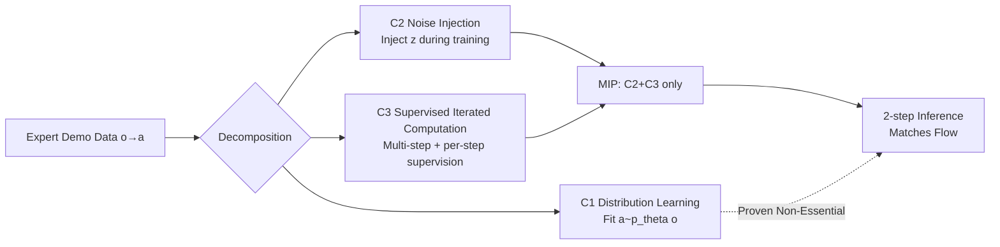

# Much Ado About Noising: Dispelling the Myths of Generative Robotic Control

**Conference**: ICLR 2026  
**OpenReview**: [https://openreview.net/forum?id=LzWKuxTKuW](https://openreview.net/forum?id=LzWKuxTKuW)  
**Code**: Project page (mentioned in abstract, link TBD)  
**Area**: Robot Control / Behavior Cloning / Generative Policy  
**Keywords**: Generative Control Policies, Behavior Cloning, Flow Models, Multimodality, Iterative Computation, Manifold Attraction  

## TL;DR
This paper systematically "demystifies" Generative Control Policies (GCP) for robotics. Through rigorous ablations across 28 behavior cloning benchmarks, the authors prove that the advantage of GCPs over regression policies stems not from multimodal modeling or expressivity, but from the combination of "noise injection during training + supervised iterative computation." Based on this, they design MIP—a minimal two-step policy without distribution fitting—that matches flow model performance.

## Background & Motivation
- **Background**: Generative architectures like diffusion and flow models (collectively termed GCPs) have become the mainstream for Imitation Learning/Behavior Cloning (BC), adopted by models ranging from Diffusion Policy to large-scale robotic models like $\pi_0$. The community generally believes the advantage of GCPs comes from "modeling the action distribution."
- **Limitations of Prior Work**: Industry hypotheses regarding why GCPs are strong—H1 better pixel control, H2 capturing multimodality, H3 stronger expressivity from iterative computation, H4 noise as representation/augmentation, H5 better scalability—have never been strictly validated. Most comparisons involve misaligned architectures, leading to severe confounding factors.
- **Key Challenge**: The goal of generative modeling (sampling high-quality and diverse samples to reproduce data distribution) differs fundamentally from the control goal (selecting an action that leads to good downstream performance). Is reproducing the expert distribution (especially multimodality) truly a **necessary condition** for strong control performance?
- **Goal**: Use controlled experiments to falsify these hypotheses, identify the minimal sufficient components for GCP success, and decouple them from "distribution fitting."
- **Core Idea**: **[Distribution fitting is a misconception]** GCP success is largely unrelated to "modeling distributions/multimodality." The components that actually function are the combination of **C2 Noise Injection** and **C3 Supervised Iterative Computation (SIC)**. Consequently, a two-step regression policy without any distribution learning can replicate flow model performance.

## Method

### Overall Architecture
The paper first falsifies old hypotheses through controlled experiments (with aligned architectures, GCP only leads in a few high-precision tasks; multimodality is non-existent; expressivity is not superior). The GCP design space is then decomposed into three orthogonal components: C1 Distribution Learning, C2 Noise Injection, and C3 Supervised Iterative Computation (SIC). A series of policy variants between RCP (Regression Control Policy) and GCP are constructed by combining C2/C3 **without C1**. The authors identify MIP, a minimal two-step policy containing both C2 and C3, which matches flow models, thereby attributing success to these components.

### Key Designs

**1. Three-component Taxonomy: Decomposing GCP into ablatable parts.** The paper posits that all GCPs can be decomposed into three elements: C1 (Distribution Learning) fits a conditional distribution $a \sim \pi_\theta(o)$ rather than deterministic prediction $a=\pi_\theta(o)$; C2 (Noise Injection) feeds random inputs $z$ into the network during training (e.g., $z$ in $I_t = ta+(1-t)z$ for flow models); C3 (Supervised Iterative Computation, SIC) feeds previous outputs back into the same network for refinement during inference, with **independent supervision signals for every step** during training. Flow models possess all three; regression policies (RCP) possess none.

**2. Falsifying Hypotheses – The necessity of architectural alignment.** The authors repurpose powerful architectures designed for diffusion/flow (Chi-Transformer, Sudeep-DiT, Chi-UNet, and $\pi_0$) as **regression policies** by setting noise levels and initial noise to zero ($z=0, t=0$). Under this fair alignment, GCP and RCP perform equally on most benchmarks, with GCP leading only in high-precision insertion tasks (Tool-Hang, Transport). Furthermore: (a) Multimodality is virtually absent—sampling multiple actions in tasks like Push-T or Kitchen multi-branch shows single clusters in t-SNE, and replacing sampling with the mean action $a=\mathbb{E}_{z}[\pi(z,o)]$ results in negligible performance loss (Table 1); (b) Expressivity is not higher—under $\kappa$-log-concave assumptions, the Lipschitz constant of a flow policy regarding observation $o$ is bounded by the flow field, and empirically, RCPs often exhibit higher Lipschitz constants (Table 3).

**3. MIP—A minimal two-step policy retaining only C2+C3.** Starting from Two-Step Denoising (TSD), MIP replaces the target of the first step $(t^\star)^{-1}I_{t^\star}$ with its expectation (direct supervision via ground truth $a$) and sets initial noise $I_0=0$ so that randomness $z$ only affects the second step. The training objective is:
$$\pi^{\text{MIP}}_\theta \approx \arg\min_\theta \mathbb{E}\big(\|\pi_\theta(o, I_0{=}0, t{=}0)-a\|^2 + \|\pi_\theta(o, I_{t^\star}, t^\star)-a\|^2\big),$$
Inference is deterministic in two steps: $\hat{a}_0 \leftarrow \pi_\theta(o,0,0)$, then $\hat{a} \leftarrow \pi_\theta(o, t^\star \hat{a}_0, t^\star)$. The key is that **both steps are supervised by ground truth $a$** (C3), the second step interpolation involves $z$ (C2), but **no distribution learning occurs** (no C1).

**4. Attributing advantage to "Manifold Attraction" rather than reconstruction accuracy.** The authors found that MIP, Flow, and RCP have **nearly identical** L2 reconstruction errors on validation sets, meaning validation loss does not predict performance. The differentiator is a new metric: "off-manifold norm," which measures the deviation of predicted actions from the subspace spanned by expert actions at neighboring states. Only MIP and Flow achieve low off-manifold error (Table 4), indicating that SIC (C3) "attracts" predictions back to the expert manifold, while noise (C2) stabilizes this iterative process by suppressing error accumulation.

## Key Experimental Results

### Main Results: MIP Matches Flow
Covering 28 BC benchmarks (state/image/point-cloud/language, including LIBERO 130 task multi-task VLA), the average success rate relative to Flow on the 7 hardest tasks is (Figure 1):

| Method | Components | Success Rate Relative to Flow |
|------|------|------------------|
| Regression (RCP) | None | 0.74 |
| Straight Flow (SF) | C2 only | 0.74 |
| Residual Regression (RR) | C3 only | 0.73 |
| **MIP (Ours)** | **C2+C3** | **1.02** |
| Flow (GCP) | C1+C2+C3 | 1.00 |

Standalone C2 (SF) or C3 (RR) fails to outperform regression; only the C2+C3 combination (MIP) matches or slightly exceeds flow models, with training times nearly half that of consistency models.

### Ablation Study and Diagnostic Evidence

| Diagnosis | Setup | Result | Conclusion |
|------|------|------|------|
| Sampling strategy (Table 1) | Push-T/Kitchen/Tool-Hang | Success rates for $z=0$ / $\mathcal{N}(0,I)$ / Mean are almost identical | No discrete action modes exist |
| Deterministic Expert (Table 2) | Re-sample data with deterministic policy | Flow 0.72 vs Reg 0.64; gap narrows but persists | Multimodality does not explain the gap |
| Lipschitz Constant (Table 3) | Average of 100 states | RCP is actually higher (Push-T State 0.90 vs Flow 0.45) | GCP expressivity is not higher |
| Manifold Attraction (Table 4) | Tool-Hang deterministic data | All have low Val L2; only MIP/Flow have low off-manifold L2 (0.054/0.042) | Performance driven by attraction, not reconstruction |

### Key Findings
- **Architecture > Objective**: The choice of action chunking length and network architecture impacts success rates significantly more than the "generative vs. regression" choice; GCP only leads by >5% in high-precision tasks.
- **Scalability**: Regression is stronger on the smallest models but scales poorly; MIP/Flow better utilize large model capacity due to C2+C3 (Figure 5).
- **Intermediate Step Supervision is Mandatory**: Variants that remove intermediate supervision or fail to condition on the timestep $t^\star$ perform worse than regression.

## Highlights & Insights
- **High "Demystification" Value**: By strictly benchmarking diffusion/flow architectures as regression policies, the paper punctures the long-held confusion that "GCP is strong because it models distributions."
- **MIP as an "Algorithmic Ablation" rather than just a new SOTA**: Its significance lies in providing a minimal reproducible unit proving C1 is discardable and C2+C3 is the core, offering a new sandbox for design without distribution fitting overhead.
- **Manifold Attraction as a Heuristic Perspective**: Decoupling control performance from "reconstruction accuracy" to "error along critical directions under o.o.d. states" provides a better predictor for closed-loop performance than validation loss.

## Limitations & Future Work
- **The Mechanism remains Mysterious**: The paper admits there is no known theory explaining why GCP/MIP achieves better manifold attraction than well-trained regression. Implicit regularization arguments from linear models are insufficient for MIP.
- **Scope Limitation**: Research focuses on flow-based GCPs and single/multi-task BC benchmarks; whether conclusions hold for diffusion, autoregressive tokens, or large-scale real-world VLAs remains to be verified.
- **"Hidden Multimodality" Not Entirely Ruled Out**: The gap between Flow and Regression narrows but does not disappear with deterministic experts, suggesting some unobserved multimodality might persist in sparse high-dimensional data.

## Related Work & Insights
- **Dialogue with Diffusion Policy / $\pi_0$**: Directly challenges the assertions by Chi et al. (2023) and Reuss et al. (2023) that "multimodality is the root of GCP success."
- **Distinction from flow-map/consistency models**: While MIP looks like a two-step flow-map, it is fundamentally different as it does not perform distribution learning and uses per-step supervision.
- **Insight**: For robot policy designers, effort is better spent on "supervised iteration + training noise" in a lightweight design space rather than struggling with distribution modeling; it also serves as a reminder to always align architectures when comparing generative vs. regression methods.

## Rating
- **Novelty**: ⭐⭐⭐⭐⭐ Systematically falsifies mainstream assumptions + proposes minimal counter-example MIP + introduces manifold attraction perspective.
- **Experimental Thoroughness**: ⭐⭐⭐⭐⭐ 28 benchmarks, 4 modalities, multiple architectures, theoretical proofs, and varied diagnostic evidence.
- **Writing Quality**: ⭐⭐⭐⭐ The logical chain is powerful, though some diagnostic details are dense.
- **Value**: ⭐⭐⭐⭐⭐ Shifts community understanding of GCP success and opens new directions for policy design excluding distribution fitting.

<!-- RELATED:START -->

## Related Papers

- [\[ICLR 2026\] Masked Generative Policy for Robotic Control](masked_generative_policy_for_robotic_control.md)
- [\[ICLR 2026\] Scaling up Memory for Robotic Control via Experience Retrieval](scaling_up_memory_for_robotic_control_via_experience_retrieval.md)
- [\[ICLR 2026\] Ctrl-World: A Controllable Generative World Model for Robot Manipulation](ctrl-world_a_controllable_generative_world_model_for_robot_manipulation.md)
- [\[ICLR 2026\] Action Chunking and Exploratory Data Collection Yield Exponential Improvements in Behavior Cloning for Continuous Control](action_chunking_and_data_augmentation_yield_exponential_improvements_in_behavior.md)
- [\[ICLR 2026\] Grounding Generative Planners in Verifiable Logic: A Hybrid Architecture for Trustworthy Embodied AI](grounding_generative_planners_in_verifiable_logic_a_hybrid_architecture_for_trus.md)

<!-- RELATED:END -->
