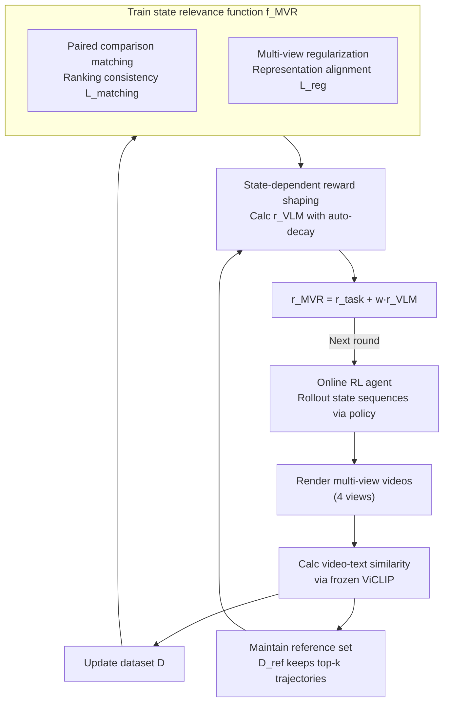

# MVR: Multi-view Video Reward Shaping for Reinforcement Learning

**Conference**: ICLR 2026  
**arXiv**: [2603.01694](https://arxiv.org/abs/2603.01694)  
**Code**: [https://mvr-rl.github.io/](https://mvr-rl.github.io/)  
**Area**: Reinforcement Learning  
**Keywords**: Visual Reward Shaping, Multi-view Video, Reinforcement Learning, Vision-Language Models, State Relevance Learning

## TL;DR
The MVR framework is proposed to utilize video-text similarity from multi-view videos to learn a state relevance function. Combined with state-dependent reward shaping (automatically decaying VLM guidance), it outperforms existing VLM reward methods across 19 tasks in HumanoidBench and MetaWorld.

## Background & Motivation

**Background**: Reward design is critical in reinforcement learning. A recent emerging paradigm involves using image-text similarity from VLMs as visual signals to enhance rewards (e.g., VLM-RM, RoboCLIP), guiding agents to visit states that match task descriptions.

**Limitations of Prior Work**: (a) **Limitations of static images**: Single-frame image-text similarity cannot characterize dynamic motion—optimizing single-frame similarity may cause the agent to repeatedly stop at the frame "most similar to running" rather than actually performing the rhythmic motion of running (which requires alternating legs). (b) **Single-view occlusion**: A single camera angle leads to occlusions between robot limbs, creating view-dependent biases. (c) **Lack of adaptive decay**: Existing methods simply perform a linear superposition of VLM scores and task rewards, which may alter the optimal policy.

**Key Challenge**: Visual guidance provided by VLMs is valuable in the early stages of learning (assisting in discovering correct motion patterns), but if applied continuously, it may conflict with task objectives—necessitating a "use first, release later" mechanism.

**Goal**: (a) Replace static images with video to accurately evaluate dynamic motion quality; (b) eliminate occlusion bias using multiple views; (c) design automatically decaying reward shaping to avoid persistent conflict between VLM guidance and task rewards.

**Key Insight**: Instead of directly fitting VLM scores (due to the excessive semantic gap), maintain ranking consistency between video space and state space through paired comparisons; use multi-view regularization to eliminate view bias; and design an automatic decay mechanism based on the Bradley-Terry model.

**Core Idea**: Learn a state-space relevance ranking function from multi-view videos, and then generate an automatically decaying reward shaping signal through comparison with a reference set.

## Method

### Overall Architecture
MVR addresses how a frozen Vision-Language Model (VLM) can guide RL online, correcting dynamic motion without long-term deviation. It decomposes this into an online loop of training and self-improvement: the agent interacts with the environment according to the current policy to accumulate state sequences, while MVR periodically renders these trajectories into multi-view videos. It then uses frozen ViCLIP to calculate video-text similarities, learns a **state relevance function** $f^{\text{MVR}}$ based on these, and finally produces a visual feedback reward that is "strong early on and automatically zeroed later" for the agent.

The key to the pipeline is that similarity scores are not used directly as rewards. Instead, they are distilled into two components: a complete dataset $\mathcal{D}$ for training $f^{\text{MVR}}$, and a reference set $\mathcal{D}^{\text{ref}}$ containing only optimal trajectories to act as a proxy for the "optimal policy." Reward shaping then compares $f^{\text{MVR}}$ with $\mathcal{D}^{\text{ref}}$ to determine how much current behavior lags behind the best; as the gap closes, the feedback weakens until it decays to zero.

### Key Designs

**1. Paired Comparison Matching: Bypassing the semantic gap between states and videos using ranking consistency**

Directly regressing state space to VLM-provided video-text similarity scores is difficult because state vectors and video features are not in the same semantic space. MVR instead requires only that their **rankings** be consistent: given two videos $\mathbf{o}, \mathbf{o}'$, the Bradley-Terry model converts the VLM similarity difference into a preference probability $h_{\text{vid}}(\mathbf{o}, \mathbf{o}') = \sigma(\psi^{\text{VLM}}(\mathbf{o}, \ell) - \psi^{\text{VLM}}(\mathbf{o}', \ell))$. It then requires that the ranking calculated from state space $h_{\text{state}}(\mathbf{s}, \mathbf{s}')$ aligns with this, using cross-entropy as the matching loss $L_{\text{matching}}$. This is similar to preference learning (RLHF) but fits continuous probabilities rather than binary labels, making it smoother and more stable. Because cross-view video pairs share the same state sequence, comparison data can be naturally augmented.

**2. Multi-view Regularization: Eliminating systematic bias from camera angles**

When viewed from a single angle, certain limbs may be occluded, while frontal views often have inflated scores due to better visibility, mixing view-dependent bias into relevance ratings. MVR explicitly splits the relevance function into two parts $f^{\text{MVR}}(s) = \langle g^{\text{rel}}, g^{\text{state}}(s) \rangle$—a state encoder $g^{\text{state}}$ and a learnable relevance direction $g^{\text{rel}}$. It adds a regularization term $L_{\text{reg}} = |\psi^{\text{VLM}}(\mathbf{o}_i, \mathbf{o}_j) - \langle \bar{g}^{\text{state}}(\mathbf{s}_i), \bar{g}^{\text{state}}(\mathbf{s}_j) \rangle|$, forcing the similarity structure between state representations to align with the (cross-view averaged) video representations. This decouples "representation learning" (anchored by $L_{\text{reg}}$) from "relevance scoring" (picking the direction $g^{\text{rel}}$ via $L_{\text{matching}}$), allowing multi-view information to be aggregated effectively.

**3. Reference Set Maintenance: Approximating the optimal policy $\pi^\ell$ with historical best trajectories**

The decay mechanism requires an optimal policy $\pi^\ell$ as a benchmark. Training a separate policy to approximate this is costly and lacks samples. MVR reuses online experience: $\mathcal{D}^{\text{ref}}$ retains only the $k=10$ state sequences with the highest cross-view aggregated similarity, effectively "recalling its own best attempts." This avoids expert demonstrations or extra training, reducing the cost of obtaining a reference policy to near zero.

**4. State-dependent Reward Shaping: Making VLM guidance strong early and zeroing out later**

Existing methods superimpose VLM scores and task rewards with fixed weights, leading to persistent guidance that may alter the optimal policy. MVR reformulates the objective as "making the current policy indistinguishable from the optimal policy $\pi^\ell$." Defining policy relevance as $h^\pi = \sum_s f^{\text{MVR}}(s) d^\pi(s)$, it optimizes $\max_\pi v^\pi + w \log(\sigma(h^\pi - h^{\pi^\ell}))$, and expands this using Jensen's inequality into a per-state shaping signal:

$$r^{\text{VLM}}(s) = \mathbb{E}_{s' \sim \pi^\ell}[\log(\sigma(f^{\text{MVR}}(s) - f^{\text{MVR}}(s')))],$$

where the expectation over $\pi^\ell$ is approximated by sampling the reference set $\mathcal{D}^{\text{ref}}$. Crucially, this signal decays naturally: as the agent's behavior aligns with $\mathcal{D}^{\text{ref}}$, $f^{\text{MVR}}(s) \approx f^{\text{MVR}}(s')$, so $r^{\text{VLM}} \to 0$. VLM guidance exits the loop and no longer competes with the task reward $r^{\text{task}}$.

### Loss & Training

State relevance model training: $L_{\text{rel}} = L_{\text{matching}} + L_{\text{reg}}$, updated every 100K steps with early stopping. Final reward: $r^{\text{MVR}}(s) = r^{\text{task}}(s) + w \cdot r^{\text{VLM}}(s)$, with $w \in \{0.01, 0.1, 0.5\}$ determined by grid search. Rendering frequency: 1 out of every 9 trajectories is rendered from random viewpoints with 64-frame segments. ViCLIP-L (428M parameters) is utilized.

## Key Experimental Results

### Main Results

HumanoidBench results over 9 tasks (10M steps, 3 seeds):

| Task | MVR | TQC | VLM-RM | RoboCLIP | DreamerV3 |
|------|-----|-----|--------|----------|-----------|
| Walk | **927.47** ✓ | 510.58 | 535.35 | 737.34 ✓ | 800.2 ✓ |
| Run | **749.23** ✓ | 647.87 | 14.93 | 501.15 | 633.8 |
| Slide | **735.03** ✓ | 514.91 | 163.13 | 494.20 | 436.5 |
| Stand | **918.55** ✓ | 576.59 | 728.69 | 849.73 ✓ | 622.7 |
| Sit_Hard | **756.67** ✓ | 511.85 | 322.95 | 559.38 | 433.4 |
| Avg Rank | **1.67** | 3.11 | 3.78 | 2.89 | 3.56 |

MetaWorld over 10 tasks (1M steps, 5 seeds, success rate): MVR average rank 1.50, RoboCLIP 2.00, VLM-RM 2.40.

### Ablation Study

| Variant | Description |
|------|------|
| w/o reg (Removing $L_{\text{reg}}$) | Performance dropped across multiple tasks, validating multi-view regularization. |
| w/o reference (Using $f^{\text{MVR}}$ directly) | Lacks automatic decay; some tasks overfit to VLM guidance. |
| MVR-CLIP (Using images instead of video) | Dynamic tasks (Run, Walk) degraded severely—single frames cannot represent rhythmic motion. |
| direct (Directly fitting VLM scores) | Semantic gap led to unstable learning. |
| Number of views (1→4) | Multi-view is generally beneficial; Stand only needs a single view (static pose). |

### Key Findings
- MVR is optimal in 5/9 HumanoidBench tasks with the best average rank (1.67), and is the only method to reach the success threshold for both Walk and Run.
- VLM-RM failed completely on the Run task (14.93 vs 749.23) because single-frame similarity induced the agent to hold a "running pose" rather than actually running.
- Multi-view is significantly beneficial for dynamic tasks and has less impact on static pose tasks.
- The automatic decay mechanism is crucial: case studies show MVR can correct poor posture early and then exit, allowing the agent to focus on speed optimization.

## Highlights & Insights
- **Fundamentally solves visual evaluation of dynamic motion**: Replacing images with video is a natural but overlooked choice. The paper clearly demonstrates the dramatic failure of single-frame methods on running tasks (VLM-RM: 14.93).
- **Clever design of paired comparison**: Avoiding direct regression of VLM scores (semantic gap) in favor of ranking consistency is robust, similar to the logic behind RLHF's success.
- **Elegant automatic decay mechanism**: $r^{\text{VLM}}$ naturally tends toward zero as behavior improves, removing the need for manually designed decay schedules.
- **Reference set as "best memories"**: Using the top-k online trajectories to approximate the target policy avoids the overhead of expert demonstrations.

## Limitations & Future Work
- Validated only in simulation; not tested on real robots where multi-view rendering would require multi-camera setups.
- Although rendering 1/9 trajectories reduces overhead, the reliance on ViCLIP (428M parameters) still involves significant computational cost.
- The weight $w$ still requires grid searching; while auto-decay eases tuning, the initial weight still impacts performance.
- Performance on Balance_Simple and Balance_Hard tasks was suboptimal (VLM-RM performed better), possibly because their visual signals are more suited to static evaluation.
- The quality of $\mathcal{D}^{\text{ref}}$ depends on exploration—if early exploration is insufficient, the reference set may be poor.

## Related Work & Insights
- **vs VLM-RM (Rocamonde et al., 2024)**: VLM-RM uses CLIP image-text similarity + fixed weights. MVR uses ViCLIP video-text + auto-decay. The comparison on the Run task (749 vs 15) is the strongest evidence.
- **vs RoboCLIP (Sontakke et al., 2024)**: RoboCLIP also uses video-text similarity but provides only trajectory-level sparse rewards. MVR learns state-level dense relevance functions for finer guidance.
- **vs RLHF**: MVR's paired comparison + BT model is related to RLHF, but the "preference" comes from the VLM rather than humans.
- **Transfer Potential**: The Multi-view + State Relevance Learning framework can be transferred to any scenario requiring behavior evaluation from video (e.g., sports training analysis, surgical skill assessment).

## Rating
- Novelty: ⭐⭐⭐⭐ The combination of video, multi-view, and auto-decay is complementary and appropriate.
- Experimental Thoroughness: ⭐⭐⭐⭐⭐ Systematic design with 19 tasks and comprehensive ablations.
- Writing Quality: ⭐⭐⭐⭐ Clear methodological derivation, though the notation requires careful reading.
- Value: ⭐⭐⭐⭐ Substantial advancement in VLM-driven RL reward design, both practical and scalable.

<!-- RELATED:START -->

## Related Papers

- [\[CVPR 2026\] General Process Reward Modeling for Robotic Reinforcement Learning](../../CVPR2026/robotics/general_process_reward_modeling_for_robotic_reinforcement_learning.md)
- [\[ICLR 2026\] ViPRA: Video Prediction for Robot Actions](vipra_video_prediction_for_robot_actions.md)
- [\[AAAI 2026\] Scalable Multi-Objective and Meta Reinforcement Learning via Gradient Estimation](../../AAAI2026/robotics/scalable_multi-objective_and_meta_reinforcement_learning_via_gradient_estimation.md)
- [\[ACL 2026\] Mango: Multi-Agent Web Navigation via Global-View Optimization](../../ACL2026/robotics/mango_multi-agent_web_navigation_via_global-view_optimization.md)
- [\[NeurIPS 2025\] Sample Complexity of Distributionally Robust Average-Reward Reinforcement Learning](../../NeurIPS2025/robotics/sample_complexity_of_distributionally_robust_average-reward_reinforcement_learni.md)

<!-- RELATED:END -->
