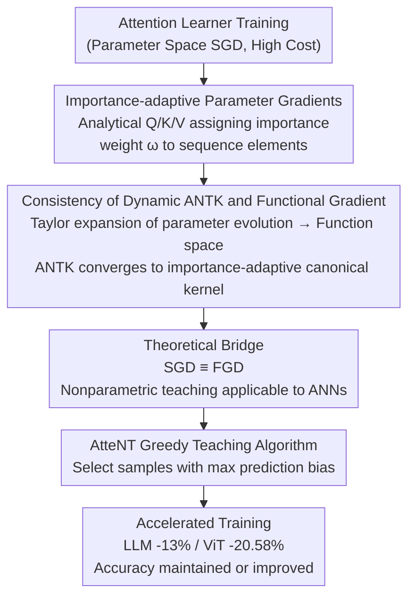

# Nonparametric Teaching of Attention Learners

**Conference**: ICLR 2026  
**arXiv**: [2602.20461](https://arxiv.org/abs/2602.20461)  
**Area**: Training Efficiency/Learning Theory  
**Keywords**: Nonparametric Teaching, Attention Mechanism, Functional Gradient, Training Acceleration, Kernel Methods

## TL;DR

This paper proposes AtteNT, which reinterprets the training process of attention learners (Transformer/ViT) from the perspective of nonparametric teaching theory. By analytically deriving the importance-adaptive role of attention in parameter gradients, the authors prove that dynamic ANTK converges to the importance-adaptive canonical kernel in functional gradients, bridging the gap between parameter and functional spaces. A greedy teaching algorithm is introduced to select samples with the largest prediction bias, accelerating training by 13.01% for LLM fine-tuning and 20.58% for ViT pre-training while maintaining or improving accuracy.

## Background & Motivation

**Background**: Attention-based learners such as Transformers and ViTs have achieved significant success in NLP and CV. However, their training costs are extremely high—LLM pre-training requires millions of sentences, and video understanding requires even larger data scales. Reducing training costs has become an urgent demand.

**Limitations of Prior Work**:

1.  **Limited Applicability of Nonparametric Teaching**: Existing nonparametric teaching theories accelerate learning by selecting teaching samples but are primarily restricted to MLP learners, neglecting the impact of attention mechanisms.
2.  **Gap between Parameter and Functional Spaces**: Attention networks (ANNs) are trained via Stochastic Gradient Descent (SGD) in the parameter space, while nonparametric teaching utilizes Functional Gradient Descent (FGD) in the function space. The consistency between these two has not been proven.
3.  **Ambiguity in Attention Learning Dynamics**: The attention mechanism assigns different importance to sequence elements via Query, Key, and Value ($Q, K, V$). How this affects the structure of parameter gradients remains unanalyzed.

**Key Challenge**: While nonparametric teaching theory has the potential to accelerate training, a theoretical gap exists between its mathematical foundation (FGD) and practical training (SGD). Extending this from MLPs to ANNs is non-trivial.

**Goal**: Systematically resolve the role of attention in parameter gradients, prove the consistency between SGD and FGD for ANNs, and directly apply the greedy selection algorithm of nonparametric teaching to accelerate attention learners.

## Method

### Overall Architecture

AtteNT addresses the high training costs of Transformers and ViTs by using principled sample selection rather than heuristics. The framework establishes a link from parameter space to functional space and finally to the training algorithm in three steps: first, it analyzes the gradient structure of attention in parameter space; second, it maps the parameter evolution trajectory to the functional space using dynamic ANTK to prove convergence with FGD; third, it implements a greedy selection algorithm that prioritizes samples with the largest prediction bias to accelerate convergence.

### Key Designs

**1. Importance-adaptive Parameter Gradients: Distinguishing Attention from MLP**

The first step in extending nonparametric teaching to ANNs is clarifying the parameter gradient structure. For a single-head self-attention network $f_\theta(\mathbf{S}) = \text{softmax}(\frac{\mathcal{Q}(\mathbf{S})\mathcal{K}(\mathbf{S})^\top}{\sqrt{d}})\mathcal{V}(\mathbf{S})$, the authors derive the explicit form of the gradient. Taking the Query weight column as an example: $\frac{\partial f_\theta(\mathbf{S})}{\partial \mathbf{W}^Q_{(:,i)}} = [d^{-1/2}\,\mathbf{S}_{(j,:)}\cdot\omega_j]_{S\times d}$. Crucially, the gradient depends not only on the features $\mathbf{S}_{(j,:)}$ but also on an element-specific scalar $\omega_j$ determined by $Q, K, V$, which represents the attention importance weight. This implies that attention learner updates are inherently "importance-adaptive," providing the basis for alignment with nonparametric teaching kernels.

**2. Consistency of Dynamic ANTK and Functional Gradients: Bridging the Space Gap**

Nonparametric teaching is founded on FGD in function space, whereas ANNs use SGD in parameter space. By applying Taylor expansion to the parameter evolution, it is rewritten in functional form:

$$\frac{\partial f_{\theta^t}}{\partial t} = -\frac{\eta}{NS}\left[\frac{\partial \mathcal{L}}{\partial f_{\theta^t}(\mathbf{S}_1)},\ldots,\frac{\partial \mathcal{L}}{\partial f_{\theta^t}(\mathbf{S}_N)}\right]\cdot[K_{\theta^t}(\mathbf{S}_i,\cdot)]_N + o(\cdot)$$

Where $K_{\theta^t}(\mathbf{S}_i,\cdot)\coloneqq\langle\frac{\partial f_{\theta^t}(\mathbf{S}_i)}{\partial\theta^t},\frac{\partial f_{\theta^t}(\cdot)}{\partial\theta^t}\rangle$ is the dynamic Attention Neural Tangent Kernel (ANTK). Theorem 3 proves that under a convex loss $\mathcal{L}$, this dynamic kernel converges pointwise to the importance-adaptive canonical kernel in FGD: $\lim_{t\to\infty}K_{\theta^t}(\mathbf{S}_i,\cdot)=K(\mathbf{S}_i,\cdot)$. This equates training ANNs via SGD with teaching a nonparametric learner via FGD.

**3. AtteNT Greedy Teaching Algorithm: Principle-based Sample Selection**

With the theoretical bridge established, training acceleration is achieved by selecting samples that maximize the functional gradient projection. Since the norm of the loss derivative correlates with prediction bias, the selection rule chooses the batch with the largest bias: $\{\mathbf{S}_i\}_m^* = \arg\max_{\{\mathbf{S}_i\}_m\subseteq\{\mathbf{S}_i\}_N}\|[f_\theta(\mathbf{S}_i)-f^*(\mathbf{S}_i)]_m\|_\mathcal{F}$. This follows the intuition of "teaching what the model understands least." Proposition 4 ensures that under Lipschitz smoothness, this selection maintains convergence while compressing data volume: $\frac{\partial \mathcal{L}}{\partial t}\leq-\frac{\eta\gamma}{2}(\frac{1}{NS}\sum_{i,j}\frac{\partial \mathcal{L}}{\partial f_{\theta^t}(\mathbf{S}_i)_{(j,:)}})^2$. Practical implementation uses Gumbel-Top-k Soft sampling and an incremental selection ratio to balance efficiency and robustness.

## Key Experimental Results

### Main Results 1: LLM Fine-tuning (NLG Tasks)

| Model | AtteNT | Avg Time↓ | GSM8K↑ | MATH↑ | HumanEval↑ | MBPP↑ | MT-Bench↑ |
|------|--------|---------|--------|-------|-----------|-------|----------|
| LLaMA 2-7B | w/o | 246m | 42.96 | 5.06 | 18.35 | 35.65 | 4.58 |
| LLaMA 2-7B | **w** | **213m** | **43.45** | **6.48** | **21.80** | **37.61** | 4.49 |
| Mistral-7B | w/o | 204m | 69.13 | 20.06 | 43.42 | 58.52 | 5.03 |
| Mistral-7B | **w** | **180m** | **71.26** | **23.12** | **46.55** | **61.74** | **5.32** |
| Gemma-7B | w/o | 228m | 75.23 | 30.52 | 53.83 | 65.69 | 5.42 |
| Gemma-7B | **w** | **201m** | **77.74** | **31.40** | **54.26** | **66.28** | **5.44** |

AtteNT reduced training time by 12.78% on average, while improving GSM8K scores by 1.39-2.42 points and MATH scores by 0.76-2.89 points.

### Main Results 2: ViT Pre-training (CV Tasks)

| Model | AtteNT | Pre-train Time↓ | ImageNetS50↑ | NYUv2(S)↑ | NYUv2(D)↑ |
|------|--------|-----------|-------------|----------|----------|
| Multi-Modal MAE | w/o | 1234m | 92.2 | 51.9 | 52.1 |
| Multi-Modal MAE | **w** | **980m(-20.58%)** | **92.3** | **52.6** | **57.2(+5.1%)** |

Training time decreased by 20.58%, with performance gains across downstream tasks, particularly in depth estimation (+5.1%).

### Ablation Study: Data Selection Strategy

| Ratio Strategy | Interval Strategy | Selection Strategy | Training Time | ImageNetS50 | NYUv2(S) | NYUv2(D) |
|----------|-------------|-------------|---------|-------------|----------|----------|
| - | - | -(Standard) | 1234m | 92.2 | 51.9 | 52.1 |
| Cosine | Incremental | Random | 966m | 88.6 | 45.3 | 49.6 |
| Cosine | Incremental | Hard | 972m | 91.8 | 49.5 | 57.3 |
| **Incremental** | **Incremental** | **Soft** | **980m** | **92.3** | **52.6** | **57.2** |
| Incremental | Fixed | Soft | 1319m | 92.4 | 53.7 | 62.1 |

The Soft strategy (Gumbel-Top-k sampling) provides the best balance. Random selection degrades accuracy, while Hard selection lacks robustness.

## Highlights & Insights

- **Theoretical Elegance**: Instead of heuristic data selection, the method is supported by a complete theoretical framework involving RKHS, functional gradients, and kernel convergence.
- **Contribution of ANTK**: Successfully extends NTK (Neural Tangent Kernel) from fully connected networks to attention mechanisms, providing a significant theoretical tool.
- **Pedagogical Intuition**: Selecting the "least understood" samples aligns with curriculum learning but is backed by a stronger kernel theory.
- **Efficient "Free Lunch"**: Achieving 13-21% acceleration without accuracy loss demonstrates that nonparametric teaching provides principled guidance for data selection.

## Limitations & Future Work

- Theoretical analysis is focused on single-layer, single-head self-attention; multi-layer/multi-head extensions are applied but not fully proven.
- Evaluating biases at the start of each epoch adds selection overhead (though overall time is still saved).
- Validation on ultra-large scale pre-training (e.g., GPT-scale) has not yet been conducted.

## Rating

- Novelty: ⭐⭐⭐⭐⭐ First establishment of nonparametric teaching theory for attention learners.
- Experimental Thoroughness: ⭐⭐⭐⭐ Covers NLP/CV, pre-training/fine-tuning, and multiple models.
- Writing Quality: ⭐⭐⭐⭐⭐ Rigorous derivations tightly coupled with experimental verification.
- Value: ⭐⭐⭐⭐ Significant theoretical and practical contribution to Transformer efficiency.

<!-- RELATED:START -->

## Related Papers

- [\[NeurIPS 2025\] Knolling Bot: Teaching Robots the Human Notion of Tidiness](../../NeurIPS2025/robotics/knolling_bot_teaching_robots_the_human_notion_of_tidiness.md)
- [\[CVPR 2026\] AVA-VLA: Improving Vision-Language-Action models with Active Visual Attention](../../CVPR2026/robotics/ava_vla_improving_vision_language_action_models_with_active_visual_attention.md)
- [\[ECCV 2024\] AFF-ttention! Affordances and Attention models for Short-Term Object Interaction Anticipation](../../ECCV2024/robotics/aff-ttention_affordances_and_attention_models_for_short-term_object_interaction_.md)
- [\[AAAI 2026\] TTF-VLA: Temporal Token Fusion via Pixel-Attention Integration for Vision-Language-Action Models](../../AAAI2026/robotics/ttf-vla_temporal_token_fusion_via_pixel-attention_integratio.md)
- [\[NeurIPS 2025\] Beyond Parallelism: Synergistic Computational Graph Effects in Multi-Head Attention](../../NeurIPS2025/robotics/beyond_parallelism_synergistic_computational_graph_effects_in_multi-head_attenti.md)

<!-- RELATED:END -->
