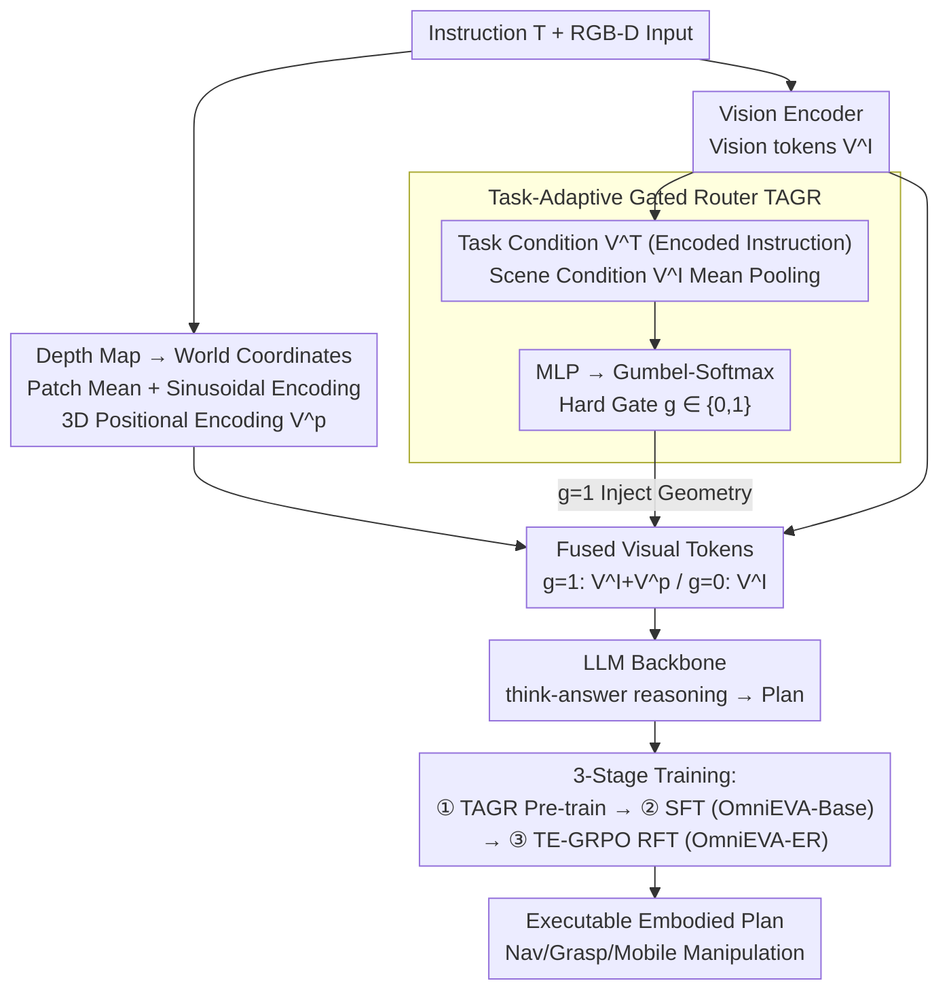

# OmniEVA: Embodied Versatile Planner via Task-Adaptive 3D-Grounded and Embodiment-aware Reasoning

**Conference**: ICLR 2026  
**arXiv**: [2509.09332](https://arxiv.org/abs/2509.09332)  
**Code**: [Project Page](https://github.com/OmniEVA-Project)  
**Area**: Embodied AI / 3D Reasoning  
**Keywords**: MLLM, Task-Adaptive 3D Grounding, Gated Routing, Embodiment-aware Reasoning, GRPO

## TL;DR
OmniEVA is proposed to address two major gaps in spatial MLLMs: poor geometric adaptability (2D-only or hard-coded 3D) and lack of embodiment constraints (producing theoretically feasible but physically unexecutable plans). It utilizes a task-adaptive gated router to dynamically inject 3D positional encodings only when geometric reasoning is required and incorporates an embodiment-aware reasoning framework to integrate physical constraints into the planning loop. Ours achieves SOTA results on 7 out of 8 benchmarks.

## Background & Motivation

**Background**: Utilizing Multimodal Large Language Models (MLLM) as embodied agents requires simultaneous spatial understanding, reasoning, and action capabilities. Existing works follow two main paths: 2D RGB models, which are simple but lose depth and world-coordinate geometric information, and 3D-LLMs, which hard-code point clouds or 3D positional encodings into every inference, leading to poor flexibility.

**Limitations of Prior Work (Geometric Adaptability Gap)**: Pure 2D models fail on geometry-dependent tasks like stacking, occlusion handling, or navigation. Conversely, hard-coded 3D injection models suffer when tasks do not require geometry or when 3D inputs are noisy, as the forced injection introduces unnecessary noise. The "whether to use 3D" decision is fixed in the architecture rather than being task-adaptive.

**Limitations of Prior Work (Embodiment Constraint Gap)**: Models trained on internet images/videos lack awareness of robot physical constraints (grasp poses, workspace boundaries, kinematic reachability). Consequently, they often output plans that are "semantically correct but physically impossible"—theoretically sound but practically unexecutable.

**Key Insight**: To address these gaps, OmniEVA introduces two components: a gated router that dynamically determines if the current task requires 3D information for on-demand injection, and TE-GRPO, which incorporates physical executability into reinforcement learning rewards to force the model to respect the robot's physical constraints.

## Method

### Overall Architecture

OmniEVA uses InternVL3-8B as the MLLM backbone. The goal is a unified model that excels at both "3D tasks requiring geometric reasoning" and "pure 2D tasks" while producing executable plans. A Task-Adaptive Gated Router (TAGR) is placed at the front-end: given an instruction and RGB-D input, it judges if the task needs 3D geometric information. If so, 3D positional encodings are injected into visual tokens; otherwise, it remains 2D. The fused tokens, along with text tokens, are fed into the LLM backbone using a "think-answer" reasoning structure. Capabilities are developed through three-stage training: TAGR pre-training for gating behavior, Supervised Fine-Tuning (SFT) for general embodied reasoning (OmniEVA-Base), and TE-GRPO reinforcement fine-tuning for physical executability (OmniEVA-ER).

### Key Designs

**1. Task-Adaptive Gated Router (TAGR): On-demand 3D Injection**

TAGR transforms the decision to "inject 3D" from a hard-coded structure into a learnable binary switch. It reconstructs world coordinates from the depth map, performs patch-wise mean pooling, and applies sinusoidal encoding to obtain 3D positional encodings $V^p \in \mathbb{R}^{N \times H_p \times W_p \times d_v}$. Simultaneously, a lightweight Sentence Transformer (all-MiniLM-L6-v2) encodes the instruction for task condition $V^T$, and the vision encoder output is mean-pooled for scene condition $V_{avg}^I$. These are concatenated and passed through an MLP to obtain gate logits, which Gumbel-Softmax converts into an end-to-end differentiable **hard gate** $g \in \{0,1\}$:

$$g = \text{GumbelSoftmax}\big(\text{MLP}([V^T; V_{avg}^I]),\ \tau\big),\qquad V^{final}=\begin{cases}V^I+V^p & g=1\\ V^I & g=0\end{cases}$$

Ours avoids **soft-weighting**: since sinusoidal positional encoding magnitudes are sensitive, continuous weighting degrades spatial reasoning. Hard gating preserves the original magnitudes. This acts as a Mixture-of-Experts (MoE) between pure visual tokens and 3D-fused tokens.

**2. Embodiment-aware Reasoning & TE-GRPO: Physical Executability via RL**

To solve the embodiment constraint gap, OmniEVA introduces TE-GRPO (Task- and Embodiment-aware GRPO). Beyond standard format rewards $r^{format}$, it adds two accuracy rewards: a task reward $r^{task}$ measured by $\text{EvalTask}(\cdot)$ (e.g., the ratio of points landing in a target zone), which is embodiment-agnostic, and an embodiment reward $r^{embod}$ measured by $\text{EvalExec}(\cdot)$ which checks kinematics and reachability in simulation. A curriculum reward scheduling is used to prevent early optimization collapse:

$$r^{acc}_{i,t} = (1-\lambda_t)\, r^{task}_i + \lambda_t\, r^{embod}_i,\qquad \lambda_t:\ 0 \to 1$$

Initially, $\lambda_t \approx 0$, rewarding semantic success; as training progresses, $\lambda_t \to 1$, enforcing strict physical compliance.

### Loss & Training

A three-stage cascaded strategy is employed: **① TAGR Pre-training**: Uses depth-aware data (ScanNet, Matterport3D) to learn gating. A low learning rate ($5e^{-7}$) protects the LLM while a higher rate ($1e^{-4}$) is used for TAGR. **② SFT**: The frozen TAGR is used with mixed 2D/Video/3D embodied data to train OmniEVA-Base. **③ TE-GRPO Reinforcement Fine-Tuning (RFT)**: OmniEVA-Base is fine-tuned using curriculum physical rewards to produce OmniEVA-ER.

## Key Experimental Results

Evaluation covers 8 public benchmarks (2D image, video, 3D) and 4 original skill benchmarks: Where2Go (view selection), Where2Fit (collision-aware space prediction), Where2Approach (occlusion-aware navigation), and Where2Grasp (object-centric recognition).

### Main Results (OmniEVA-Base, after SFT)

| Benchmark | Result |
|-----------|--------|
| 8 Public Benchmarks (2D/3D/Video) | SOTA on 7/8 |
| Avg. on 4 2D Embodied Reasoning Benchmarks | 8B model, **+10.45** over Prev. SOTA Robobrain2.0-32B |
| ObjectNav HM3D / MP3D | 1st on Leaderboard |
| 4 Original Skill Benchmarks | Surpasses all existing models |

### Ablation Study: TE-GRPO (OmniEVA-ER vs. Base / Naive RL)

| Task | OmniEVA-ER Gain |
|------|----------------|
| Where2Approach | Accuracy +28.95% |
| Where2Fit | Accuracy +34.28% |
| Mobile Placement (Easy / Hard) | Success Rate +43% / +50% |

### Key Findings
- **Semantic-driven Gating**: Shape-related prompts trigger 3D reasoning most frequently (76.9%), followed by actions (50.9%) and occlusion (33.0%). This validates the adaptive "as-needed" strategy.
- **Hard Gate > Soft Gate**: Soft gating via continuous weighting consistently underperformed across all benchmarks due to numerical instability in positional encodings.
- **TE-GRPO Ensures Executability**: Combining $r^{task}$ and $r^{embod}$ yields the best results, significantly improving robustness in mobile manipulation tasks.

## Highlights & Insights
- **"As-needed 3D" Philosophy**: Instead of applying 3D to all tasks, the model learns when it is necessary, providing more flexibility than manual rules.
- **Original Skill Benchmarks**: The 4 new benchmarks provide a systematic evaluation of embodied plan executability.
- **Bridging LLM and Robotics with TE-GRPO**: Combining GRPO with physical rewards is a natural and effective way to adapt LLM post-training for robotics.

## Rating
- Novelty: ⭐⭐⭐⭐⭐ Dual innovation in task-adaptive 3D and embodiment-aware reasoning.
- Experimental Thoroughness: ⭐⭐⭐⭐⭐ 8+4 benchmarks, extensive ablations, and leaderboard results.
- Writing Quality: ⭐⭐⭐⭐ Clear architectural descriptions.
- Value: ⭐⭐⭐⭐⭐ Significant advancement for embodied MLLMs.

<!-- RELATED:START -->

## Related Papers

- [\[ICLR 2026\] MomaGraph: State-Aware Unified Scene Graphs with Vision-Language Models for Embodied Task Planning](momagraph_state-aware_unified_scene_graphs_with_vision-language_models_for_embod.md)
- [\[ICLR 2026\] EVLP: Learning Unified Embodied Vision-Language Planner with Reinforced Supervised Fine-Tuning](evlp_learning_unified_embodied_vision-language_planner_with_reinforced_supervise.md)
- [\[ICLR 2026\] OneTwoVLA: A Unified Vision-Language-Action Model with Adaptive Reasoning](onetwovla_a_unified_vision-language-action_model_with_adaptive_reasoning.md)
- [\[ICLR 2026\] EquAct: An SE(3)-Equivariant Multi-Task Transformer for 3D Robotic Manipulation](equact_an_se3-equivariant_multi-task_transformer_for_3d_robotic_manipulation.md)
- [\[ICLR 2026\] Embodied-R1: Reinforced Embodied Reasoning for General Robotic Manipulation](embodied-r1_reinforced_embodied_reasoning_for_general_robotic_manipulation.md)

<!-- RELATED:END -->
