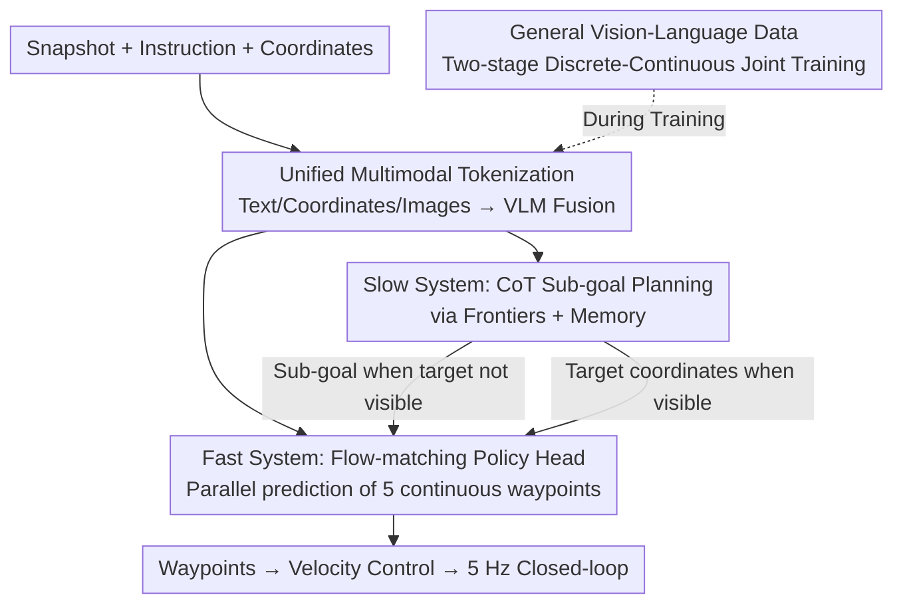

# OmniNav: A Unified Framework for Prospective Exploration and Visual-Language Navigation

**Conference**: ICLR 2026  
**OpenReview**: [https://openreview.net/forum?id=zGtTQTD1zu](https://openreview.net/forum?id=zGtTQTD1zu)  
**Code**: To be confirmed  
**Area**: Robot Navigation / Embodied AI / Multimodal VLM  
**Keywords**: Embodied Navigation, Visual-Language Navigation, dual-system, flow-matching, frontier exploration

## TL;DR
OmniNav utilizes a dual-system architecture comprising a VLM backbone and a flow-matching policy head to unify four navigation tasks—instruct-goal, object-goal, point-goal, and frontier exploration—into a single model. The fast system predicts high-precision continuous waypoints from short-term visual contexts to support 5 Hz real-time control, while the slow system performs sub-goal planning with Chain-of-Thought (CoT) using long-term memory and frontiers. Supplemented by joint training with large-scale general vision-language data, it achieves SOTA performance on benchmarks such as R2R-CE, RxR-CE, and HM3D-OVON, and has been successfully deployed on physical robots.

## Background & Motivation
**Background**: Embodied navigation requires robots to perceive environments, understand natural language instructions, and explore autonomously without pre-built maps. Current research primarily revolves around three paradigms: point-goal (given coordinates), instruct-goal (given language instructions, e.g., R2R/RxR), and object-goal (finding specific object categories). Recent works directly employ VLM/Video-LLM/VLA to decode visual instructions into low-level actions end-to-end.

**Limitations of Prior Work**: Existing methods face several significant challenges. First, most are tailored for single tasks and rely on task-specific data, limiting the potential for cross-task transfer and mutual gain—Uni-NaVid unifies multiple tasks but uses discrete action prediction and lacks long-range planning; MTU3D couples frontier exploration with visual localization but requires constructing 3D object coordinates, complicating deployment. Second, discretizing actions (action chunking) sacrifices precision and flexibility; VLM inference frequency is limited, and frequent context resets make low-latency deployment difficult under streaming video input. Third, and most critically, the primary cause of failure is often not the navigation policy itself, but a lack of understanding of general instructions and open-vocabulary objects.

**Key Challenge**: There exists a trade-off between long-term deliberation (global planning, memory) and short-term agility (low-latency real-time control). A single reactive policy often gets trapped in local loops or shows poor map coverage during long-range exploration, while pure end-to-end VLA suffers from streaming input and high inference latency. Furthermore, the fact that "navigation paradigms are easy to learn, but general understanding is difficult" has been overlooked by most works.

**Goal**: To construct a unified and efficient framework that simultaneously addresses real-time operation, fast-slow coordination, and generalization across four navigation paradigms.

**Key Insight**: Drawing from dual-system theory (fast-slow), the framework decouples "fast reaction" and "deliberate planning" into two complementary modules, linked by a central memory (KV cache) to ensure decisions are locally agile and globally consistent.

**Core Idea**: A flow-matching fast system for continuous waypoints is used to achieve precision and low latency, while a CoT-based frontier reasoning slow system handles long-range planning. Large-scale general vision-language data is integrated into multi-task joint training to specifically address the "understanding" bottleneck.

## Method

### Overall Architecture
OmniNav is based on Qwen2.5-VL-3B-Instruct. It first tokenizes inputs from four task types into discrete tokens manageable by the LLM: text tokens (task descriptions, categories, point-goal instructions), coordinate tokens (2D coordinates + headings of candidate search areas, encoded via MLP into dense embeddings), and image tokens (a circular buffer in central memory maintains pose-stamped frames, with the fast system sampling up to 20 frames and the slow system sampling from the spatio-temporal neighborhood of candidate frontiers, all encoded by ViT). The VLM performs deep fusion of these features, and the resulting fusion features $O_{VLM}$ are fed to both the fast and slow systems.

The fast system is a pure-vision, end-to-end policy that uses the fused features as conditioning to generate $H=5$ continuous waypoints in parallel via a flow-matching head. The slow system, operating above the fast system, uses frontiers and historical images to build long-term spatio-semantic memory for CoT sub-goal planning. The collaborative workflow is: the slow system generates high-level sub-goals; once a sub-goal is determined, the fast system takes over, outputting low-level waypoint sequences until the goal is reached. Spatio-temporal context is shared across the architecture via a central memory (KV cache).

### Key Designs

**1. Flow-matching continuous waypoint policy: Replacing discrete actions with conditional diffusion for precision and low latency**

To address the loss of precision from action discretization and the accumulated error/slow inference of autoregressive prediction, the fast system models waypoint prediction as a conditional diffusion task rather than token-by-token autoregression. Each waypoint is a 5-tuple $w_t^{(i)} = (x^{(i)}, y^{(i)}, \sin\theta^{(i)}, \cos\theta^{(i)}, c^{(i)})$, where $(x,y)$ is the 2D position, $\theta$ uses sin-cos embeddings to avoid discontinuities at $\pi/-\pi$, and $c\in\{0,1\}$ is a binary completion flag. The policy network is a DiT variant: self-attention blocks capture spatio-temporal dependencies within the waypoint sequence, while cross-attention blocks attend to the VLM context $O_{VLM}$.

Training employs conditional flow-matching: given a ground-truth sequence $w_{t:t+H}$, noise $\epsilon\sim\mathcal{N}(0,I)$, and time $\tau\in[0,1]$, the input is constructed as $w^\tau_{t:t+H} = \tau w_{t:t+H} + (1-\tau)\epsilon$. The policy $\pi$ learns the denoising residual $\epsilon - w_{t:t+H}$ by minimizing:

$$\mathbb{E}_{\tau,\epsilon}\left[\left\|\pi(O_{VLM}, w^\tau_{t:t+H}) - (\epsilon - w_{t:t+H})\right\|^2\right].$$

During inference, the sequence is refined from noise via $S=5$ Euler integration steps. Generating the entire sequence non-autoregressively allows for 5 Hz real-time closed-loop control with 20 frames of history, resulting in smoother and more accurate trajectories.

**2. Dual-system + Central memory: Coordinating global planning and local execution**

Addressing the trade-off between long-range deliberation and short-range agility, OmniNav assigns global planning to the slow system and local execution to the fast system, coupled via central memory. Crucially, the fast system is not just a low-level controller following coordinates; it must continuously move toward sub-goals using raw visual input—e.g., if the slow system provides a coordinate but the path is blocked by a wall, the fast system uses visual cues to bypass the obstacle. Upon retrieving target coordinates from memory, it adjusts the final pose based on current vision to stop accurately. This "plan-execute" hierarchy better mimics human reasoning in unfamiliar environments, ensuring exploration efficiency and trajectory consistency.

**3. Semantic and reasoning-aware frontier selection and long-term memory**

To prevent reactive policies from getting stuck in local loops during long-range object-goal exploration, the slow system maintains a 3D occupancy map (marked as explored/unknown), where frontiers are the boundary points. It builds a memory bank archiving visual data and corresponding poses. The sampling strategy links history to future exploration: it collects historical images near the agent's current position and, for each frontier, selects the view most spatially aligned with the frontier's coordinates as its "visual proxy." Frontier selection involves integrated spatial and content reasoning (e.g., prioritizing bathrooms when searching for a toilet). 

Unlike traditional non-semantic frontier exploration based on distance heuristics, OmniNav binds each frontier to its first-person view and uses explicit CoT to judge which frontier is most promising. CoT makes sub-goal selection transparent, supporting self-checking and error correction to reduce accumulated errors in complex semantic tasks.

**4. General data joint training + Two-stage training: Enhancing understanding without compromising control**

Based on the observation that failures often stem from poor understanding of instructions or objects, the authors incorporate large-scale general vision-language data (QA, captioning, OCR, chart understanding, coding, math from MAmmoTH-VL) and grounding data (RefCOCO, Objects365) into joint training. This injects linguistic understanding, visual semantics, and common-sense priors (e.g., "towels are in bathrooms") into the VLN model.

Training is divided into two stages: Stage 1 uses autoregressive targets to predict discrete variables (navigation action chunks, general semantic data, Embodied QA, grounding) to align language, vision, and action. Stage 2 attaches the flow-matching policy head to the shared backbone for continuous waypoints, while including 20% of Stage-1 discrete data to prevent the degradation of VLM capabilities. Waypoint coordinates are normalized via min-max for stability.

## Key Experimental Results

### Main Results
On the Val-Unseen split of R2R-CE / RxR-CE, using only the fast system and pure RGB input, OmniNav achieves SOTA:

| Dataset | Metric | OmniNav | Prev. SOTA (CorrectNav) | Gain |
|--------|------|---------|----------|------|
| R2R-CE Val-Unseen | SR↑ | 69.5 | 65.1 | +4.4 |
| R2R-CE Val-Unseen | SPL↑ | 66.1 | 62.3 | +3.8 |
| R2R-CE Val-Unseen | NE↓ | 3.74 | 4.24 | -0.50 |
| RxR-CE Val-Unseen | SR↑ | 73.6 | 69.3 | +4.3 |

On Object-Goal (HM3D-OVON), pure-vision OmniNav exceeds the best method by 2.7%; with the slow system + frontier reasoning, it leads significantly:

| Configuration | Val-Unseen SR↑ | Val-Unseen SPL↑ | Note |
|------|------|------|------|
| OmniNav (Vision only) | 43.5 | 27.3 | Beats MTU3D (40.8) by 2.7% |
| OmniNav* (w/ slow+CoT) | 59.2 | 33.2 | Beats previous best by 18.4% |

On Point-Goal (CityWalker, outdoor), OmniNav achieves a Mean Angular Error (MAOE) of 11.53%, outperforming CityWalker's 15.23%.

### Ablation Study
Evaluation on HM3D-OVON Val-Unseen with components enabled incrementally:

| Configuration | SR↑ | SPL↑ | Note |
|------|------|------|------|
| Base only | 35.3 | 22.1 | Discrete action chunks |
| + policy-head | 43.5 | 27.3 | Flow-matching waypoints |
| + slow-system | 55.9 | 30.7 | Frontier + long-term memory planning |
| + general data | 57.7 | 32.9 | General MLLM/grounding data |
| + CoT (Full) | 59.2 | 33.2 | Explicit Chain-of-Thought |

### Key Findings
- **Slow system contributes most to long-range exploration**: Increasing SR from 43.5 to 55.9 (+12.4), as tracking explored areas reduces redundancy and decomposes exploration into a hierarchy.
- **Continuous waypoints vs. Discrete action chunks**: Discrete actions show significant degradation on R2R-CE/RxR-CE/OVON; discrete tokens are suitable for language alignment but inferior for fine-grained motor control.
- **CoT provides transparency in sub-goal selection**, supporting process-level self-correction and reducing error accumulation in complex semantic tasks.
- **Real-robot deployment**: The fast system runs on a cloud server with an RTX 3090, processing 20 history frames and current views at >5 Hz, with waypoints fed to an on-board velocity controller for zero-shot validation on a quadruped robot.

## Highlights & Insights
- **The diagnosis that "the bottleneck is understanding, not policy learning" is the most valuable insight**: Instead of just scaling the policy network, mixing large-scale general vision-language data directly addresses the primary cause of failure.
- **Flow-matching for continuous waypoints** allows for non-autoregressive generation of entire sequences, achieving both precision and 5 Hz real-time performance.
- **Frontiers as "visual proxies" + CoT selection**: Binding frontiers to first-person images is simpler than scene graphs or semantic maps while being more effective than pure geometric heuristics.
- **Mixing 20% discrete data in the second stage** is a robust trick to prevent catastrophic forgetting of VLM capabilities during continuous control fine-tuning.

## Limitations & Future Work
- Full slow-system deployment on hardware requires additional engineering (e.g., robust real-time integration with LiDAR/depth estimation), which remains future work.
- The slow system relies on depth and odometry for occupancy mapping, limiting its full planning capability in RGB-only scenarios.
- Point-goal evaluation is relatively thin, relying on a single benchmark (CityWalker).
- Future direction: Distilling slow-system reasoning into the fast system to reduce reliance on depth/odometry.

## Related Work & Insights
- **vs. Uni-NaVid**: Both unify multi-task navigation, but Uni-NaVid uses discrete actions and lacks sufficient long-range LLM planning. OmniNav significantly leads on OVON and R2R-CE.
- **vs. MTU3D**: MTU3D couples frontier exploration with visual localization but requires complex 3D coordinate construction. OmniNav is simpler with visual proxies and CoT, outperforming it on OVON Val-Unseen (59.2 vs 40.8).
- **vs. End-to-end VLA / Video-LLM (e.g., StreamVLN)**: These systems struggle with streaming input and low-latency inference. OmniNav mitigates latency via KV cache central memory and non-autoregressive flow-matching (R2R-CE SR 69.5 vs StreamVLN 56.9).

## Rating
- Novelty: ⭐⭐⭐⭐ 
- Experimental Thoroughness: ⭐⭐⭐⭐⭐ 
- Writing Quality: ⭐⭐⭐⭐ 
- Value: ⭐⭐⭐⭐⭐ 

<!-- RELATED:START -->

## Related Papers

- [\[CVPR 2026\] FantasyVLN: Unified Multimodal Chain-of-Thought Reasoning for Vision-and-Language Navigation](../../CVPR2026/robotics/fantasyvln_unified_multimodal_chain-of-thought_reasoning_for_vision-and-language.md)
- [\[ICLR 2026\] UniVLA: Unified Vision-Language-Action Model](unified_vision-language-action_model.md)
- [\[ICLR 2026\] Uncertainty-Aware Gaussian Map for Vision-Language Navigation](uncertainty-aware_gaussian_map_for_vision-language_navigation.md)
- [\[CVPR 2026\] HTNav: A Hybrid Navigation Framework with Tiered Structure for Urban Aerial Vision-and-Language Navigation](../../CVPR2026/robotics/htnav_a_hybrid_navigation_framework_with_tiered_structure_for_urban_aerial_visio.md)
- [\[CVPR 2026\] CUBic: Coordinated Unified Bimanual Perception and Control Framework](../../CVPR2026/robotics/cubic_coordinated_unified_bimanual_perception_and_control_framework.md)

<!-- RELATED:END -->
