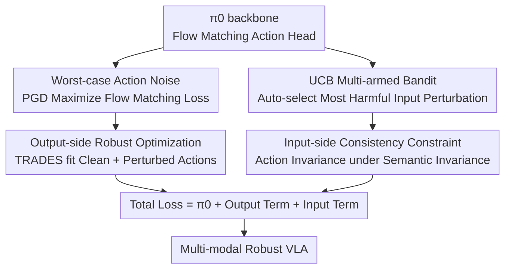

# On Robustness of Vision-Language-Action Model against Multi-Modal Perturbations

**Conference**: ICLR 2026  
**OpenReview**: [https://openreview.net/forum?id=cS6xizdYD5](https://openreview.net/forum?id=cS6xizdYD5)  
**Code**: https://github.com/gakakulicc/RobustVLA  
**Area**: Robotics / Embodied AI / VLA Robustness  
**Keywords**: VLA, Multi-modal robustness, Flow matching, Adversarial training, Multi-armed bandit  

## TL;DR
This paper first systematically evaluates the robustness of mainstream VLAs across 17 types of perturbations in four modalities (action, observation, environment, and instruction), finding that action is the most vulnerable modality, existing vision-only robustness methods fail to transfer, and $\pi_0$ is the most stable. Then, it proposes RobustVLA: robust optimization under worst-case action noise for the output, and action consistency constraints under semantic invariance for the input, utilizing a UCB bandit to automatically select the most harmful perturbations for training. It achieves a 14.0% absolute improvement over $\pi_0$ on LIBERO and a 65.6% higher success rate than $\pi_0$ on real-world robots with only 25 demonstrations.

## Background & Motivation

**Background**: VLA (Vision-Language-Action) models bridge vision, language, and action. After pre-training on internet-scale robot data, they enable cross-embodiment, general-purpose dexterous manipulation, serving as the mainstream technical route for current robot foundation models. Representative works include the auto-regressive OpenVLA (discretizing actions into tokens) and the diffusion-based $\pi_0$ (generating continuous high-frequency actions via flow matching).

**Limitations of Prior Work**: In real-world deployment, perturbations extend far beyond visual noise: the action side involves sensor/actuator noise and external force disturbances; the observation side suffers from camera errors; the environment includes distractors and lighting changes; and the instruction side faces paraphrasing and ambiguous expressions. However, existing robust VLA works (VLATest only evaluates; BYOVLA uses LLMs for visual inpainting; GEVRM does model-based planning) focus almost exclusively on visual inputs, fail to test other modalities, and rely heavily on external large models with massive inference overhead.

**Key Challenge**: VLA policies are derived from offline imitation learning. Once the action deviates from the data distribution, subsequent rollouts slide Out-of-Distribution (OOD), with errors accumulating **quadratically** over time (whereas online RL only accumulates linearly due to interactive error correction). This makes action robustness particularly difficult under the "offline data only, no environment interaction" setting—traditional minimax adversarial training for robust RL requires a simulator, which VLA lacks.

**Goal**: The project is split into two steps: (1) systematically measure the robustness of VLA under omni-modal perturbations to determine where effort should be focused; (2) create a robust VLA that can withstand both input and output perturbations without relying on external large models.

**Key Insight**: The authors conducted a large-scale evaluation and reached three key findings: ① Action is the most vulnerable modality ($\pi_0$ success rate drops to 52.4% with only 2.5% action noise and collapses at 5%); ② Existing visual robustness methods (e.g., BYOVLA) show +0.0% improvement on non-visual modalities, failing to transfer; ③ $\pi_0$ outperforms OpenVLA and $\pi_0$-FAST by 27.9% and 5.1% respectively, suggesting that diffusion action heads possess inherent robustness advantages. Consequently, $\pi_0$ is chosen as the backbone.

**Core Idea**: Robustness is decoupled into "output-side" and "input-side" solutions. The output side undergoes adversarial flow matching against worst-case action noise, while the input side enforces action consistency under semantic invariance. A UCB bandit automatically decides which perturbation to prioritize during each training step.

## Method

### Overall Architecture
RobustVLA is a **fine-tuning framework** that adds two robust regularizers to the existing $\pi_0$ (equipped with a rectified flow matching action head). The objective function is the sum of three terms: $\mathcal{L}^\tau_{RobustVLA}=\mathcal{L}^\tau_{\pi_0}+\mathcal{L}^\tau_{in}+\mathcal{L}^\tau_{out}$. The logic is: for the **output side**, PGD is used to find the worst-case action noise $\delta$ that maximizes the flow matching loss, followed by a TRADES-style objective to fit both clean and perturbed action distributions. For the **input side**, based on the observation that "semantically invariant perturbations should not change the optimal action," the model is constrained to output consistent actions under noisy inputs. Facing over a dozen input perturbations, a **scheduler** models "which perturbation to select" as a multi-armed bandit, using UCB to automatically pick the most harmful one.

### Key Designs

**1. Worst-case Action Noise + Output-side Robust Optimization: Using Flow Matching Loss as a Proxy for Action Quality**

Addressing the pain point that action is the most vulnerable modality and lacks interactive correction. The difficulty lies in defining the "worst action" when success rates cannot be measured incrementally. The authors borrow from robust RL: since offline demonstrations $(o_t, A_t)$ represent actions most likely to succeed, the flow matching loss $\|v_\theta(\hat A^\tau_t,o_t)-u(\hat A^\tau_t|\hat A^1_t)\|^2$ is used as an empirical measure of action quality (the Pearson correlation between this loss and success rate is measured at $r=-0.95$). By setting the noisy action as $\hat A^1_t=A^1_t+\delta$, the perturbed flow under rectified flow satisfies $u(\hat A^\tau_t|\hat A^1_t)=u(A^\tau_t|A^1_t)-\delta$, allowing PGD to maximize the loss for $\delta$. The TRADES objective then balances clean accuracy and robustness:

$$\min_\theta\ \mathcal{L}^\tau_{\pi_0}+\lambda_{out}\max_\delta\mathbb{E}\,\|v_\theta(\hat A^\tau_t,o_t)-u(\hat A^\tau_t|\hat A_t)\|^2$$

This design has three interpretations: **Adversarial Training** (matching both clean $p(A_t|o_t)$ and adversarial distributions $p(A_t+\delta|o_t)$), **Label Smoothing** (injecting noise to make the learned flow less certain, suppressing overconfidence), and **Outlier Penalty** (since $\delta$ points toward the maximum mismatch between the velocity field and rectified flow, the MSE objective penalizes corner cases where VLA fits poorly).

**2. Input-side Consistency Constraint: Semantically Invariant Perturbations Should Not Change the Optimal Action**

Targeting noise in observation, environment, and instruction. The core observation is that perturbations like camera noise, distractors, lighting, or paraphrasing change the input $o_t$, but the underlying physical state and task remain the same; thus, the **optimal action should remain unchanged**. The flow matching objective is rewritten to output the same action under noisy inputs:

$$\min_\theta\max_{\omega_i}\mathbb{E}\,\|v_\theta(A^\tau_t,\omega_i(o_t))-u(A^\tau_t|A_t)\|^2$$

This translates state perturbation techniques from offline RL to VLA inputs: picking the worst input $\omega_i$ adversarially forces the model to map "contaminated inputs" back to the "clean input" action. To enhance local smoothness, an $\ell_p$-bounded observation noise $\eta$ is also optimized via PGD.

**3. UCB Multi-armed Bandit: Automatically Selecting the Most Harmful Perturbations**

Addressing the engineering challenge of balancing over a dozen input perturbations. Simple Gaussian noise is easy to defend but harmful to complex noise robustness; manually tuning weights is time-consuming. The authors model "selecting a perturbation type at each step" as a multi-armed bandit, using UCB to balance exploration and exploitation:

$$\omega_i^*=\arg\max_{\omega_i\in\Omega}\Big[r_n(\omega_i)+\alpha\sqrt{\tfrac{\log n}{\omega_i(n)}}\Big]$$

The reward $r_n(\omega_i)$ is defined as the "flow matching loss increment caused by the perturbation," i.e., the difference between the noisy target and the clean target for the same $(o_t, A_t)$. A higher loss indicates a more harmful perturbation that requires more training. Rewards are normalized via z-scores using EMA. Ablations show a 7.3% drop without UCB, proving it prevents overfitting to a single dominant noise.

### Loss & Training
The total objective is $\mathcal{L}^\tau_{RobustVLA}=\mathcal{L}^\tau_{\pi_0}+\mathcal{L}^\tau_{in}+\mathcal{L}^\tau_{out}$, with $\lambda_{in}=\lambda_{out}=1$, action noise $\delta=0.03$, and observation noise $\eta=8/255$. Other hyperparameters follow official $\pi_0$ / OpenVLA recipes.

## Key Experimental Results

### Main Results
On the LIBERO benchmark with 17 perturbations using the $\pi_0$ backbone (Success Rate %, absolute gains shown):

| Configuration | 17-Perturb Avg | Clean | Rel. to $\pi_0$ | Rel. to BYOVLA |
| :--- | :---: | :---: | :---: | :---: |
| $\pi_0$ | 62.6 | 96.0 | — | — |
| BYOVLA | 64.0 | 95.2 | +1.4 | — |
| **RobustVLA** | **76.6** | 95.5 | **+14.0** | **+12.6** |

- **OpenVLA backbone**: RobustVLA outperforms OpenVLA by 13.2% and BYOVLA by 10.4%, proving effectiveness across diffusion and auto-regressive VLAs.
- **Efficiency**: One episode of inference takes ~11s, comparable to $\pi_0$ but **50.6× faster** than BYOVLA which relies on external LLMs.
- **Mixed Perturbations**: Outperforms $\pi_0$ by 14.5% and BYOVLA by 10.4% ($p < 0.001$).
- **Real-world FR5**: Achieves a **65.6%** higher success rate than $\pi_0$ with only 25 demonstrations; remains 30% higher even with 100 demonstrations.

### Ablation Study

| Configuration | 17-Perturb Avg | Description |
| :--- | :---: | :--- |
| RobustVLA (Full) | 76.6 | Complete model |
| w/o out | 71.7 | No output robust term |
| w/o UCB | 69.3 | Random selection instead of UCB, -7.3% |
| w/o in | 64.8 | No input robust term |
| DR | 61.8 | Domain Randomization, performs worse than $\pi_0$ |

### Key Findings
- **Input robust term contributes most**: Removing it drops performance from 76.6 to 64.8. UCB is also critical (-7.3%). DR performs poorly due to overfitting to simple perturbations.
- **Cross-modal positive transfer**: The full model outperforms single-sided ablations on 14/17 perturbations. Output robustness helps against input-noise-induced action drift, while input robustness improves generalization to unseen transitions.
- **Generalization**: Improvement is seen on unseen perturbations like External Force and on LIBERO-long tasks (+19.61% over $\pi_0$).
- **Low-data advantage**: RobustVLA is highly stable in the 25-demonstration region, whereas baselines overfit to the limited demonstration distribution.

## Highlights & Insights
- **Decoupling robustness into input/output halves** is elegant. Output-side uses adversarial flow matching, while input-side uses semantic consistency, resulting in cross-modal synergy.
- **Using flow matching loss as a proxy for action quality** is a clever shortcut. Since success rates aren't measurable offline, the high correlation ($r=-0.95$) allows PGD to solve for worst-case actions directly.
- **Triple interpretation of the output regularizer** (Adversarial training / Label smoothing / Outlier penalty) provides profound insight; the label smoothing view explains why it suppresses overconfidence.
- **UCB perturbation scheduling** is a versatile strategy applicable to any training scenario requiring automatic balancing of multiple data augmentations or adversarial types.

## Limitations & Future Work
- Evaluation primarily focuses on $\pi_0$ (flow matching); fine-grained analysis for auto-regressive VLAs is relatively scarce.
- Although 17 perturbations are tested, noise intensity remains manually set ($\delta=0.03$, $\eta=8/255$); coverage of real-world noise distributions requires further verification.
- The framework is for offline fine-tuning and remains dependent on demonstration quality.
- The UCB reward, defined solely by loss increments, might favor perturbations that increase loss significantly but have less impact on actual success rates.

## Related Work & Insights
- **vs. BYOVLA**: BYOVLA uses VLM for visual segmentation and inpainting, restricted to vision and requiring heavy external models. Ours covers four modalities, is 50.6× faster, and provides significant gains where prior work provided +0.0%.
- **vs. GEVRM**: GEVRM relies on model-based planning for visual corruptions; Ours uses adversarial fine-tuning to modify training objectives directly, covering harder modalities like action and instruction.
- **vs. Robust RL**: Traditional methods use minimax in simulators. Ours bridges robust RL and VLA by using flow matching loss to enable worst-case action solving in an offline setting.

## Rating
- **Novelty**: ⭐⭐⭐⭐⭐ First to systematically address VLA multi-modal robustness and integrate input/output robustness with UCB scheduling into flow matching.
- **Experimental Thoroughness**: ⭐⭐⭐⭐⭐ 17 perturbations × 2 backbones, simulation + real-world, mixed noise, efficiency, and ablation.
- **Writing Quality**: ⭐⭐⭐⭐ Logic is clear; triple interpretation is brilliant; some minor formula inconsistencies with the original text.
- **Value**: ⭐⭐⭐⭐⭐ +65.6% real-world gain at low data without external LLMs, highly significant for deployment.

<!-- RELATED:START -->

## Related Papers

- [\[ICLR 2026\] UniVLA: Unified Vision-Language-Action Model](unified_vision-language-action_model.md)
- [\[ICLR 2026\] Vlaser: Vision-Language-Action Model with Synergistic Embodied Reasoning](vlaser_vision-language-action_model_with_synergistic_embodied_reasoning.md)
- [\[ICLR 2026\] WMPO: World Model-based Policy Optimization for Vision-Language-Action Models](wmpo_world_model-based_policy_optimization_for_vision-language-action_models.md)
- [\[ICLR 2026\] AutoFly: Vision-Language-Action Model for UAV Autonomous Navigation in the Wild](autofly_vision-language-action_model_for_uav_autonomous_navigation_in_the_wild.md)
- [\[ICML 2026\] Dual-Stream Diffusion for World-Model Augmented Vision-Language-Action Model](../../ICML2026/robotics/dual-stream_diffusion_for_world-model_augmented_vision-language-action_model.md)

<!-- RELATED:END -->
