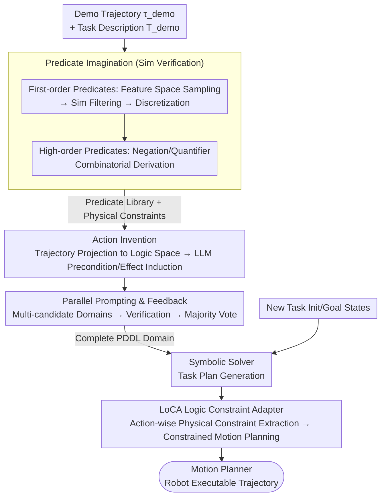

# One Demo Is All It Takes: Planning Domain Derivation with LLMs from A Single Demonstration

**Conference**: ICLR 2026  
**arXiv**: [2505.18382](https://arxiv.org/abs/2505.18382)  
**Code**: None  
**Area**: Robot Planning / TAMP / LLM  
**Keywords**: PDDL, Task and Motion Planning, LLM Reasoning, Physical Simulation, Predicate Generation, Motion Planning Interface

## TL;DR

The authors propose PDDLLM, a framework that automatically derives a complete PDDL planning domain (predicates and actions) from **a single demonstration trajectory**. By cross-validating LLM reasoning with physical simulation, it generates interpretable symbolic representations and utilizes a Logic Constraint Adapter (LoCA) to interface with motion planners. In over 1200 tasks across 9 environments, its success rate outperforms 6 LLM baselines by at least 20% and has been successfully deployed on 3 physical robot platforms.

## Background & Motivation

**Background**: Task and Motion Planning (TAMP), which combines high-level symbolic reasoning with low-level motion planning, is a primary paradigm for solving long-horizon robotic tasks. It fundamentally relies on planning domains defined by the PDDL language $\mathcal{D} = (\mathcal{P}, \mathcal{A})$, consisting of a predicate set $\mathcal{P}$ and an action set $\mathcal{A}$.

**Limitations of Prior Work**: The construction of PDDL planning domains is highly dependent on manual effort. Defining predicates (e.g., `(on ?o1 ?o2)`), action preconditions $\mathcal{P}_{pre}$, and effects $\mathcal{P}_{eff}$ requires meticulous design by domain experts, which is labor-intensive and difficult to transfer to new environments.

**LLM's Limitations**: Although LLMs demonstrate strong generalization in task planning, they are unreliable for long-horizon reasoning—frequently failing when temporal dependencies are complex (Huang et al., 2022a).

**Limitations of Prior Work**: (1) Existing domain generation methods require pre-defined predicates or actions as prior knowledge (Silver et al., 2023; Kumar et al., 2023), still necessitating significant human involvement. (2) LLM-based methods require detailed natural language domain descriptions and elaborate prompt engineering (Guan et al., 2023). (3) Many methods assume that symbolic actions already have corresponding motion skills; the interface between actions and motion planners still requires manual implementation.

**Key Insight**: This work combines the semantic understanding of LLMs with the verification capabilities of physical simulation—simulation provides physical feasibility checks (which LLMs cannot guarantee alone), while LLMs provide semantic abstraction and pattern recognition. Only one demonstration is needed to build a planning domain fully automatically.

**Core Contribution**: (1) First fully automatic pipeline from a one-shot demo to a complete PDDL domain; (2) Proposal of LoCA to automatically interface symbolic actions with motion planners; (3) Validation of effectiveness and deployability across 1200+ tasks.

## Method

### Overall Architecture

PDDLLM receives a demonstration trajectory $\tau_{demo}$ (a sequence of continuous environment states) and a task description $T_{demo}$, operating in two stages: **Domain Derivation** and **Inference**. In the Domain Derivation stage, physical simulation is used to "imagine" a set of physically feasible **predicates** (with associated computable physical constraint boundaries), and the demonstration is projected into logical space to extract **PDDL actions**. The entire process is wrapped in **Parallel Prompting and Feedback**, where multiple candidates are generated in parallel and the most reliable domain is selected via voting after verification. In the Inference stage, the initial and goal states of a new task are passed to a symbolic solver to generate a plan, and **LoCA** translates each symbolic action into a constraint problem for the motion planner:

$$\tilde{a}^{(0)}, \tilde{a}^{(1)}, \ldots = \text{MotionPlanner}(\text{PDDLLM}(\mathcal{S}_{new}^{(init)}, \mathcal{S}_{new}^{(goal)}, T_{demo}, \tau_{demo}))$$

### Key Designs

**1. Predicate Imagination: Using Simulation to Verify Physical Feasibility**

Relying solely on LLMs to invent predicates often leads to physically impossible relations (e.g., a floating `(is_on)`). Here, predicate generation is split into two stages with a physics simulator as a safeguard. In the first-order predicate stage, object states are uniformly sampled in feature space (position $(x,y,z)$, color $(r,g,b)$, etc.). The simulator verifies feasibility, filtering out unreasonable states like penetration or levitation. The continuous space is then discretized into sub-regions based on granularity $u_f$. The LLM only needs to summarize semantic predicates (e.g., `(is_on ?o1 ?o2)`, `(smaller ?o1 ?o2)`) from these verified sub-spaces and label their task relevance. Crucially, each predicate is attached to its corresponding sub-space boundary as a **physical constraint**, which is later used by the motion planner to determine predicate truth values. In the high-order predicate stage, negation $\neg$ and quantifiers $\forall$, $\exists$ are used to systematically derive complex relations, such as `(is_on ?o1 ?o2)` $\to$ `(not_is_on ?o1 ?o2)` $\to$ `(∀_o1_not_is_on ?o1 ?o2)` (indicating o2 is at the very top). This combination of discretization and simulation allows the LLM to abstract predicates from stable, feasible patterns rather than chaotic continuous data.

**2. Action Invention: Projecting Long Trajectories into Logical Transitions**

A demonstration trajectory may contain thousands of continuous state steps; identifying action boundaries directly in continuous space is slow and inaccurate. The approach uses the generated predicate library to project the continuous trajectory $\tau_{demo}$ into a logic space $\tau_{demo}^{logic}$, compressing 1000+ steps into a few logical state transitions. The pre- and post-state pairs of each transition are sampled as prompts for the LLM to summarize PDDL action definitions, specifically $\mathcal{P}_{pre}$ and $\mathcal{P}_{eff}$. This step transforms continuous manipulation into a discrete pattern recognition problem where the LLM only observes critical state jumps.

**3. Parallel Prompting and Feedback: Using Redundancy to Mitigate LLM Stochasticity**

Since LLM generation is stochastic and a single error can invalidate an entire domain, a redundancy sampling layer is added. Multiple candidate PDDL domains are generated in parallel for the same demonstration. These candidates undergo runtime verification (checks for syntax, completeness, and reachability) to eliminate failures, followed by a majority vote to select the most reliable domain. Experiments show that correctness stabilizes when the number of parallel prompts exceeds 5.

**4. LoCA Logic Constraint Adapter: Automatic Translation of Symbolic Actions to Motion Constraints**

During inference, symbolic plans must be executed by the robot. In traditional TAMP, interfacing symbolic actions with motion planning requires manual encoding of semantics into mathematical constraints (Toussaint, 2015), which is the most tedious engineering step. LoCA reuses the physical constraints generated during the predicate imagination stage. For each logical action in the task plan, it automatically extracts all physical constraints (in the form of mathematical inequalities) corresponding to the first-order predicates in the effect set $\mathcal{P}_{eff}$. These are applied to the motion planner, transforming a single logical action into a standard **constrained motion planning problem**. This mechanism is also compatible with VLA models, where logical actions can serve as prompt conditions.

## Key Experimental Results

### Table 1: Planning success rates across 9 tasks (%, Time Limit=50s)

| Method | Stack | Unstack | Color Class. | Alignment | Parts Assem. | Rearrange | Burger Cook | Bridge Build | Tower Hanoi | **Overall** |
|------|-------|---------|-------------|-----------|-------------|-----------|-------------|-------------|-------------|------------|
| Expert | 98.5 | 100 | 100 | 100 | 98.9 | 73.3 | 100 | 100 | 100 | 95.7 |
| LLMTAMP | 41.7 | 89.4 | 18.1 | 31.1 | 33.3 | 5.6 | 27.8 | 43.3 | 14.3 | 35.7 |
| LLMTAMP-FF | 70.8 | 94.6 | 36.4 | 52.0 | 53.9 | 17.4 | 50.0 | 53.3 | 14.3 | 52.5 |
| LLMTAMP-FR | 64.2 | 92.1 | 49.0 | 40.0 | 41.3 | 11.8 | 48.6 | 51.7 | 14.3 | 48.6 |
| RuleAsMem | 85.5 | 88.4 | 88.7 | 96.0 | 95.0 | 1.1 | 27.8 | 20.0 | 14.3 | 69.9 |
| **PDDLLM** | **97.5** | **97.7** | **100** | **100** | **100** | **64.3** | **91.7** | **87.2** | **100** | **93.3** |

### Table 2: PDDLLM vs. Reasoning LLMs Success Rate and Token Cost (Time Limit=500s)

| Task | PDDLLM | LLMTAMP | o1-TAMP | R1-TAMP | PDDLLM(k) | LLMTAMP(k) | o1-TAMP(k) | R1-TAMP(k) |
|------|--------|---------|---------|---------|-----------|------------|------------|------------|
| Rearrangement | **73.8** | 5.6 | 70.8 | 40.0 | 334 | 212 | 1200 | 1460 |
| Tower of Hanoi | **100** | 14.3 | 33.3 | 14.3 | 535 | 36 | 529 | 353 |
| Bridge Building | **87.2** | 44.3 | 51.7 | 40.0 | 375 | 50 | 270 | 363 |
| **Overall** | **80.5** | 13.9 | 61.5 | 35.9 | 415 | 99 | 666 | 725 |

### Table 3: Domain Quality Evaluation—Missing/Redundant Predicate Ratio

| Task | Missing Predicates | Redundant Predicates |
|------|---------|---------|
| Stack | 4.2% | 8.3% |
| Burger Cooking | 22.2% | 3.7% |
| Bridge Building | 22.2% | 3.7% |
| Tower of Hanoi | 0.0% | 14.3% |

## Key Findings

1. **Significant Lead Over LLM Baselines**: PDDLLM achieves an overall success rate of 93.3%, which is over 40 percentage points higher than the best LLM baseline, LLMTAMP-FF (52.5%). Improvements are particularly notable in complex tasks like Tower of Hanoi and Color Classification.
2. **Outperforming Reasoning LLMs**: Even with a 500s time limit for o1-TAMP and R1-TAMP, PDDLLM maintains an 80.5% success rate compared to o1-TAMP's 61.5%, with significantly lower token costs (415k vs. 666k).
3. **Approaching Expert Performance**: PDDLLM's 93.3% overall rate is only 2.4 percentage points behind the 95.7% achieved by expert-designed domains. It perfectly matches expert performance (100%) in four tasks.
4. **Cross-Task Knowledge Transfer**: PDDLLM can modularly combine action knowledge from different demonstrations—for example, solving rearrangement tasks using actions learned from stack and unstack demos.
5. **Indispensability of Simulation Verification**: Ablation studies show that predicate quality drops significantly without simulation verification. Discretizing continuous feature spaces is also critical for allowing the LLM to extract stable patterns.
6. **Token Efficiency**: PDDLLM costs are concentrated in the one-time domain derivation stage. Subsequent planning is handled by symbolic solvers with zero additional token cost, making it ideal for long-term deployment.

## Highlights & Insights

- **Complementary Sim + LLM Architecture**: Simulation provides physical feasibility (which LLMs lack), while LLMs provide semantic abstraction—this is an excellent paradigm for applying LLMs to physical reasoning.
- **One-Shot Demo to Generalizable Domain**: Requires minimal data to generate a planning domain that generalizes to new tasks, significantly lowering the barrier for TAMP.
- **LoCA Eliminates Manual Bottlenecks**: LoCA automates the symbolic-to-motion interface, traditionally the most tedious part of TAMP engineering, by leveraging pre-generated physical constraints.
- **Modular Action Composition**: The modular nature of PDDL ensures that knowledge transfer across tasks happens naturally.
- **Symbolic Solvers vs. LLM Planners**: Results suggest that LLMs have limited capacity for understanding complex domain rules directly; delegating rule enforcement to symbolic solvers is more reliable.

## Limitations & Future Work

1. **Complex Predicate Omission**: In complex tasks, the system occasionally misses higher-order predicates (e.g., `(all_base_finished)`), requiring more backtracking by the planner.
2. **Perception Boundaries**: Currently relies on simplified perception like ArUco markers; it cannot yet derive domains directly from raw visual input or handle complex dynamics like fluids.
3. **Simulation Dependency**: Requires a high-fidelity physical simulator for parallel roll-outs, which may be unavailable in some scenarios.
4. **Sensitivity to Initial Discretization**: While LLMs can adjust granularity, the initial choice of hyperparameter $u_f$ still impacts predicate quality.

## Related Work & Insights

### vs. Direct LLM Planning (LLMTAMP, SayCan series)

| Dimension | PDDLLM | Direct LLM Planning |
|------|--------|-------------|
| Logic | LLM derives domain → Solver plans | LLM directly outputs sequences |
| Reasoning | Strong (guaranteed by solver) | Weak (error-prone temporal dependencies) |
| Token Cost | One-time derivation cost | High cost per plan |
| Verifiability | Domains are human-readable/correctable | Outputs are black-box |
| Data | 1 Demo | Task description/hist contexts |

### vs. Traditional Domain Learning (Predicate Invention, VisualPredicator)

| Dimension | PDDLLM | Traditional Domain Learning |
|------|--------|-----------|
| Priors | No pre-defined symbols needed | Requires partial pre-defined symbols |
| Data | Single demonstration | Typically requires large datasets |
| Interface | LoCA automation | Usually assumes pre-defined skills |

### vs. Manual TAMP Domains (Expert Design)

| Dimension | PDDLLM | Expert Design |
|------|--------|--------------|
| Cost | Fully automatic | Manual expert coding/debugging |
| Performance | 93.3% success | 95.7% success |
| Portability | New demo for new environments | Manual redesign for new environments |

## Rating

- **Novelty**: ⭐⭐⭐⭐⭐ — First fully automatic pipeline from one-shot demo to PDDL without pre-defined symbols.
- **Experimental Thoroughness**: ⭐⭐⭐⭐⭐ — Extensive testing across 9 environments, 1200+ tasks, and physical platforms.
- **Writing Quality**: ⭐⭐⭐⭐ — Clear framework diagrams and logic, though occasional notation inconsistency.
- **Value**: ⭐⭐⭐⭐⭐ — Significant reduction in TAMP entry barriers; LoCA solves a major engineering pain point.

<!-- RELATED:START -->

## Related Papers

- [\[ICLR 2026\] DemoGrasp: Universal Dexterous Grasping from a Single Demonstration](demograsp_universal_dexterous_grasping_from_a_single_demonstration.md)
- [\[ICLR 2026\] VLBiMan: Vision-Language Anchored One-Shot Demonstration Enables Generalizable Bimanual Robotic Manipulation](vlbiman_vision-language_anchored_one-shot_demonstration_enables_generalizable_bi.md)
- [\[CVPR 2026\] Cross-Domain Demo-to-Code via Neurosymbolic Counterfactual Reasoning](../../CVPR2026/robotics/cross-domain_demo-to-code_via_neurosymbolic_counterfactual_reasoning.md)
- [\[ICLR 2026\] All-day Multi-scenes Lifelong Vision-and-Language Navigation with Tucker Adaptation](all-day_multi-scenes_lifelong_vision-and-language_navigation_with_tucker_adaptat.md)
- [\[ICLR 2026\] Statistical Guarantees for Offline Domain Randomization](statistical_guarantees_for_offline_domain_randomization.md)

<!-- RELATED:END -->
