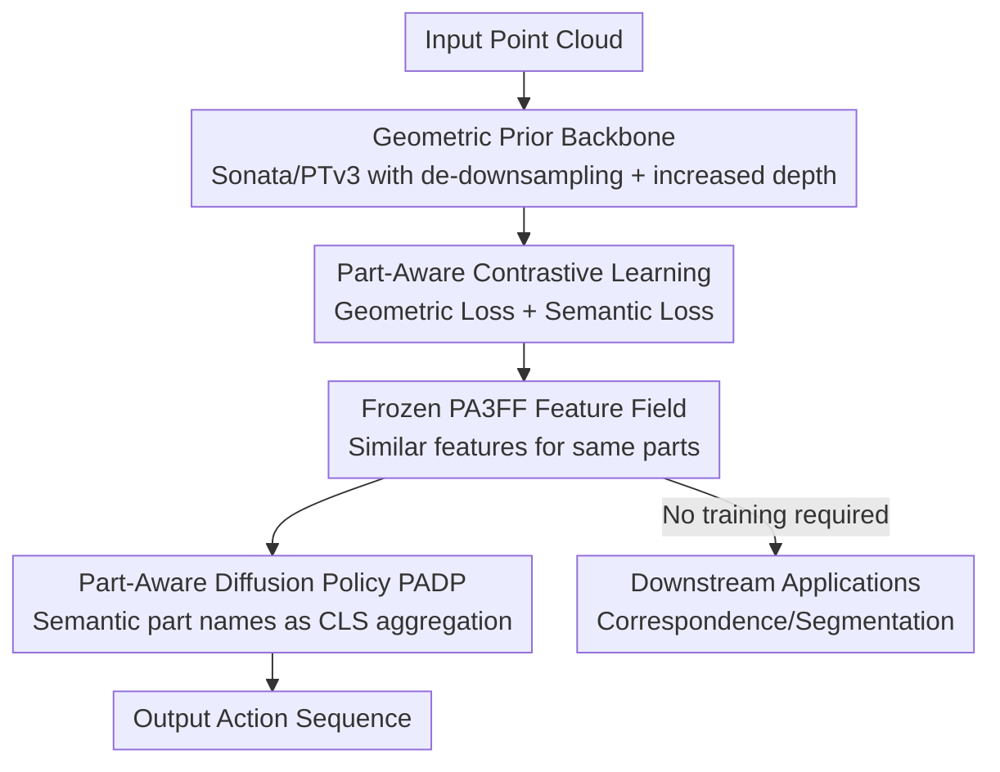

# PA3FF: Part-Aware Dense 3D Feature Fields for Generalizable Articulated Object Manipulation

**Conference**: ICLR 2026  
**OpenReview**: [https://openreview.net/forum?id=qXfRXfAHOK](https://openreview.net/forum?id=qXfRXfAHOK)  
**Paper**: [Project Page](https://pa3ff.github.io/)  
**Code**: https://pa3ff.github.io/ (Project Page)  
**Area**: Robotics / Embodied AI / 3D Vision / Imitation Learning  
**Keywords**: Articulated Object Manipulation, 3D Feature Fields, Part-Aware, Contrastive Learning, Diffusion Policy

## TL;DR
This paper proposes PA3FF—a dense 3D feature field predicted feed-forwardly from point clouds where feature distances reflect whether points belong to the same functional part. Building upon this, the Part-Aware Diffusion Policy (PADP) is introduced, enabling robots to generalize across various articulated objects (door handles, knobs, lids) with minimal demonstrations, significantly outperforming 2D/3D representations like CLIP, DINOv2, and Grounded-SAM in PartInstruct simulations and 8 real-world tasks.

## Background & Motivation
**Background**: Enabling robots to manipulate diverse objects hinges on understanding "functional parts"—identifying where handles are and how knobs rotate, as these parts dictate "where and how to manipulate." Recent mainstream approaches leverage semantic features from 2D vision-language foundation models (CLIP, DINOv2, SigLIP) to improve policy generalization.

**Limitations of Prior Work**: 2D foundation features inherently lack 3D geometry and spatial continuity, which are essential for reasoning about object shapes, part configurations, and affordances. To compensate, some works "lift" 2D features into 3D feature fields via multi-view fusion or neural rendering. However, these are not native 3D representations and suffer from three major drawbacks: slow inference (sometimes minutes), cross-view feature inconsistency, and low spatial resolution (e.g., ViT patching; DINOv2 feature maps are $14\times$ smaller than the original image, causing small parts to be lost).

**Key Challenge**: There is a natural trade-off between "semantic quality" and "spatial resolution/geometric consistency" in 2D features. Even when lifted to 3D, they lack explicit supervision for "functional parts"—they fail to differentiate consistency within a part and contrast between different parts.

**Goal**: To design a native 3D, dense, and explicitly part-aware feature representation where "feature similarity $\Leftrightarrow$ belonging to the same functional part," and to implement it as a sample-efficient manipulation policy capable of generalizing to novel objects.

**Key Insight**: Rather than lifting from 2D, it is more effective to operate directly on point clouds. The authors leverage the rich 3D geometric priors from Sonata (a Point Transformer V3 pre-trained via self-distillation on 140k point clouds) and inject "part-level" semantics using contrastive learning.

**Core Idea**: Replace "2D feature lifting" with a feed-forward 3D feature field (where point distance encodes part membership). This frozen feature field is then integrated into a diffusion policy to achieve generalizable manipulation with high sample efficiency.

## Method

### Overall Architecture
The system consists of two main components and three stages. The first two stages train the PA3FF representation: a PTv3 backbone (Sonata), pre-trained on large-scale point clouds, extracts geometric features, followed by cross-object contrastive learning to distill "part-level consistency/differentiation" into the features. In the third stage, the trained PA3FF is frozen and used as a perception backbone for the Part-Aware Diffusion Policy (PADP), which aggregates point features into global representations to conditionally generate robot actions.

The input is a point cloud $P=\{p_i\in\mathbb{R}^3\}_{i=1}^N$. PA3FF outputs a continuous feature field $f:\mathbb{R}^3\to\mathbb{R}^n$, assigning an $n$-dimensional feature vector to each point. The semantic meaning is that points $p_a, p_b$ belonging to the same part should have similar features $f(p_a)\approx f(p_b)$. The downstream PADP uses these features plus the robot's proprioceptive state as conditions to predict a future action sequence.

### Key Designs

**1. Native 3D Geometric Backbone: Replacing 2D Lifting with Pre-trained Point Models**

To address "slow lifting, cross-view inconsistency, and low resolution," this work skips multi-view fusion and directly uses Sonata (self-supervised pre-trained PTv3) as a feature extractor $f(p)$ to extract multi-scale features from point clouds. This naturally provides feed-forward, cross-view consistent, and per-point dense geometric features. However, Sonata was originally trained for scene-level data; PTv3 uses aggressive downsampling to expand receptive fields, which is unsuitable for object-level inputs with fewer points. The authors made a key modification: **removing most downsampling layers in PTv3 and stacking more Transformer blocks to deepen the network**, thereby enhancing abstraction while preserving fine details. The framework is model-agnostic and can accommodate stronger 3D extractors.

**2. Part-Aware Contrastive Learning: Dual Constraints of Geometric and Semantic Losses**

Geometric priors alone cannot distinguish functional parts. The authors use contrastive learning to inject the concept of "parts" into the feature space using two complementary losses. The **Geometric Loss** $L_{Geo}$ handles spatial relationships between points—pulling points from the same part closer and pushing different parts apart, following the Supervised Contrastive (SupCon) loss:

$$L_{Geo}=\sum_{i=1}^{N}\frac{-1}{N_{a_i}-1}\sum_{j=1}^{N}\mathbb{1}_{i\neq j}\cdot\mathbb{1}_{a_i=a_j}\cdot\log\frac{\exp(f_i\cdot f_j/\tau)}{\sum_{k=1}^{N}\mathbb{1}_{i\neq k}\exp(f_i\cdot f_k/\tau)}$$

where $a_i$ is the part label of point $i$, and $\tau$ is a temperature coefficient. The **Semantic Loss** $L_{Sem}$ aligns point features with part names: a SigLIP text encoder encodes part names (e.g., "Switch, Spout, Base of a Faucet") into semantic vectors $x_k=\mathrm{SigLip}(s_k)$, and InfoNCE aligns each point feature with its corresponding part name:

$$L_{Sem}=\sum_{i=1}^{N}-\log\frac{\exp(f_i\cdot x_{a_i}/\tau)}{\sum_{k=1}^{m}\exp(f_i\cdot x_k/\tau)}$$

The total loss $L_{total}=L_{Geo}+L_{Sem}$ ensures features are geometrically consistent within parts and semantically aligned with part names. Supervision signals come from public datasets with part annotations like PartNet-Mobility, 3DCoMPaT, and PartObjaverse-Tiny.

**3. Lightweight Feature Refinement Network: Distilling Sonata into Part-level Representations**

Sonata features alone are insufficient for part differentiation. The authors add a **shallow point-wise MLP** as a refinement network on top of Sonata, specifically guided by $L_{total}$. Although lightweight, it is crucial—ablations show that removing this refinement drops the success rate from 62% to 46%, proving that part-level consistency/differentiation stems from this contrastive refinement rather than Sonata alone.

**4. Part-Aware Diffusion Policy PADP: Aggregating Features with Part Names as CLS Tokens**

With PA3FF established, it is **frozen** as a perception backbone for a diffusion policy. The observation $o_t=[P^1_t,\dots,P^n_t,q_t]$ includes multi-camera point clouds and the proprioceptive state $q_t$. The policy models the conditional distribution $p(A_t\mid o_t)$ to predict an action chunk $A_t=[a_t,\dots,a_{t+H-1}]$. Training uses DDPM, and inference uses DDIM acceleration with a denoising MSE objective $L(\phi)=\mathrm{MSE}(a_t,D_\theta(o_t,\tilde a_t,k))$. The innovation lies in the aggregation: because PA3FF features are semantically meaningful, the authors **input the semantic embedding of the "task-relevant part name" as a CLS token** into a trainable Transformer encoder. This guides point-wise features into a global representation, which is concatenated with the robot pose, compressed via MLPs, and output by the diffusion action head. Thus, the policy is explicitly told "which part to focus on" via semantic cues, which is key to localizing functional parts on novel objects.

### Loss & Training
The representation stage is trained with $L_{total}=L_{Geo}+L_{Sem}$ (SupCon + InfoNCE, temperature $\tau$). In the policy stage, PA3FF is frozen, and the diffusion action head is trained with DDPM denoising MSE, accelerated by DDIM sampling. For real-world tasks, only 30 human teleoperation demonstrations per task are collected. The action space consists of end-effector poses and gripper states.

## Key Experimental Results

### Main Results
PartInstruct simulation five-level generalization protocol (Success Rate %):

| Method | Test1(OS) | Test5(OC) | Average |
|------|-----------|-----------|------|
| DP | 7.27 | 6.67 | 5.96 |
| DP3 | 23.18 | 6.67 | 15.40 |
| GenDP | 24.34 | 14.61 | 19.36 |
| **Ours (PADP)** | **36.76** | **26.67** | **28.79** |

The average success rate shows an absolute improvement of approximately 9.4% over the strongest baseline, GenDP. In 8 real-world tasks (unseen objects, 10 trials per task), PADP achieved an average success rate of **58.75%**, whereas the highest baseline was only 35%. Open Bottle generalization test (Completion Rate %):

| Method | Original | Spatial | Object | Environment |
|------|------|------|------|------|
| GenDP | 50 | 30 | — | 30 |
| **PADP** | **80** | **60** | — | **60** |

### Ablation Study
Component-wise ablation on the "Put in Drawer" task:

| Configuration | Put in Drawer (%) | Notes |
|------|-------------------|------|
| PADP (Full Model) | 62 | — |
| w/o Extra Stacked Transformer | 58 | Core modification removal drops 4% |
| w/o Geometric Loss | 54 | — |
| w/o Semantic Loss | 46 | Largest drop |
| Sonata + DP3 | 39 | Direct concatenation yields limited gain |
| DP3 Baseline | 37 | — |

### Key Findings
- **Contrastive refinement is the primary contributor**: Removing refinement drops performance from 62% to 46% (−16%), indicating that performance stems from part-aware feature learning rather than just using Sonata.
- **Direct concatenation is ineffective**: Sonata+DP3 reached only 39%, just 2% higher than DP3 (37%), proving that stacking modules without architectural adaptation is insufficient.
- **2D features struggle with small parts**: DINOv2/SigLIP fail to represent thin parts that occupy less than one patch (e.g., refrigerator handles), whereas PA3FF's feature fields are smoother and successfully highlight functional parts.
- **Generalization stems from shared part structures**: Even if different microwaves look different, PA3FF identifies shared functional structures (handles, chassis), maintaining consistent manipulation under pose/shape variations.

## Highlights & Insights
- **The "Feature Distance = Part Membership" semantic is very clean**: It transforms the abstract concept of "understanding parts" into a measurable, clusterable metric within the feature space. This allows the same features to drive policies and perform correspondence learning or part segmentation with zero additional training.
- **Using part name embeddings as CLS tokens is a transferable trick**: Explicitly injecting "which part to focus on" via text semantics into feature aggregation acts as a soft attention prior. This is a valuable lesson for other policy architectures requiring "task-conditional aggregation."
- **"Slimming down" scene-level pre-trained models for object-level tasks**: Replacing downsampling with deeper Transformers is a practical insight for migrating large-scene backbones to small-object inputs.

## Limitations & Future Work
- Real-world tasks were limited to 30 demonstrations and focused on short-to-medium horizon actions (opening/closing/pulling); long-horizon, multi-stage complex tasks have not been fully verified.
- Part awareness depends on the quality and coverage of part annotations in datasets like PartNet-Mobility; generalization to rare part types not in the training set may be limited.
- Representation and policy training are decoupled; whether end-to-end joint optimization could yield further improvements remains unexplored.
- As a 3D-native representation, it relies on the quality of depth/point cloud sensing; robustness under extreme occlusion or sparse point clouds requires further study.

## Related Work & Insights
- **vs. GenDP**: GenDP constructs dense semantic fields using cosine similarity between 2D image features and scene observations to achieve category-level generalization. However, it relies on DINOv2 2D features, leading to cross-view inconsistency and insufficient semantic granularity to locate functional parts. Ours uses a 3D-native, function-aware fine-grained feature field, providing better localization and requiring fewer demonstrations.
- **vs. DP3 / DP**: DP3 and DP are general diffusion policies that do not explicitly model part semantics. Sonata+DP3 is only 2% better than the DP3 baseline, highlighting that the part-aware refinement in this work is the key to generalization.
- **vs. Keyframe-based 3D Policies (PerAct / Act3D / 3D Diffuser Actor)**: These methods predict discrete keyframes, limiting long-horizon or fine-grained manipulation. Ours follows a continuous action-chunk diffusion approach, offering a more flexible action representation.

## Rating
- Novelty: ⭐⭐⭐⭐ The native 3D representation where "feature distance encodes part membership" combined with part-name CLS aggregation is a fresh and self-consistent approach.
- Experimental Thoroughness: ⭐⭐⭐⭐ Covers five levels of simulation generalization + 8 real-world tasks + downstream correspondence/segmentation, with thorough ablations.
- Writing Quality: ⭐⭐⭐⭐ Clear progression from motivation to method and experiment, with intuitive illustrations.
- Value: ⭐⭐⭐⭐ Provides a reusable part-aware 3D foundation feature that can empower various downstream robotic tasks.

<!-- RELATED:START -->

## Related Papers

- [\[ICLR 2026\] EquAct: An SE(3)-Equivariant Multi-Task Transformer for 3D Robotic Manipulation](equact_an_se3-equivariant_multi-task_transformer_for_3d_robotic_manipulation.md)
- [\[ICLR 2026\] OmniEVA: Embodied Versatile Planner via Task-Adaptive 3D-Grounded and Embodiment-aware Reasoning](omnieva_embodied_versatile_planner_via_task-adaptive_3d-grounded_and_embodiment-.md)
- [\[CVPR 2025\] 3D-MVP: 3D Multiview Pretraining for Robotic Manipulation](../../CVPR2025/robotics/3d-mvp_3d_multiview_pretraining_for_manipulation.md)
- [\[CVPR 2026\] DiffuView: Multi-View Diffusion Pretraining for 3D-Aware Robotic Manipulation](../../CVPR2026/robotics/diffuview_multi-view_diffusion_pretraining_for_3d_aware_robotic_manipulation.md)
- [\[CVPR 2026\] Structural Action Transformer for 3D Dexterous Manipulation](../../CVPR2026/robotics/structural_action_transformer_for_3d_dexterous_manipulation.md)

<!-- RELATED:END -->
