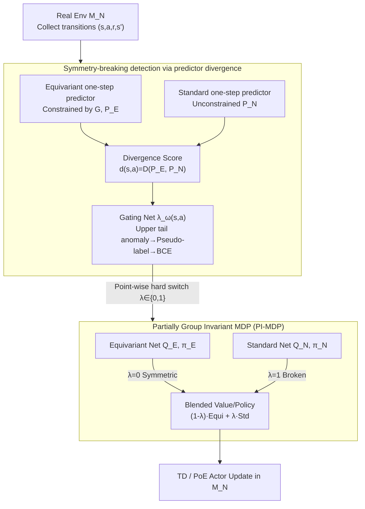

# Partially Equivariant Reinforcement Learning in Symmetry-Breaking Environments

**Conference**: ICLR 2026  
**arXiv**: [2512.00915](https://arxiv.org/abs/2512.00915)  
**Code**: [Project Page](https://pranaboy72.github.io/perl_page/)  
**Area**: Reinforcement Learning/Equivariance  
**Keywords**: Partial Equivariance, Symmetry Breaking, Group Invariant MDP, Gating Strategy, Bellman Error Propagation

## TL;DR

A Partially Group Invariant MDP (PI-MDP) framework is proposed, utilizing a learnable gating function $\lambda(s,a)$ to point-wise switch between equivariant and standard Bellman updates in the state-action space. It is theoretically proven that local symmetry breaking is amplified $1/(1-\gamma)$ times through discounted backup to produce global value function errors, whereas PI-MDP strictly confines errors within the symmetry-breaking regions. Instantiated as PE-DQN and PE-SAC algorithms, the method outperforms strict and approximate equivariant baselines across Grid-World, MuJoCo locomotion, and robotic arm manipulation tasks.

## Background & Motivation

**Background**: Group equivariance provides a powerful inductive bias for reinforcement learning. By constructing Group Invariant MDPs (requiring reward $R(s,a)=R(gs,ga)$ and transition kernel $P(s'|s,a)=P(gs'|gs,ga)$ to hold for all elements $g \in G$), equivariant networks achieve zero-shot generalization between symmetric states, significantly improving sample efficiency. Existing equivariant RL works (e.g., EMLP-based RPP, Equivariant DQN) rely on the assumption that the environment fully satisfies group invariance.

**Limitations of Prior Work**: Real-world control tasks rarely satisfy group invariance perfectly. In robotic control, ground contact forces break vertical symmetry, actuator torque limits break joint symmetry, and obstacles break spatial rotation symmetry. The critical issue is that even if symmetry is broken only in a local region of the state-action space, traditional equivariant RL produces incorrect value estimates in that region. This local error propagates and amplifies through Bellman backup across the entire space, leading to global policy degradation or training failure.

**Key Challenge**: Strict equivariant methods introduce uncontrollable errors in broken regions. Existing approximate equivariant methods (e.g., RPP via global relaxation of constraints through residual paths) provide some robustness but employ a "global uniform relaxation" strategy. This either loses sample efficiency in fully symmetric regions or remains unstable when breaking is severe, as it cannot distinguish between "where it is symmetric" and "where it is not."

**Goal**: (1) Quantify how local symmetry breaking propagates as global value function error through the Bellman operator; (2) Design a framework capable of point-wise selection between equivariant and standard updates in the state-action space; (3) Automatically detect symmetry-breaking regions in a data-driven manner without prior knowledge.

**Key Insight**: The authors observe that the discrepancy between a Group Invariant MDP $\mathcal{M}_E$ and a real MDP $\mathcal{M}_N$ can be precisely described by point-wise reward deviation $\epsilon_R(s,a)$ and transition deviation $\epsilon_P(s,a)$. Reverting to standard updates in regions where $\epsilon>0$ can block error propagation at the source.

**Core Idea**: Use a learnable binary gating function $\lambda(s,a)$ to automatically select either equivariant or standard Bellman updates for each state-action pair. This maintains sample efficiency in symmetric regions while preventing errors in broken regions from propagating outward.

## Method

### Overall Architecture

The PERL (Partially Equivariant RL) workflow maintains two parallel value function/policy networks: a group-equivariant $(Q_E, \pi_E)$ and an unconstrained standard network $(Q_N, \pi_N)$. Simultaneously, a gating function $\lambda_\omega(s,a) \in \{0,1\}$ is trained to determine if a state-action pair lies in a symmetry-breaking region. Final Q-values and policies are determined by a hard switch via $\lambda$: equivariant networks for symmetric regions and standard networks for broken regions. Training occurs in the real environment $\mathcal{M}_N$, with supervision for the gating function provided by the divergence of two one-step predictors. The runtime data flow is: gating $\lambda_\omega$ is trained via predictor divergence (symmetry-breaking detection), then $\lambda_\omega$ point-wise blends the equivariant and standard networks (PI-MDP), followed by TD/Actor updates in the real environment. The error propagation analysis supports this "point-wise switching" routing theoretically rather than acting as a runtime module.

### Key Designs

**1. Local-to-Global Error Propagation Analysis: Quantifying the Impact of Breaking**

To justify the necessity of point-wise processing over global relaxation, the authors quantify the global consequences of local breaking. The gap between the real MDP $\mathcal{M}_N$ and the Group Invariant MDP $\mathcal{M}_E$ is characterized by point-wise deviations: reward deviation $\epsilon_R(s,a) = |R_N(s,a) - R_E(s,a)|$ and transition deviation $\epsilon_P(s,a) = \frac{1}{2}\int|P_N(s'|s,a) - P_E(s'|s,a)|ds'$. Lemma 1 provides a single-step upper bound: the Bellman error at $(s,a)$ does not exceed $\epsilon_R(s,a) + 2\gamma V_{\max}\epsilon_P(s,a)$. Critically, Proposition 1 shows that after accumulating these single-step errors through Bellman backup, the global error of the optimal value function is amplified:

$$\|Q_N^* - Q_E^*\|_\infty \leq \frac{1}{1-\gamma}\|\delta\|_\infty$$

This implies that even if breaking occurs in one local region, discounted backup amplifies it by $(1-\gamma)^{-1}$, contaminating the entire value function. This explains why strict equivariant RL fails in real environments: the issue isn't the equivariance prior, but the local MDP mismatch being transported and amplified globally.

**2. Partially Group Invariant MDP (PI-MDP): Embedding "Where to be Equivariant" into the MDP**

The error bound suggests reverting to standard updates in broken regions where $\delta>0$ to nullify that term. The authors formalize this as the PI-MDP framework, introducing a gating function $\lambda: \mathcal{S}\times\mathcal{A} \to [0,1]$ to define hybrid reward and transition kernels via convex combinations:

$$R_H = (1-\lambda)R_E + \lambda R_N, \qquad P_H = (1-\lambda)P_E + \lambda P_N$$

This ensures $P_H$ remains a valid transition kernel. Theorem 1 proves the corresponding Bellman operator $\mathcal{T}_H$ can be affinely decomposed and remains a $\gamma$-contraction mapping, ensuring convergence to a unique fixed point. Corollary 1 provides the key error bound $\|Q_H^* - Q_N^*\|_\infty \leq \frac{1}{1-\gamma}\|(1-\lambda)\delta\|_\infty$. By setting $\lambda=1$ in broken regions, $(1-\lambda)\delta$ becomes zero, theoretically reducing the PI-MDP optimal value function error to zero.

**3. Symmetry-Breaking Detection via Predictor Divergence: Unsupervised Identification**

Since $\epsilon_R, \epsilon_P$ are not directly measurable without knowing the true underlying group-invariant MDP, the authors use a proxy signal. They train two one-step predictors: an equivariant predictor $\hat{P}_E$ (constrained by the group) and a standard predictor $\hat{P}_N$ (unconstrained). In symmetric regions, both fit the dynamics consistently; in broken regions, $\hat{P}_E$ can only represent the "group-averaged" dynamics, while $\hat{P}_N$ approximates the true dynamics, leading to divergence. The divergence score $d(s,a) = D(\hat{P}_E, \hat{P}_N)$ identifies high-discrepancy samples from the upper tail as anomalies for generating pseudo-labels $y \in \{0,1\}$, which are used to train the gating network $\lambda_\omega$ via binary cross-entropy.

### Loss & Training

**Critic Loss**: The blended Q-value $Q_\theta(s,a) = (1-\lambda_\omega)Q_{E,\theta}(s,a) + \lambda_\omega Q_{N,\theta}(s,a)$ is trained with standard TD targets. During TD calculation, $\lambda_\omega$ is treated with stop-gradient.

**Actor Loss (SAC variant)**: A state-level gate $\lambda_\zeta(s)$ is introduced, and the policy uses a Product of Experts (PoE) form $\pi_\phi \propto \pi_E^{1-\lambda_\zeta} \cdot \pi_N^{\lambda_\zeta}$. $\lambda_\zeta$ is aggregated from $\lambda_\omega(s,a)$ via expectile regression (with $\tau \to 1$) to approximate $\max_a \lambda_\omega(s,a)$, ensuring the policy switches to standard mode if any action at that state triggers a breaking signal.

**Predictor Loss**: $\hat{P}_E$ and $\hat{P}_N$ are trained to fit one-step transitions using equivariant and standard networks, respectively. An optional reward prediction head $\hat{R}_i(s,a)$ is used to detect reward-level symmetry breaking.

**Overall Training Loop**: Each step involves: data collection → updating predictors → calculating divergence → updating gating → updating critic → updating actor → soft updating target networks. Components use independent trunks for stability.

## Key Experimental Results

### Main Results: Grid-World Discrete Control ($C_4$ Rotation + Obstacle Breaking)

| Method | 0 Obstacles | 10 Obstacles | 20 Obstacles | 30 Obstacles | 40 Obstacles |
|------|---------|---------|---------|---------|---------|
| Vanilla DQN | Medium | Medium | Medium | Medium | Medium |
| Equivariant DQN | **Highest** | Fast Decline | Large Degradation | Severe Degradation | Near Failure |
| RPP-DQN (Approx.) | High | Slightly > Vanilla | Slightly > Vanilla | Slightly > Vanilla | Slightly > Vanilla |
| Approx. Equi DQN | High | Slightly > Vanilla | Slightly > Vanilla | Medium | Medium |
| **PE-DQN (Ours)** | **Highest** | **Highest** | **Highest** | **Highest** | **Highest** |

As obstacles increase, the gap between PE-DQN and baselines widens, validating the theoretical prediction that selective equivariance is more important as breaking increases.

### Main Results: Continuous Control (MuJoCo + Robot Arm)

| Environment | SAC | Equi-SAC | RPP-SAC | Approx-SAC | **PE-SAC (Ours)** | Symmetry Breaking Source |
|------|-----|----------|---------|------------|-----------|-------------|
| Hopper | Medium | Medium | Medium | Medium | **Highest Speed** | Ground contact |
| Ant | Medium | Medium | Medium | Medium | **Highest (Efficiency+Final)** | Asymmetric torques |
| Swimmer | Medium | **Highest** | High | High | Near Highest | Minimal breaking |
| Fetch Reach | Medium | High | High | High | **Highest** | Ground constraints |
| UR5e Reach | Medium | Unstable/Crash | Unstable | Unstable | **Highest & Stable** | Dynamics + Orientation |

In the UR5e Reach task, PE-SAC is the only method to maintain stable high performance, whereas strict and approximate variants suffer instability due to complex dynamics breaking.

### Ablation Study

| Configuration | Grid-World (30 obs) | Description |
|------|-------------------|------|
| PE-DQN (Full) | **Highest** | Hard gate + Predictor divergence |
| Soft Gating ($\lambda \in [0,1]$) | Lower | Less stable training than hard gating |
| Shared trunk (Critic) | Slightly Lower | Occasionally impacts stability |
| Shared trunk (Actor) | Lower | Interference between equivariant/standard paths |
| No Reward Head | Lower in R-breaking | Cannot detect pure reward-level breaking |

### Key Findings

- **Breaking-to-Performance Curve**: PE-DQN's relative advantage grows monotonically with the degree of symmetry breaking. In perfectly symmetric environments, $\lambda$ converges to $\approx 0$, yielding performance identical to strict equivariant DQN.
- **Gating Visualization**: The learned $\lambda$ aligns closely with obstacle locations in Grid-World—$\lambda \approx 0$ (equivariant) in open spaces and $\lambda = 1$ (standard) near obstacles.
- **Hard Gate > Soft Gate**: Binary switching $\lambda \in \{0,1\}$ is more stable than soft interpolation $\lambda \in [0,1]$, likely due to the decoupling of training signals preventing mutual interference.
- **Robustness to Complex Dynamics**: In variant tasks with 40 obstacles and stochastic transitions, PE-DQN remains optimal, proving divergence detection is robust to noisy dynamics.

## Highlights & Insights

- **Error Propagation Theory**: This work fills a cognitive gap by strictly proving the "local breaking → $1/(1-\gamma)$ amplification → global bias" mechanism. This not only explains the failure of equivariant RL in real settings but also indicates that mitigation must happen locally.
- **Gating Design**: The PI-MDP formulation ensures MDP validity and convergence, while Corollary 1 provides a clear design guideline for $\lambda$. Using predictor divergence as a proxy makes the theory implementable without knowing the ground-truth MDP.
- **Transferable "Selective Inductive Bias" Paradigm**: The concept of applying priors only where needed is not limited to equivariance. This gating approach can be generalized to other structural priors like sparsity, smoothness, or causal structures.

## Limitations & Future Work

- **Computational Overhead**: Maintaining dual networks and predictors increases training time by approximately 2-3x compared to standard RL. This may be costly for high-dimensional visual inputs.
- **Universal Breaking**: If symmetry is severely broken throughout the entire space, $\lambda$ becomes 1 everywhere, and the framework degrades into standard RL with redundant architectural overhead.
- **State-level Input**: Current implementation relies on state vectors; extending PI-MDP to visual observations (pixels/point clouds) remains a primary future direction.
- **Detector Sensitivity**: Accuracy depends on predictor quality. In high-dimensional environments, ensemble predictors or stronger world models may be required to improve reliability.

## Related Work & Insights

- **vs RPP (Finzi et al., 2021)**: RPP uses global residual paths to relax constraints, essentially letting each parameter decide its equivariance. PE-RL point-wise decides equivariance in the state-action space. PE-RL significantly outperforms RPP in severe breaking scenarios.
- **vs Approx. Equivariant RL (Park et al., 2025)**: While similar in goal, these use global architectural modifications. They perform well with slight breaking but fail compared to PE-RL when breaking is severe because global relaxation cannot isolate "good" from "bad" regions.

## Rating

- Novelty: ⭐⭐⭐⭐⭐ Integration of PI-MDP, error theory, and gating detection is highly cohesive.
- Experimental Thoroughness: ⭐⭐⭐⭐ Wide coverage of tasks with systematic breaking analysis, though visual RL and real-robot experiments are missing.
- Writing Quality: ⭐⭐⭐⭐⭐ Clear derivation from theory to algorithm; well-organized structure.
- Value: ⭐⭐⭐⭐⭐ Significant push towards the deployment of equivariant RL in real-world scenarios.

<!-- RELATED:START -->

## Related Papers

- [\[AAAI 2026\] Coordinated Humanoid Robot Locomotion with Symmetry Equivariant Reinforcement Learning Policy](../../AAAI2026/robotics/coordinated_humanoid_robot_locomotion_with_symmetry_equivariant_reinforcement_le.md)
- [\[ICLR 2026\] RAVEN: End-to-end Equivariant Robot Learning with RGB Cameras](raven_end-to-end_equivariant_robot_learning_with_rgb_cameras.md)
- [\[ICLR 2026\] EquAct: An SE(3)-Equivariant Multi-Task Transformer for 3D Robotic Manipulation](equact_an_se3-equivariant_multi-task_transformer_for_3d_robotic_manipulation.md)
- [\[ICLR 2026\] MVR: Multi-view Video Reward Shaping for Reinforcement Learning](mvr_multi-view_video_reward_shaping_for_reinforcement_learning.md)
- [\[ICLR 2026\] From Seeing to Experiencing: Scaling Navigation Foundation Models with Reinforcement Learning](from_seeing_to_experiencing_scaling_navigation_foundation_models_with_reinforcem.md)

<!-- RELATED:END -->
