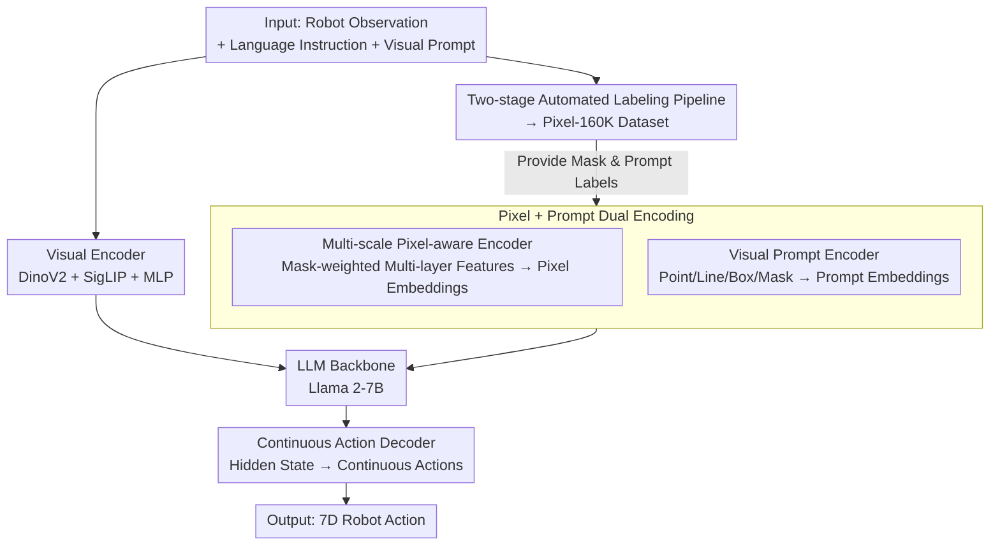

# PixelVLA: Advancing Pixel-level Understanding in Vision-Language-Action Model

**Conference**: ICLR 2026  
**OpenReview**: [https://openreview.net/forum?id=7M6ryCABIc](https://openreview.net/forum?id=7M6ryCABIc)  
**Paper**: [Project Page](https://wenqiliang.github.io/PixelVLA/)  
**Code**: https://wenqiliang.github.io/PixelVLA/ (Project Page)  
**Area**: Robotics / Embodied AI / VLA  
**Keywords**: Vision-Language-Action Models, Pixel-level Understanding, Visual Prompting, Continuous Actions, Visuomotor Instruction Tuning

## TL;DR
PixelVLA is the first vision-language-action model to support both pixel-level understanding and multi-modal prompting (text + points/lines/boxes/masks). By integrating three components—a "multi-scale pixel-aware encoder, a visual prompt encoder, and a continuous action decoder"—into existing VLAs and utilizing an automated annotation pipeline to create the Pixel-160K dataset, it enhances manipulation success rates by $10.1\% \sim 28.7\%$ over OpenVLA at only $1.5\%$ of the pre-training cost.

## Background & Motivation

**Background**: Vision-Language-Action (VLA) models combine large-scale robotic data with pre-trained Vision-Language Models (VLMs) to generalize to unseen objects and instructions in zero-shot scenarios. Representative works like RT-2, OpenVLA, and $\pi_0$ have become the mainstream paradigm for general-purpose robotic manipulation policies.

**Limitations of Prior Work**: Almost all existing VLAs directly inherit from VLMs, which process observations at the "image-level." While they can identify an eggplant in a scene, they lack precision regarding its exact pixel contours and spatial boundaries. This leads to two specific issues: first, a lack of fine-grained scene understanding and weak spatial reasoning, resulting in poor out-of-distribution generalization; second, most VLAs only accept text instructions, ignoring intuitive visual cues like points, lines, boxes, or masks. This limits human-robot interaction, particularly for referential instructions like "put *this* eggplant into the basket."

**Key Challenge**: While pixel-level understanding has been validated in VLMs (e.g., Shikra, Ferret), migrating it to VLAs is hindered by data bottlenecks. Existing robot datasets (OXE, DROID, etc.) lack multi-modal visual prompts and pixel-level mask annotations. Directly using off-the-shelf open-vocabulary segmentation models to label robotic images yields poor results due to cluttered, low-quality images and a significant domain gap with VLM pre-training data.

**Goal**: (1) Design a model architecture that enables VLAs to gain pixel-level understanding and accept multi-modal visual prompts; (2) Solve the "lack of pixel annotations in robotic data" bottleneck by automatically generating usable training data; (3) Design a training pipeline to inject these capabilities into existing VLAs at low cost.

**Key Insight**: The authors propose **Visuomotor Instruction Tuning**, migrating the mature "visual instruction tuning" from VLMs to VLAs. This expands action generation from $a_t = F_\theta(x_t, L)$ (image + text $\to$ action) to $a_t = F_\theta(x_t, p_t, L, V)$, introducing pixel mask inputs $p_t$ and diverse visual prompts $V$.

**Core Idea**: Encode pixel-level information from segmentation masks into LLM tokens via "pixel-aware embeddings." A lightweight visual prompt encoder receives points/lines/boxes/masks, and a continuous action decoder replaces discrete action tokens. These three modules enhance existing VLAs in a plug-and-play manner, supported by an automated annotation pipeline to fill the missing pixel-level training data.

## Method

### Overall Architecture

PixelVLA enables VLAs to perceive pixels and follow visual prompts. It utilizes the Prismatic-7B backbone (DinoV2 + SigLIP encoders + Llama 2-7B). Three new components are inserted: Observations, language instructions, and visual prompts are processed through the visual encoder for embeddings; the **multi-scale pixel-aware encoder** aggregates multi-layer features from mask regions into pixel-aware embeddings; and the **visual prompt encoder** encodes points/lines/boxes/masks into prompt embeddings. These are fed into the LLM, and the hidden state of the final layer is used by the **continuous action decoder** to regress 7-dimensional robotic actions (incorporating action chunking).

This structure is supported by a **two-stage automated labeling pipeline** that processes public datasets (Fractal, Bridge v2) into the Pixel-160K dataset, and **two-stage visuomotor instruction tuning**, which first learns continuous action representations and then injects pixel-level understanding via LoRA.

### Key Designs

**1. Multi-scale Pixel-aware Encoder: Compressing mask region features into LLM-readable pixel embeddings**

This addresses the "pixel blindness" of VLAs. Given an observation $x_0$, SigLIP extracts multi-layer visual features $F_v^0=\{f_v^{0,i}\}_{i=1}^L$. The pixel mask $p_0$ defines the target region. The core mechanism performs mask-weighted averaging on each feature layer, followed by linear projection, cross-layer summation, and an MLP to obtain the pixel-aware embedding $E_p^0$:

$$E_p^0 = \mathrm{MLP}\Big(\sum_{i=1}^{L}\Gamma_i(f_p^{0,i})\Big),\qquad f_p^{0,i}=\frac{p_0\cdot f_v^{0,i}}{|p_0|}$$

Where $\Gamma_i(\cdot)$ is the linear projection for the $i$-th layer, and $f_p^{0,i}$ is the normalized average feature for that region. Since these embeddings are supervised by action prediction loss, the model learns the "pixel info $\leftrightarrow$ action" association, truly injecting pixel-level understanding into the VLA backbone.

**2. Visual Prompt Encoder: Unified processing of points/lines/boxes/masks**

This enables VLAs to receive visual instructions. Borrowing from SAM’s prompt encoder, input visual prompts $V_0$ are converted to continuous positional embeddings based on normalized coordinates, overlaid with learnable "prompt type embeddings" to form feature $F_s^0$, and processed via MLP into $E_s^0$. Explicit spatial binding ensures the LLM retains precise location information, allowing users to point to objects instead of providing verbose text descriptions.

**3. Continuous Action Decoder: Direct regression to bypass discretization loss**

Existing models like OpenVLA discretize each action dimension into 256 bins, which loses fine-grained detail. PixelVLA follows the continuous approach of $\pi_0$: the final LLM hidden state $F_t$ passes through a linear projection, $N_r$ ResNet blocks, and an MLP to output continuous actions $A\in\mathbb{R}^{N_c\times 7}$, where $N_c$ is the action chunking size. This combination avoids cumulative discretization errors and captures longer temporal dependencies, significantly improving performance on long-horizon tasks like LIBERO-Long.

**4. Two-stage Automated Labeling Pipeline $\to$ Pixel-160K: Extracting pixel labels from robotic videos**

The pipeline consists of: **Gripper-aware Region Proposal**—identifying the "gripper closure" moment as a heuristic for the object's location. SAM 2 segments the gripper mask in the closure frame, and an expanded bounding box defines the region proposal $R_\eta$. **Multi-modal Object Segmentation**—using Llama 2-7B to extract the target noun (e.g., "Eggplant") from the instruction and feeding it with $R_\eta$ into Grounding DINO and SAM. After filtering by confidence, prompts (points/lines/boxes) are randomly sampled from the resulting masks. The final Pixel-160K dataset contains 160k episodes and 6.5 million visual-prompt-mask-action triplets.

### Loss & Training

A **two-stage visuomotor instruction tuning** strategy is used. **Stage 1 (Continuous Action Training, CAT)**: The LLM and encoders are initialized with weights from OpenVLA/$\pi_0$. Except for the continuous action decoder, most modules are frozen. Only the $L_1$ regression loss is used to align LLM hidden states with ground-truth continuous actions on Fractal + Bridge v2 data. **Stage 2 (Pixel-level Understanding Enhancement, PUE)**: The LLM backbone is fine-tuned using LoRA ($r=32$) on Pixel-160K, while jointly training the prompt and pixel encoders and optimizing the action decoder. The loss is:

$$\mathcal{L}_{PixelVLA}=\sum_{i=1}^{B}\big\|a_i - C\big(H(E_v^i, E_l^i, E_p^i, E_s^i)\big)\big\|_1$$

Where $C(\cdot)$ is the decoder, $H$ is the LLM, and $E_v/E_l/E_p/E_s$ are the diverse embeddings.

## Key Experimental Results

Evaluated on SimplerEnv-Google Robot, SimplerEnv-WidowX, and LIBERO.

### Main Results

| Benchmark / Setting | Metric | PixelVLA | Baseline | Gain |
|------|------|------|----------|------|
| Google Robot (VM Avg) | Success Rate | 61.4 | OpenVLA 32.7 | +28.7 |
| Google Robot (VA Avg) | Success Rate | 50.1 | OpenVLA 40.0 | +10.1 |
| WidowX (Suc. Avg, $\pi_0$ base) | Success Rate | 33.8 | $\pi_0$ 27.1 | +6.7 |
| LIBERO (Avg of 4 sets) | Success Rate | 86.7 | OpenVLA 76.5 | +10.2 |
| LIBERO-Long | Success Rate | 82.6 | OpenVLA 53.7 | +28.9 |

PixelVLA achieves SOTA on LIBERO and leads significantly on LIBERO-Long. This is attributed to the continuous decoder and action chunking, which capture temporal dependencies and mitigate discretization errors.

### Ablation Study

Ablation on Google Robot (VA) using OpenVLA as the baseline:

| Configuration | Avg Success Rate | Description |
|------|---------|------|
| Baseline | 40.0 | Original OpenVLA |
| +FT | 37.0 | FT on Fractal+Bridge only (decreases) |
| +FT+CAT | 43.8 | With Continuous Action Training, +3.8 |
| +FT+PUE | 48.0 | With Pixel-level Enhancement, +8.0 |
| PixelVLA (CAT+PUE) | 50.1 | Full two-stage, +6.3 over CAT |

### Key Findings
- **PUE is the primary driver**: Adding PUE alone (+8.0) significantly outperforms adding CAT alone (+3.8), proving pixel-level info is key for generalization.
- **Direct fine-tuning can be detrimental**: Pure fine-tuning (+FT) scored lower than the baseline, indicating improvements stem from the new components and two-stage paradigm rather than just "more data."
- **Low Cost**: These results were achieved using only $\sim 1.5\%$ of OpenVLA's pre-training compute.

## Highlights & Insights
- **"Gripper closure" as a positioning heuristic**: Positioning target objects via gripper closure moments simplifies pixel annotation into an automated pipeline, avoiding the need for per-frame manual labeling.
- **Implicit supervision through action loss**: Pixel-aware embeddings are learned via downstream action regression rather than a dedicated segmentation loss, simplifying multi-task optimization.
- **Plug-and-play**: The architecture shows consistent gains on both OpenVLA and $\pi_0$, demonstrating versatility across different VLA backbones.

## Limitations & Future Work
- **Simulation-only evaluation**: Results are currently limited to SimplerEnv and LIBERO; real-robot deployment and sim-to-real performance remain to be verified.
- **Resolution and perspective**: Dependency on a single third-person view and $224 \times 224$ resolution may affect robustness in high-resolution or occluded scenarios.
- **Catastrophic forgetting**: Two-stage joint optimization showed slight performance drops in highly sensitive tasks (e.g., Open/Close Drawer), requiring better mitigation strategies.

## Related Work & Insights
- **vs OpenVLA**: PixelVLA replaces discrete tokens with continuous actions and adds pixel/prompt encoders, surpassing it by $10.1\% \sim 28.7\%$ at minimal cost.
- **vs TraceVLA**: TraceVLA uses visual trajectory prompts for spatio-temporal awareness; PixelVLA reaches pixel-mask level granularity, outperforming it on Google Robot and LIBERO.
- **vs Region-level VLMs (Shikra, Ferret)**: While those focus on perception, PixelVLA is the first to align fine-grained pixel masks with continuous actions for embodied control.

## Rating
- Novelty: ⭐⭐⭐⭐⭐ First to implement both pixel-level understanding and multi-modal prompting in VLA.
- Experimental Thoroughness: ⭐⭐⭐⭐ Solid benchmark results and ablations, though lacks real-world testing.
- Writing Quality: ⭐⭐⭐⭐ Clear structure and well-defined mechanisms.
- Value: ⭐⭐⭐⭐⭐ Plug-and-play, low-cost enhancement of VLA fine-grained perception.

<!-- RELATED:START -->

## Related Papers

- [\[ICLR 2026\] Vision-Language-Action Instruction Tuning: From Understanding to Manipulation](vision-language-action_instruction_tuning_from_understanding_to_manipulation.md)
- [\[ICLR 2026\] TPRU: Advancing Temporal and Procedural Understanding in Large Multimodal Models](tpru_advancing_temporal_and_procedural_understanding_in_large_multimodal_models.md)
- [\[ICLR 2026\] Vlaser: Vision-Language-Action Model with Synergistic Embodied Reasoning](vlaser_vision-language-action_model_with_synergistic_embodied_reasoning.md)
- [\[ICLR 2026\] UniVLA: Unified Vision-Language-Action Model](unified_vision-language-action_model.md)
- [\[ICLR 2026\] WMPO: World Model-based Policy Optimization for Vision-Language-Action Models](wmpo_world_model-based_policy_optimization_for_vision-language-action_models.md)

<!-- RELATED:END -->
