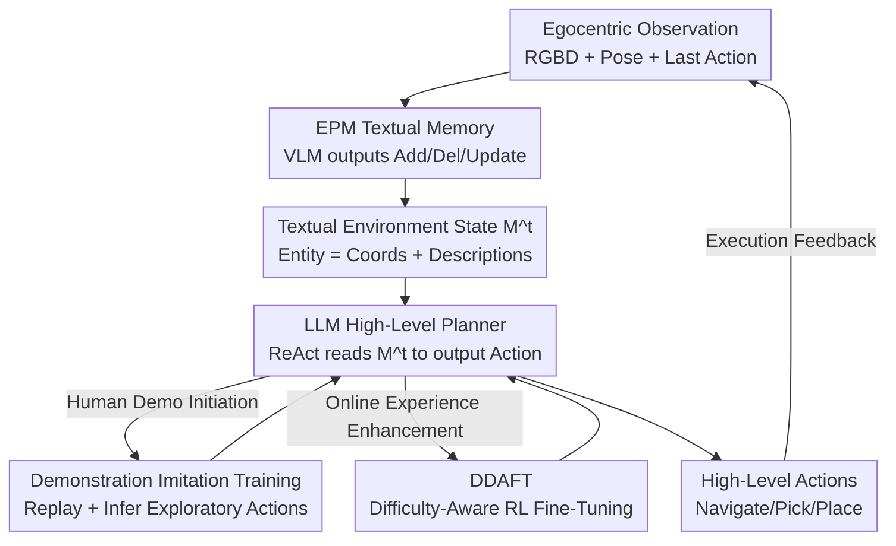

# Planning with an Embodied Learnable Memory

**Conference**: ICLR 2026  
**OpenReview**: [https://openreview.net/forum?id=79BOATBal9](https://openreview.net/forum?id=79BOATBal9)  
**Code**: To be confirmed  
**Area**: Embodied AI / Robotics / Long-horizon Task Planning  
**Keywords**: Embodied Memory, Mobile Manipulation, VLM, Task Planning, Reinforcement Learning

## TL;DR
This paper proposes EPM (Embodied Perception Memory)—a learnable memory that uses a single VLM to maintain a "textual scene representation" through add/delete/update operations from first-person observations. Combined with "human demonstration imitation + Dynamic Difficulty-Aware Fine-Tuning (DDAFT)", the LLM planner achieves up to a 55% success rate improvement over strong baselines on long-horizon mobile manipulation tasks in dynamic home environments within PARTNR.

## Background & Motivation
**Background**: Enabling robots to complete long-horizon mobile manipulation tasks—such as "moving scissors, phones, and credit cards from the table to the counter"—requires the coordination of memory (remembering object locations), perception (observing the current scene), and planning (deciding the next action). Current mainstream approaches typically attach an external perception/memory module to an LLM planner: either storing egocentric images or point clouds with features (e.g., ConceptGraphs, DynaMem, 3D-Mem), and then using language queries to retrieve relevant information during planning.

**Limitations of Prior Work**: This "multi-module concatenation" memory representation suffers from three specific issues. First, it **cannot handle dynamic environments**—objects are constantly moved by robots or humans, changing their states; representations based on static point clouds/features are difficult to update, often relying on heuristic re-association to track objects and failing to correct misdetections. Second, it has **high computational overhead**—querying the large model multiple times and performing per-category detection over large vocabularies strains memory and compute. Third, **queries are difficult to write**—the authors cite prior work (GOAT) noting that naive language feature matching fails to balance precision and recall, making it impractical for planners to formulate precise queries.

**Key Challenge**: Decoupling "perception/memory" and "planning" into independent modules connected via query interfaces makes the system extremely sensitive to individual module representations. Errors propagate through the pipeline, leading to planning failures. Furthermore, this query-based interface restricts the planner to training only on data with query annotations, preventing it from directly learning from robot interaction data.

**Goal**: Design a memory representation that handles dynamic environments, maintains efficiency, and allows the LLM planner to directly read environmental information without explicit queries, alongside a training method capable of learning planning from real interaction data.

**Key Insight**: If the memory can directly output a **textual** object list (each entity with 3D coordinates + natural language description and relationships), it can naturally fit into the LLM planner's context. The planner no longer needs to issue API queries to retrieve info but can focus on generating actions. Consequently, the planner can be trained using interaction/demonstration data without query labels.

**Core Idea**: Replace "multi-model concatenation + query retrieval" with "a single end-to-end VLM outputting discrete add/delete/update operations to maintain textual scene memory." Then, use "human demonstrations + difficulty-aware RL" to teach the planner robust planning over this noisy memory.

## Method

### Overall Architecture
The system consists of two layers: the bottom layer is **EPM memory**, which converts egocentric observations into a textual environment state $M^t$ that updates over time; the top layer is the **LLM high-level planner**, which reads $M^t$ to output high-level actions (Navigate/Pick/Place/Open), executed by low-level skill policies. Formally, EPM learns an update function $f$ such that $M^t = f(M^{t-1}, o^t, a^t)$, where $o^t$ comprises RGBD + camera pose + intrinsics, and $a^t$ is the previous action. The environment state $M$ is a sequence of entities, each containing a unique ID, a 3D centroid $c_i \in \mathbb{R}^3$, and a natural language description $d_i$ (open-vocabulary name, state, and relationships).

Crucially, EPM does not regenerate the entire $M^t$ but outputs a set of **discrete operations** to be applied to $M^{t-1}$. The planner follows the ReAct paradigm, autoregressively alternating between "world representation ↔ action," and only adds entities updated by EPM into the context per step to avoid context explosion. The planner is enhanced through two training pipelines: Human Demonstration (HD) imitation for initialization, followed by Dynamic Difficulty-Aware Fine-Tuning (DDAFT).

### Key Designs

**1. EPM: Maintaining Textual Scenes with Single VLM Discrete Operations**

To address the failure of multi-module systems in dynamic settings and the reliance on queries, EPM integrates perception-memory into **one** VLM (based on LLaVa-OneVision-7B + LoRA fine-tuning). Instead of predicting a full new memory, it selects from four discrete operations: `Add (<coords>):<description>` (back-projecting new objects to world coordinates), `Update k (<coords>):<description>` (modifying coordinates/descriptions of entity $k$, e.g., when a cabinet is opened or a label is corrected upon closer inspection), `Remove k` (deleting vanished or misdetected entities), and `No updates` (maintaining $M^t \equiv M^{t-1}$). The key benefit is that object tracking, re-association, and error correction are **learned internally** rather than relying on thresholds/heuristics. The output is natively textual and directly consumable by the LLM planner, eliminating explicit queries. Training data is derived by heuristically inferring operation sequences using privileged simulator information (static layouts + initial furniture $M^0$ in PARTNR)—note that heuristics are only used for data generation, not inference.

**2. Inferring Planning Traces from Human Demonstrations (HD): Teaching Exploration and Noise Robustness**

Training a planner directly on human teleoperation demonstrations presents a conflict: different perception systems induce different optimal actions (a "pixel-perfect" agent might identify a room by turning once, while a "myopic" agent must move to gain the same understanding). The solution is to **replay teleoperations in simulation while running the perception system (EPM) in-the-loop**, obtaining "planning traces tailored to the perception system" without collecting new data for every sensor. The process (`toPlanningTrace`) steps through each frame to update EPM; each interaction label (Pick/Place/Open/Close) corresponds to a planning action. If EPM has not detected the interaction object by the end of the previous action, an `Explore` action is appended—deliberately sampling "exploration without finding" to teach exhaustive search and sampling "navigating/grabbing hallucinations" to teach robustness against EPM noise. Finally, an episode evaluation function (`optimize`) removes suboptimal sequences that do not advance the task.

**3. DDAFT: Dynamic Difficulty-Aware Value-Free Online RL for Self-Induced Curriculum**

To further enhance the planner with online experience, the authors propose Dynamic Difficulty-Aware Fine-Tuning. This is a **value-free RL** approach for LLMs: the initial policy $\pi_0$ (HD model) is rolled out across all episodes to create a dataset $D_0 = \{(x_0, r_0), \dots, (x_n, r_n)\}$, followed by alternating between "fine-tuning the model" and "sampling new traces" using an RFT objective. Unlike standard LLM inference fine-tuning (e.g., GRPO, DART-Math) which **samples uniformly**, DDAFT biases sampling toward **difficult problems without current success samples**—specifically using a distribution derived from the "softmax of failure rates" per episode. The key difference from DART-Math is that DDAFT **runs iteratively**, dynamically estimating instruction difficulty to self-induce a curriculum, resulting in higher sample efficiency and final performance.

### A Complete Example
Task: "Move scissors, phone, and credit card from table to counter." Initial $M^0$ contains static furniture (Entity.1 Coffee Table). After moving forward, EPM sees the objects and outputs `Add (0.3,0.8): Scissors on Entity.1`, `Add (0.6,0.9): Phone on Entity.1`, and `Remove: Entity.4` for a misdetected entry. These updates result in a new textual state. The planner reads "Scissors on Entity.1" and directly outputs `Action: Grab Object.2`. If a target object is not yet detected, the HD-trained policy executes `Explore` to search, returning to the "Detect → Navigate → Grab → Place" cycle until completion.

## Key Experimental Results

### Main Results
Evaluation is conducted on the PARTNR single-agent benchmark (1000 validation episodes, 12 HSSD scenes), measuring Success Rate (SR↑), Progress Check (PC↑), simulation steps, planning cycles, and redundant actions. Selected results for the "Learned Perception" setting:

| Configuration (Learned Perception) | SR↑ | PC↑ | Sim Steps↓ |
|--------|------|------|------|
| DynaMem (Baseline) | 0.03 | 0.11 | 5090 |
| PP (Llama3.3-70B, Zero-shot) | 0.46 | 0.65 | 1850 |
| PP+DDAFT (Ours) | 0.58 | 0.74 | 2200 |
| HD (Ours, 8B model) | 0.55 | 0.69 | 3040 |
| HD+DDAFT (Ours) | 0.58 | 0.74 | 2250 |

Ours (rows 8-10) achieves an absolute SR gain of **55%** and **12%** over strong baselines (DynaMem, PP). Even when DynaMem uses Ground Truth (GT) perception (SR 0.17), it lags behind. Ours is **3.5×** faster than DynaMem. Notably, an 8B HD model (GT perception SR 0.63) outperforms the 70B PP (SR 0.51) by 0.12 points.

Independent perception evaluation (outside the planning loop) shown below (PARTNR, Node F1):

| Method | Node Precision | Node Recall | Node F1 |
|------|------|------|------|
| GT (Upper Bound) | 0.86 | 0.54 | 0.60 |
| GPT-4o | 0.00 | 0.05 | 0.00 |
| DynaMem | 0.04 | 0.10 | 0.05 |
| EPM (Ours) | 0.36 | 0.42 | 0.34 |

EPM significantly outperforms GPT-4o / DynaMem in simulation, though F1=0.34 is far from saturated (due to object partial visibility/distance). EPM trained in simulation generalizes to the real-world Spot-Indoor dataset but faces misclassifications and multi-instance association issues.

### Ablation Study

| Configuration | Key Findings |
|------|---------|
| PP → PP+DDAFT (GT) | SR 0.51 → 0.66 (+0.15); DDAFT provides the largest gain to pre-trained policies. |
| HD → HD+DDAFT (GT) | SR 0.63 → 0.68 (+0.05); HD is already strong, yielding smaller RL gains. |
| PP → PP+DDAFT (Learned) | SR 0.46 → 0.58 (+0.12); DDAFT is effective under noisy perception. |
| HD vs PP (Learned) | 0.55 vs 0.46; Demonstration training helps small models adapt to EPM failures. |
| HD (Learned) vs PP (GT) | 0.55 vs 0.51; Ours + Learned perception outperforms PP + GT perception. |

### Key Findings
- **HD enables effective planning from EPM representations**: An 8B HD model outperforms a 70B PP model (+0.12 SR in GT setting), showcasing the efficacy of trace derivation for embodied planning.
- **HD is resilient to EPM failures**: Under learned perception, HD exceeds PP and even "PP + Perfect Perception," suggesting demonstrations don't require "perception-specific" traces to teach robust planning.
- **DDAFT is universal**: It improves performance for both PP and HD under both GT and learned perception, offering a general recipe for enhancing textual planning policies.
- **Real-world validation**: PP+DDAFT + Learned EPM achieved a 55% success rate in 20 real Spot robot scenarios, with EPM providing correct plans in 70% of tasks.

## Highlights & Insights
- **Unified "Memory as Text, Planning as Completion"**: Designing perception-memory as a single VLM outputting discrete text operations allows memory to naturally enter the LLM context, removing the need for queries. This elegantly solves both "query difficulty" and "lack of query-labeled training data."
- **Perception-in-the-Loop Data Generation**: Using "simulated teleoperation replay + EPM in-the-loop" to generate "perception-specific" planning traces bypasses the conflict of differing optimal actions across perception systems without recollecting human data.
- **Difficulty-Aware Sampling for Self-Induced Curriculum**: DDAFT uses a "failure rate softmax" to focus RL exploration budgets on difficult problems and iteratively re-estimates difficulty, proving more efficient than static sets (DART-Math).
- **Intentional Noise Injection**: Deliberately sampling "failed exploration" and "grabbing hallucinations" during demonstration training teaches the planner to be robust to noisy memory rather than assuming perfection—a pragmatic design given EPM's F1 of 0.34.

## Limitations & Future Work
- The authors acknowledge that training utilizes **only simulation data** due to the difficulty of collecting large-scale real-world dynamic scene data; real-world training is left for future work.
- **Bottlenecks of pure text representation**: If a task requires reasoning about object properties not captured in text, the planner cannot proceed; EPM could be extended as a hybrid system with continuous visual features or paired with VLA/visuomotor modules.
- Observation: EPM perception F1 is only 0.34. Success relies heavily on the "robustness to noise" learned from demonstrations. For tasks sensitive to fine-grained instance discrimination, this pipeline might struggle. Real-world failures were a mix of planning and skill execution errors.

## Related Work & Insights
- **vs DynaMem**: DynaMem stores aggregated embeddings in global voxel grids and queries per category; it cannot infer relationships and uses open-loop planning. EPM outputs relationship-aware text, is end-to-end, supports closed-loop planning, and is 3.5× faster with 55% higher SR.
- **vs ConceptGraphs / 3D-Mem**: These rely on heuristics for re-association and are sensitive to dynamic scenes. EPM **learns** re-association and error correction within the model and supports Add/Update/Remove operations.
- **vs DART-Math (RL Sampling)**: DART-Math uses static difficulty sets; DDAFT iteratively estimates difficulty for better efficiency.
- **vs VLA (e.g., GR00T)**: VLAs ground actions directly in vision but are limited by memory capacity for long-horizon exploration. Ours uses "LLM Planner + Learnable External Memory" for long-horizon tasks.

## Rating
- Novelty: ⭐⭐⭐⭐⭐ The combination of "textual learnable memory + query-free planning + difficulty-aware RL" is novel; EPM's discrete operation memory is particularly ingenious.
- Experimental Thoroughness: ⭐⭐⭐⭐ Comprehensive simulation experiments, perception evaluation, and real-world validation; however, real-world training is missing and perception F1 is low.
- Writing Quality: ⭐⭐⭐⭐ Strong motivation, clear correspondence between tables and findings, and well-organized handling of multiple modules.
- Value: ⭐⭐⭐⭐⭐ Provides a reusable "Memory as Text + Demo/RL for Planning" recipe for long-horizon dynamic embodied planning.

<!-- RELATED:START -->

## Related Papers

- [\[ICLR 2026\] MomaGraph: State-Aware Unified Scene Graphs with Vision-Language Models for Embodied Task Planning](momagraph_state-aware_unified_scene_graphs_with_vision-language_models_for_embod.md)
- [\[CVPR 2026\] Predict Before You Explore: Predictive Planning with Specialized Memory for Embodied Question Answering](../../CVPR2026/robotics/predict_before_you_explore_predictive_planning_with_specialized_memory_for_embod.md)
- [\[ICLR 2026\] Embodied Agents Meet Personalization: Investigating Challenges and Solutions Through the Lens of Memory Utilization](embodied_agents_meet_personalization_investigating_challenges_and_solutions_thro.md)
- [\[ICLR 2026\] SLAP: Shortcut Learning for Abstract Planning](slap_shortcut_learning_for_abstract_planning.md)
- [\[ICLR 2026\] REI-Bench: Can Embodied Agents Understand Vague Human Instructions in Task Planning?](rei-bench_can_embodied_agents_understand_vague_human_instructions_in_task_planni.md)

<!-- RELATED:END -->
