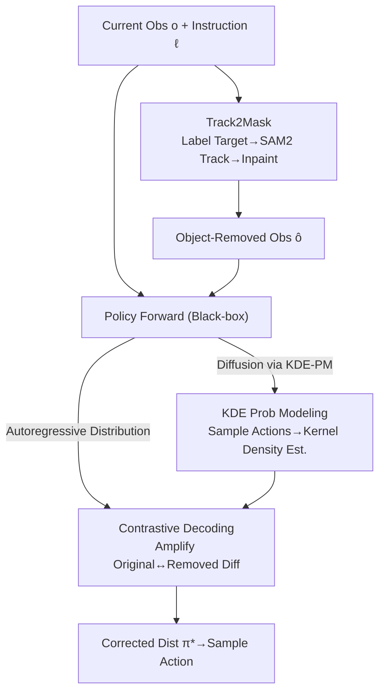

# Policy Contrastive Decoding for Robotic Foundation Models

**Conference**: ICLR 2026  
**OpenReview**: [https://openreview.net/forum?id=P9PVdWyM3U](https://openreview.net/forum?id=P9PVdWyM3U)  
**Project Page**: [https://koorye.github.io/PCD](https://koorye.github.io/PCD)  
**Code**: https://koorye.github.io/PCD (Available)  
**Area**: Robotics / Embodied AI / VLA  
**Keywords**: Robotic Foundation Models, Spurious Correlation, Contrastive Decoding, Training-free Plugin, Generalization

## TL;DR
Addressing the issue where generalist robot policies tend to form spurious correlations between irrelevant features (like background/texture) and actions, this paper proposes Policy Contrastive Decoding (PCD). PCD is a training-free, plug-and-play method that performs contrastive decoding between action distributions derived from "original observations" and "object-removed observations." This forces the policy's attention back onto the target object. It is effective for both autoregressive (OpenVLA) and diffusion-based (Octo, $\pi_0$) policies, achieving performance gains of up to 50.6% in simulation and 108% on real hardware.

## Background & Motivation
**Background**: Robotic foundation models (or generalist robot policies) represent the mainstream approach for building versatile and dexterous robotic systems. A policy $\pi_\theta(a_i \mid o_i, \ell)$ takes a visual observation $o_i$ and a language instruction $\ell$ as input to output a robot action (e.g., end-effector displacement). These are categorized into two types based on action generation: autoregressive policies (e.g., OpenVLA, generating action dimensions token-by-token) and diffusion policies (e.g., Octo, $\pi_0$, denoising the entire action vector in parallel).

**Limitations of Prior Work**: The authors discovered that these policies learn significant **spurious correlations** from pre-training trajectories—relying on task-irrelevant features like background, lighting, and texture to predict actions rather than focusing on the target object. Consequently, slight changes to the background (e.g., moving the lighting area or drawer handle) cause the action prediction performance of OpenVLA to drop by 36% and 32%, respectively. These "shortcuts" fail when the deployment environment shifts from the training distribution (OOD).

**Key Challenge**: The root cause is the statistical dependence between action $a$ and task-irrelevant factors $v$ in the training distribution, i.e., $I_{\text{train}}(a, v) > 0$. While the policy can take a shortcut by inferring $a$ from $v$, $v$ changes independently of task-relevant factors $u$ during testing, causing the shortcut to fail. The ideal approach is to "use only $u$ and filter out $v$," but spurious features vary excessively across tasks and scenes and are deeply entangled with useful features in the feature space, making direct identification and removal extremely difficult.

**Goal**: To develop a **training-free, plug-and-play** method that can neutralize the negative impact of spurious correlations during inference and correct the action predictions of existing policies, while remaining compatible with both autoregressive and diffusion-based models.

**Key Insight**: The authors drew inspiration from **Visual Contrastive Decoding (VCD)** used to suppress hallucinations in vision-language models. VCD suppresses over-reliance on linguistic priors by contrasting output distributions of "original inputs" and "perturbed inputs." This paper transfers this concept to robotic policies, but instead of noise perturbation, it contrasts action distributions before and after "erasing the target object."

**Core Idea**: By contrasting action probability distributions from "original observations" and "object-masked observations," the differences are amplified, pulling the policy's attention away from spurious features $v$ and back toward target-relevant features $u$.

## Method

### Overall Architecture
PCD treats each pre-trained policy as a **black box**, involving no parameter updates or fine-tuning, and intervenes only during inference. Given the current observation $o_i$ and instruction $\ell$, the pipeline is: first, Track2Mask automatically generates an observation $\hat{o}_i$ where the target object is removed; then, the policy performs forward passes on both $o_i$ and $\hat{o}_i$ to obtain two action distributions $\pi_\theta(a_i \mid \ell, o_i)$ and $\pi_\theta(a_i \mid \ell, \hat{o}_i)$; finally, contrastive decoding is applied to produce a corrected distribution $\pi_\theta^*$, from which the action is sampled. For diffusion policies where explicit distributions are unavailable, a KDE-PM module is inserted to convert sampled actions into probability distributions.

### Key Designs

**1. Policy Contrastive Decoding: Correcting Predictions via Action Distribution Differences**

This is the core of the method, directly addressing the reliance on spurious features. The intuition is that if a feature is a truly task-relevant feature $u$ that determines the action, removing the target object from the frame should significantly change the action distribution. Conversely, if the policy relies on background texture $v$, removing the object has little effect. PCD **amplifies** this difference to favor predictions dependent on the object. Specifically, the contrasted action distribution is:

$$\pi_\theta^*(a_i \mid \ell, o_i) = \frac{1}{C} \cdot \pi_\theta(a_i \mid \ell, o_i) \left( \frac{\pi_\theta(a_i \mid \ell, o_i)}{\pi_\theta(a_i \mid \ell, \hat{o}_i)} \right)^{\alpha},$$

where $C$ is a normalization constant and $\alpha \ge 0$ controls the amplification intensity. Larger $\alpha$ values lead to stronger amplification of the distribution difference; notably, $\alpha = 0$ reverts to the original policy. Actions with a ratio $\pi_\theta(a_i \mid \ell, o_i) / \pi_\theta(a_i \mid \ell, \hat{o}_i) > 1$ (i.e., actions more likely with the object than without it) are further weighted. Thus, the corrected distribution becomes more sensitive to object-related features in $u$ and less sensitive to spurious features in $v$. Unlike the original VCD, which counters linguistic priors using noisy/distorted inputs, PCD counters reliance on irrelevant scene features using object-masked inputs.

**2. Tracking-to-Mask: Automated Low-Effort Object Removal**

PCD requires $\hat{o}_i$, but manually masking frames in a trajectory is impractical. Track2Mask solves this in two steps: first, the target object is labeled in the **initial** observation of a trajectory using human-provided point/box prompts (minimal effort) or open-vocabulary detection models (e.g., Grounding DINO) for fully automated labeling. Second, SAM2 is used to **track and segment** the object in all subsequent frames, followed by inpainting (e.g., LaMa) to obtain the object-removed sequence. Since intervention is only needed once (or not at all), the method remains practical and "plug-and-play."

**3. KDE-based Probabilistic Modeling: Enabling PCD for Diffusion Policies**

Autoregressive policies naturally output probability distributions per action dimension, fitting Eq.(2) directly. Diffusion policies, however, generate action samples via parallel denoising without an explicit $\pi_\theta(a_i \mid \ell, o_i)$, making PCD inapplicable. KDE-PM fills this gap. It first samples $N$ candidate actions $\{a_i(j)\}_{j=1}^N$ from the pre-trained diffusion policy. Assuming independence between action dimensions $\pi_\theta(a_i \mid \ell, o_i) = \prod_{t=1}^M \pi_\theta(a_t \mid \ell, o_i)$, it reconstructs the probability distribution for each dimension using Kernel Density Estimation:

$$\pi_\theta(a_t \mid \ell, o_i) \approx \frac{1}{C'} \sum_{j=1}^N K\!\left( \frac{a_t - a_t(j)}{b} \right), \quad t = 1, \dots, M,$$

where $K(\cdot)$ is a Gaussian kernel and $b$ is the bandwidth controlling smoothness. A similar distribution $\pi_\theta(a_t \mid \ell, \hat{o}_i)$ is estimated for the masked observation $\hat{o}_i$. These are then combined and fed into Eq.(2). In experiments, Octo and $\pi_0$ used $N=24$. KDE-PM allows PCD to unify autoregressive and diffusion policies under a single framework.

### Example Case
Consider OpenVLA for 2D actions ($\Delta x, \Delta y$) in a "Move Right vs. Move Left" task. In the original observation $o$, the policy might favor "Move Left" due to specific lighting in the background, yielding distribution $p$. After erasing the target object to get $\hat{o}$, the policy relies solely on spurious features and still predicts "Move Left," yielding $\hat{p}$. Contrastive decoding looks for high-variance actions between $o$ and $\hat{o}$. The "Move Right" action, truly driven by the object, is relatively higher in $p$ than in $\hat{p}$. Thus, the amplified $p^*$ pushes probability mass toward "Move Right," correcting the background-biased prediction. This process updates no weights and only re-weights the outputs of two forward passes during inference.

## Key Experimental Results

### Main Results
Simulations were conducted in SIMPLER (a real-to-sim evaluation environment) across Google Robot and WidowX platforms with 9 tasks. Figures represent success rates (%) over 300 trials. Three labeling modes: Manual Point, Manual Box, and Auto GDINO.

| Policy | Base Avg | +PCD (Point) | +PCD (Box) | +PCD (GDINO) | Relative Gain |
| :--- | :--- | :--- | :--- | :--- | :--- |
| OpenVLA (AR) | 16.8 | 24.4 | 22.9 | 25.3 | +45.2% / +36.3% / **+50.6%** |
| Octo (Diff) | 13.8 | 17.6 | 17.4 | 17.9 | +27.5% / +26.1% / **+29.7%** |
| $\pi_0$ (Diff) | 63.9 | 68.1 | 68.6 | 69.6 | +6.6% / +7.4% / **+8.9%** |

Real-world experiments utilized an AGILEX PIPER 6DOF arm across 6 manipulation tasks (10-demonstration finetuning per task, 20 trials). Using the stronger $\pi_0$ as a baseline with GDINO + LaMa: PCD improved the average success rate by **108%**, with a 24% increase in inference time (a trade-off the authors deem acceptable for most applications).

### Ablation Study
Average results across 9 simulation tasks.

| Dimension | Configuration | Conclusion |
| :--- | :--- | :--- |
| Alpha $\alpha$ | $\{0, 0.2, ..., 1.0\}$ | Consistent gains for $\alpha > 0$; optimal $\alpha$ for Octo / OpenVLA / $\pi_0$ are $1.0 / 0.8 / 0.2$ |
| Detector | GDINO / YOLO-World / SED | All work; GDINO is generally best; robust to detector choice |
| Inpainting | Telea / Navier-Stokes / LaMa | All work; LaMa performs best across all policies; robust to method |

### Key Findings
- **PCD is robust to perturbations**: In unseen scenes with changed brightness, OpenVLA and $\pi_0$ performance dropped by 48% and 75%, respectively. PCD consistently mitigated degradation from various spurious correlations (spatial relationships, brightness, distractors, table texture). In 4/10 unseen scenes, policies with PCD even outperformed their original training scene performance.
- **Stronger baselines show smaller relative gains**: $\pi_0$ is significantly stronger than OpenVLA/Octo (e.g., in "Apple Drawer," the latter are near 0% while $\pi_0$ is at 17%). $\pi_0$ relies less on spurious correlations, so PCD’s relative gain (8.9%) is more moderate—though in complex real-world backgrounds, $\pi_0$ still gained 108%, showing PCD’s value in high-complexity environments.
- **Hyperparameters are stable**: The same PCD hyperparameters were used across simulation and real-world results (not tuned per task), yet yielded stable improvements, suggesting room for further optimization.

## Highlights & Insights
- **Transferring VLM Contrastive Decoding to Robotic Action Spaces**: While the original contrastive decoding addresses token-level hallucinations, PCD applies it to "Object-Masked vs. Original" action distributions. This effectively performs a causal intervention at inference time (observing distribution changes when the object is removed), providing a clean and interpretable mechanism.
- **Black-box + Training-free + Dual Paradigm Compatibility**: No weights are changed, and no fine-tuning is required. Compatibility with diffusion policies via KDE-PM means it can be applied to almost any existing robotic policy with low engineering overhead.
- **Reusable KDE-PM Mechanism**: For any generative policy that "outputs samples but not explicit distributions," KDE-PM is a viable technique for reconstructing distributions for contrastive or weighted operations.

## Limitations & Future Work
- **Inference Overhead**: Running two forward passes (Original + Masked) plus Track2Mask (Detection/Tracking/Inpainting) increases latency by approximately 24%, which may require a trade-off in real-time-sensitive scenarios.
- **Dependency on Object Detection/Segmentation**: Track2Mask relies on the ability to label and track the target. It may fail on small objects, heavy occlusions, poorly defined targets, or multi-object interactions.
- **Independence Assumption**: KDE-PM assumes independence between action dimensions, which may introduce approximation errors in action spaces with strong inter-dimensional coupling.
- **Suboptimal Hyperparameters**: The authors used uniform hyperparameters; per-task optimization of $\alpha$ could yield higher performance.

## Related Work & Insights
- **vs. Near On-policy Sampling (NOS)**: Methods like NOS modify "what data to provide during training," whereas PCD modifies "how to decode during inference." The two are orthogonal; PCD requires no retraining or new feedback.
- **vs. VCD / ICD (VLM Contrastive Decoding)**: These counter linguistic priors by contrasting original vs. noisy/distorted inputs. PCD counters reliance on irrelevant scene features by contrasting original vs. object-masked inputs. The "perturbation type" and "bias to correct" differ, marking the first application of this mechanism to spurious correlations in robotics.
- **vs. Direct "Spurious Feature Removal"**: Explicitly disentangling $u$ and $v$ in feature space is difficult. PCD bypasses explicit separation by using "masking the target object" as an operable proxy to indirectly amplify reliance on $u$.

## Rating
- Novelty: ⭐⭐⭐⭐⭐ First to use training-free contrastive decoding for robotic spurious correlations; clever perspective transfer.
- Experimental Thoroughness: ⭐⭐⭐⭐ Covers 3 policies, Sim+Real, 15 tasks, and complete ablations, though real-world baselines primarily focus on $\pi_0$.
- Writing Quality: ⭐⭐⭐⭐ Clear logic from motivation to method to experiments; well-defined formulas.
- Value: ⭐⭐⭐⭐⭐ High deployment value due to its plug-and-play and black-box nature.

<!-- RELATED:START -->

## Related Papers

- [\[ICLR 2026\] Masked Generative Policy for Robotic Control](masked_generative_policy_for_robotic_control.md)
- [\[ICLR 2026\] From Seeing to Experiencing: Scaling Navigation Foundation Models with Reinforcement Learning](from_seeing_to_experiencing_scaling_navigation_foundation_models_with_reinforcem.md)
- [\[ICLR 2026\] Genie Envisioner: A Unified World Foundation Platform for Robotic Manipulation](genie_envisioner_a_unified_world_foundation_platform_for_robotic_manipulation.md)
- [\[ICML 2026\] Contrastive Representation Regularization for Vision-Language-Action Models](../../ICML2026/robotics/contrastive_representation_regularization_for_vision-language-action_models.md)
- [\[CVPR 2025\] Lift3D Foundation Policy: Lifting 2D Large-Scale Pretrained Models for Robust 3D Robotic Manipulation](../../CVPR2025/robotics/lift3d_policy_lifting_2d_foundation_models_for_robust_3d_robotic_manipulation.md)

<!-- RELATED:END -->
