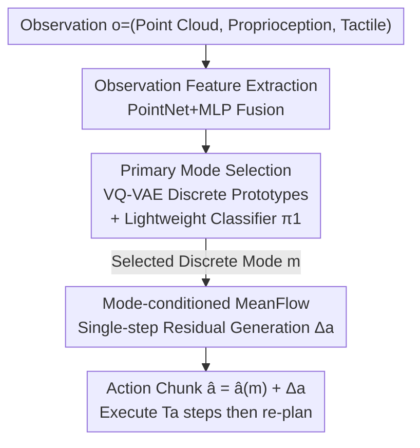

# Primary-Fine Decoupling for Action Generation in Robotic Imitation

**Conference**: ICLR 2026  
**OpenReview**: [https://openreview.net/forum?id=wySMuWHmt4](https://openreview.net/forum?id=wySMuWHmt4)  
**Project Page**: [https://xiaohanlei.github.io/projects/PF-DAG](https://xiaohanlei.github.io/projects/PF-DAG)  
**Code**: None  
**Area**: Robotics / Imitation Learning / Generative Policy  
**Keywords**: Imitation Learning, Multi-modal Actions, Vector Quantization, MeanFlow, Closed-loop Control

## TL;DR
PF-DAG decouples action generation in robotic imitation learning into a two-stage process: first selecting a coarse mode from discrete prototypes using a lightweight classifier, and then filling in continuous intra-modal details with a single-step MeanFlow generator. This approach avoids the precision loss of discretization while eliminating the mode bouncing issues typical of single-stage generative policies. It outperforms diffusion and flow baselines across 56 tasks in Adroit/DexArt/MetaWorld and real-world dexterous manipulation tasks with tactile feedback.

## Background & Motivation

**Background**: Expert demonstrations in robotic manipulation are inherently **multi-modal**—multiple equally valid actions may exist for a given observation (e.g., bypassing an obstacle from either the left or the right). For robust imitation learning, this multi-modal distribution must be modeled. Current approaches follow three main paths: Behavior Cloning (BC) via supervised regression $a=\pi(o)$; action tokenization which quantizes continuous actions into discrete tokens for sequence modeling; and generative policies that introduce latent variables $a=\pi(o,z)$, sampling different $z$ to obtain various valid actions (e.g., CVAE in ACT, denoising in Diffusion Policy).

**Limitations of Prior Work**: Each approach has significant drawbacks. BC tends to **collapse multiple modes into a single mean** (mode collapse), resulting in "averaged" actions that fail to accomplish the task. Tokenization strategies can represent multiple modes but introduce **reconstruction errors and temporal discontinuities** due to coarse quantization, leading to non-smooth trajectories. Generative policies are expressive, but independent re-sampling of $z$ at each time step leads to **mode bouncing**—random jumping between different modes in adjacent steps—causing trajectory fragmentation and jitter, which degrades success rates.

**Key Challenge**: Tokenization sacrifices precision for stability, whereas single-stage continuous generation retains precision but suffers from unstable mode switching. **"Coarse-grained mode consistency" and "fine-grained continuous variation" are coupled in a single generation process**, creating a trade-off.

**Key Insight**: The authors observe that actions in many manipulation tasks can be naturally decomposed into a **few discrete, interpretable "primary modes"** (coarse prototypes, e.g., "lift then fold" vs. "lift then rotate") plus **continuous intra-modal refinements** (grasp offsets, minor trajectory corrections). Primary modes handle coarse discrete decisions, while intra-modal residuals handle fine-grained changes—these two functions should be separated.

**Core Idea**: Explicitly decouple action generation into two stages: the first stage consistently selects a **discrete primary mode**, and the second stage generates **fine-grained continuous actions** conditioned on the selected mode. Using discrete selection locks the coarse mode to eliminate bouncing, while the continuous generator maintains intra-modal precision.

## Method

### Overall Architecture
PF-DAG (Primary-Fine Decoupling for Action Generation) is a two-stage closed-loop action sequence prediction framework. The task is modeled as receding-horizon closed-loop control: at time $t$, given observation $o_t=(p_t, s_t, f_t)$ (point cloud, proprioception, tactile), the policy predicts an action chunk $\hat a_t\in\mathbb{R}^{T_p\times d_a}$, executing the first $T_a\le T_p$ steps before re-planning.

The pipeline consists of three components: ① **Observation Feature Extraction**—PointNet-style processing for point clouds and MLPs for proprioception/tactile data, fused into a shared observation embedding; ② **Primary Mode Stage**—During training, a VQ-VAE compresses ground-truth action chunks into $K$ discrete primary modes for supervision, while a lightweight classifier $\pi_1(m\mid o)$ is trained to predict the mode directly from observations (the VQ-VAE is used only during training); ③ **Mode-conditioned MeanFlow Stage**—Given the selected mode $m$ and observation, a single-step generator $\pi_2$ generates high-fidelity continuous actions. The final action consists of the VQ reconstruction $\hat a(m)$ plus the residual $\Delta a$ from the generator.

### Key Designs

**1. VQ-VAE Primary Mode Codebook + Lightweight Classifier: Converting "Path Selection" into Discrete Decisions**

This step addresses the mode bouncing of single-stage generative policies. The authors use a VQ-VAE to compress continuous action chunks $a$ into a **small number** of discrete primary modes $m\in\{1,\dots,K\}$: the encoder $E_\phi$ produces $z_e=E_\phi(a)$, which is quantized to the nearest codebook vector $k^*=\arg\min_k\|z_e-e_k\|^2$, where $\tilde z=e_{k^*}$, $m:=k^*$, and reconstruction $\hat a(m)=D_\psi(\tilde z)$. Standard VQ loss is used:
$$L_{VQ}(a)=\|a-D_\psi(\tilde z)\|_2^2+\|\mathrm{sg}[E_\phi(a)]-\tilde z\|_2^2+\beta\|E_\phi(a)-\mathrm{sg}[\tilde z]\|_2^2$$
where $\mathrm{sg}[\cdot]$ is the stop-gradient and $\beta$ is the commitment weight. Crucially, **the codebook size $K$ is intentionally small** to capture only coarse primary prototypes, making them easier to learn. The primary mode policy $\pi_1(m\mid o)$ is a lightweight MLP classifier trained with cross-entropy to match labels from the VQ encoder; **during inference, the mode with the highest probability is greedily selected**. By making mode selection an explicit classification problem rather than part of continuous sampling, coarse mode flickering is fundamentally suppressed.

**2. Mode-conditioned Single-step MeanFlow Generator: Recovering Continuous Details within Modes**

VQ reconstruction $\hat a(m)$ alone is insufficient (as shown by its failure in ablation studies due to high quantization error). Thus, the second stage restores high-fidelity continuous actions conditioned on the mode, ensuring **real-time** performance. The authors leverage MeanFlow to replace multi-step denoising with **single-step** generation: a mean velocity field $\bar v_\theta(z_r,\tau,r;o,m)$ is learned to predict the displacement from noise to the target residual. $z_r$ is the state on the interpolation path between noise and target action, $\tau\in[0,1]$ is the start time, and $r\in(0,1]$ is the end time. The velocity field is trained to match the ground-truth mean velocity over any interval $[\tau,r]$:
$$\bar v^*(z_r,\tau,r)=\mathrm{sg}\Big[\frac{dz_r}{dr}-(r-\tau)\big(\frac{dz_r}{dr}\frac{\partial\bar v_\theta}{\partial z}+\frac{\partial\bar v_\theta}{\partial r}\big)\Big]$$
where $\frac{dz_r}{dr}$ is the instantaneous velocity of $z_r$ at time $r$. The generator outputs only the conditional residual $\Delta a$, such that the final action is $\hat a=\hat a(m)+\Delta a$. The backbone uses a DiT-style transformer treating the action chunk as a sequence of tokens; $\tau,r$ are added to the observation embedding using sinusoidal embeddings, along with a learnable embedding for the discrete mode $m$. Inference uses $(\tau,r)=(0,1)$ to produce the action chunk in one step—achieving intra-modal precision and real-time speed.

**3. MSE Lower Bound Proof: Theoretical Advantage over Single-stage Generation**

Theoretical analysis justifies the two-stage design, showing why it is never worse and typically better than single-stage generation. For a single-stage generative policy, the optimal estimate under mean squared error is the conditional expectation, where the MSE decomposes into irreducible data variance and model bias:
$$\mathbb{E}_{o,a}\big[\|a-\hat a_g^*(o)\|^2\big]=\mathbb{E}_o\big[\mathrm{Var}(a\mid o)\big]+\mathbb{E}_o\big[\|\mathbb{E}[a\mid o]-\hat a_g^*(o)\|^2\big]$$
When unbiased, the second term vanishes, and the minimum error equals $\mathbb{E}_o[\mathrm{Var}(a\mid o)]$. In the two-stage scheme, optimally predicting for a fixed $(o,m)$ collapses the randomness of $a$ into its conditional expectation, and the irreducible residual becomes $\mathbb{E}_{o,m}[\mathrm{Var}(a\mid o,m)]$. By the Law of Total Variance:
$$\mathbb{E}_{o,m}\big[\mathrm{Var}(a\mid o,m)\big]=\mathbb{E}_o\big[\mathrm{Var}(a\mid o)\big]-\mathbb{E}_o\big[\mathrm{Var}_{m\mid o}\mathbb{E}[a\mid o,m]\big]$$
Since the second term on the right is non-negative, the MSE lower bound for the two-stage approach is **no higher** than the single-stage one, and is **strictly lower** as long as the between-mode variance $\mathrm{Var}_{m\mid o}\mathbb{E}[a\mid o,m]>0$. Intuitively, primary mode discretization strips "inter-modal variance" from the residual error, leaving only intra-modal variance for the continuous generator to fit.

### Loss & Training
The framework is trained in phases: first, the VQ-VAE is pre-trained to learn compact primary prototypes. Then, the **codebook is frozen**, and the primary mode policy $\pi_1$ (cross-entropy alignment with VQ indices) and the mode-conditioned MeanFlow generator $\bar v_\theta$ (MSE supervision on sampled $(\tau,r)$ intervals) are trained jointly. AdamW is used for optimization with a short linear warmup followed by cosine decay. Inference uses $(\tau,r)=(0,1)$ for single-step generation.

## Key Experimental Results

### Main Results
Comparison across 18 representative tasks in Adroit (high-dimensional Shadow Hand), DexArt (Allegro Hand), and MetaWorld (low-dimensional gripper) (mean of top-5 success rates across 3 seeds):

| Task/Benchmark | IBC | DP | DP3 | FlowPolicy | PF-DAG |
|----------------|-----|----|-----|------------|--------|
| Adroit-Pen | 0.10 | 0.25 | 0.43 | 0.53 | **0.65** |
| DexArt-Faucet | 0.07 | 0.23 | 0.63 | 0.42 | **0.72** |
| MetaWorld-Medium(6) | 0.11 | 0.20 | 0.45 | 0.47 | **0.68** |
| MetaWorld-Hard(5) | 0.09 | 0.19 | 0.35 | 0.37 | **0.72** |
| **Overall Success** | 0.08 | 0.30 | 0.51 | 0.51 | **0.72** |

Overall success rate improved from 0.51 (next best) to 0.72, with the most significant gains in MetaWorld-Hard (0.37 to 0.72). Performance was also validated in 4 real-world tasks (including tactile-enabled dexterous tasks like Wipe Table and Place Toy Into Bin):

| Real-world Task | Vanilla BC | DP3 | PF-DAG |
|-----------------|------------|-----|--------|
| Pick Cube (Gripper) | 0.20 | 0.60 | **0.70** |
| Place Baymax (Gripper) | 0.40 | 0.85 | **0.90** |
| Wipe Table (XHand + Tactile) | 0.00 | 0.55 | **0.70** |
| Place Toy Into Bin (XHand + Tactile) | 0.00 | 0.60 | **0.80** |

### Ablation Study

| Configuration | Token. | #Modes | Weighted Success | Notes |
|---------------|--------|--------|------------------|-------|
| Full (PM+MF) | VQ-VAE | 64 | **0.72** | Full Model |
| w/o MF (PM Decode Only) | VQ-VAE | 64 | 0.01 | Fails nearly completely without generator |
| w/o PM (No Mode Condition) | VQ-VAE | 64 | 0.56 | Drops 0.16 without primary mode |
| Full | VQ-VAE | 8 | 0.61 | Too few modes |
| Full | VQ-VAE | 1024 | 0.58 | Too many modes hinders classification |
| Full | K-means | 64 | 0.70 | VQ-VAE slightly better than K-means |

### Key Findings
- **Removing the MeanFlow generator (using VQ reconstruction only) caused the success rate to plummet from 0.72 to 0.01**: Quantization error in a small codebook causes massive reconstruction distortion, demonstrating that the continuous generator is indispensable.
- **Removing the primary mode policy results in a 0.16 drop in absolute success rate**: Explicit discrete mode selection significantly simplifies downstream continuous generation and suppresses mode bouncing.
- **The number of modes $K$ has a "sweet spot"**: $K=64$ performs best. $K=8$ (0.61) is too coarse, while $K=1024$ (0.58) makes the classifier harder to train. VQ-VAE (0.72) is slightly superior to K-means (0.70).
- **Speed-Accuracy Trade-off**: Single-step MeanFlow decoding (FPS ~40.9) is comparable to 1-NFE DP3 (41.7) but yields significantly higher success rates (0.71 vs. 0.47), supporting 30Hz real-time control.
- **Reactivity with Short Action Chunks**: Shorter chunks provide higher reactivity. DP3 performance drops sharply with short chunks due to mode bouncing, while PF-DAG maintains high success rates through mode consistency.

## Highlights & Insights
- **Decoupling "Path Selection" from "Walking"** is the core insight: splitting multi-modal modeling into discrete coarse decisions and continuous fine refinements addresses the twin issues of single-stage policies—precision loss from discretization and mode bouncing from continuous sampling.
- **VQ-VAE used only during training** is a clever design: discrete prototypes serve only to provide supervision for the primary mode classifier. Deployment involves only a lightweight MLP classifier and a single-step generator, ensuring speed and efficiency.
- **Bridge between Theory and Engineering**: The application of the law of total variance explains "why discretization works" as "stripping inter-modal variance," providing a clean statistical explanation and a rigorous lower bound.
- **Transferability**: This two-stage paradigm (quantized coarse selection + generative refinement) is likely applicable to any multi-modal sequence generation task, such as trajectory planning or motion synthesis.

## Limitations & Future Work
- Primary modes are selected greedily; the model **does not retain mode-level uncertainty**. Hard selection might be suboptimal when an observation is at a mode boundary.
- Failure cases often occur with **Out-of-Distribution (OOD) object placements** or intermittent tactile noise, suggesting that robustness still relies on data augmentation/demonstrations rather than an intrinsic mechanism.
- The number of modes $K$ is a critical hyperparameter (differences between 8/64/1024 are significant), and an adaptive method for selecting $K$ is currently lacking.
- Theoretical analysis assumes unbiased models; the benefit of the two-stage approach diminishes in tasks with very low inter-modal variance.

## Related Work & Insights
- **vs. Diffusion Policy / DP3 (Single-stage Generative)**: These use multi-step denoising for continuous multi-modal distributions, but independent per-step sampling causes mode bouncing and slow inference. PF-DAG uses primary modes to lock coarse decisions and single-step MeanFlow for details, eliminating bouncing and increasing speed while maintaining a lower MSE.
- **vs. Tokenization Strategies (e.g., VQ-based, FAST)**: These quantize the entire action into tokens, sacrificing reconstruction precision for discrete simplicity. PF-DAG uses tokenization **only for high-level mode selection**, leaving fine-grained variation to a continuous generator.
- **vs. Hierarchical Policies (e.g., HDP)**: HDP relies on task-specific heuristics (like contact point waypoints) for hierarchy. PF-DAG's primary modes are **learned end-to-end from action chunk clustering**, offering a more general abstraction.

## Rating
- **Novelty**: ⭐⭐⭐⭐ Solid decoupling of tokenization and continuous generation with a rigorous MSE lower bound proof.
- **Experimental Thoroughness**: ⭐⭐⭐⭐⭐ Extensive testing across 56 simulation tasks and real-world tactile-enabled dexterous tasks; thorough ablation of components and hyperparameters.
- **Writing Quality**: ⭐⭐⭐⭐ Clear flow from motivation to method and theory; Figure 1 intuitively compares failure modes.
- **Value**: ⭐⭐⭐⭐ Achieves stability, precision, and speed in real-time closed-loop control; the paradigm has potential for broader sequence generation tasks.

<!-- RELATED:START -->

## Related Papers

- [\[ICLR 2026\] Geometry-Aware Policy Imitation](geometry-aware_policy_imitation.md)
- [\[ICLR 2026\] Translating Flow to Policy via Hindsight Online Imitation](translating_flow_to_policy_via_hindsight_online_imitation.md)
- [\[ICML 2025\] Action-Constrained Imitation Learning](../../ICML2025/robotics/action-constrained_imitation_learning.md)
- [\[ICLR 2026\] Self-Improving Vision-Language-Action Models with Data Generation via Residual RL](self-improving_vision-language-action_models_with_data_generation_via_residual_r.md)
- [\[CVPR 2026\] Expanding Spatial and Temporal Context for Robotic Imitation Learning With Scene Graphs](../../CVPR2026/robotics/expanding_spatial_and_temporal_context_for_robotic_imitation_learning_with_scene.md)

<!-- RELATED:END -->
