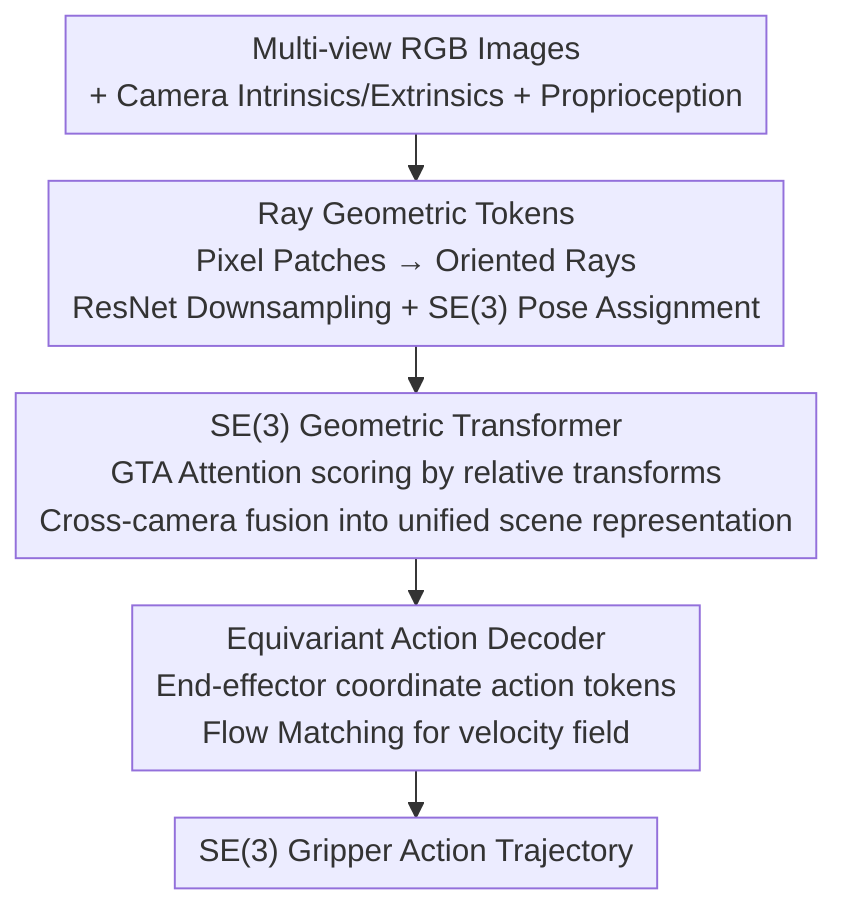

# RAVEN: End-to-end Equivariant Robot Learning with RGB Cameras

**Conference**: ICLR 2026  
**OpenReview**: [https://openreview.net/forum?id=z8BN7KyaPl](https://openreview.net/forum?id=z8BN7KyaPl)  
**Code**: https://dmklee.github.io/raven (Project page, promised to be open-sourced after acceptance)  
**Area**: Robotics / Embodied AI  
**Keywords**: Equivariant Policy, SE(3) Equivariance, Imitation Learning, Ray Representation, Flow Matching

## TL;DR
RAVEN treats each pixel patch of an RGB image as an oriented 3D ray. This allows for the construction of the first end-to-end SE(3) equivariant robot manipulation policy using only standard RGB cameras (without requiring point clouds, depth, or fixed top-down views). It significantly outperforms strong baselines like Diffusion Policy in MimicGen / DexMimicGen simulations and real-world experiments, while training 1.6× faster than existing equivariant methods.

## Background & Motivation

**Background**: In imitation learning, visuo-motor policies such as Diffusion Policy and large-scale Behavior Cloning have demonstrated the ability to learn manipulation in diverse scenarios. However, to remain robust under sensor or scene changes, they generally require large amounts of demonstration data. A mature approach to improving sample efficiency is to explicitly encode symmetry (equivariance) into the network — if the policy responds consistently to spatial transformations of the scene (e.g., changes in object poses or tabletop layouts), it can generalize from very few demonstrations.

**Limitations of Prior Work**: Unfortunately, existing equivariant manipulation methods impose harsh requirements on input modalities — either requiring point clouds (EquiBot requires SIM(3) equivariance + accurate object segmentation) or height-aligned RGB-D (EquiDiffPo assumes a fixed camera). However, widely used robot learning setups (such as UMI, ALOHA, and Mobile-ALOHA) utilize arbitrarily placed, inexpensive RGB cameras producing raw 2D images, making the aforementioned assumptions inapplicable.

**Key Challenge**: 2D pixels exist only within the camera plane and only support 2D planar transformations, whereas SE(3) equivariance requires quantities that can be acted upon by 3D rotation and translation. There is a gap between images and 3D equivariance ("2D pixels → 3D geometry"); previously, this was either bypassed using point clouds (sacrificing "RGB-only" utility) or by simply ignoring 3D equivariance.

**Goal**: To build an end-to-end SE(3) equivariant policy network under the condition of **only using RGB images with arbitrary camera counts and placements**.

**Key Insight**: The authors' key observation is that an image is not just a mapping of "pixel coordinates → RGB," but can be viewed as "a bundle of rays projected from the camera's optical center into the world." Given camera intrinsics $K$ and extrinsics $M=[R|t]$, the ray corresponding to pixel $u$ is $r=(t,\,RK^{-1}u)$, where the origin is at the camera position and the direction is a unit direction. Rays are naturally defined in 3D: when the scene undergoes a $g\in SE(3)$ transformation, the **image content remains unchanged, but the camera extrinsics change, thus the rays are acted upon by SE(3)**. This implicitly connects images to the 3D equivariant world.

**Core Idea**: Use "oriented ray features" instead of "2D pixels" as the input representation, turning RGB observations into geometric tokens that can be processed by SE(3) equivariant layers, thereby encoding equivariance end-to-end from the encoder to the action decoder.

## Method

### Overall Architecture

RAVEN addresses the problem where input consists of multi-view RGB images from arbitrarily placed cameras + robot proprioception (end-effector pose, gripper state), and the output is a future SE(3) gripper action trajectory. The entire pipeline maintains equivariance to global SE(3) transformations of the scene. It follows three steps: first, downsample each image using a pre-trained ResNet into feature maps and assign an SE(3) pose to each grid cell based on camera projection to form "geometric tokens" (features normalized to a local coordinate system); second, use a GTA-style SE(3) Geometric Transformer to fuse tokens from all cameras and the robot to obtain a unified 3D scene representation; finally, use an equivariant action decoder trained with Flow Matching to decode this representation into a velocity field relative to the end-effector frame, integrating it into an action trajectory. Equivariance is achieved via "canonicalization" rather than expensive group convolutions: features reside in local canonical frames and are de-canonicalized to the global frame using hard-coded poses. Thus, feed-forward layers acting on canonical features do not break equivariance, and attention only considers relative transformations between tokens.

### Key Designs

**1. Ray Geometric Tokens: Translating 2D Images into 3D Quantities for SE(3) Action**

This step directly addresses the fundamental obstacle that "2D pixels cannot be acted upon by 3D roto-translation." The authors do not treat pixels as points on a plane but as 3D rays: based on known camera intrinsics and extrinsics, pixel $u$ corresponds to ray $r=(t,\,RK^{-1}u)$. Processing rays per-pixel is too expensive, so a pre-trained ResNet is first used to downsample the image into feature maps — extracting features efficiently while reducing the 3D computational load. The crucial insight is: a single ray is symmetric about the camera's roll axis and lacks a clear orientation, but **after downsampling, a grid cell represents a small patch of rays, which possesses a clear orientation** — the direction is assigned as the z-axis and the two image plane axes as x/y axes. Thus, each cell can be assigned a full $SE(3)$ element (origin + orientation). In this way, an image is expressed as a set of posed geometric tokens; SE(3) transformations act on the camera extrinsics, rotating the poses of these tokens while the image data itself remains unchanged.

**2. Geometric Tokens and Canonicalization: Unified Representation for Multi-modal, Efficient Equivariance**

A geometric token is a tuple $x=(z_x, g_x)$: a feature vector $z_x\in\mathbb{R}^d$ plus a pose $g_x\in SE(3)$, where it is agreed that the feature is "normalized" by the pose — i.e., $z_x$ expresses information in the local frame, and global information is obtained by de-canonicalizing with the pose $\rho(g_x)z_x$. Features are further split into three types of components: scalars, vectors, and points, each corresponding to different group actions: $\rho(g_x)z_x=(\rho^s(g_x)z_x^s,\ \rho^v(g_x)z_x^v,\ \rho^p(g_x)z_x^p)$, where scalar components are invariant ($\rho^s$ is identity), vector components are affected only by 3D rotation, and point components are affected by both rotation and translation. This representation is **modality-agnostic**: image tokens come from feature map cells; proprioception tokens are constructed for each robot, with features mapped linearly from gripper states and poses set to the end-effector pose. The value of canonicalization lies in bypassing the computational overhead of equivariant convolutions — it satisfies the right-compensation property $C(\rho_g x)=C(x)g^{-1}$, such that $x\mapsto f(\rho_{C(x)}x)$ is $G$-invariant, and de-canonicalizing at the output $F(x)=\rho'_{C(x)^{-1}}f(\rho_{C(x)}x)$ restores equivariance.

**3. SE(3) Geometric Transformer + GTA Attention: Equivariant Fusion Based on Relative Transforms**

After converting all observations into geometric tokens, they are processed by several Transformer blocks. Feed-forward layers (two-layer MLPs) act directly on the canonical features of the tokens without changing the poses — because the features are in the local frame, feed-forwarding does not break SE(3) equivariance. The attention layer uses GTA (Geometric Transform Attention), where the core idea is to make similarity depend only on the **relative** transformation $\rho_{g_i}^{\top}\rho_{g_j}$ between two tokens: the output takes the form $O_i=\rho(g_i)\,\mathrm{softmax}_j\big[(\rho(g_i)^{\top}Q_i)^{\top}(\rho(g_j)^{-1}K_j)\big]\,\rho(g_j)^{-1}V_j$. Thus, when all tokens undergo the same global transformation $g_i\mapsto hg_i$, the internal similarities remain unchanged, and the output transforms globally by $\rho(h)$, ensuring equivariance. One engineering detail: dot-product similarity breaks equivariance under $G=SE(3)$; the authors use dot products for scalar/vector components (stabling training) but switch to negative Euclidean distance for point components to ensure **exact** SE(3) equivariance — because the model works in a low-data régime, it is preferable to use Euclidean distance where necessary to maintain strict equivariance. GTA allows information from three cameras to be fused based on geometric relationships, rather than simply concatenating feature vectors as in DiffPo/EquiDiffPo.

**4. Equivariant Action Decoder: Trajectory Generation in End-effector Frame via Flow Matching**

The geometric tokens from the encoder form a 3D representation of the scene, which the decoder must transform into SE(3) gripper actions. The authors leverage the property that "features are always canonicalized in a known reference frame" to output trajectories in any reference frame: to predict actions relative to the end-effector frame, the poses of the action tokens are set to the current end-effector pose — when these tokens pass through the SE(3) Geometric Transformer, the action features are naturally suited to express trajectories in the global frame while retaining local frame precision. For training, action token features are initialized by sampling from a normal distribution, with poses set to the current gripper pose. Flow Matching loss $L_{FM}=\mathbb{E}\big[\lVert v_\theta((1-t)a_0+ta_1,\,t)-(a_1-a_0)\rVert^2\big]$ supervises a continuous-time velocity field (faster and more stable than discrete denoising sampling in DDPM). The decoder structure aligns with the transformer decoder of DiffPo: each block consists of causal self-attention between action tokens → cross-attention with encoder geometric tokens → feed-forward, for a total of four blocks, finally projecting into velocity. The entire encoder-decoder pipeline is end-to-end equivariant to global SE(3) transformations of the robot/sensors/objects (note: equivariance only covers unified transformations of the whole scene; independent movement of a single camera is not theoretically guaranteed, though tested experimentally).

### Loss & Training
The core training objective is the Flow Matching loss (Eq. 4), acting only on the predicted action token features; a pre-trained ResNet serves as the visual backbone (aligned fairly with DiffPo (Pre)). In simulation, MimicGen uses 100 demos, and DexMimicGen uses 50/100 demos, with 50 rollouts per task across 3 random seeds.

## Key Experimental Results

### Main Results

| Benchmark | Configuration | RAVEN (Ours) | Prev. SOTA | Gain |
|-----------|---------------|---------------|------------|------|
| MimicGen (12 tasks, 100 demos) | agent-view + eye-in-hand | 66 | 54 (EquiDiffPo) | +12% |
| DexMimicGen (6 bimanual tasks, 50 demos) | dual eye-in-hand + 1 agent-view | 82 | 65 (DiffPo Pre) | +17% |
| View Generalization (4 tasks, agent-view perturbed) | ±20° pitch / ±40° yaw | 71 | 48 (EquiDiffPo) | +23% |
| Real-world (4 tasks, avg. progress / success) | UR5 + RealSense + GoPro | 81 / 63 | 46 / 24 (DiffPo Pre) | Comprehensive Lead |

On MimicGen, RAVEN achieved the highest success rate in 11 out of 12 tasks, trailing by only 4% in the remaining one. Even compared to DiffPo (Pre), which also uses a pre-trained encoder, RAVEN is 14% better on average, indicating that the advantage stems from architectural design rather than just pre-training. In terms of training efficiency, on the Threading D2 task, DiffPo took 3.3 hours and EquiDiffPo took 7.3 hours, while RAVEN required only 2.8 hours — approximately 1.6× faster than the existing equivariant method, EquiDiffPo.

### Ablation Study

| Configuration | Avg. Success Rate | Description |
|---------------|-------------------|-------------|
| RAVEN (Full) | 76 | Full model |
| w/o SE(3) Ray Encoding | 72 | Ray patches degraded to $\mathbb{R}^3\times S^2$ direction vectors, -4% |
| w/o Equivariant Decoder | 72 | GTA replaced by standard dot-product attention (retaining absolute PE), -4% |
| w/o Equivariant Encoder & Decoder | 58 | Removing equivariant layers on both sides, -18% |

### Key Findings
- **Equivariant layers are the primary source of contribution**: Removing both encoder and decoder equivariant layers causes an 18% drop, much larger than removing either one individually (4% each), suggesting the value of end-to-end equivariance is synergistic.
- **Ray orientation is useful but incremental**: Degrading "oriented ray patches" to simple direction vectors only drops performance by 4%, likely because the test tasks are tabletop manipulations with minimal out-of-plane motion; the authors expect larger gains for SE(3) equivariance in more unstructured scenarios.
- **Outstanding data efficiency**: On DexMimicGen, RAVEN matches or exceeds baselines using 100 demos with only 50 demos, thanks to GTA fusing three cameras based on geometric relationships (baselines merely concatenate features without 3D reasoning).
- **Calibration sensitivity**: RAVEN is sensitive to camera calibration noise (especially when introduced at test time), but becomes robust after adding data augmentation on camera parameters, with only a ~1% drop.

## Highlights & Insights
- **The "image as ray bundle" re-representation is the pivot of the paper**: It transforms an input that seemingly only supports 2D transformations into a 3D quantity acted upon by SE(3). The clever part is "image stays same, extrinsics change" — no depth, point clouds, or 3D sensors are needed; it connects to the equivariant framework purely via camera parameters.
- **Obtaining orientation via patches (instead of single pixels)**: A single ray is symmetric around its roll axis and cannot define an orientation; downsampling into a small patch of rays resolves this, as the patch has a clear orientation. Downsampling both saves computation and solves the geometric defect of "rays having no orientation."
- **Canonicalization instead of group convolutions**: Achieving equivariance by "storing features in local frames + hard-coded de-canonicalization" makes RAVEN lighter than methods stacking equivariant convolutions. Paradoxically, RAVEN trains faster than the non-equivariant Diffusion Policy, breaking the stereotype that "equivariant equals slow."
- **Transferable modality unity of geometric tokens**: Images and proprioception are both packed into the same $(z,g)$ representation. Ideally, depth and point clouds could be tokenized the same way — this interface provides a clean target for the equivariant fusion of multi-source heterogeneous observations.

## Limitations & Future Work
- The authors acknowledge that while the policy generalizes to new camera views, it requires all cameras to be **well-calibrated** relative to the world coordinate system. Integration of depth/point cloud inputs is left for future work.
- Equivariance only covers **unified SE(3) transformations of the entire scene**; there is no theoretical guarantee for independent movement of a single camera (as seen in view generalization experiments where performance decreased).
- Ablations show ray orientation gain is only 4% in tabletop tasks; the core value might only be fully realized in unstructured scenarios with more out-of-plane motion — existing benchmarks are somewhat structured, potentially underestimating or overestimating gains in different contexts.
- Sensitivity to camera calibration noise requires data augmentation; in real-world tasks like Beans Scooping or Coffee Cleanup, high-precision success rates remain around 45%, leaving room for improvement.

## Related Work & Insights
- **vs EquiDiffPo (Wang et al., 2024)**: This is an SO(2) equivariant image diffusion policy but assumes fixed cameras and a smaller equivariant group. RAVEN achieves SE(3) equivariance with arbitrary camera placement and trains 1.6× faster.
- **vs EquiBot (Yang et al., 2024)**: Achieves SIM(3) equivariance via object-centric point clouds, relying on accurate object segmentation. RAVEN requires no segmentation or point clouds, using raw RGB only.
- **vs GTA (Miyato et al., 2023)**: RAVEN's geometric Transformer builds on GTA but represents image patches as ray-based SE(3) quantities (GTA uses camera pose + pixel coordinates), better encoding the spread of rays and handling non-image data.
- **vs Hu et al. (2025)**: Performs SO(3) equivariance but only for a single wrist camera RGB. RAVEN is SE(3) equivariant and supports multi-camera fusion.

## Rating
- Novelty: ⭐⭐⭐⭐⭐ The re-representation of "images as rays" for the first pure RGB end-to-end SE(3) equivariant policy is both simple and effective.
- Experimental Thoroughness: ⭐⭐⭐⭐⭐ Comprehensive coverage across simulation (single/dual arm, view generalization, efficiency), real-world tasks, and thorough ablations.
- Writing Quality: ⭐⭐⭐⭐ Clear motivation and derivation; rigorous equivariance analysis, though some details are in the appendix.
- Value: ⭐⭐⭐⭐⭐ High practical value as it frees equivariant policies from point cloud/fixed view constraints, making them compatible with low-cost RGB setups like UMI/ALOHA.

<!-- RELATED:START -->

## Related Papers

- [\[ICLR 2026\] LeRobot: An Open-Source Library for End-to-End Robot Learning](lerobot_an_open-source_library_for_end-to-end_robot_learning.md)
- [\[ICLR 2026\] End-to-end Listen, Look, Speak and Act](end-to-end_listen_look_speak_and_act.md)
- [\[CVPR 2026\] RoboTAG: End-to-end Robot Pose Estimation via Topological Alignment Graph](../../CVPR2026/robotics/robotag_end-to-end_robot_pose_estimation_via_topological_alignment_graph.md)
- [\[CVPR 2026\] End-to-End Language-Action Model for Humanoid Whole Body Control](../../CVPR2026/robotics/end-to-end_language-action_model_for_humanoid_whole_body_control.md)
- [\[NeurIPS 2025\] SutureBot: A Precision Framework & Benchmark for Autonomous End-to-End Suturing](../../NeurIPS2025/robotics/suturebot_a_precision_framework_benchmark_for_autonomous_end-to-end_suturing.md)

<!-- RELATED:END -->
