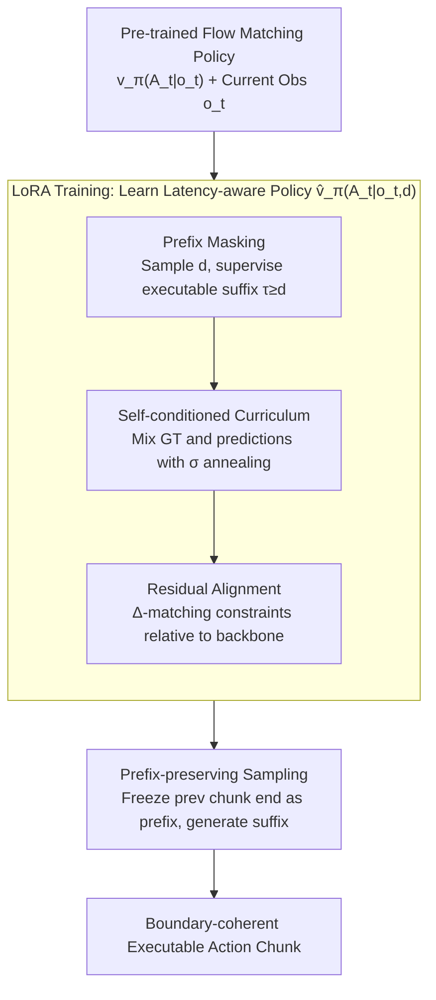

# Real-Time Robot Execution with Masked Action Chunking

**Conference**: ICLR 2026  
**arXiv**: [2601.20130](https://arxiv.org/abs/2601.20130)  
**Code**: [Project Page](https://remac-robot.github.io)  
**Area**: Robot Learning  
**Keywords**: Real-time Execution, Action Chunking, Asynchronous Inference, VLA, Flow Matching, LoRA

## TL;DR

REMAC is proposed to systematically address intra-chunk inconsistency and inter-chunk discontinuity under asynchronous inference through a masked action chunking training strategy and a prefix-preserving sampling pipeline, achieving more reliable real-time robot control without introducing hardware-dependent inference latency.

## Background & Motivation

**Background**: Vision-Language-Action (VLA) models predict action sequences through action chunking for robotic manipulation, which has become the mainstream paradigm for generalist robot policies. Real-time performance is critical for robotic systems – latency can cause task failure (e.g., spilling liquids) rather than merely increasing waiting time.

**Limitations of Prior Work**: Synchronous inference requires inference latency $\delta < \Delta t$ (control cycle). For instance, a 50Hz control frequency requires <20ms. However, the $\pi_0$ model takes 76ms for action generation alone on an RTX 4090, far exceeding the threshold when combined with preprocessing and transmission. Asynchronous inference, which predicts the next chunk while executing the current one to ensure actions are always available, is the only viable real-time solution.

**Key Challenge — Inter-chunk Discontinuity**: Consecutive action chunks $\mathbf{A}_t^1$ and $\mathbf{A}_{t+h}^2$ may originate from different latent expert modes, resulting in jumpy motions at chunk boundaries and incoherent robot movement. Existing methods like Temporal Ensembling (TE), BID, and RTC attempt to solve this but are either unreliable (TE can be worse than Naive Async in multi-task settings) or introduce extra latency (RTC requires 55-64ms for gradient correction).

**Core Problem — Intra-chunk Inconsistency**: This is the core insight of this paper. With inference latency $d$, the first $d$ actions of the currently executing chunk actually come from the previous chunk $\mathbf{A}_{t-h}$ (based on old observation $\mathbf{o}_{t-h}$) rather than the optimal action for the current observation $\mathbf{o}_t$. This leads to perception-action mismatch and distribution shift between training and inference. Prior works have failed to identify and address this issue.

**Key Insight**: Model intra-chunk inconsistency as a partial masking problem at any position within the action chunk. By randomly masking the prefix during training, the model learns to make corrections when observations and partial actions are misaligned. Simultaneously, the sampling pipeline is adjusted to maintain prefix continuity, handling inter-chunk discontinuity.

**Mechanism**: Training-time adaptation is adopted instead of test-time correction. By fine-tuning pre-trained policies with LoRA (adding only 1.5% parameters), the correction capability is internalized within the model. This requires no extra computational steps during inference and is orthogonal to existing test-time methods.

## Method

### Overall Architecture

REMAC is built upon flow matching policies. Given a pre-trained policy $\mathbf{v}_\pi(\mathbf{A}_t|\mathbf{o}_t)$, the goal is to learn a latency-aware policy $\hat{\mathbf{v}}_\pi(\mathbf{A}_t|\mathbf{o}_t, d)$ that explicitly conditions on inference latency $d$. The approach consists of two phases: training using LoRA to formalize "intra-chunk inconsistency" as a partial masking problem where the prefix is occupied by old chunks, combined with three components: **Prefix Masking** (supervising only executable suffixes), **Self-conditioned Curriculum** (gradually switching training inputs to the model's own predictions), and **Residual Alignment** (constraining corrections relative to the pre-trained policy). During inference, **Prefix-preserving Sampling** treats the end of the previous chunk as a frozen prior to generate only the suffix, ensuring natural boundary transitions.

### Key Designs

**1. Prefix Masking: Responsibility for Executable Actions**

Under latency $d$, the first $d$ actions of a new chunk are already occupied by the previous chunk and cannot be executed, yet they were generated based on old observations, causing mismatch. REMAC samples a latency condition mask $\mathbf{m}_d = \{m_d^\tau\}_{\tau=0}^{P-1} = \mathbf{1}[\tau \geq d]$ for each chunk, applying supervision only on the executable suffix $\tau \geq d$. The masked loss is defined as:

$$\mathcal{L}_\mathrm{m} = \sum_d \frac{\sum_{\tau} m_d^\tau \|\hat{\mathbf{u}}_\tau - \mathbf{u}_\tau\|_2^2}{\max(1, \sum_{\tau} m_d^\tau)}.$$

During training, $d \sim \mathcal{U}\{0,\dots,P-1\}$ is randomly sampled, exposing the model to the full spectrum of latency. A single model can thus cover any latency setting.

**2. Self-conditioned Curriculum: Aligning with Test Conditions**

Masked supervision on ground truth (GT) is insufficient because the prefix provided during inference is self-generated, not GT, causing exposure bias. However, using self-conditioned inputs too early causes instability. REMAC approximates this by using pre-trained policy predictions $\tilde{\mathbf{A}}_t$, mixing them with GT actions $\mathbf{A}_t$ before flow matching interpolation:

$$\hat{\mathbf{A}}_t = \gamma \mathbf{A}_t + \text{sg}((1-\gamma)\tilde{\mathbf{A}}_t),\quad \gamma \sim \mathrm{Bernoulli}(\sigma),$$

where $\text{sg}(\cdot)$ is stop-gradient and $\sigma$ linearly anneals from 1 to 0. This forces the model to learn to correct its own introduced biases.

**3. Residual Alignment: Explicitly Modeling Corrections**

REMAC aims to "learn corrections" rather than relearn actions. A $\Delta$-matching term is introduced to constrain the modification amount:

$$\mathcal{L}_\Delta = \sum_d \frac{\sum_{\tau} \|m_d^\tau(\mathbf{u}_\tau - \tilde{\mathbf{u}}_\tau) - m_d^\tau(\hat{\mathbf{u}}_\tau - \tilde{\mathbf{u}}_\tau)\|_2^2}{\max(1, \sum_{\tau} m_d^\tau)}.$$

Total loss $\mathcal{L} = \lambda_m \mathcal{L}_m + \lambda_\Delta \mathcal{L}_\Delta$ (with $\lambda_m = \lambda_\Delta = 0.01$). $\mathcal{L}_\Delta$ focuses learning specifically on how much to compensate based on the pre-trained policy.

**4. Prefix-preserving Sampling: Eliminating Boundary Jumps**

During inference, the initial state $\mathbf{A}_t^0$ is no longer sampled entirely from a Gaussian prior. Instead, it is initialized with an executable prior $\mathbf{A}_t^\mathrm{p}$—filling the first $P-h$ dimensions with the end of the previous chunk and zeroing the rest. During flow matching integration, this prefix is frozen:

$$\mathbf{A}_t^{\tau+\frac{1}{n}} = \mathbf{m} \odot \Big(\mathbf{A}_t^\tau + \tfrac{1}{n}\hat{\mathbf{v}}_\pi(\mathbf{A}_t^\tau, \mathbf{o}_t, \tau)\Big) + (1-\mathbf{m}) \odot \mathbf{A}_t^\mathrm{p}.$$

The new suffix continues naturally from executed actions, directly eliminating boundary jumps.

## Key Experimental Results

### Kinetix Simulation (12 Dynamic Tasks, Average Success Rate)

| Method | $d=0$ | $d=1$ | $d=2$ | $d=3$ | $d=4$ |
|------|-------|-------|-------|-------|-------|
| Naive Async | 0.828 | 0.702 | 0.639 | 0.525 | 0.451 |
| BID | — | — | — | — | — |
| RTC | — | — | — | — | — |
| **REMAC (Ours)** | **0.888** | **0.879** | **0.859** | **0.817** | **0.779** |

### Ablation Study (Component Contribution)

| Configuration | $d=0$ | $d=1$ | $d=2$ | $d=3$ | $d=4$ |
|------|-------|-------|-------|-------|-------|
| Naive | 0.828 | 0.702 | 0.639 | 0.525 | 0.451 |
| + LoRA (Params only) | 0.825 | 0.710 | 0.630 | 0.510 | 0.428 |
| + Prefix Masking | 0.863 | 0.825 | 0.752 | 0.729 | 0.636 |
| + Self-conditioned Curriculum | 0.848 | 0.837 | 0.805 | 0.762 | 0.710 |
| + $\mathcal{L}_\Delta$ (Full REMAC) | **0.888** | **0.879** | **0.859** | **0.817** | **0.779** |

### Combination with Test-time Methods

| Method | $d=0$ | $d=1$ | $d=2$ | $d=3$ | $d=4$ |
|------|-------|-------|-------|-------|-------|
| REMAC | 0.888 | 0.879 | 0.859 | 0.817 | 0.779 |
| REMAC + BID | 0.888 | 0.880 | 0.862 | 0.821 | 0.781 |
| REMAC + RTC | 0.888 | 0.879 | 0.864 | 0.826 | 0.791 |

### Real Robot Experiments (Franka Research 3, Completion Progress)

| Method | Grasp-Easy | Grasp-Medium | Grasp-Hard |
|------|-----------|-------------|-----------|
| Synchronous | 0.805 | 0.718 | 0.670 |
| Naive Async | 0.825 | 0.825 | 0.460 |
| Temporal Ensembling | 0.825 | 0.868 | 0.717 |
| RTC | 0.823 | 0.848 | 0.753 |
| **REMAC (Ours)** | **0.903** | **0.943** | **0.812** |

## Key Findings

- **Intra-chunk Inconsistency is a Critical Failure Mode**: While prior works focused on inter-chunk discontinuity, REMAC identifies intra-chunk inconsistency as a primary issue. Prefix masking alone improves success rate at $d=4$ from 0.451 to 0.636 (+41%).
- **Training-time Adaptation Outperforms Test-time Correction**: REMAC introduces zero inference latency, whereas RTC adds 55-64ms. In real-world tests, RTC performance degrades under high latency as test-time adjustments can be counterproductive over longer horizons.
- **Robustness Increases with Latency**: REMAC's performance drop from $d=0$ to $d=4$ (-12.3%) is significantly smaller than Naive Async (-45.5%), demonstrating strong robustness to latency variations.
- **Unified Model for Full Latency Spectrum**: Randomly sampling training latency allows a single REMAC model to handle any latency setting without per-latency retraining.

## Highlights & Insights

- **Value of Problem Identification**: Recognizing intra-chunk inconsistency as a partial perception-action mismatch modeled via masking is an elegant abstraction.
- **Internalizing Correction > Test-time Patching**: Embedding the correction capability within weights via LoRA is a more fundamental solution than inference-time computation.
- **Composability**: As a backbone improvement, REMAC is orthogonally compatible with test-time methods like BID/RTC.

## Limitations & Future Work

- **Validated only on Flow Matching**: While appendix mentions ACT, the primary framework is flow matching; applicability to diffusion or autoregressive policies needs further verification.
- **Simplified Latency Estimation**: Discretizing continuous latency into $d = \lfloor \delta / \Delta t \rfloor$ may be imprecise in real-world scenarios with high latency jitter.
- **Search Scale**: Real-world experiments are limited to 3 tasks and 200 trajectories; complex dual-arm or long-horizon tasks remain to be tested.

## Related Work & Insights

### vs RTC (Black et al., 2025)
RTC uses test-time inpainting and gradient correction. **Difference**: RTC introduces extra inference latency and ignores intra-chunk inconsistency. REMAC addresses both at training time with zero inference overhead.

### vs BID (Liu et al., 2025)
BID uses rejection sampling on multiple candidates. **Difference**: BID is computationally expensive and unsuitable for real-time loops, also neglecting intra-chunk inconsistency.

### vs Temporal Ensembling (Zhao et al., 2023)
TE smooths boundaries via weighted averages. **Difference**: TE is heuristic and can underperform Naive Async in dynamic environments; REMAC provides a principled solution.

## Rating

- **Novelty**: ⭐⭐⭐⭐ Identification of intra-chunk inconsistency is a key insight.
- **Experimental Thoroughness**: ⭐⭐⭐⭐⭐ Extensive simulation and real-world robot validation.
- **Writing Quality**: ⭐⭐⭐⭐ Clear problem categorization and derivation.
- **Value**: ⭐⭐⭐⭐⭐ Highly practical for real-world VLA deployment with zero overhead.

<!-- RELATED:START -->

## Related Papers

- [\[ICLR 2026\] Time Optimal Execution of Action Chunk Policies Beyond Demonstration Speed](time_optimal_execution_of_action_chunk_policies_beyond_demonstration_speed.md)
- [\[CVPR 2026\] Adaptive Action Chunking at Inference-time for Vision-Language-Action Models](../../CVPR2026/robotics/adaptive_action_chunking_at_inference-time_for_vision-language-action_models.md)
- [\[ICML 2026\] Mixture of Horizons in Action Chunking](../../ICML2026/robotics/mixture_of_horizons_in_action_chunking.md)
- [\[ICLR 2026\] Verifier-Free Test-Time Sampling for Vision-Language-Action Models](verifier-free_test-time_sampling_for_vision-language-action_models.md)
- [\[ICLR 2026\] Action Chunking and Exploratory Data Collection Yield Exponential Improvements in Behavior Cloning for Continuous Control](action_chunking_and_data_augmentation_yield_exponential_improvements_in_behavior.md)

<!-- RELATED:END -->
## Related Papers

- [\[ICLR 2026\] Time Optimal Execution of Action Chunk Policies Beyond Demonstration Speed](time_optimal_execution_of_action_chunk_policies_beyond_demonstration_speed.md)
- [\[CVPR 2026\] Adaptive Action Chunking at Inference-time for Vision-Language-Action Models](../../CVPR2026/robotics/adaptive_action_chunking_at_inference-time_for_vision-language-action_models.md)
- [\[ICML 2026\] Mixture of Horizons in Action Chunking](../../ICML2026/robotics/mixture_of_horizons_in_action_chunking.md)
- [\[ICLR 2026\] Verifier-Free Test-Time Sampling for Vision-Language-Action Models](verifier-free_test-time_sampling_for_vision-language-action_models.md)
- [\[ICLR 2026\] Action Chunking and Exploratory Data Collection Yield Exponential Improvements in Behavior Cloning for Continuous Control](action_chunking_and_data_augmentation_yield_exponential_improvements_in_behavior.md)

<!-- RELATED:END -->
