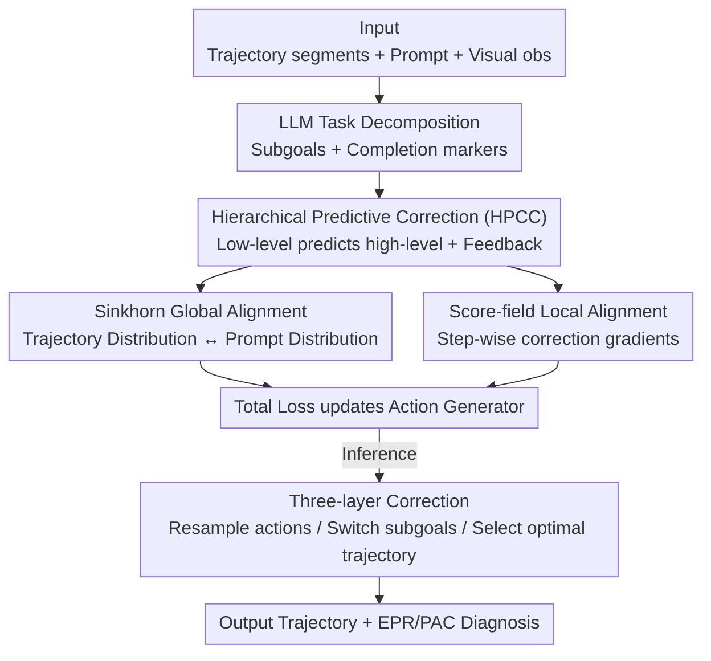

# ReCAPA: Hierarchical Predictive Correction to Mitigate Cascading Failures

**Conference**: ICLR 2026  
**OpenReview**: [https://openreview.net/forum?id=WC6MJ5r5Bj](https://openreview.net/forum?id=WC6MJ5r5Bj)  
**Code**: TBD (Project page: https://sunandreas0437-svg.github.io/recapa-project-page/)  
**Area**: Robotics / Embodied AI  
**Keywords**: Embodied Agents, VLA, Cascading Failures, Cross-layer Prediction, Trajectory Alignment

## TL;DR
ReCAPA decomposes long-horizon trajectories of embodied agents into three levels: "Action—Subgoal—Trajectory." It utilizes low-level predictions of high-level semantics to backpropagate correction signals. Combined with Sinkhorn global alignment and Score-field local alignment, it suppresses deviations during the training phase before they accumulate into cascading failures. ReCAPA achieves higher success rates than strong LLM/LMM baselines on AI2-THOR, MineDojo, and VisualAgentBench.

## Background & Motivation
**Background**: LLM-based VLA (Vision–Language–Action) agents are widely used for long-horizon tasks such as household chores, indoor navigation, and multi-turn human-robot interaction. Mainstream approaches either decompose the overall plan into executable sub-plans for sequential execution (e.g., LLaMAR, CityNavAgent) or use semantic matching to align instructions with trajectories (e.g., TrajPrompt, PRET) to enhance execution consistency.

**Limitations of Prior Work**: Existing methods generally rely on **post-hoc correction** (e.g., ReAct, Reflexion, which reflect only after an error occurs) or **static decomposition + static alignment**. The problem is that once an intermediate step is incorrectly set, local errors propagate through subsequent steps, eventually accumulating into cascading failures. Experiments cited in the paper show that in benchmarks like VirtualHome and AI2-THOR, a **single subgoal error can lead to a performance drop of over 60%** in subsequent steps.

**Key Challenge**: Error propagation occurs across different time scales—errors at the action level compound rapidly in the short term, while misalignments at the policy/subgoal level slowly distort the entire plan. However, existing methods often reflect only at a **single level**, leaving propagation at other levels unchecked. Furthermore, relying solely on local alignment leads to isolated optimization of each step, which easily deviates from the overall task intent.

**Goal**: To **expose and correct errors prematurely** before they propagate, covering action, subgoal, and trajectory levels simultaneously; and to provide diagnostic metrics characterizing how errors diffuse or dissipate, rather than just measuring final success rates.

**Key Insight**: The authors observe that long-horizon consistency requires **cross-layer guidance**: low-level steps should be able to predict the high-level semantics they will compose. Any discrepancy between the prediction and the actual high-level representation indicates a deviation, which can be used to pull low-level representations back on track during training. This shifts "error correction" from a passive reaction during inference to proactive prediction during training.

**Core Idea**: Replacing "static decomposition + post-hoc correction" with "cross-layer prediction + prompt-trajectory distribution alignment" to allow deviations to be predicted and corrected top-down in advance.

## Method

### Overall Architecture
ReCAPA (Predictive Alignment and Planning Architecture) aims to ensure that every local decision made by an agent during long-horizon tasks remains consistent with the overall task intent, preventing small errors from accumulating into cascading failures. It segments a trajectory into three scales: **action level, subgoal level, and trajectory level**. The core module is **HPCC (Hierarchical Predictive Correction)**: it predicts high-level semantics from low-level semantics and backpropagates the gap as a correction signal. In parallel, **Prompt-Trajectory Alignment** pulls trajectory representations toward prompt semantics through two complementary modules: Sinkhorn global alignment and Score-field local alignment. All these signals are combined into a loss during **training** to update the action generator; during **inference**, they form a three-layer correction mechanism to refine the trajectory.

During training, inputs include trajectory segments, prompt embeddings, and visual observations. HPCC encodes them into three-layer representations. At each layer, cross-layer consistency signals are derived by comparing trajectory representations with prompt embeddings. These signals define the training loss used to update action and object selection. During inference, inputs include environmental observations, prompts, and historical trajectories. An LLM (GPT-4o-mini) provides subgoal decomposition and completion markers, while the execution network generates trajectories. The three-layer correction mechanism refines trajectories by **resampling actions, adjusting subtasks, and performing prompt alignment using Sinkhorn**.

### Key Designs

**1. HPCC Cross-layer Predictive Correction: Predicting the High-level with the Low-level**

This is the core of ReCAPA, addressing the limitation where single-layer reflection fails to monitor error propagation at other levels. HPCC organizes trajectories into three layers: actions (how fine-grained steps compose short-term subgoals, e.g., `[GRAB], [WALK], [WIPE] → Cleaning`), subgoals (predicting trajectory outcomes and enforcing causal order, e.g., "wash before dry"), and trajectories (encoding overall task intent and results). At each level $l \in \{\text{action}, \text{subgoal}\}$, the model encodes a state representation $z^l \in \mathbb{R}^d$ based on a set of segments $T^l$ constructed via a sliding window along the trajectory. A Transformer predictor then generates a **predicted high-level representation** $\hat z^{l+1}$, which is compared with the actual target representation $z^{l+1}$ to construct a cross-layer alignment loss for regularizing the low-level representation $z^l$.

The discrepancy is measured using an InfoNCE-style contrastive loss $\mathcal L^l_{\text{pred}}$:

$$\mathcal L^l_{\text{pred}} = -\log \frac{\exp\big(\text{sim}(\hat z^{l+1}, z^{l+1})\big)}{\exp\big(\text{sim}(\hat z^{l+1}, z^{l+1})\big) + \sum_j \exp\big(\text{sim}(\hat z^{l+1}, z^{l+1}_{\text{neg},j})\big)}$$

The positive sample is the actual high-level representation $z^{l+1}$, while negative samples $\{z^{l+1}_{\text{neg},j}\}$ are generated by an LLM (GPT-4o-mini)—these are "plausible yet semantically misaligned" trajectory segments caused by incorrect action sequences or failed subgoals, serving as hard negatives for real failure modes. During optimization, gradients backpropagate through the predictor and the $l$-th layer encoder, while the high-level target $z^{l+1}$ is detached to prevent contamination. The regularized $z^l$ is then fed into the action generator, where the representation at the latest timestep passes through an MLP head to produce discrete action logits. In this way, whether the low-level can predict the high-level serves as an early signal of deviation, moving error correction from a post-hoc response to a training-time proactive measure.

**2. Sinkhorn Global Alignment: Pulling the Trajectory Toward Prompt Semantics at the Distribution Level**

This design targets the issue where local alignment leads to isolated optimization and overall drift. It uses Optimal Transport (OT) to align trajectories and prompts at the **distribution level**. It does not require token-by-token matching; thus, the gradient is dominated by overall semantic consistency, avoiding interference from local ambiguity or out-of-order execution. Specifically, it uses entropy-regularized OT distance, taking the trajectory distribution $\mu$ and prompt distribution $\nu$ as inputs to output the Sinkhorn divergence:

$$\mathcal L_{\text{sinkhorn}}(\mu, \nu) = \text{OT}_\epsilon(\mu, \nu) - \tfrac{1}{2}\text{OT}_\epsilon(\mu, \mu) - \tfrac{1}{2}\text{OT}_\epsilon(\nu, \nu)$$

Minimizing this forces the latent space distribution of the entire trajectory toward the prompt semantics, providing a "global anchor" complementary to HPCC.

**3. Score-field Local Alignment: Providing Step-wise Correction via Denoising Vector Fields**

While Sinkhorn manages global alignment, the Score-field provides **fine-grained local correction**. It shares the same prompt encoder as $\nu$ and the prompt embedding $p$. Taking the state embedding $z^l$ and $p$ as input, it outputs a local correction gradient $s_\psi(z^l, p)$ via an MLP. During training, Gaussian noise $\xi \sim \mathcal{N}(0, \sigma^2 I)$ is added to $z^l$, and the network learns to predict the denoising score $-\xi/\sigma^2$:

$$\mathcal L_{\text{score}} = \mathbb E_{(z^l,p),\,\xi\sim\mathcal N(0,\sigma^2 I)}\Big[\big\| s_\psi(z^l+\xi, p) - (-\xi/\sigma^2) \big\|_2^2\Big]$$

This trains a **vector field pointing toward high-density regions** of the target distribution defined by the prompt. Any trajectory state $z^l$ falling into a low-density region (deviating from task intent) receives a gradient pushing it back toward high-consistency configurations. It acts as an auxiliary regularizer alongside Sinkhorn.

**4. EPR / PAC Diagnostic Metrics: Quantifying Error Diffusion and Dissipation**

Success Rate (SR) often masks differences in robustness—two agents might have the same final SR, but one might suffer from cascading failures while the other recovers. The authors introduce two diagnostic metrics. **Error Propagation Rate (EPR)** uses a step-level error indicator $e_t \in \{0,1\}$ (1 if a constraint is violated or it deviates from the oracle) to measure error compounding with a lag of $k$ steps:

$$\text{EPR}_k = \Pr(e_{t_0+k}=1 \mid e_{t_0}=1) - \Pr(e_{t_0+k}=1 \mid e_{t_0}=0)$$

Example: $\text{EPR}_3=0.4$ means an error three steps ago increases the current error probability by 40%. The **Propagation Attenuation Coefficient (PAC)** measures the exponential decay rate of post-error risk:

$$\text{PAC} = -\text{slope}\big(\Delta, \ln \Pr(e_{t_0+\Delta}=1 \mid e_{t_0}=1)\big)$$

A higher PAC indicates faster recovery, while a lower value reflects persistent exposure to error accumulation. Lower EPR reflects "error prevention," and higher PAC reflects "error recovery."

### Loss & Training
Training consists of two stages. First, the Transformer encoder is **pre-trained** using a contrastive objective: sliding window segments of state-action trajectories are encoded into fixed-length embeddings and optimized via InfoNCE (Eq. 1). Positive samples come from the same episode, while negatives are generated by an LLM. This initializes a structured embedding space capturing local segment plausibility and temporal dependencies. Then, the hierarchical encoders, predictors, and alignment modules are **jointly fine-tuned**, optimizing the total loss end-to-end:

$$\mathcal L_{\text{total}} = \sum_{l\in\{\text{action},\text{subgoal}\}} \big(\lambda^l_{\text{pred}}\mathcal L^l_{\text{pred}} + \lambda^l_{\text{score}}\mathcal L^l_{\text{score}}\big) + \lambda_{\text{sinkhorn}}\mathcal L_{\text{sinkhorn}}$$

Hyperparameters: $\lambda^l_{\text{pred}}=0.5, \lambda^l_{\text{score}}=0.2, \lambda_{\text{sinkhorn}}=0.1$. During inference, three-layer serial correction is performed: the action layer selects Top-K candidates based on alignment thresholds; the subgoal layer triggers switches based on windowed representation similarity; and the trajectory layer uses Sinkhorn to select the best candidate action to appended to the buffer.

## Key Experimental Results

### Main Results
Evaluations were conducted on AI2-THOR (120 scenarios), MineDojo (3,142 tasks), and VisualAgentBench (including OmniGibson and Minecraft). VisualAgentBench/AI2-THOR evaluations utilized **zero-shot transfer** after pre-training on ProcTHOR and Behavior1K.

AI2-THOR (SR=Success Rate, TR=Transport Rate, Coverage=Successful interaction coverage, Balance=Subtask contribution balance):

| Model | SR | TR | Coverage | Balance |
|------|------|------|----------|---------|
| ReAct | 0.34 | 0.72 | 0.92 | 0.67 |
| GPT-4o | 0.51 | 0.85 | 0.95 | 0.83 |
| GPT-4V | 0.66 | 0.91 | **0.97** | 0.82 |
| LLaMAR | 0.68 | 0.90 | 0.95 | 0.85 |
| **Ours (ReCAPA)** | **0.75** | **0.93** | 0.95 | **0.93** |

VisualAgentBench (AVG=Average score):

| Model | AVG. | OmniGibson | Minecraft |
|------|------|-----------|-----------|
| InternVL-2 | 22.20 | 16.0 | 28.4 |
| GPT-4o | 48.30 | 41.4 | 55.2 |
| GPT-4o mini | 54.15 | 46.7 | 61.6 |
| Gemini 2.5 Flash | 53.00 | 43.9 | 62.1 |
| **Ours (ReCAPA)** | **58.65** | **50.6** | **66.7** |

Overall gains reported: VisualAgentBench +5.65%, MineDojo +7%, AI2-THOR +7% over strong baselines. Regarding error propagation, ReCAPA achieved $\text{EPR}_{10}=0.082$ on OmniGibson, whereas other models exceeded 0.3.

### Ablation Study
Ablations focus on HPCC and alignment components (values represent SR):

| Configuration | Behavior | VirtualHome | AI2-THOR | Description |
|------|---------|-------------|----------|------|
| w/o-HPCC | 59.3 | 60.1 | 0.63 | No hierarchical prediction; largest drop |
| PPO | 60.2 | 60.6 | 0.59 | Flat RL baseline using PPO |
| HIRO | 63.4 | 62.7 | 0.63 | Two-layer fixed subgoals + alignment |
| HPCC-AS | 63.6 | 61.4 | 0.65 | Action + Subgoal only |
| HPCC-AT | 65.1 | 70.9 | 0.73 | Action + Trajectory; significant gains |
| HPCC-ST | 66.3 | 66.3 | 0.69 | Subgoal + Trajectory |
| **HPCC-Full** | **72.2** | **70.5** | **0.75** | All three layers enabled |
| w/o-Alignment | 65.8 | 67.2 | 0.69 | All alignment losses removed |
| Sinkhorn | 66.1 | 69.4 | 0.74 | Global alignment only |
| Score-field | 64.4 | 67.9 | 0.72 | Local alignment only |
| KL+Score-field | 70.3 | 68.1 | 0.74 | KL instead of Sinkhorn |
| Alignment-Full| 72.2 | 70.5 | 0.75 | Both alignment modules enabled |

### Key Findings
- **HPCC is the primary contributor**: Removing HPCC dropped the SR on Behavior from 72.2 to 59.3, confirming multi-layer prediction as the core.
- **Trajectory layer is crucial**: HPCC variants including the trajectory layer (AT/ST) significantly outperformed the Action+Subgoal version (AS), as trajectory representations provide global semantic anchors.
- **Alignment modules are complementary**: Sinkhorn generally performs better than Score-field alone, though the combination is optimal.
- **Coverage-Stability Trade-off**: ReCAPA's Coverage (0.95) is slightly lower than GPT-4V (0.97). The hierarchical structure favors consistency over exploration.

## Highlights & Insights
- **Shifting Error Correction to Training**: Unlike ReAct/Reflexion ("reflect after failing"), ReCAPA uses "predictability of the high-level by the low-level" as an early signal to regularize representations during training.
- **Detached Targets + Hard Negatives**: Detaching the high-level target prevents "self-deceptive" collapse, while LLM-generated hard negatives ensure the model learns real semantic failure patterns.
- **Diagnostic Innovation**: EPR and PAC fill the gap left by terminal metrics (SR), quantifying the "prevention" and "recovery" dimensions of robustness.
- **Global + Local Alignment**: The combination of OT (Sinkhorn) and Score Matching is an effective design for embodied alignment.

## Limitations & Future Work
- **Conservative Exploration**: The focus on consistency leads to lower coverage compared to purely exploratory agents like GPT-4V.
- **LLM Dependency**: Inference-time decomposition and training-time negative generation rely on GPT-4o-mini; performance is heavily tied to the quality of LLM decomposition.
- **Instability of KL Alignment**: While sensitive to skewed distributions, KL-based alignment can destabilize signals.
- **Hyperparameter Sensitivity**: The granularity of the three layers (window size, boundaries) and $\lambda$ sensitivity were not fully explored.

## Related Work & Insights
- **vs Decomposition (LLaMAR / HIRO)**: These methods use static pipelines that fail to adapt when the initial decomposition is flawed. ReCAPA uses cross-layer prediction for adaptive correction.
- **vs Correction (ReAct / Reflexion)**: These provide episodic feedback but reflect on only one level. ReCAPA enforces cross-layer consistency.
- **vs Integration (TrajPrompt)**: These focus on sub-step alignment but may allow "correct subgoal, wrong action" scenarios. ReCAPA maintains intent across all three levels.

## Rating
- Novelty: ⭐⭐⭐⭐
- Experimental Thoroughness: ⭐⭐⭐⭐
- Writing Quality: ⭐⭐⭐
- Value: ⭐⭐⭐⭐

<!-- RELATED:START -->

## Related Papers

- [\[ICLR 2026\] Experience-based Knowledge Correction for Robust Planning in Minecraft](experience-based_knowledge_correction_for_robust_planning_in_minecraft.md)
- [\[CVPR 2026\] Diagnose, Correct, and Learn from Manipulation Failures via Visual Symbols](../../CVPR2026/robotics/diagnose_correct_and_learn_from_manipulation_failures_via_visual_symbols.md)
- [\[ICLR 2026\] H$^3$DP: Triply-Hierarchical Diffusion Policy for Visuomotor Learning](h3dp_triplyhierarchical_diffusion_policy_for_visuomotor_learning.md)
- [\[CVPR 2026\] GeoPredict: Leveraging Predictive Kinematics and 3D Gaussian Geometry for Precise VLA Manipulation](../../CVPR2026/robotics/geopredict_leveraging_predictive_kinematics_and_3d_gaussian_geometry_for_precise.md)
- [\[ICLR 2026\] Hierarchical Value-Decomposed Offline Reinforcement Learning for Whole-Body Control](hierarchical_value-decomposed_offline_reinforcement_learning_for_whole-body_cont.md)

<!-- RELATED:END -->
