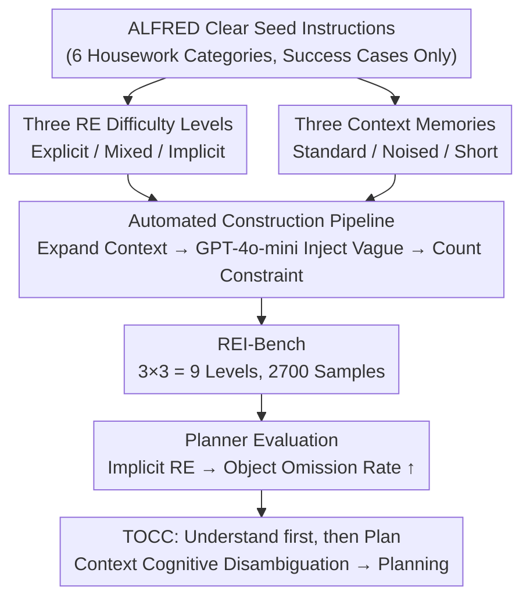

# REI-Bench: Can Embodied Agents Understand Vague Human Instructions in Task Planning?

**Conference**: ICLR 2026  
**arXiv**: [2505.10872](https://arxiv.org/abs/2505.10872)  
**Code**: [Project Page](https://jcx0110.github.io/rei-bench-project)  
**Area**: Embodied AI/Task Planning  
**Keywords**: Referring Expressions, Vague Instructions, LLM Planning, Coreference Resolution, Robustness

## TL;DR

The first systematic study on the impact of Referring Expressions (RE) in vague human instructions on LLM robotic task planning. It constructs the REI-Bench benchmark modeling 9 levels of coreference ambiguity (3 levels of RE difficulty $\times$ 3 levels of context). It finds that implicit REs can cause existing planners' success rates to drop by up to 36.9%. It proposes the Task-Oriented Context Cognition (TOCC) method to decouple task understanding from planning decisions, yielding an average success rate improvement of 6.5%.

## Background & Motivation

**Background**: LLM-driven robotic task planning (SayCan, ProgPrompt, DAG-Plan, etc.) has made significant progress, but all rely on an idealized assumption: user instructions are clear, complete, and unambiguous. However, in real-world scenarios, human language is inherently vague.

**Limitations of Prior Work**: Instructions from real users (especially the elderly, children, or Alzheimer's patients) often contain implicit referring expressions, such as using "it" instead of "pot" or "that heavy thing" instead of "frying pan." Linguistic research shows that about 20% of expressions in news are descriptive (implicit RE), and the proportion is even higher in daily conversation. These are precisely the groups most in need of robotic services.

**Research Gap**: (1) Lack of a benchmark to systematically evaluate the impact of vague instructions on robotic planning; (2) Existing ambiguity datasets (AmbiK, CLARA, etc.) do not systematically model the position, frequency, and form of REs; (3) It is unclear whether LLMs can fully leverage their inherent language understanding capabilities in planning scenarios.

**Key Challenge**: Clark's (1975) bridging inference theory explains how humans resolve implicit REs: when hearing "that heavy thing," humans find multiple candidates from context memory (pot, ingredients, sink) and select the best match. Pragmatic scholar Levinson further distinguished between Referring Expressions (RE) and Deictic Expressions (DE) as two types of ambiguity.

**Design Motivation**: The authors found that LLMs can correctly resolve implicit REs when prompted in isolation (e.g., via reflection prompts), but this ability is not fully utilized during the planning process. LLMs focus excessively on plan generation while neglecting linguistic understanding. This challenges the common assumption that "embedding an LLM automatically guarantees robotic understanding of human language."

**Value**: Failures caused by implicit REs primarily manifest as "object omission"—the planner fails to correctly identify the target object in the instruction, thus generating the wrong action sequence. For example, "the heated one" is incorrectly identified as "plate" instead of "potato."

## Method

### Overall Architecture

REI-Bench decomposes coreference ambiguity in real human-robot interaction into two orthogonal dimensions—Referring Expression (RE) difficulty and dialogue context quality. It uses an automated pipeline, independent of human labeling, starting from clear ALFRED seed instructions to expand context and inject ambiguity. This results in an evaluation benchmark covering 9 ambiguity levels with 2,700 samples. After stress-testing various LLM planners, the authors observed that failures almost exclusively stem from "object omission." Consequently, they proposed the TOCC method, using a "understand first, then plan" decoupled approach to extract language understanding from planning, mitigating failures caused by vague instructions.

### Key Designs

**1. Three Levels of RE Difficulty: Creating Controllable Gradients from "Clear to Vague"**

The level of ambiguity in real user expressions varies. The elderly and children often use "it" or "that heavy thing" instead of specific names; thus, a benchmark must quantitatively distinguish between degrees of ambiguity. The paper divides RE into three levels: Explicit RE includes proper nouns ("apple"), definite phrases ("the apple"), and indefinite phrases ("an apple"), which map directly to objects; Implicit RE includes pronouns ("it"/"them") and attribute expressions ("sweet fruit"), which correspond to multiple candidates and require context inference. The construction follows a gradient—Explicit retains original clear expressions; Mixed replaces explicit REs in instructions with implicit ones while keeping context explicit; Implicit replaces all explicit REs with implicit ones, leaving only the first mention in the context as the sole clue. Replacement rules follow coreference resolution patterns from the OntoNotes corpus to ensure naturalness.

**2. Three Levels of Context Memory: Simulating Varying Information Quality in Real Interactions**

Pragmatics suggests that the binding of words to objects is established within specific contexts (Levinson, 1983). Therefore, the same implicit instruction varies in difficulty across contexts. The paper designs three contexts: Standard provides complete task-related information; Noised injects "ambiguous name" noise, such as names or brands similar to object names (e.g., expanding "Rose" to the recurring "Mrs. Rose") to create interference; Short randomly deletes noun phrases containing task-related explicit REs on top of noise to further remove clues. Noise corresponds to "polysemy" in daily life (e.g., "apple" is both a fruit and a brand), while deletion corresponds to semantic gaps from cognitive limitations. The Cartesian product of the three RE levels and three context levels yields $3 \times 3 = 9$ ambiguity levels.

**3. Automated Data Construction Pipeline: Bulk Generation of Vague Samples Without Human Labeling**

Existing vague expression datasets (OntoNotes, Winograd Schema) are labeled by linguists but lack systematic control over RE position, frequency, and form. The paper builds an automated pipeline: it selects 6 housework tasks from ALFRED (Pick & Place, Stack & Place, etc.), executes them with a planner, and keeps only successful cases as seeds to isolate the impact of REs. Then, GPT-4o-mini expands the dialogue, derives Standard/Noised/Short variants, and uses CoT to replace explicit REs with implicit ones. Finally, counting rules ensure consistency in the number of explicit REs across tasks. This ensures the 2,700-sample scale while eliminating subjective bias.

**4. Task-Oriented Context Cognition (TOCC): Decoupling Understanding and Planning**

An anti-intuitive phenomenon was observed: when prompted directly with "what does 'the heated one' refer to?", the LLM identifies "potato" correctly, but in a planning task, it identifies it as "plate." The issue isn't a lack of understanding but rather that attention is consumed by plan generation. TOCC splits the task into two steps: a context cognition stage, where the LLM identifies implicit REs and infers their actual referents to output a disambiguated clear instruction, followed by a planning stage where the planner generates action sequences based on the clear instruction. Unlike "Aware Prompt" (which only warns of ambiguity) or "Chain-of-Thought" (which attempts both in one pass), TOCC prevents attention competition via physical separation.

## Key Experimental Results

### Main Results: Success Rate vs. Ambiguity

| Planner | Explicit+Standard | Mixed+Standard | Implicit+Standard | Max Drop |
|---------|-------------------|----------------|-------------------|----------|
| LLaMA3.1-8B + SayCan | 46.90% | 30.10% (-16.8%) | 22.10% (-24.8%) | -24.8% |
| GPT-4o-mini + SayCan | 45.00% | 25.90% (-19.1%) | 24.30% (-20.7%) | -20.7% |
| DeepSeekMath-7B + SayCan | 27.00% | 19.80% (-7.2%) | 14.70% (-12.3%) | -12.3% |
| LLaMA3.1-8B + DAG-Plan | — | — | — | Max 36.9% |
| GPT-4o + SayCan | High Baseline | Small Drop | Significant Drop | — |

> Note: The baseline (Explicit REs without context) for LLaMA3.1-8B+SayCan is 57.7%, dropping to 46.90% after adding multi-turn dialogue.

### Ablation Study: Comparison of Prompting Methods (LLaMA3.1-8B + SayCan, Standard Context)

| Method | Explicit RE Total Error | Mixed RE Total Error | Implicit RE Total Error | Implicit RE Object Omission |
|------|---------------------|-------------------|---------------------|----------------------|
| Baseline | 53.1% | 69.9% | 77.9% | 53.9% |
| + AP | 53.2% (+0.1) | 71.0% (+1.1) | 77.3% (-0.6) | 49.9% (-4.0) |
| + CoT | 52.7% (-0.4) | 69.1% (-0.8) | 77.9% (+0.0) | 47.6% (-6.3) |
| + ICL | 60.8% (+7.7) | 71.7% (+1.8) | 78.6% (+0.7) | 49.9% (-4.0) |
| + TOCC | **41.0%** (-12.1) | **66.4%** (-3.5) | **70.7%** (-7.2) | **40.1%** (-13.8) |
| - Context | 42.3% (-10.8) | 86.9% (+17.0) | 90.6% (+12.7) | 85.1% (+31.2) |

## Key Findings

- **Implicit RE is the main cause of planning failure**: Success rates drop for all planners as implicit RE proportions increase. For LLaMA3.1-8B+SayCan, Mixed drops by 16.8%, and Implicit drops another 8.0%. Context noise and information loss have relatively smaller impacts.

- **Root cause is "object omission" rather than "execution error"**: Error analysis shows that as implicit REs increase, the **object omission rate** leaps from 22.6% to 53.9% (LLaMA3.1-8B), while the execution error rate actually drops from 30.5% to 24.0%. This indicates LLMs can plan but fail to identify the target objects.

- **LLMs have RE parsing skills but fail during planning**: When prompted only to resolve "the heated one," the LLM succeeds; in planning tasks, it fails. This suggests planning tasks consume LLM attention, inhibiting language understanding.

- **TOCC improves performance via decoupling**: TOCC achieved best performance across all levels, improving success rates by 6.5% on average. For Implicit REs, object omission dropped from 53.9% to 40.1% (a 13.8% reduction).

- **Removing context validates pragmatics**: Without context, performance for Mixed and Implicit REs plummeted (object omission rate jumped from 38.8% to 81.6%), proving context is indispensable.

## Highlights & Insights

1. **Linguistics-driven AI System Design**: The paper systematically integrates linguistic theories like bridging inference and pragmatics into robotic planning evaluation, moving beyond simple "vague instructions" to model one-to-many Signifier-Signified relations.

2. **Revealing "Scenario-Dependent Capability Failure"**: LLMs do not lack the ability to understand implicit REs; they fail because that capability is suppressed under the multi-task pressure of planning. This observation suggests we cannot assume all LLM capabilities remain active across all task combinations.

3. **Effective Simplicity**: TOCC is essentially a "understand then plan" decoupling. Its effectiveness reflects an accurate localization of the root cause—returning to the fundamental principle of "Separation of Concerns."

## Limitations & Future Work

1. **Limited Task Complexity**: To isolate RE impact, the dataset includes only simple, short-horizon, single-target tasks. Complex long-horizon multi-target scenarios are not covered.

2. **Focus Only on Coreference**: Human vague language includes deictic expressions, syntactic ambiguity, and scope ambiguity; this work focuses only on coreference.

3. **Absence of Multi-modal Information**: Experiments are conducted in AI2-THOR, evaluating only text-level semantic understanding. Visual cues (e.g., VLM-based planners resolving "the red thing") are not considered.

4. **TOCC Inference Overhead**: Decoupling requires two LLM calls, which may affect real-time performance on resource-constrained robotic ends.

## Related Work & Insights

### vs AmbiK (Ivanova et al., 2025)
AmbiK is a dataset for vague natural language instructions in kitchens (1k samples). Compared to REI-Bench: (1) AmbiK does not support planning evaluation; (2) AmbiK lacks multi-turn dialogue context; (3) REI-Bench models ambiguity more systematically through RE and context types.

### vs CLARA (Park et al., 2023) / KNOWNO (Ren et al., 2023)
CLARA lets LLMs judge instruction certainty; KNOWNO measures uncertainty. Both follow a "detect ambiguity → request clarification" paradigm. REI-Bench focuses on whether planners can resolve ambiguity autonomously without user interaction.

### vs DialFRED (Gao et al., 2022)
DialFRED uses a "Questioner-Executor" framework through 53k Q&A pairs for multi-round interaction. REI-Bench differs by assuming the robot should autonomously infer from existing context rather than relying on additional interaction. These paradigms are complementary.

## Rating

| Dimension | Rating | Reason |
|------|------|------|
| Novelty | ★★★★☆ | First systematic modeling of RE ambiguity in planning; theory-driven benchmark; however, TOCC is relatively simple. |
| Technical Depth | ★★★☆☆ | Robust benchmark pipeline, but the core method (TOCC) is a two-step prompt decoupling without model training. |
| Experimental Thoroughness | ★★★★★ | Comprehensive ablation of 12 planners, 9 ambiguity levels, and 4 prompting methods; deep error attribution. |
| Value | ★★★★☆ | Reveals a neglected vulnerability in LLM planners; highlights implications for HRI; limited to simulation. |

<!-- RELATED:START -->

## Related Papers

- [\[CVPR 2026\] AGENTSAFE: Benchmarking the Safety of Embodied Agents on Hazardous Instructions](../../CVPR2026/robotics/agentsafe_benchmarking_the_safety_of_embodied_agents_on_hazardous_instructions.md)
- [\[ICLR 2026\] MomaGraph: State-Aware Unified Scene Graphs with Vision-Language Models for Embodied Task Planning](momagraph_state-aware_unified_scene_graphs_with_vision-language_models_for_embod.md)
- [\[ICLR 2026\] Planning with an Embodied Learnable Memory](planning_with_an_embodied_learnable_memory.md)
- [\[CVPR 2026\] RoboAgent: Chaining Basic Capabilities for Embodied Task Planning](../../CVPR2026/robotics/roboagent_chaining_basic_capabilities_for_embodied_task_planning.md)
- [\[NeurIPS 2025\] Can Agents Fix Agent Issues?](../../NeurIPS2025/robotics/can_agents_fix_agent_issues.md)

<!-- RELATED:END -->
