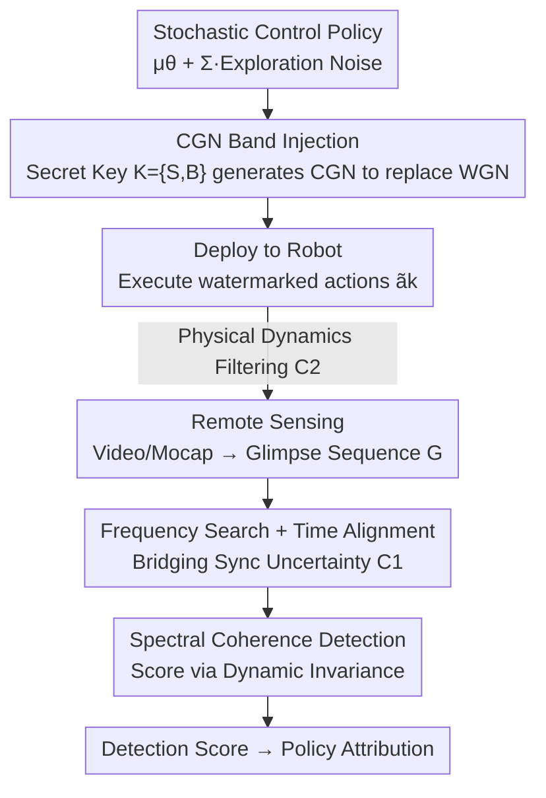

# Remotely Detectable Robot Policy Watermarking

**Conference**: ICLR2026  
**OpenReview**: [https://openreview.net/forum?id=8s5jBVybhQ](https://openreview.net/forum?id=8s5jBVybhQ)  
**Code**: [https://github.com/proroklab/RobotPolicyWatermarking](https://github.com/proroklab/RobotPolicyWatermarking)  
**Area**: Robotics / Reinforcement Learning / AI Safety  
**Keywords**: Policy Watermarking, Remote Detection, Frequency Domain Watermarking, Spectral Coherence, Intellectual Property Protection

## TL;DR
Addressing the realistic scenario where robot policy ownership can only be verified through remote observations (e.g., video, motion capture), this paper proposes CoNoCo. It replaces the white noise originally used for exploration in Reinforcement Learning (RL) with "colored noise" hidden in a secret frequency band. This watermark is then detected using spectral coherence, which is insensitive to system dynamics. The method achieves policy attribution on both simulated and real robots without compromising performance or requiring access to internal states.

## Background & Motivation
**Background**: Robot control policies (locomotion, manipulation, navigation) trained via machine learning are high-value IP assets. Similar to multimedia and Large Language Models (LLMs), there is a need to "watermark" these policies to verify ownership and trace their origins.

**Limitations of Prior Work**: Existing policy watermarking methods (e.g., Behzadan & Hsu 2019 requiring execution in a "trigger environment"; Chen et al. 2021 forcing secret actions in specific "safe states") and neural network watermarks (embedding in weights or backdoor triggers) all assume **white-box access**—the auditor must have access to internal policy states, action logs, or the ability to query the model actively.

**Key Challenge**: In real-world auditing scenarios, auditors often only have **remote external observations** (e.g., traffic surveillance video) and cannot see the torque commands output by the policy, only their physical consequences (how the robot moves). The authors term this the **Physical Observation Gap**, which presents three difficulties: (C1) Synchronization Uncertainty—internal policy frequency $f_\pi$ is unknown and prone to jitter, while remote sensor sampling rates $f_g$ are independent with unknown time offsets; (C2) System Dynamics—actions are filtered and distorted by unknown robot physics (inertia, friction); (C3) Interference and Noise—the primary policy behavior $\mu_k$ is much stronger than the watermark, compounded by environmental disturbances and sensor noise.

**Goal**: Design a watermark that (W1) does not change the marginal distribution of actions (no performance loss) and (W2) remains reliably detectable from purely remote observations despite C1–C3.

**Key Insight**: Time-domain methods based on precise timing are fragile under such distortions. The authors turn to the **frequency domain**, as frequency components are more robust to time offsets and dynamical filtering. Furthermore, continuous control policies inherently contain Gaussian exploration noise, which can serve as a "shell" to embed signals without introducing extra disturbances.

**Core Idea**: Replace the white noise exploration term of the policy with frequency-controlled Colored Gaussian Noise (CGN) to embed the watermark, then use spectral coherence—which can "see through" unknown linear dynamics—for detection.

## Method

### Overall Architecture
A robot policy $\pi_\theta$ maps observations $o_k$ to actions $a_k = \mu_\theta(o_k) + \Sigma_\theta(o_k)\epsilon_k$, where $\mu_\theta$ is the mean behavior, $\Sigma_\theta$ is the exploration scale, and $\epsilon_k \sim \mathcal{N}(0, I)$ is White Gaussian Noise (WGN). The workflow consists of three steps (per Figure 1): ① The **Policy Owner** uses a secret key $K=\{S,B\}$ to generate the watermark and a detection function; ② The **Policy User** deploys the watermarked policy on their robot; ③ The **Policy Auditor** holds the key $K$, obtains "glimpses" of the robot's behavior via remote sensing, and feeds these into the detection function to compute a score.

The two pillars of CoNoCo are: the injection side replaces WGN with normalized CGN (a "shaped noise" with energy concentrated in band $B$); the detection side uses **spectral coherence** combined with **frequency search and time alignment** to bridge the Physical Observation Gap.

To formalize remote observations, the authors define a **Glimpse Sequence**: a remote sensor samples at times $\{t_i\}$ to obtain $G_i = G_{\text{map}}(s(t_i)) + \eta_i$, where $G_{\text{map}}$ maps system states to remote observations (e.g., velocity estimated from video) and $\eta_i$ is measurement noise. the sequence $G=(G_i)$ is the only data available for detection.

### Key Designs

**1. Glimpse Sequence Formalization: Modeling the "Remote Observation Gap" as a Signal Problem**

The authors formalize "seeing only video" into a mathematical problem. They model the policy execution (digital, timestamps $\{T_k\}$, internal frequency $f_\pi$) and remote observation (sampling rate $f_g$, unknown offset, $G_{\text{map}}$ mapping + noise $\eta_i$) using glimpse sequences. They distill three challenges: C1 (Sync Uncertainty), C2 (Dynamics Filtering), C3 (Interference/Noise), and two requirements: W1 (Marginal Distribution Preservation), W2 (Robust Detectability). This clarifies why time-domain methods fail: the auditor observes physical consequences after unknown transformations, not the actions $a_k$ themselves.

**2. CGN Band Injection: Embedding Signals via Exploration Noise Shell with Invariant Marginal Distribution**

For W1 (no performance loss) and C3 (primary behavior interference), the authors **replace** the existing exploration noise instead of adding a new disturbance. Using the key $K=\{S,B\}$ (where $S$ is a secret seed and $B=[f_{\min},f_{\max}]$ is a secret band), they derive a white noise $X$ from the seed, pass it through a Butterworth bandpass filter $H$, and normalize it to unit variance to obtain the CGN sequence $W_k$. The policy executes $\tilde a_k = \mu_\theta(o_k) + \Sigma_k \cdot W_k$. Since physical frequencies depend on the unknown $f_\pi$ (C1), the digital filter band is chosen as $[f_{\min}/f_{\pi,ub},\, f_{\max}/f_{\pi,lb}]$ to ensure physical signal coverage of band $B$. Selecting $B$ outside the expected spectrum of $\mu_\theta$ reduces interference (C3). **Theorem 5.1** provides the theoretical guarantee: the marginal distribution of $W_k$ remains $\mathcal{N}(0,I)$, meaning $p_{\pi_\theta}(a|o)=p_{\tilde\pi_\theta}(a|o)$—the action statistics are identical to the original policy, satisfying W1.

**3. Spectral Coherence Detection: Using Dynamic Invariance to "See Through" Physical Filtering**

This addresses C2. The observed $G$ results from the watermark transformed by unknown robot dynamics $S_{\text{dyn}}$. The authors use **complex coherence** $C_{XY}(f)=\frac{S_{XY}(f)}{\sqrt{S_{XX}(f)S_{YY}(f)}}$ as the metric. Its magnitude $|C_{XY}(f)|\in[0,1]$ acts as a frequency-dependent correlation coefficient. **Theorem 5.2** provides the key invariance: if $Y$ is the output of an input $X$ through a Linear Time-Invariant (LTI) system $H$, then in noise-free conditions $|C_{XY}(f)|=1$, regardless of $H$. This perfectly matches LTI transformations (like torque-to-velocity) described by constant-coefficient ODEs. **Theorem 5.3** links detectability to SINR: $|C_{WG}(f)|^2 = \frac{\text{SINR}(f)}{\text{SINR}(f)+1}$. CoNoCo mitigates the "spectral smearing" of Linear Time-Varying (LTV) systems by averaging across multiple observation dimensions and selecting $B$ in stable frequency regions.

**4. Frequency Search + Time Alignment: Realigning Signals without Knowing True Policy Frequency**

C1 means the detector does not know $f_\pi$ or the video start time. During detection (Algorithm 1), a search is performed over a candidate frequency grid $F_{\text{search}}\subseteq[f_{\pi,lb},f_{\pi,ub}]$. For each hypothesized frequency $s$, the watermark $W$ is regenerated and resampled to the known glimpse rate $f_g$ to produce $W'_s$. Welch's method then estimates the coherence between $W'_s$ and each dimension of $G$. The final detection score is the maximum average coherence magnitude within band $B$ across all hypotheses: $D(G)=\max_{s\in F_{\text{search}}}\big(\frac{1}{D}\sum_{d=1}^{D}\text{mean}_{f\in B}|C_{W'_d G_d}(f;s)|\big)$. For unknown time offsets, GCC-PHAT is used for alignment (Appendix G.1).

### Loss & Training
The watermark is **not part of RL training**; it is applied during inference/deployment. Thus, multiple policies can share the same pre-trained models. In the experiments, policies for all environments were pre-trained using PPO.

## Key Experimental Results

### Main Results
Evaluation dimensions: Simulation + real robots, tasks including VMAS navigation, RoboMaster real-world navigation, Mujoco InvertedPendulum, and HalfCheetah. Remote modalities include Motion Capture and top-down/side-view cameras. Metrics: Detectability (ROC AUC), Anonymity ($1-\text{AUC}(k')$ with wrong keys), and Reward Preservation. (Values below are qualitative; refer to original charts for precision).

| Watermarking Policy | Detectability | Anonymity | Remarks |
|---------------------|---------------|-----------|---------|
| **CoNoCo (Ours)**   | High          | High      | Only method achieving both; near-perfect remote detection |
| Multi-Sine Wave     | High          | Low       | Fails anonymity (detected even with wrong keys) |
| Correlation-Based   | Low           | High      | Unreliable detection |
| Tournament-Based    | Low           | High      | Robust to C1 but weak detection |

Challenges introduced by modalities (Table 1):

| Observation Modality | C1 Sync | C2 Dynamics | C3 Noise/Interference |
|----------------------|---------|-------------|-----------------------|
| Ground Truth Action  | –       | –           | –                     |
| Onboard Sensors      | –       | ✓           | ✓                     |
| Remote Motion Capture| ✓       | ✓           | ✓                     |
| Remote Camera Feed   | ✓       | ✓           | ✓ (Stronger)          |

### Ablation Study

| Config / Analysis | Key Findings |
|-------------------|--------------|
| Real RoboMaster + Remote Mocap | CoNoCo is optimal; trajectories nearly overlap with non-watermarked ones. |
| Torque Control + Remote Camera | Near-perfect detection; only Multi-Sine is comparable but fails anonymity. |
| Glimpse Sequence Length | Detectability improves with length, converging to ROC AUC=1. |
| Adversarial Attacks | Highly robust against white noise/band-specific interference targeting $B$. |

### Key Findings
- **Simultaneous Detectability and Anonymity is the core challenge**: Multi-Sine has high detection but poor anonymity; others have good anonymity but weak detection. CoNoCo excels in both due to spectral coherence and secret band selection.
- **Remote is harder but CoNoCo remains stable**: Using velocity estimated via template matching from video, CoNoCo still maintains high detection, verifying Theorem 5.2's LTI invariance holds reasonably well in real settings.
- **Simpler tasks are more demanding**: RoboMaster navigation has little behavioral redundancy; deviations are easily visible. CoNoCo's success here shows it is applicable beyond high-dimensional complex systems.

## Highlights & Insights
- **"Exploration Noise Shell" is the most clever design**: The watermark is a replacement, not an addition. Combined with Theorem 5.1's normalization, it achieves zero marginal distribution change—the root of its performance preservation.
- **Bypassing unknown physics via LTI invariance**: Treating "torque → velocity" as an LTI filter and using the fact that coherence magnitude is invariant to the filter allows the method to eliminate unknown dynamics. This is applicable to any watermark problem where the source and observer are separated by an unknown linear system.
- **Band as a design lever**: Choosing the secret band $B$ outside the primary behavior spectrum simultaneously reduces interference (C3), ensures stealth, and defines the secret key.

## Limitations & Future Work
- Theoretical guarantees (Thm 5.2/5.3) rely on LTI + constant exploration scale assumptions; real systems are LTV, and time-varying $\Sigma_k$ can cause spectral smearing.
- High detectability requires sufficient exploration randomness ($\Sigma$); it may be less effective for nearly deterministic policies.
- Distillation as an adversarial attack is mentioned but not experimentally verified; whether an attacker can erase the signature by re-distilling a non-watermarked policy remains open.
- Remote camera detection depends on the quality of velocity estimation (e.g., template matching), which could be a bottleneck in complex visual scenes.

## Related Work & Insights
- **vs. Trigger-based Policy Watermarking**: Previous methods require white-box access or specific trigger states; CoNoCo works with remote data and does not change marginal action distributions.
- **vs. NN Weight/Backdoor Watermarking**: CoNoCo targets the "deployed physical policy" rather than the model weights.
- **vs. CPS Dynamic Watermarking**: While both inject signals into control, CPS methods focus on real-time integrity and usually assume internal signal access. CoNoCo focuses on IP attribution using external data.
- **vs. Multimedia/SynthID Watermarking**: This work extends frequency-domain principles to the more hostile setting of signals filtered by unknown physical dynamics.

## Rating
- Novelty: ⭐⭐⭐⭐⭐ First policy watermark for pure remote detection; formalization of the "physical observation gap" is highly original.
- Experimental Thoroughness: ⭐⭐⭐⭐ Covers sim/real, multi-modal, and attacks; however, relies heavily on ROC plots and lacks direct external baselines (due to being the first of its kind).
- Writing Quality: ⭐⭐⭐⭐⭐ Excellent breakdown of challenges (C1–C3) and requirements (W1–W2); strong link between theory and intuition.
- Value: ⭐⭐⭐⭐⭐ Provides a non-intrusive means for robot IP protection and regulatory accountability.

<!-- RELATED:START -->

## Related Papers

- [\[AAAI 2026\] Sim-to-Real: An Unsupervised Noise Layer for Screen-Camera Watermarking Robustness](../../AAAI2026/robotics/sim-to-real_an_unsupervised_noise_layer_for_screen-camera_watermarking_robustnes.md)
- [\[AAAI 2026\] Coordinated Humanoid Robot Locomotion with Symmetry Equivariant Reinforcement Learning Policy](../../AAAI2026/robotics/coordinated_humanoid_robot_locomotion_with_symmetry_equivariant_reinforcement_le.md)
- [\[ICLR 2026\] Rethinking Policy Diversity in Ensemble Policy Gradient in Large-Scale Reinforcement Learning](rethinking_policy_diversity_in_ensemble_policy_gradient_in_large-scale_reinforce.md)
- [\[NeurIPS 2025\] Opinion: Towards Unified Expressive Policy Optimization for Robust Robot Learning](../../NeurIPS2025/robotics/opinion_towards_unified_expressive_policy_optimization_for_robust_robot_learning.md)
- [\[ICLR 2026\] Geometry-Aware Policy Imitation](geometry-aware_policy_imitation.md)

<!-- RELATED:END -->
