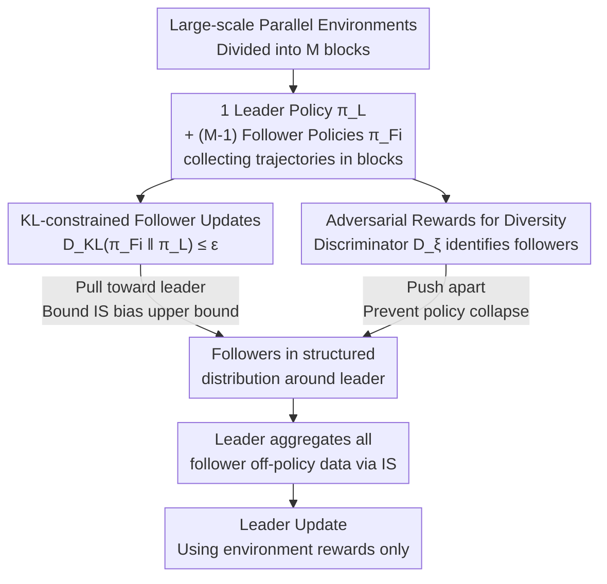

# Rethinking Policy Diversity in Ensemble Policy Gradient in Large-Scale Reinforcement Learning

**Conference**: ICLR 2026  
**arXiv**: [2603.01741](https://arxiv.org/abs/2603.01741)  
**Code**: [Project Page](https://naoki04.github.io/paper-cpo/)  
**Area**: Reinforcement Learning  
**Keywords**: Policy Ensemble, Large-scale Parallel RL, Policy Diversity, KL Constraint, Dexterous Manipulation

## TL;DR

This paper theoretically analyzes the impact of inter-policy diversity on learning efficiency in ensemble policy gradient methods and proposes Coupled Policy Optimization (CPO). By regulating diversity through KL divergence constraints, CPO achieves efficient and stable exploration in large-scale parallel environments.

## Background & Motivation

GPU-based parallel physical simulators (e.g., Isaac Gym, Genesis) enable data collection across tens of thousands of environments simultaneously. However, **simply increasing the number of parallel environments does not improve learning efficiency** (Singla et al., 2024)—a single policy generates highly similar trajectories across mass parallels, leading to insufficient exploration diversity.

To address this, the SAPG method proposed a leader-follower framework: one leader policy and multiple follower policies collect data in different environment blocks, with the leader aggregating all follower data via importance sampling (IS). However, **excessive policy diversity is harmful**: when follower policies deviate too far from the leader, IS ratios stray from 1, leading to a decrease in Effective Sample Size (ESS) and increased PPO clipping bias, which damages training stability and sample efficiency.

The **Key Challenge** lies in the conflict: exploration diversity requires policy differences, but excessive differences reduce the efficiency of utilizing off-policy data. This paper proposes a method to regulate this "moderate diversity."

## Method

### Overall Architecture

The problem CPO addresses is that in the SAPG leader-follower ensemble, wider exploration by followers leads to higher bias when the leader recovers this off-policy data via weight sampling, whereby diversity actually hinders sample efficiency. CPO follows the SAPG architecture—one leader policy $\pi_L$ and several follower policies $\pi_{F_i}$ each collecting data in distinct environment blocks, with the leader aggregating all follower trajectories for its update. However, CPO introduces two mechanisms on the follower side to regulate "moderate diversity": one pulls followers toward the leader (KL-constrained follower updates to control the upper bound of IS bias), while the other pushes followers apart (adversarial rewards to promote policy dispersion and prevent collapse). These two forces ensure that followers do not deviate too far from the leader while remaining dispersed, forming structured exploration around the leader.

### Key Designs

**1. KL-constrained follower update: Boxing "diversity" into a controllable range**

This specifically addresses the pain point where "followers deviate too far from the leader → distorted IS ratios." CPO formulates the follower update as a constrained optimization problem: while maximizing its own advantage $A_{F_i}(\mathbf{s},\mathbf{a})$, it requires the KL divergence from the leader to not exceed a threshold $\varepsilon_{KL}$:

$$\pi_{F_i}^* = \arg\max_{\pi_{F_i}} A_{F_i}(\mathbf{s},\mathbf{a}) \quad \text{s.t.} \quad D_{KL}(\pi_{F_i}(\cdot|\mathbf{s}) \| \pi_L(\cdot|\mathbf{s})) \leq \varepsilon_{KL}$$

This constrained optimization is approximated using an AWAC-style closed-form solution, resulting in a trainable parameterized objective consisting of a weighted log-likelihood plus the original SAPG loss:

$$L_{\text{CPO},F_i}(\theta) = -\mathbb{E}_{\mathbf{a},\mathbf{s} \sim \pi_L}\Big[\log \pi_{F_i,\theta}(\mathbf{a}|\mathbf{s}) \exp\big(\tfrac{1}{\lambda_f} A^{F_i}\big)\Big] + L_{\text{SAPG},F_i}$$

The effectiveness of this approach is backed by theoretical guarantees from Pinsker’s inequality: the KL constraint directly bounds the upper limit of the IS ratio bias $\mathbb{E}[|1-\frac{\pi_L}{\pi_F}|] \leq \sqrt{2D_{KL}}$. In other words, as long as KL is controlled, the Effective Sample Size (ESS) will not collapse and PPO clipping bias will not explode when the leader recovers follower data—diversity is constrained within a box of quantifiable bias.

**2. Adversarial rewards to promote policy dispersion: A counter-force to the pull**

The KL constraint has a side effect: while pulling each follower toward the leader, it implicitly pulls followers closer to each other, risking collapse into identical policies and losing diversity. Adversarial rewards counteract this. CPO trains a discriminator $D_\xi(y|\mathbf{s}_t,\mathbf{a}_t)$ to predict which follower (identity $y$) a trajectory originated from based on state-action pairs, and provides the log-confidence of the discriminator as an additional reward to the corresponding follower:

$$r_t^{adv} = \lambda_{adv} \log D_\xi(y|\mathbf{s}_t,\mathbf{a}_t)$$

Consequently, each follower is incentivized to explore unique regions that make it "identifiable." The KL constraint handles the pulling and the adversarial reward handles the pushing; together, they maintain followers in a structured distribution around the leader rather than crowding them together or allowing them to spiral out of control.

### Loss & Training

The total objective combines the SAPG loss with CPO regularization terms for all followers:

$$L_{\text{CPO}}(\theta) = L_{\text{SAPG}}(\theta,j) + \beta \sum_{i} L_{\text{CPO},F_i,f}(\theta,\lambda_f)$$

Here, $\beta$ balances the scale between the PPO objective and the KL regularization term, while $\lambda_f$ controls the strength of the KL constraint. Adversarial rewards are only given to followers; the leader is updated using only real environment rewards without discriminator signals to avoid polluting the final policy intended for deployment.

## Key Experimental Results

### Main Results (Dexterous Manipulation, after $2\times10^{10}$ environment steps)

| Task | PPO | PBT | SAPG | **Ours (CPO)** |
|------|-----|-----|------|---------|
| ShadowHand | 10661±1050 | 10294±1728 | 12882±343 | **13762±414** |
| AllegroHand | 10439±1282 | 13239±239 | 11989±817 | **14421±885** |
| Reorientation | 1.04±0.98 | 2.92±4.27 | 38.79±1.66 | **43.75±0.65** |
| Two-Arms | 1.41±0.80 | 26.43±11.12 | 5.11±3.41 | **35.30±2.77** |

### Ablation Study (IS Bias and ESS, at $5\times10^9$ steps)

| Method | Avg IS Bias ↓ | ESS Rate ↑ |
|------|----------------|--------|
| SAPG | 0.889 | 0.0223 |
| CPO ($\lambda_f$=0.5) | Lower | Higher |

### Key Findings
- CPO reaches the final performance of SAPG in approximately half the environment steps in most tasks.
- SAPG fails completely in the Two-Arms Reorientation task (5.11), while CPO learns successfully (35.30).
- The KL constraint keeps IS ratios closer to 1, validating the theoretical analysis.
- Follower policies naturally form a structured distribution around the leader, exhibiting "emergent exploration behavior."

## Highlights & Insights

- **Strong Theoretical Analysis**: Demonstrates the harm of excessive diversity from the perspectives of IS ratio bias and PPO clipping bias.
- **Simple and Practical**: Achieves significant improvements by adding only KL constraints and adversarial rewards on top of SAPG.
- **In-depth Comparative Analysis**: Reveals the policy misalignment problem in SAPG—where some follower policies deviate severely from the leader.

## Limitations & Future Work

- Although robust, the KL constraint strength $\lambda_f$ still requires manual setting; adaptive adjustment schemes are worth exploring.
- Improvement margins are limited in simple tasks (e.g., Locomotion).
- Current implementation uses a 1D condition vector to distinguish policies; richer conditioning schemes might further enhance diversity.

## Related Work & Insights

- SAPG (Singla et al., 2024) is the direct predecessor; CPO solves the policy misalignment issue on its foundation.
- The discriminator approach from DIAYN (Eysenbach et al., 2018) is cleverly applied to promote inter-policy dispersion.
- **Insight**: In large-scale distributed RL, "organized diversity" is more effective than "unconstrained diversity."

## Rating
- Novelty: ⭐⭐⭐⭐ Theory-driven design, though individual components (KL constraint, discriminator) have precedents.
- Experimental Thoroughness: ⭐⭐⭐⭐⭐ 10 tasks, detailed ablations, IS/KL analysis, 5 random seeds.
- Writing Quality: ⭐⭐⭐⭐ Coherent logic from problem identification to theoretical analysis and method design.
- Value: ⭐⭐⭐⭐ Provides practical guidance for exploration strategies in large-scale parallel RL.

<!-- RELATED:START -->

## Related Papers

- [\[ICLR 2026\] Emergent Dexterity via Diverse Resets and Large-Scale Reinforcement Learning](emergent_dexterity_via_diverse_resets_and_large-scale_reinforcement_learning.md)
- [\[ICLR 2026\] H$^3$DP: Triply-Hierarchical Diffusion Policy for Visuomotor Learning](h3dp_triplyhierarchical_diffusion_policy_for_visuomotor_learning.md)
- [\[ICLR 2026\] RoboCasa365: A Large-Scale Simulation Framework for Training and Benchmarking Generalist Robots](robocasa365_a_large-scale_simulation_framework_for_training_and_benchmarking_gen.md)
- [\[ICLR 2026\] Geometry-Aware Policy Imitation](geometry-aware_policy_imitation.md)
- [\[ICLR 2026\] Towards Bridging the Gap between Large-Scale Pretraining and Efficient Finetuning for Humanoid Control](towards_bridging_the_gap_between_large-scale_pretraining_and_efficient_finetunin.md)

<!-- RELATED:END -->
