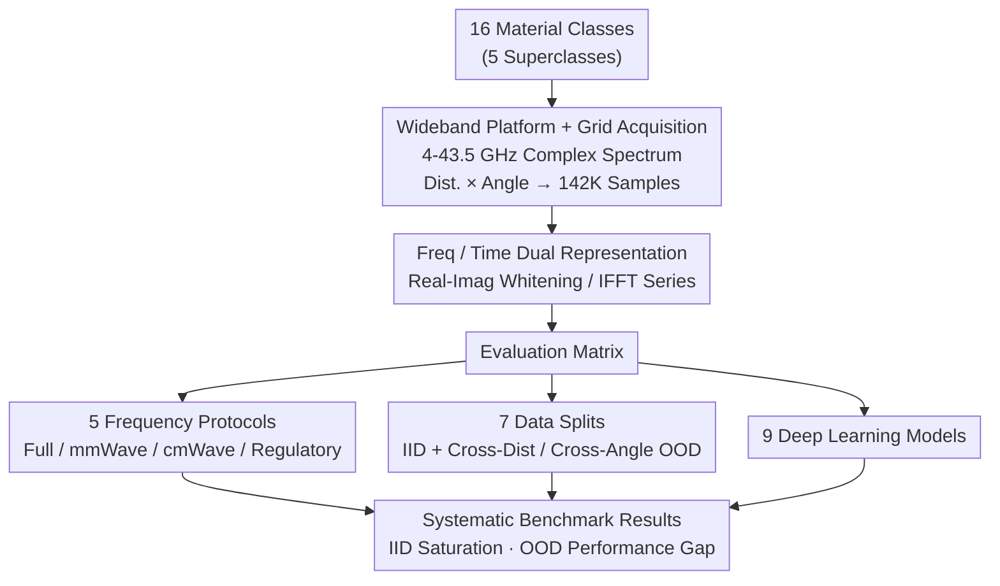

# RF-MatID: Dataset and Benchmark for Radio Frequency Material Identification

**Conference**: ICLR 2026  
**arXiv**: [2601.20377](https://arxiv.org/abs/2601.20377)  
**Code**: Yes (provided on project page)  
**Area**: AI Safety / Embodied AI / RF Sensing  
**Keywords**: RF sensing, material identification, UWB-mmWave, dataset benchmark, embodied AI

## TL;DR
Constructs the first open-source, large-scale, wideband (4-43.5 GHz), and geometrically diverse RF material identification dataset, RF-MatID, containing 16 fine-grained material categories (5 superclasses) and 142K samples. A systematic benchmark is established covering 9 deep learning models, 5 frequency protocols, and 7 data splits.

## Background & Motivation

**Background**: Material identification is a fundamental capability for embodied AI. Currently, it primarily relies on optical sensors (cameras, hyperspectral). RF (Radio Frequency) methods reveal intrinsic material properties (permittivity, conductivity, etc.) through physical interaction between electromagnetic waves and materials, remaining unaffected by lighting conditions or visual similarity.

**Limitations of Prior Work**: (1) Existing RF material datasets are generally not public, hindering fair comparisons; (2) COTS sensors have narrow and fragmented frequency bands (e.g., only 77-81 GHz), preventing cross-band systematic evaluations; (3) There is a lack of systematic assessment regarding geometric perturbations (changes in angle and distance), leaving the robustness of practical deployment in question.

**Key Challenge**: While RF methods offer theoretical advantages (strong penetration, immunity to lighting), the absence of research infrastructure (datasets + benchmarks) severely constrains the development and evaluation of learning-based methods.

**Goal**: To construct the first open-source, wideband, and geometrically diverse RF material identification dataset and establish a complete benchmarking framework.

**Key Insight**: Utilizing a self-built UWB-mmWave sensing platform (continuous 4-43.5 GHz coverage) to systematically collect RF responses of 16 materials at various distances (200-2000mm) and angles (0-10°).

**Core Idea**: Promote the standardization of learning-based RF material identification research through the first open-source wideband RF dataset and a systematic benchmark.

## Method

### Overall Architecture
RF-MatID does not propose a new model but rather builds the infrastructure to allow "learning-based RF material identification" to be evaluated fairly. The pipeline consists of three steps: first, using a custom UWB-mmWave platform to grid-scan frequency-domain electromagnetic responses of 16 materials across distances and angles; second, organizing each sampled complex spectrum into paired frequency-domain and time-domain representations for network input; finally, performing cross-evaluations across "Frequency Protocol × Data Split × Model" to form a systematic evaluation matrix. The design emphasizes "open-source" accessibility and "reproducible horizontal comparison."

### Key Designs

**1. Wideband Sensing Platform and Grid Acquisition: Full 4-43.5 GHz Scanning**

This directly addresses the limitation of narrow and fragmented bands in COTS sensors. The platform uses DRH40 dual-ridged horn antennas connected to an MS46131A Vector Network Analyzer (VNA) to measure complex responses $H(f_i) = I(f_i) + jQ(f_i)$ across 2048 frequency bins. Acquisition is conducted systematically on a grid of distances 200-2000mm (50mm steps) × angles 0-10° (1° steps), resulting in 142K samples. The 39.5 GHz bandwidth captures both penetrating information from the centimeter-wave (3-30 GHz) range and surface-sensitive information from the millimeter-wave Q-band (30-50 GHz). Materials cover 5 superclasses and 16 fine-grained categories: Brick, Glass, Synthetic, Wood, and Stone.

**2. Frequency/Time Domain Dual Representation: Capturing Attenuation and Delay**

To feed complex spectra into networks, two paired representations are generated: the frequency domain splits complex numbers into real and imaginary channels with complex whitening; the time domain applies an IFFT to the spectrum to obtain a normalized 10240-length sequence. The frequency domain emphasizes frequency-selective attenuation (absorption/reflection), while the time domain emphasizes propagation delay. Experiments indicate that dual-channel real representations consistently outperform direct complex-valued network processing.

**3. Five Frequency Protocols: Incorporating Regulatory Constraints**

Since spectrum use is regulated in real-world deployments, five protocols are defined: P1 (Full 4-43.5 GHz), P2 (mmWave 30-43.5 GHz only), P3 (cmWave 4-30 GHz only), P4 (US legal commercial bands), and P5 (China legal bands). This marks the first inclusion of regulatory constraints in a material identification benchmark.

**4. Seven Data Splits: Testing Geometric Robustness**

Splits are divided into two types: S1 is a standard random split (IID) to measure the basic upper bound. S2 and S3 are Out-of-Distribution (OOD) splits for distance (mod 1-3) and angle, respectively. These test the distribution shifts caused by sensor distance or angle drift during actual deployment.

## Key Experimental Results

### Main Results (Protocol 1, Full Band 4-43.5 GHz)

| Model | S1 (IID) | S2-mod1 (Cross-Dist) | S3-mod1 (Cross-Angle) | Description |
|------|----------|----------------------|-----------------------|-------------|
| Baseline (Ours) | 99.57 | 86.62 | 98.89 | Simple CNN |
| LSTM-ResNet | 99.84 | 97.12 | 99.69 | Best IID |
| ConvNeXt | 99.51 | 79.10 | 98.85 | CV Model |
| AirTac | 96.81 | 91.36 | 98.12 | RF-Specific |
| Material-ID | 99.28 | 95.67 | 97.63 | RF-Specific |

### OOD Robustness (S2 OOD, Protocol 1)

| Model | S2-mod1 | S2-mod2 | S2-mod3 | Description |
|------|---------|---------|---------|-------------|
| LSTM-ResNet | 97.12 | 49.95 | 71.00 | Massive drop in mod2 |
| AirTac | 91.36 | 86.95 | 65.41 | Most robust cross-dist |
| ConvNeXt | 79.10 | 64.19 | 63.52 | CV Model poor OOD |

### Key Findings
- **IID scenarios are nearly saturated**: Most models achieve >99% on S1, suggesting RF material identification is straightforward given sufficient data.
- **Cross-distance domain shift is the primary challenge**: Accuracy drops sharply to 50-87% in S2-mod2, indicating that signal attenuation from distance changes significantly impacts models.
- **AirTac exhibits stable cross-domain performance**: While not the highest in IID, it shows the smallest OOD decline, suggesting RF-specific architecture designs benefit robustness.
- **Freq vs. Time Domain**: Dual-channel frequency representation outperforms time-domain and pure complex-valued processing.
- **Regulatory bands are viable**: Performance under P4/P5 remains usable despite being lower than the full band, validating feasibility for real deployment.

## Highlights & Insights
- **First Open-Source RF Material Dataset**: Much like ImageNet propelled vision research, RF-MatID aims to standardize RF sensing research. The open-source policy is a major contribution.
- **Regulatory-Aware Design**: Incorporating legal compliance into the benchmark design directly aids the transition from research to deployment.
- **Systematic Geometric Perturbations**: The grid-based acquisition for distance and angle provides a methodology applicable to other sensing modalities (e.g., LiDAR, ultrasonic).

## Limitations & Future Work
- **Limited Material Variety**: 16 categories are relatively few compared to real environments containing liquids, fabrics, metals, etc.
- **Single Sensing Platform**: Data from a single hardware set limits knowledge of cross-device generalization.
- **Controlled Indoor Environment**: Multi-path interference and occlusion in real-world settings are not yet considered.
- **Narrow Angle Range**: Only 0-10°; robotic operations may involve 0-90° variations.
- **Lack of Multi-modal Benchmarks**: No corresponding visual or tactile data is provided for multi-modal fusion research.

## Related Work & Insights
- **vs. VNA-based datasets (he2022accurate, shanbhag2023contactless)**: Offers wider bandwidth (39.5 GHz vs. 4 GHz) and is open-source.
- **vs. Wi-Fi/RFID datasets**: Higher signal quality via coherent transceivers but requires specialized hardware.
- Provides a foundational resource for material perception in embodied AI as an RF branch baseline.

## Rating
- Novelty: ⭐⭐⭐⭐ First open-source wideband RF material dataset, filling a critical gap.
- Experimental Thoroughness: ⭐⭐⭐⭐ 9 models × 5 protocols × 7 splits; comprehensive coverage.
- Writing Quality: ⭐⭐⭐⭐ Well-structured with detailed background.
- Value: ⭐⭐⭐⭐ Dataset contribution provides lasting utility for the field.

<!-- RELATED:START -->

## Related Papers

- [\[ICLR 2026\] Memory, Benchmark & Robots: A Benchmark for Solving Complex Tasks with Reinforcement Learning](memory_benchmark_robots_a_benchmark_for_solving_complex_tasks_with_reinforcement.md)
- [\[AAAI 2026\] TouchFormer: A Robust Transformer-based Framework for Multimodal Material Perception](../../AAAI2026/robotics/touchformer_a_robust_transformer-based_framework_for_multimodal_material_percept.md)
- [\[ICLR 2026\] TaCo: A Benchmark for Lossless and Lossy Codecs of Heterogeneous Tactile Data](taco_a_benchmark_for_lossless_and_lossy_codecs_of_heterogeneous_tactile_data.md)
- [\[ICLR 2026\] CoNavBench: Collaborative Long-Horizon Vision-Language Navigation Benchmark](conavbench_collaborative_long-horizon_vision-language_navigation_benchmark.md)
- [\[ICLR 2026\] MolLangBench: A Comprehensive Benchmark for Language-Prompted Molecular Structure Recognition, Editing, and Generation](mollangbench_a_comprehensive_benchmark_for_language-prompted_molecular_structure.md)

<!-- RELATED:END -->
