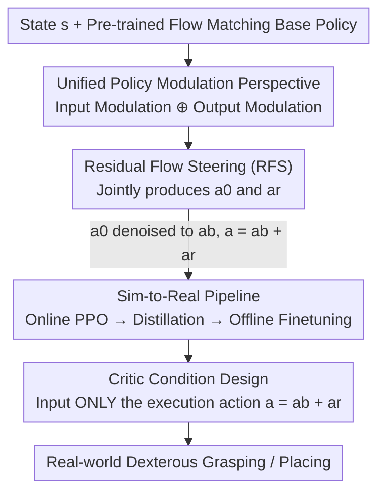

# RFS: Reinforcement Learning with Residual Flow Steering for Dexterous Manipulation

**Conference**: ICLR 2026  
**OpenReview**: [https://openreview.net/forum?id=Kt9tJeOwjy](https://openreview.net/forum?id=Kt9tJeOwjy)  
**Paper**: [Project Website](https://weirdlabuw.github.io/rfs/)  
**Code**: See project homepage  
**Area**: Robotics / Dexterous Manipulation / Reinforcement Learning  
**Keywords**: Residual Reinforcement Learning, Flow Matching Policy, Noise Steering, Dexterous Grasping, Sim-to-Real

## TL;DR
RFS unifies "residual reinforcement learning" and "diffusion/flow steering" into a single policy modulation framework. For a pre-trained flow matching policy, it simultaneously learns a latent space noise distribution (for global exploration) and a residual action correction (for local refinement). Without modifying the base policy parameters, it enables efficient fine-tuning, increasing the average success rate from 0.25 (base policy) to 0.87 in simulation and real-world dexterous manipulation.

## Background & Motivation

**Background**: Dexterous manipulation (high-degree-of-freedom tasks such as multi-finger grasping, placing, pouring, and stacking) currently relies on imitation learning (behavior cloning) to bootstrap policies from human demonstrations. Increasingly, expressive generative models like diffusion models and flow matching are used to capture the multi-modal distribution of human actions, achieving strong initial performance in high-dimensional action spaces.

**Limitations of Prior Work**: Pure imitation learning policies have limited generalization capabilities and almost always require a round of fine-tuning during deployment to reach a usable level. However, fine-tuning faces a dilemma: Supervised Fine-Tuning (SFT) depends on high-quality expert data, which is expensive; meanwhile, traditional RL methods (like DDPG or reparameterization-based approaches) rely on closed-form likelihoods and differentiable sampling of the action distribution, making them fundamentally incompatible with generative architectures like diffusion or flow matching that use iterative denoising.

**Key Challenge**: Fine-tuning must preserve the global exploration capability provided by pre-training (without forgetting learned multi-modal behaviors) while simultaneously correcting local execution errors (fine-grained adjustments in off-distribution states). Current modulation approaches address only one side: residual RL adds corrections to the base policy output, excelling at local refinement but failing to induce global behavioral changes; diffusion steering (e.g., DSRL) modifies latent space noise, enabling global modulation but remaining constrained to the demonstration manifold, thus struggling to explore or refine once off-distribution.

**Goal**: Design a data-efficient RL fine-tuning framework that achieves both global exploration and local refinement capabilities, while being natively compatible with generative policies like flow matching without altering base policy parameters.

**Key Insight**: The authors view both residual RL and diffusion steering as special cases of a broader category of "policy modulation"—the former modulates **output**, while the latter modulates **input**. Since the two are complementary, input and output modulation should be integrated into a single policy for joint optimization.

**Core Idea**: A modulation policy $\pi_{\text{RFS}}(a_0, a_r \mid s)$ is used to simultaneously output latent noise $a_0$ (for global mode switching) and residual action $a_r$ (for local refinement). The final action $a = a_b + a_r$ (where $a_b$ is the action denoised by the base policy using $a_0$) can both break away from the demonstration manifold and adapt to real-world dynamics.

## Method

### Overall Architecture

RFS addresses the following: Given a pre-trained flow matching base policy $v_\theta(a_t, t, s)$, how can its performance be improved using RL without changing its parameters. The overall mechanism is "dual-channel modulation"—inserting a learnable latent noise distribution at the **input** of the base policy and overlaying a learnable residual correction at the **output**. Both are jointly generated by the same modulation policy and optimized using a single RL objective.

Specifically for dexterous manipulation, the authors implement a sim-to-real pipeline: first, a flow matching base policy is trained in simulation using approximately 400 VR-teleoperated demonstrations per task; then, an online PPO-trained RFS modulation policy is used to increase success rates; subsequently, the RFS policy (which utilizes privileged state information) is distilled into a point-cloud-conditioned visuo-motor policy for real-world transfer; finally, during zero-shot real-world deployment, human corrections are collected and used for offline RFS (TD3+BC) fine-tuning.

### Key Designs

**1. Unified Policy Modulation Perspective: Residual RL and Noise Steering as Two Sides of the Same Coin**

This conceptual foundation addresses the pain point that "local refinement" and "global exploration" are monopolized by different methods. The authors align the two using isomorphic RL objectives: Residual RL is output modulation—the base policy samples $a_b = \mathrm{Des}(s, a_0, v_\theta)$ (with fixed $a_0 \sim \mathcal{N}(0, I)$), a residual policy $\pi_r$ provides $a_r$, and $a = a_b + a_r$ is executed. DSRL is input modulation—action generation follows flow matching denoising $a = \mathrm{Des}(s, a_0, v_\theta)$, but the initial noise $a_0$ is changed from fixed Gaussian to a learnable policy $\pi_{\text{DS}}(a_0 \mid s)$ to steer the semantic direction of the denoising trajectory. Both modulate a generative base policy without moving $\theta$. The authors abstract a general form: policy modulation involves learning an input transformation $g$ or an output transformation $f$ for $v_\theta(a_t, t, s)$. This perspective reveals that latent noise handles switching grasping modes (global) while residuals handle fitting real contact dynamics (local), making them complementary.

**2. RFS: Joint Optimization of Latent Noise and Residuals**

With the unified perspective, RFS instantiates both $f$ and $g$ within a modulation policy $\pi_{\text{RFS}}(a_0, a_r \mid s)$. Given state $s$, it simultaneously produces two components: the latent flow variable $a_0$, used to shape the overall behavior of the generative model (e.g., changing grasp pose or motion mode), and the residual action $a_r$, used to compensate for off-manifold requirements or base policy imperfections. The final action is:

$$a_b \sim \mathrm{Des}(s, a_0, v_\theta), \qquad a = a_b + a_r$$

The objective $\max_{\pi_{\text{RFS}}} \mathbb{E}\big[\sum_t \gamma^t r(s_t, a_t)\big]$ is compatible with standard RL algorithms because, for the RL agent, it simply optimizes in the $(a_0, a_r)$ action space, avoiding the complexities of backpropagating through denoising trajectories or computing generative model likelihoods. Compared to output-only residual RL, it adds the ability to switch global modes; compared to input-only DSRL, it adds fine-grained correction capabilities for off-distribution states.

**3. Sim-to-Real Pipeline: Online PPO → Distillation → Offline Correction Finetuning**

The authors designed a three-stage pipeline to make RFS practical. Stage one (simulation): A small set of VR demonstrations trains a flow matching base policy (providing a strong motion prior), followed by online PPO to train the RFS policy for success and stability. Stage two (distillation): The trained RFS policy (with privileged low-level states like object pose) generates more simulation demonstrations, which are distilled into a point-cloud-conditioned visuo-motor policy $v_\phi(a_t, o_{pc}, s_{pro}, t)$ using a student-teacher framework. Stage three (real-world): Since zero-shot deployment may fail on new objects or initial conditions, 50 human corrections (via SpaceMouse) are collected. Human actions are defined as residuals $a_r = a_{\text{human}} - a_b$, forming an RFS-ready dataset $D_{\text{RFS}} = \{((o,s), (a_0, a_r), (o',s'), r)\}$. Offline RL (TD3+BC) is then used for actor-critic updates with BC regularization on the residuals.

**4. Critic Condition Design: Input Only Executive Action $a=a_b+a_r$**

A subtle but critical choice in offline RFS is what the critic should observe. Intuition suggests feeding the decoupled components $(a_0, a_r)$ to the critic, but this fails. The authors compared three critic inputs: $Q(a_r, o)$ (residual only), $Q([a_r, a_b], o)$ (residual plus base action), and $Q(a_b + a_r, o)$ (final execution action). The first two failed to produce consistent grasp poses or precise placements in real-world tests. Only conditioning the critic on the **composed execution action** $a = a_b + a_r$ yielded stable and effective offline RL adaptation. The reasoning is that residuals and base actions are coupled; the environment only responds to the composed action. Decoupling them in the critic's input leads to a value surface inconsistent with actual execution, causing training divergence.

### Loss & Training

In the simulation phase, the base policy is trained with a flow matching objective: sample $(s, a) \sim D$, $t \sim U[0,1]$, $a_0 \sim p_0$, interpolate $a_t = (1-t)a_0 + ta$, and regress the velocity field $\|v_\theta(a_t, t, s) - (a - a_0)\|^2$. The RFS modulation policy is optimized via online PPO. In the real-world phase, TD3+BC is used: the critic performs standard TD updates $\min_\phi \mathbb{E}\,\|Q_\phi(o,s,a) - r - \gamma \bar{Q}_{\bar\phi}(o',s',a')\|^2$ (where $a = a_b + a_r$), while the actor maximizes the critic with BC regularization on the residual $\max_{\pi_{\text{RFS}}} \mathbb{E}\big[Q(o,s,\hat a) - \lambda_{\text{BC}} \|\hat a_r - a_r\|^2\big]$.

## Key Experimental Results

### Main Results (Simulation Success Rate)

| Method | Grasp | Place | Kit | Push-Grasp | Stack | Pour | Average |
|------|------|------|------|------|------|------|------|
| Base Policy (Flow Matching) | 0.495 | 0.367 | 0.30 | 0.131 | 0.06 | 0.15 | 0.250 |
| DPPO | 0.41 | 0.433 | 0.186 | 0.04 | 0.00 | 0.00 | 0.178 |
| ReinFlow | 0.584 | 0.462 | 0.100 | 0.398 | 0.59 | 0.32 | 0.409 |
| IQL | 0.690 | 0.560 | 0.203 | 0.267 | 0.625 | 0.583 | 0.488 |
| ResiP (Residual SOTA) | 0.65 | 0.57 | 0.302 | 0.165 | 0.67 | 0.24 | 0.433 |
| DSRL (Noise Steering) | 0.732 | 0.692 | 0.639 | 0.430 | 0.135 | 0.268 | 0.483 |
| **Ours (RFS)** | **0.899** | **0.939** | **0.781** | **0.721** | **0.951** | **0.873** | **0.861** |

RFS achieved the highest success rates across all six tasks, with an average of 0.861—nearly double the strongest baseline, DSRL (0.483). Notably, DSRL performance crashed (0.13/0.27) on high-precision tasks like stacking/pouring, highlighting the limitations of "input modulation constrained to the demonstration manifold."

### Real-world Offline Finetuning (Seen Objects Success Rate %)

| Method | Place | Grasp |
|------|------|------|
| Zero-shot | 50.0 | 43.3 |
| Co-training | 60.0 | 83.3 |
| BC Finetuning | 40.0 | 73.3 |
| Residual RL (only) | 50.0 | 80.0 |
| DSRL (noise only) | 80.0 | 70.0 |
| **Ours (RFS)** | **90.0** | 80.0 |

### Key Findings

- **Dual Components are Indispensable**: On unseen objects, using only residuals or only DSRL performed worse than the complete $\pi(a_0, a_r \mid o)$. Latent noise provides global exploration while residuals provide local refinement; their combination is significantly superior to either alone.
- **Critic Condition is Crucial**: $Q(a_r, o)$ and $Q([a_r, a_b], o)$ resulted in zero success for real-world grasping/placing. Only $Q(a_b + a_r, o)$ was stable.
- **Sim Pre-training > Pure Real-world Data**: Finetuning an RFS policy trained only on real-world demonstrations yielded limited gains (35%→50% on unseen objects), whereas simulation pre-training covered a broader range of poses and perturbations.
- **Restricting RL Updates is More Stable**: Compared to performing RL over the entire denoising trajectory (e.g., DPPO), RFS restricts updates to the initial noise and residual terms, resulting in success rates at least 0.35 higher and more stable training.

## Highlights & Insights
- The **unified perspective of "Input ⊕ Output Modulation"** is elegant: it is not just a combination of two tricks, but a framework demonstrating that residual RL and diffusion steering are complementary special cases of a single formula.
- Using **human correction actions directly as residuals** ($a_r = a_{\text{human}} - a_b$) is a clever data engineering approach, allowing fine-tuning with just 50 trajectories without re-training the base policy.
- The **critic condition insight** is highly transferable: for any "base action + learned residual" offline RL setup, the critic should be fed the composed execution action to avoid value surface misalignment.
- The approach of **circumventing generative policy likelihoods/backpropagation** by shrinking the learnable parameters to two low-dimensional control points (noise and residual) offers a robust paradigm for RL fine-tuning of diffusion policies.

## Limitations & Future Work
- **Observation Limitations**: Current implementation relies on point cloud observations and lacks semantic context, potentially degrading in cluttered or high-level reasoning scenarios.
- **Offline-only Real-world Finetuning**: The framework currently only supports offline fine-tuning on the real robot, meaning the policy cannot respond online to dynamically changing conditions.
- **Task Scope**: While simulation tasks include stacking and pouring, real-world evaluation was primarily focused on pick-and-place; more complex bimanual coordination or tool use remains unverified.

## Related Work & Insights
- **vs DSRL (Diffusion Steering / Input Modulation)**: DSRL only learns initial noise for global modulation but is constrained to the demonstration manifold. RFS adds residual output correction to provide local refinement.
- **vs ResiP / Policy Decorator (Residual RL / Output Modulation)**: These add residuals to base actions, providing local correction but failing to induce global behavioral changes, leading to significant drops in long-horizon tasks.
- **vs DPPO / ReinFlow (RL on Denoising Trajectory)**: These perform RL on high-dimensional iterative trajectories, which is unstable. RFS simplifies this by only learning two control points.
- **vs IQL / AWAC / RLPD (Offline-to-Online RL)**: These operate directly in action space and suffer from distribution shift; RFS leverages base policy pre-training for consistently higher success rates.

## Rating
- Novelty: ⭐⭐⭐⭐⭐ Unifying residual RL and diffusion steering into input/output modulation is both clean and powerful.
- Experimental Thoroughness: ⭐⭐⭐⭐ Extensive simulation comparisons and real-world testing on seen/unseen objects are solid, though real-world task variety is slightly narrow.
- Writing Quality: ⭐⭐⭐⭐⭐ Clear logical progression from unified theory to sim-to-real implementation.
- Value: ⭐⭐⭐⭐⭐ Provides a data-efficient and stable paradigm for RL fine-tuning of generative policies.

<!-- RELATED:START -->

## Related Papers

- [\[ICLR 2026\] DemoGrasp: Universal Dexterous Grasping from a Single Demonstration](demograsp_universal_dexterous_grasping_from_a_single_demonstration.md)
- [\[ICLR 2026\] DexMove: Learning Tactile-Guided Non-Prehensile Manipulation with Dexterous Hands](dexmove_learning_tactile-guided_non-prehensile_manipulation_with_dexterous_hands.md)
- [\[CVPR 2025\] ManipTrans: Efficient Dexterous Bimanual Manipulation Transfer via Residual Learning](../../CVPR2025/robotics/maniptrans_efficient_dexterous_bimanual_manipulation_transfer_via_residual_learn.md)
- [\[ICLR 2026\] D-REX: Differentiable Real-to-Sim-to-Real Engine for Learning Dexterous Grasping](d-rex_differentiable_real-to-sim-to-real_engine_for_learning_dexterous_grasping.md)
- [\[ICLR 2026\] Emergent Dexterity via Diverse Resets and Large-Scale Reinforcement Learning](emergent_dexterity_via_diverse_resets_and_large-scale_reinforcement_learning.md)

<!-- RELATED:END -->
