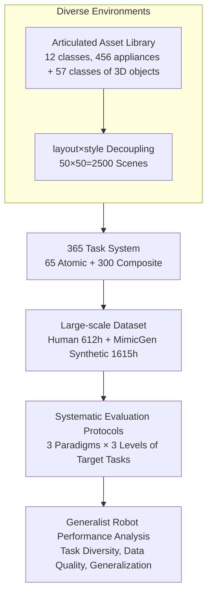

# RoboCasa365: A Large-Scale Simulation Framework for Training and Benchmarking Generalist Robots

**Conference**: ICLR 2026  
**arXiv**: [2603.04356](https://arxiv.org/abs/2603.04356)  
**Code**: [https://robocasa.ai](https://robocasa.ai) (Project page, including open-source code and models)  
**Area**: Robotics / Simulation Benchmarks / Generalist Robots  
**Keywords**: Simulation platform, Household mobile manipulation, Multi-task learning, Foundation model training, Lifelong learning

## TL;DR

RoboCasa365 constructs a large-scale simulation benchmark consisting of 365 daily kitchen tasks, 2,500 diverse kitchen scenes, and over 2,000 hours of robot interaction data. It systematically evaluates the performance of generalist robot policies under three paradigms—multi-task learning, foundation model training, and lifelong learning—finding that the task diversity in pre-training data is a key factor in improving downstream generalization.

## Background & Motivation

**Background**: Recent rapid developments in robot learning have led to large-scale robot foundation models like π₀, π₀.₅, and GR00T N1.5, which demonstrate generalization capabilities across new objects, environments, and tasks.

**Limitations of Prior Work**: Training generalist robots requires massive amounts of data, but existing real-world datasets remain limited in diversity and task coverage. Real-world evaluation is costly, noisy, and difficult for reproducible systematic comparisons.

**Key Challenge**: Existing simulation frameworks (e.g., RLBench, LIBERO, robosuite) suffer from a small number of tasks, low environmental diversity, and a lack of large-scale supporting datasets, making it impossible to support systematic research on generalist robot policies. Most focus on simple tabletop manipulation or single-room scenes, failing to answer the core question of "how task diversity, environmental variation, and data scale affect generalization."

**Goal**: (a) Construct a sufficiently large-scale and diverse simulation benchmark; (b) Provide systematic evaluation protocols covering multi-task learning, foundation model pre-training + fine-tuning, and lifelong learning; (c) Analyze key factors influencing generalist robot performance through extensive experiments.

**Key Insight**: Substantially expand upon the existing RoboCasa platform—from 100 scenes to 2,500, from dozens of tasks to 365, and from 100K demonstrations to over 500K—to create an ImageNet-level benchmark for the "household kitchen" domain.

**Core Idea**: Construct the first robot simulation framework that simultaneously satisfies four conditions—"large-scale tasks, large-scale scenes, large-scale data, and systematic benchmarking"—through extreme scaling across the task-scene-data dimensions.

## Method

### Overall Architecture

RoboCasa365 is essentially a "data generation + evaluation" pipeline: it first converts interactive items in the kitchen into articulated 3D assets, then assembles these assets into a large number of diverse kitchen scenes. Tasks for the robot are defined within these scenes, and finally, large-scale demonstration data is collected for these tasks. These materials are integrated into three systematic evaluation protocols. Therefore, it progresses through four core components—**Diverse Environments (Assets + Scenes) → 365 Task System → Large-scale Dataset → Systematic Evaluation Protocols**—with each layer scaling up by an order of magnitude, enabling the systematic study of how task diversity, environmental changes, and data scale impact generalization for the first time.

The simulation base uses the robosuite + MuJoCo physics engine from RoboCasa, running at 20Hz. The robot is a Franka Panda arm with an Omron mobile base, with a 12-dimensional action space (7-DOF end-effector + 5-DOF mobile base). Compared to the previous RoboCasa, this work scales assets, scenes, tasks, and data by approximately one order of magnitude (scenes 100 → 2,500, tasks ~dozens → 365, demonstrations 100K → 500K+).

### Key Designs

**1. Diverse Environments: Articulating assets and creating 2,500 kitchens via layout×style multiplication**

To research whether a policy can generalize to unseen environments, a massive and non-identical set of environments is required. Manually building 2,500 kitchens is unrealistic. This work solves this in two steps. First, it expands interactive appliances from 4 classes and 20 instances in RoboCasa to 12 classes and 456 instances, adding common appliances like toasters, blenders, and kettles. 57 new classes of 3D objects are added, with 20–50 instances per class to ensure visual diversity. Crucially, all appliances are made into articulated MJCF models supporting realistic interactions like opening doors and pressing buttons—whereas refrigerators and ovens were not articulated in the previous work. Second, scenes are split into two orthogonal dimensions: 50 spatial layouts (derived from real US kitchens on Zillow) and 50 independent visual styles (materials/appliances/textures). Multiplying them yields $50 \times 50 = 2500$ pre-training scenes. This ensures that建模 costs grow linearly while scene count explodes multiplicatively. These 2,500 scenes are strictly non-overlapping in style with the 10 target scenes used for evaluation, ensuring the evaluation measures generalization to new environments rather than memory of seen ones.

**2. 365 Task System: Atomic tasks for single-step operations, Composite tasks for long-horizon planning**

A single-difficulty task set is insufficient to test generalist policies. RoboCasa365 uses a dichotomy of atomic tasks (single skill) and composite tasks (sequences of multiple skills), defining 65 atomic tasks (25 from prior work + 40 new) and 300 composite tasks (83 from prior work + 217 new), totaling 365 tasks across 60 daily activities (grouped into 6 activity families). Composite tasks use a semi-automated pipeline: "LLM generates task blueprints (activity → task name + description + involved objects + skill sequence) + manual coding implementation." Task lengths range from 1 to over 15 sub-tasks. Atomic tasks test single-step precision, while composite tasks test long-term reasoning and planning. Furthermore, 220 tasks require mobile manipulation, while 145 do not, decoupling the requirement for base movement.

**3. Large-Scale Dataset: Human teleoperation as the base, MimicGen synthesis for scaling, exceeding 2,000 hours**

Training generalist policies requires massive demonstrations. This work uses a dual approach to reach 2,000+ hours. Pre-training data = 100 human demonstrations for each of 300 tasks (30K trajectories, 404 hours) + 10K MimicGen synthetic trajectories for each of 60 atomic tasks (600K trajectories, 1615 hours). Target data = 500 human demonstrations for 50 representative tasks (25K trajectories, 208 hours). While MimicGen scales atomic data by $\sim 100\times$, subsequent experiments find that these synthetic data are of varying quality and can sometimes degrade downstream performance. This "negative" conclusion about synthetic data is a key output meant for community research.

**4. Systematic Evaluation Protocols: Three learning paradigms × three levels of target tasks**

A single total success rate cannot distinguish whether a model lacks basic manipulation ability or generalization ability. This work splits evaluation along two axes. One axis represents three learning paradigms: multi-task learning (training all tasks at once), foundation model training (pre-training + fine-tuning on target tasks), and lifelong learning (tasks arriving in sequential stages). The other axis splits 50 target tasks into three levels: Atomic (18 tasks, single-step operation), Composite-Seen (16 tasks, seen during pre-training, testing transfer), and Composite-Unseen (16 tasks, unseen during pre-training, testing zero-shot generalization). This decoupling allows for clearer conclusions, such as "pre-training gains are greater for unseen tasks" and "task diversity primarily improves generalization."

### Evaluation Strategy and Setup

The benchmark itself does not propose a new algorithm but compares four SOTA language-conditioned visual policies: **Diffusion Policy**, the vision-language-action (VLA) flow-matching model **π₀**, its open-world enhanced version **π₀.₅**, and NVIDIA's open-source humanoid foundation model **GR00T N1.5**. VLA models are fine-tuned from public pre-trained checkpoints. Under the foundation model protocol, models are first pre-trained on all data and then fine-tuned on the three levels of target tasks, comparing the effects of different target data amounts (10%/30%/100%) to quantify the data efficiency gains from pre-training.

## Key Experimental Results

### Main Results

| Task Group | Diffusion Policy | π₀ | π₀.₅ | GR00T N1.5 |
|----------|------------------|----|------|------------|
| Atomic | 15.7% | 36.3% | 39.6% | 43.0% |
| Composite-Seen | 0.2% | 5.2% | 7.1% | 9.6% |
| Composite-Unseen | 1.25% | 0.7% | 1.2% | 4.4% |
| **Average** | **6.1%** | **15.0%** | **16.9%** | **20.0%** |

GR00T N1.5 performs best across all groups, while Diffusion Policy performs worst, indicating that high-capacity VLA models have better fitting capabilities for large-scale multi-task data. All methods perform poorly on Composite-Unseen, showing that generalizability remains an open challenge.

### Foundation Model Training Results

| Task Type | Pre-train Only | Target 10% Only | Target 30% Only | Target 100% Only | Pre-train + Target 10% | Pre-train + Target 30% | Pre-train + Target 100% |
|----------|----------|-----------|-----------|------------|----------------|----------------|-----------------|
| Atomic | 41.9% | 38.7% | 50.6% | 60.6% | 56.9% | 59.1% | 68.5% |
| Composite-Seen | 0.0% | 11.0% | 22.7% | 35.0% | 25.4% | 34.6% | 40.6% |
| Composite-Unseen | 0.2% | 11.2% | 27.5% | 33.3% | 22.7% | 30.8% | 42.1% |
| **Average** | **15.1%** | **21.0%** | **34.3%** | **43.7%** | **35.9%** | **42.2%** | **51.1%** |

Pre-training yields approximately **3× data efficiency gains**: the performance of Pre-train + 10% target data (35.9%) is close to using 30% target data only (34.3%). On Composite-Unseen, Pre-train + 100% target data reaches 42.1%, significantly exceeding the 33.3% of target-only training, demonstrating that pre-training gains are particularly significant for unseen task generalization.

### Ablation Study

| Pre-training Data | Avg (10% target) | Avg (100% target) |
|-----------|-------------------|---------------------|
| No Pre-training | 21.0% | 43.7% |
| Human50 (50 tasks) | 34.7% | 50.0% |
| Human300 (300 tasks) | 40.0% | 52.5% |
| Human300 + MG60 (Synthetic) | 35.9% | 51.1% |

Key Findings: (1) Using only human data (Human300) **outperforms** the inclusion of MimicGen synthetic data (Human300+MG60) due to inconsistent synthetic quality; (2) Expanding task diversity from 50 to 300 tasks brings significant improvements, especially in low-data regimes (10%); (3) The improvement for Composite-Unseen tasks is most pronounced (+8.5% at 10%), proving task diversity is crucial for generalizing to new tasks.

### Lifelong Learning Results

| Training Phase | Atomic | Phases 2-3 Tasks | Phases 4-5 Tasks | Phases 6+ Tasks |
|----------|--------|------------|------------|-----------|
| Phase 1 | 41.5% | - | - | - |
| Phase 2 | 13.9% | 24.5% | - | - |
| Phase 3 | 13.9% | 4.8% | 11.3% | - |
| Phase 4 | 10.6% | 1.7% | 2.7% | 4.3% |

Lifelong learning faces severe catastrophic forgetting: success rates for Atomic tasks drop from 41.5% in Phase 1 to 10.6% in Phase 4. Long-horizon tasks themselves are harder to learn (diagonal success rates decrease: 41.5% → 24.5% → 11.3% → 4.3%).

### Real-World Transfer

| Method | Close Kettle Lid | Retreive from Oven | Counter to Cabinet | Place in Bowl Rack | Average |
|------|-----------|-----------|----------|--------|------|
| Real Only | 70% | 70% | 52% | 55% | 61.8% |
| Sim + Real | 70% | 100% | 84% | 65% | 79.8% |

Joint training with simulation data increased the average success rate from 61.8% to 79.8% (+18.1%), validating the practical value of the simulation benchmark for the real world.

## Highlights & Insights

- **Evidence that Data Quality > Data Quantity**: MimicGen synthetic data expanded the atomic task volume by 100×, but its inclusion degraded downstream performance. This serves as a warning for robot foundation model data strategies—blindly scaling synthetic data can be counterproductive; curation and quality control are essential.
- **Non-linear Returns on Task Diversity**: Expanding pre-training from 50 to 300 tasks yielded nearly a 2× improvement in low-data regimes, with gains for unseen tasks exceeding those for seen tasks. This reveals the core insight that "task diversity is the fuel for generalization."
- **Layout × Style Decoupled Scene Generation**: By decoupling spatial layouts and visual styles, 2,500 scenes are generated from $50\times50$ combinations, achieving exponential environmental diversity with linear modeling costs. This approach is transferable to other domains requiring large-scale environmental variation.
- **LLM-Assisted Task System Design**: The pipeline using LLM to generate activity lists → task blueprints → manual coding balances task diversity with quality control, proving more practical than purely manual or purely automated designs.

## Limitations & Future Work

- **Limited to Kitchen Scenes**: All 2,500 scenes are kitchens; it is uncertain whether conclusions transfer to bedrooms, living rooms, or offices.
- **Sim-to-Real Gap**: While joint training was effective, real-world comparison was limited to 4 simple tasks using specific camera view alignment, limiting generalizability.
- **MimicGen Data Quality**: The paper found that synthetic data degraded performance but did not deeply analyze why, or attempt data filtering/weighting strategies.
- **Simplistic Lifelong Learning Setup**: The four-stage sequential learning setup is a basic CL scenario and does not consider active replay or elastic weight consolidation.
- **Physical Fidelity**: MuJoCo has limited modeling capabilities for fluids, soft bodies, and cloth, restricting task types (e.g., cooking or pouring).
- **Single Robot Morphology**: Only the Franka Panda + mobile base was used; testing dual-arm or humanoid robots for multi-morphology generalization remains for future work.

## Related Work & Insights

- **vs RoboCasa (RSS 2024)**: RoboCasa365 is a massive expansion (100→2,500 scenes, ~dozens→365 tasks, 100K→500K+ demonstrations) and adds systematic evaluation protocols. The main contribution lies in scale and systematic experimentation.
- **vs LIBERO (NeurIPS 2023)**: LIBERO has only 130 tasks and limited environmental diversity, focusing solely on lifelong learning. RoboCasa365 has 2.8× the tasks and covers three paradigms.
- **vs BEHAVIOR-1K (CoRL 2023)**: BEHAVIOR-1K offers 1,000 activities but lacks accompanying large-scale datasets. RoboCasa365 has fewer activities (60) but hundreds of high-quality demonstrations per task.
- **vs ManiSkill Series**: ManiSkill focuses on general object manipulation and GPU-parallel simulation with richer physical interactions. RoboCasa365 focuses on room-level daily tasks, making them complementary.

## Rating

- Novelty: ⭐⭐⭐ — Core technical contribution is engineering-driven scale expansion; methodological novelty is limited.
- Experimental Thoroughness: ⭐⭐⭐⭐⭐ — Comparison of four SOTA methods, three training paradigms, data composition ablation, and real-world validation makes for a very complete experimental system.
- Writing Quality: ⭐⭐⭐⭐ — Clear structure, deep experimental discussion, and rich visuals.
- Value: ⭐⭐⭐⭐ — High infrastructure value as a standardized evaluation benchmark for generalist policies; findings on data composition provide direct guidance for data strategy.

<!-- RELATED:START -->

## Related Papers

- [\[ICLR 2026\] Manipulation as in Simulation: Enabling Accurate Geometry Perception in Robots](manipulation_as_in_simulation_enabling_accurate_geometry_perception_in_robots.md)
- [\[ICLR 2026\] Emergent Dexterity via Diverse Resets and Large-Scale Reinforcement Learning](emergent_dexterity_via_diverse_resets_and_large-scale_reinforcement_learning.md)
- [\[ICLR 2026\] Rethinking Policy Diversity in Ensemble Policy Gradient in Large-Scale Reinforcement Learning](rethinking_policy_diversity_in_ensemble_policy_gradient_in_large-scale_reinforce.md)
- [\[ICLR 2026\] Towards Bridging the Gap between Large-Scale Pretraining and Efficient Finetuning for Humanoid Control](towards_bridging_the_gap_between_large-scale_pretraining_and_efficient_finetunin.md)
- [\[ICML 2026\] RoboMME: Benchmarking and Understanding Memory for Robotic Generalist Policies](../../ICML2026/robotics/robomme_benchmarking_and_understanding_memory_for_robotic_generalist_policies.md)

<!-- RELATED:END -->
