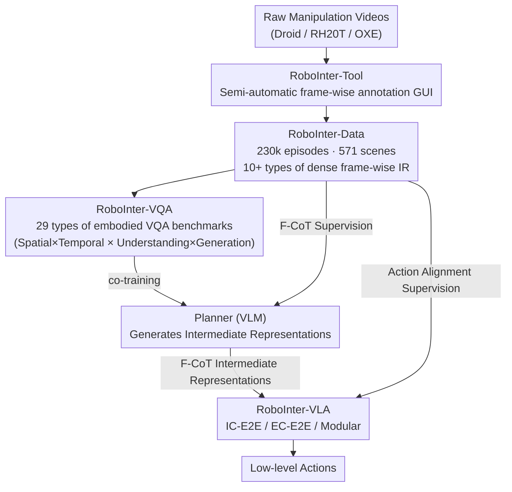

# RoboInter: A Holistic Intermediate Representation Suite Towards Robotic Manipulation

**Conference**: ICLR 2026  
**arXiv**: [2602.09973](https://arxiv.org/abs/2602.09973)  
**Code**: [GitHub](https://github.com/RoboInter)  
**Area**: Robotic Learning / Datasets  
**Keywords**: Intermediate Representation, VLA, Manipulation Dataset, Embodied VQA, plan-then-execute

## TL;DR

The RoboInter manipulation suite is proposed as a unified resource for intermediate representation data, benchmarks, and models. It includes RoboInter-Tool (a semi-automatic annotation GUI), RoboInter-Data (dense frame-by-frame annotations for 230,000 episodes across 571 scenes with 10+ types of intermediate representations), RoboInter-VQA (a benchmark featuring 29 types of embodied VQA tasks), and RoboInter-VLA (a plan-then-execute framework supporting modular and end-to-end configurations). This suite provides a comprehensive infrastructure to enhance VLA generalization through intermediate representations.

## Background & Motivation

**Background**: Vision-Language-Action (VLA) systems integrate large-scale pre-trained VLMs with robotic manipulation. However, existing manipulation datasets suffer from high costs, embodiment specificity, and insufficient coverage. The plan-then-execute paradigm—generating high-level plans before translating them into low-level actions—has been validated as an effective approach to improve generalization, but it fundamentally relies on supervisory signals from intermediate representations (subtasks, traces, grounding, etc.).

**Limitations of Prior Work**:

1.  Existing datasets rarely provide dense intermediate representation annotations, limiting the development of plan-then-execute methods.
2.  Current annotation efforts are either small-scale (ShareRobot with only 51k), offer limited annotation types (LLARVA with only traces), or rely on uncontrollable automatic annotation quality (ECoT).
3.  There is a lack of benchmarks to systematically evaluate the spatial and temporal reasoning capabilities of VLMs in embodied scenarios.
4.  A unified framework and data support for comparing modular vs. end-to-end VLA are missing.

**Key Challenge**: While the potential of the plan-then-execute paradigm has been demonstrated, there is a lack of large-scale, high-quality, and diverse intermediate representation annotation data to fully unlock this potential.

**Goal**: To build a complete intermediate representation ecosystem—covering annotation tools (RoboInter-Tool), data (RoboInter-Data), benchmarks (RoboInter-VQA), and model frameworks (RoboInter-VLA)—to address the three major bottlenecks: data, evaluation, and methodology.

## Method

### Overall Architecture

RoboInter is a comprehensive infrastructure built around "intermediate representations," aiming to fill the most critical gap in the plan-then-execute paradigm: large-scale, multi-type, and densely aligned intermediate representation supervision. The suite functions as a pipeline from data creation to utilization. The RoboInter-Tool performs semi-automatic frame-by-frame annotation on raw manipulation videos (Droid / RH20T / OXE), yielding RoboInter-Data (dense annotations for over 230,000 episodes across 571 scenes). These annotations are reorganized into RoboInter-VQA (29 categories of embodied VQA benchmarks), which serves both to assess the embodied reasoning capabilities of VLMs and to co-train an embodied Planner. Finally, RoboInter-VLA utilizes a Planner + Executor framework, feeding intermediate representations into policy learning in the form of Flexible Chain-of-Thought (F-CoT).

### Key Designs

**1. RoboInter-Tool and Multi-level Intermediate Representation Annotation**

The bottleneck of plan-then-execute lies in the lack of dense and varied supervision. RoboInter-Tool adopts a semi-automatic human-in-the-loop approach, organizing annotations into three levels:
*   **Task Level**: Videos are segmented according to 15 predefined primitive skills. Language descriptions are initialized by ChatGPT and revised by humans, with contact frames recorded.
*   **Object Level**: Interactive objects are identified, and SAM2 is used for automatic segmentation and tracking, followed by human verification, yielding $\sim 61$ million frames of object grounding.
*   **Execution Level**: Calibration matrices are estimated for videos lacking camera parameters. Gripper detection and point tracking are used to reconstruct 2D end-effector traces ($\sim 70$ million frames). Affordance boxes, contact points, 6D grasp poses, and gripper bounding boxes are derived from contact frames.
Critically, all annotations are temporally aligned with actions, robot states, and visual observations, allowing synchronized retrieval of skill labels, object boxes, affordances, and traces.

**2. RoboInter-VQA: Reorganizing Annotations into an Embodied Reasoning Benchmark**

RoboInter-VQA reorganizes annotations into 29 task categories along two axes: spatial vs. temporal (9 spatial, 20 temporal) and understanding vs. generation. The spatial axis involves multiple-choice or judgment questions on object boxes, grasp poses, and contact states, alongside prediction tasks for generating affordance boxes and keypoints. The temporal axis evaluates gripper motion direction, trace-description matching, skill segmentation, and multi-step planning. This benchmark exposes the embodied weaknesses of VLMs and enables co-training of the RoboInter-VLA Planner.

**3. F-CoT Flexible Chain-of-Thought**

Recognizing that different tasks require different intermediate representations (e.g., precise grasping depends on affordances, while long-horizon transport depends on subtasks), Flexible Chain-of-Thought (F-CoT) allows for the free combination of various representations (subtask, skill, object box, etc.). F-CoT serves as training supervision for the Planner and as conditional guidance for the Executor. It can be represented as pure text (Te-Modular) or visual prompts overlaid on images (Im-Modular), allowing users to select task-specific subsets.

**4. Three Plan-then-Execute VLA Variants**

To compare how intermediate representations are utilized, RoboInter-VLA provides three variants:
*   **IC-E2E (Implicitly-Conditioned)**: Uses the pre-trained Planner VLM as a feature extractor for the Executor; intermediate representations exist implicitly within weights.
*   **EC-E2E (Explicitly-Conditioned)**: The Executor is initialized with the Planner VLM, jointly optimizing reasoning and action generation in an explicit yet end-to-end manner.
*   **Modular**: Completely decouples the Planner and Executor. During training, the Executor is conditioned on ground-truth representations, while at inference, it uses Planner predictions.
All variants share a Qwen2.5-VL backbone with a DiT (Diffusion Transformer) action head, ensuring that performance differences are attributed solely to internal architecture and representation usage.

## Key Experimental Results

### Main Results: VLM Capability Evaluation on Third-party Benchmarks

| Model | Where2Place ↑ | RoboRefIt ↑ | RoboVQA ↑ | RefCOCOg ↑ |
| :--- | :---: | :---: | :---: | :---: |
| QwenVL2.5-7B | 18.9% | 75.8% | 38.4 | 87.2% |
| RoboBrain-2.0-7B | 63.6% | 8.8% | 31.6 | 62.9% |
| **RoboInter-Qwen-7B (Ours)** | **65.8%** | **85.6%** | **74.4** | **88.4%** |
| RoboInter-LLaVAOV-7B (Ours) | 66.3% | 89.3% | 74.5 | 87.3% |

RoboInter-VLM significantly outperforms baselines across all embodied benchmarks while maintaining stable general performance (TextVQA 83.0, MME 2281).

### Open-Loop Executor Evaluation

| Method | OLS@0.1 | OLS@0.05 | OLS@0.01 | mOLS |
| :--- | :---: | :---: | :---: | :---: |
| Vanilla | 0.6793 | 0.3608 | 0.0189 | 0.3086 |
| IC-E2E | 0.6984 | 0.3810 | 0.0204 | 0.3218 |
| EC-E2E | 0.7049 | 0.3930 | 0.0314 | 0.3340 |
| **Te-Modular** | **0.7124** | **0.4133** | **0.0584** | **0.3543** |
| Oracle+Executor | 0.7511 | 0.4640 | 0.0587 | 0.3861 |

Te-Modular (textual F-CoT + modular architecture) achieves the best results among learning methods, demonstrating that decoupling planning and execution facilitates specialized optimization.

### Ablation Study: Contribution of Intermediate Representation Types

| Intermediate Representation Combination | mOLS |
| :--- | :---: |
| Vanilla (No IR) | 0.3086 |
| + Subtask | 0.3146 |
| + Subtask + Primitive Skill | 0.3159 |
| + ... + Object Box | 0.3289 |
| + ... + Gripper Box | 0.3391 |
| + ... + Affordance | 0.3435 |
| + ... + **Trace** | **0.3861** |

Coarse-grained representations (Subtask, Skill) provide marginal gains, whereas spatially precise signals (Object Box, Affordance) contribute significantly. **Trace provides the maximum benefit** due to dense temporal information directly constraining action generation.

### Real-world Closed-loop Evaluation

| Model | Average ID Success Rate | Average OOD Success Rate | ID→OOD Drop |
| :--- | :---: | :---: | :---: |
| OpenVLA | 45.0% | 23.3% | 21.7% |
| π₀ | 63.3% | 45.0% | 18.3% |
| Vanilla | 65.0% | 38.3% | 26.7% |
| IC-E2E | 77.3% | 58.3% | 19.0% |
| **EC-E2E** | 68.3% | **60.0%** | **8.3%** |

EC-E2E performs best on OOD tasks and shows the smallest performance drop (only 8.3%), suggesting that explicit intermediate reasoning provides stronger generalization robustness.

## Highlights & Insights

1.  **Systematic Approach**: Provides a full-stack infrastructure for intermediate representation research, from tools and data to benchmarks and frameworks.
2.  **Massive Scale**: 230,000 episodes, 571 scenes, and 61 million grounding frames far exceed existing efforts.
3.  **Comprehensive Experiments**: Covers open-loop/closed-loop, cross-platform, SimplerEnv, and extensive ablation studies.
4.  **Profound Insights**: Systematically validates the impact of representation granularity and architectural choices (modular vs. E2E) on performance.

## Limitations & Future Work

1.  The VQA data is generated from templates and reorganized annotations, which may limit diversity based on the design of the annotation templates.
2.  Real-world experiments are limited to 4 tasks; generalization performance on more complex long-sequence tasks remains to be explored.
3.  The modular Planner introduces higher inference latency ($2.4\text{s}$), requiring engineering optimizations such as asynchronous inference for practical deployment.

## Rating

⭐⭐⭐⭐⭐

RoboInter represents a milestone in robotic intermediate representation research. It provides the largest multi-type intermediate representation dataset to date and establishes a comprehensive experimental platform through its VQA benchmark and VLA framework. The ablation studies clearly reveal a hierarchy of representation value (Trace > Affordance > Object Box > Subtask), offering critical guidance for future embodied AI research.

<!-- RELATED:START -->

## Related Papers

- [\[CVPR 2026\] Rethinking Intermediate Representation for VLM-based Robot Manipulation](../../CVPR2026/robotics/rethinking_intermediate_representation_for_vlm-based_robot_manipulation.md)
- [\[CVPR 2026\] Language-Grounded Decoupled Action Representation for Robotic Manipulation (LaDA)](../../CVPR2026/robotics/lada_robotic_manipulation.md)
- [\[ICLR 2026\] MemoryVLA: Perceptual-Cognitive Memory in Vision-Language-Action Models for Robotic Manipulation](memoryvla_perceptual-cognitive_memory_in_vision-language-action_models_for_robot.md)
- [\[ICLR 2026\] Genie Envisioner: A Unified World Foundation Platform for Robotic Manipulation](genie_envisioner_a_unified_world_foundation_platform_for_robotic_manipulation.md)
- [\[ICLR 2026\] Embodied-R1: Reinforced Embodied Reasoning for General Robotic Manipulation](embodied-r1_reinforced_embodied_reasoning_for_general_robotic_manipulation.md)

<!-- RELATED:END -->
