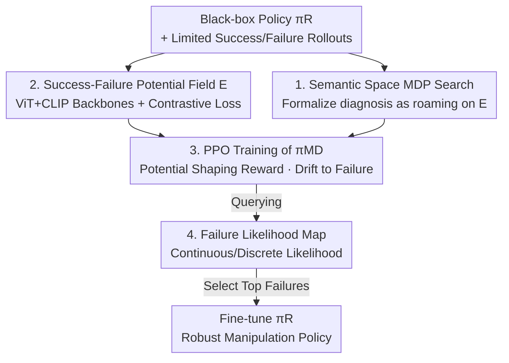

# RoboMD: Uncovering Robot Vulnerabilities through Semantic Potential Fields

**Conference**: ICLR 2026  
**OpenReview**: [https://openreview.net/forum?id=Gsrw1vxq1G](https://openreview.net/forum?id=Gsrw1vxq1G)  
**Code**: https://github.com/somsagar07/RoboMD (Available)  
**Area**: Robotics / Embodied AI / AI Safety  
**Keywords**: Failure Diagnosis, Policy Robustness, Vision-Language Embedding, Potential Fields, Deep Reinforcement Learning

## TL;DR
A standalone deep RL "diagnostic policy" $\pi_{MD}$ is trained to search a continuous vision-language embedding space learned from limited success/failure data. By treating this space as a "potential field" that drifts toward failure regions and away from success regions, the framework predicts where a robot manipulation policy $\pi_R$ will fail under environmental changes without extensive real-world trials—uncovering up to 23% more unique vulnerabilities than SOTA vision-language baselines.

## Background & Motivation
**Background**: Robot manipulation policies (e.g., picking bottles, stacking blocks) are fundamental to embodied AI. The industry primarily relies on "training-side" methods like curriculum learning, domain randomization, and Vision-Language-Action (VLA) models to enhance robustness. However, regardless of how general a model is, unforeseen environmental changes always occur during deployment. Thus, a "diagnostic-side" tool is needed to systematically identify exactly where a policy might stumble before deployment.

**Limitations of Prior Work**: Finding vulnerabilities in perception or language tasks is relatively inexpensive by querying large datasets or benchmarks. In contrast, finding vulnerabilities in manipulation tasks is extremely difficult because it requires physical trials, which are slow, expensive, and potentially hazardous to the robot, environment, or humans. Simple heuristic testing or trial-and-error is both unrealistic and costly.

**Key Challenge**: Diagnosing manipulation vulnerabilities is hindered by two factors: (i) **Unknown test cases**: Manipulation policies must withstand infinite variations in color, shape, material, lighting, background, and layout. Hard-coding a small set of known variations often misses critical failure modes exposed only under novel conditions. (ii) **High cost and safety risks of direct physical testing**.

**Goal**: Construct a diagnostic framework that allows for inexpensive/safe global searching while generalizing from limited known variations to entirely novel changes.

**Key Insight**: The authors reformulate failure searching as "exploring a learned continuous vision-language embedding space" rather than exploring discrete, manually specified variations. This embedding space is rich in semantic and visual structure, allowing it to be treated as a "potential field" to guide exploration toward failure and away from success.

**Core Idea**: An independent deep RL policy $\pi_{MD}$, which is architecture-agnostic to $\pi_R$ and requires only rollouts of $\pi_R$, is trained to perform virtual "walks" in a "success-failure potential field" embedding space to predict vulnerabilities. This replaces expensive physical experiments with nearly zero-cost jumps within the embedding space.

## Method

### Overall Architecture
RoboMD aims to produce a "failure likelihood map" for a given black-box pre-trained manipulation policy $\pi_R$, informing engineers how $\pi_R$ is likely to fail under various environmental changes (including unseen ones). The pipeline consists of four steps: first, a vision-language embedding space $E$ is trained using a few labeled success/failure rollouts and intentionally structured as a "potential field"; second, the diagnostic problem is formalized as an MDP roaming on $E$, and a diagnostic policy $\pi_{MD}$ is trained using PPO, rewarded for being attracted to failure zones and repelled from success zones; third, the trained $\pi_{MD}$ is queried to generate the failure likelihood map; finally, the highest-ranked failure modes are used for targeted fine-tuning of $\pi_R$. The key is that each "action" of $\pi_{MD}$ is merely a jump to another hypothetical environmental change in the embedding space, requiring no physical environment changes or rollouts during the search process.

### Key Designs

**1. Failure Diagnosis = MDP Search in Semantic Space**

To systematically find vulnerabilities when "what to test" is unknown, the authors formalize the problem as a Markov Decision Process $\langle S, A, P, R, \gamma \rangle$, where states and actions have no direct physical constraints and live directly in a continuous semantic embedding space $E$. A state $s_t \in S \equiv E$ is a 512-dimensional vector representing a "hypothetical environment change"—notably, this includes changes that may or may not be physically realizable, so $S$ is the set of "all hypothetical changes reachable via embedding." An action $a_t \in A \equiv E$ is also a 512-dimensional vector, functioning as an introduction of a change to the current state, moving $\pi_{MD}$ from one hypothetical environment to another. $\pi_{MD}$ treats $\pi_R$ and the environment as a black box, aiming to find a sequence of actions (environmental changes) that maximizes the probability of $\pi_R$ failing, with rewards encouraging "faster" discovery of failures. The benefit of this approach is that the exploration space transforms from discrete, manually specified variations into a continuous, semantically coherent space where $\pi_{MD}$ can naturally discover relationships between variations and extrapolate to unseen conditions.

**2. Training the Embedding Space as a "Success-Failure Potential Field"**

Predicting vulnerabilities in unseen environments requires two things: a prior of "where vulnerabilities roughly are" and the ability to generalize this prior to new conditions. The authors start with a limited dataset of labeled rollouts $D=\{(x^{vision}_i, x^{lang}_i), y_i\}_{i=1}^M$ ($y\in\{$failure, success$\}$, where text descriptions can be automatically generated from known changes) and train a **dual-backbone** multi-modal embedding: ViT processes the raw image (leveraging semantic priors from ImageNet pre-training to allow $\pi_{MD}$ to infer from similar environments), and CLIP encodes the natural language description of the task (experimentally found to help focus on key visual features). The outputs from both paths are projected, concatenated, and passed through a 512-D MLP + classification head to obtain the embedding $e_i$. Training uses a joint objective of binary cross-entropy (success/failure classification) and a contrastive loss $L$:

$$L = \sum_{i,j\in D}\left[\mathbb{1}_{y_i=y_j}\,d_{ij} + \mathbb{1}_{y_i\neq y_j}\max(0, m-d_{ij})\right],\quad d_{ij}=\|e_i-e_j\|_2$$

This pulls rollouts with the same outcome together and pushes those with different outcomes apart, making $E$ locally smooth: proximity equals similarity in outcome. This smooth structure is the source of the "potential field" $\Phi$. Theoretical analysis proves that reward shaping based on potential differences $F(s_t,a,s_{t+1})=\gamma\Phi(s_{t+1})-\Phi(s_t)$ preserves the optimal policy while providing dense signals for convergence. In other words, the contrastive loss is not just for regularization; it "shapes" the embedding space into a landscape where RL can naturally roll toward failure regions.

**3. PPO Drifting Toward Failure in Continuous Semantic Space**

With the potential field established, $\pi_{MD}$ can roam within $E$, using a pre-computed set of known embeddings $E_{known}=\{e_i; i\in D\}$ as reference anchors. Specifically (see Algorithm 1), $\pi_{MD}$ samples an action $a^*_{t+1}$ from the embedding space and finds the nearest embedding in $E_{known}$ as the actual action $a$. Thus, "executing an action" implicitly imposes a change on the environment without needing a physical rollout, making the search extremely cheap. PPO is used for optimization due to its training stability; entropy regularization is particularly critical in continuous spaces to prevent the agent from collapsing into a few modes and to encourage broader coverage (experimental action entropy for PPO was 2.88, higher than A2C or SAC). The reward function is designed to reward failure discovery while penalizing deviations too far from $E_{known}$ (entering uncertain zones) and repetitive actions (stalled search):

$$R(s,a)=\begin{cases}\dfrac{K_{failure}}{penalty+1}-k\cdot N(a), & \text{Failure}\\[2mm]-\dfrac{K_{success}}{horizon\times(penalty+1)}, & \text{Success}\end{cases}$$

Where the distance penalty in the denominator increases with $\|a-e\|$, which can be related to the potential field $\|a-e\|^2=\|\Phi(s_a)-\Phi(s_e)\|^2$; the frequency penalty $N(a)$ counts consecutive repetitions with coefficient $k=5$, pushing the agent toward uncertainty. This reward setup echoes Theorem 2: focusing exploration near success/failure decision boundaries enables more efficient vulnerability identification. When candidate changes are **known** (e.g., historical failures or expert knowledge), a special case exists where $\pi_{MD}$ only needs to search over discrete $E_{known}$, sequentially applying predefined action sequences (e.g., "table turns black → light to 50% → table size X") until a failure is induced.

**4. From Failure Likelihood Maps to Targeted Fine-tuning of $\pi_R$**

The trained $\pi_{MD}$ outputs a probability distribution over changes (actions), which can be directly read as a failure likelihood map. In continuous spaces, $\pi_{MD}(a|s)$ is modeled as a Gaussian density on $\mathbb{R}^{512}$. While any specific action has near-zero probability, the likelihood ratio $\frac{p_{MD}(a_{t1}|s)}{p_{MD}(a_{t2}|s)}$ is well-defined, allowing for the ranking of changes that are more likely to cause failure. Confidence in the likelihood estimate is measured by the distance $\min_{e\in E}\|e-e_s\|$ from the current state embedding to the nearest known embedding. When restricted to a finite candidate set $E_{known}$, this simplifies to a softmax categorical distribution $\pi_{MD}(a|s)=\frac{\exp(f_a(s))}{\sum_{a'}\exp(f_{a'}(s))}$, where probability mass concentrates on failure-inducing changes. This ordered list of failure modes allows engineers to avoid blindly collecting massive rollouts and instead **target only the highest likelihood failures** (e.g., specific lighting or object changes) for collecting a small batch of fine-tuning data, systematically "patching" the policy with minimal data.

### Loss & Training
The embedding space is trained using a joint objective of BCE (success/failure classification) and contrastive loss $L$ (with margin $m$) to structure $E$ as a potential field. $\pi_{MD}$ is trained using PPO on $E$, with rewards as described above (failure reward, deviation penalty, frequency penalty $k=5$, discount $\gamma=0.99$). Three theoretical guarantees are provided: Theorem 1 uses potential-based reward shaping theory to prove advantage invariance and preservation of the optimal policy; Theorem 2 proves that Lipschitz continuity of the embedding leads to smooth rewards and stable gradients, concentrating exploration on decision boundaries to reach precision $\epsilon$ with rollouts polynomial in $1/\epsilon$; Theorem 3 proves that potential field shaping reduces critic initial/approximation error, leading to faster PPO convergence.

## Key Experimental Results

### Main Results
Simulation was conducted in RoboSuite + RoboMimic/MimicGen, covering four tasks: lift, stack, threading, and pick&place. Various manipulation policies (BC, HBC, BC-Transformer, BCQ, Diffusion) were diagnosed. Ground truth ranking consistency was constructed from 500 success-failure pairs. $\pi_{MD}$ (PPO) consistently outperformed other RL, VLM, and lightweight model baselines in ranking accuracy.

| Model Category | Model | Lift | Square | Pick&Place | Average |
|--------|------|------|--------|-----------|------|
| RL | **PPO ($\pi_{MD}$)** | **82.3%** | **84.0%** | **76.0%** | **80.7** |
| RL | A2C | 74.2% | 79.0% | 72.0% | 75.0 |
| RL | SAC | 51.2% | 54.6% | 50.8% | 52.2 |
| VLM | GPT-4o-ICL (5-shot) | 57.4% | 48.6% | 57.0% | 54.3 |
| VLM | Gemini 1.5 Pro | 59.0% | 36.4% | 37.4% | 44.3 |
| VLM | Qwen2-VL | 32.0% | 24.6% | 57.4% | 38.0 |
| Small Model | ResNet | 49.0% | 52.0% | 44.0% | 48.3 |

VLM accuracy was generally below 60%, indicating that they do not interact iteratively with robot policies and struggle to provide reliable quantitative probability predictions. The failure detection accuracy of $\pi_{MD}$ remained stable across different tasks and policy architectures (Table 2: Lift 82.5%, Stack 88.0%, Threading 68–82%).

### Ablation Study

| Configuration | Key Metrics | Description |
|------|---------|------|
| Image + Text, BCE + Contrastive (Full) | MSE 0.1801 / Frobenius 7.64 (Lowest) | Strongest diagonal confusion matrix, highest action separability |
| BCE Loss Only | Poor | Removing contrastive loss decreases local embedding consistency |
| Image Backbone Only | Poor | Removing language prevents focusing on key visual features |
| Fine-tuning $\pi_R$: Pre-trained | Accuracy 67.91% | Before fine-tuning |
| Fine-tuning $\pi_R$: FT with RoboMD | **Accuracy 92.83%**, Error 0.033 | Targeted fine-tuning using top failures from $\pi_{MD}$ |
| Fine-tuning $\pi_R$: FT with all failures | Accuracy 85.48% | Fine-tuning on all failures, perform lower than targeted |

### Key Findings
- **Multi-modality + Contrastive Loss are critical for embedding quality**: Removing either significantly degrades the separability and local smoothness of the embedding space. The Full model achieved the highest group separation ratio of 22.99, a Silhouette coefficient of 0.91, and a Davies-Bouldin index of only 0.15.
- **Generalization to Unseen Changes**: On a real UR5e and in simulation, the failure likelihood ranking of $\pi_{MD}$ for changes never seen during training (e.g., real "bread," simulated "black table") matched ground truth, with accuracies of 61%–80% across 21 unseen variations.
- **Targeted FT > Global FT**: Targeted fine-tuning using the top-ranked failures from $\pi_{MD}$ improved the BC-lift policy from 67.91% to 92.83%, outperforming "fine-tuning with all failures" (85.48%), proving that diagnostic signals can yield greater robustness improvements with less data.
- **Semantic Continuity**: Under controlled light intensity scans, the cumulative distance in embedding space increased monotonically as lighting weakened (Kendall's $\tau=1.000$, Pearson's $r=0.982$), proving $E$ is suitable for use as a continuous potential field.
- The method uncovered up to 23% more unique vulnerabilities compared to SOTA vision-language baselines and captured subtle failures missed by heuristic testing.

## Highlights & Insights
- **Transforming "Vulnerability Search" into "Rolling Downhill in a Potential Field"**: Using contrastive loss to shape the embedding space into a potential field and guiding PPO with potential-based reward shaping is theoretically sound and practically effective—ensuring optimal policy preservation (advantage invariance) while providing dense, smooth signals for exploration.
- **Action Decoupling from Physical Meaning as an Advantage**: Since actions are 512-D vectors implicitly mapped to the nearest known embedding, "executing an environmental change" has nearly zero cost. Replacing expensive physical trials with embedding space jumps is the foundation of the method's scalability.
- **Diagnostic Signals Directly Drive Improvement**: The failure likelihood map is more than a report; it provides an ordered list of failures that turns fine-tuning from "broad strokes" into "precision patching," systematically fixing vulnerabilities with less data—a cycle that can migrate to any black-box policy.
- **Architecture Agnostic**: $\pi_{MD}$ only requires rollouts of $\pi_R$, allowing it to diagnose BC, RL, or VLA models. It serves as a pre-deployment diagnostic tool complementary to existing training-side robustness methods.

## Limitations & Future Work
- **Dependency on Coverage of Initial Labeled Data**: The potential field prior relies on variations selected by humans (e.g., object color, lighting). It remains questionable whether generalization holds if initial data completely misses a certain category of failure directions.
- **State Space Includes Physically Unrealizable Changes**: $S$ contains hypothetical changes that are physically impossible. Some "vulnerabilities" found by $\pi_{MD}$ may correspond to environments that cannot be recreated in reality, requiring additional realizability filtering for deployment.
- **Theoretical Guarantees Depend on Lipschitz Continuity Assumptions**: Sample efficiency and convergence acceleration in Theorems 2/3 depend on embedding smoothness and a well-structured potential field. The extent to which real multi-modal embeddings strictly satisfy these, and how performance degrades otherwise, is primarily discussed as a sketch in the main text (refer to the appendix for full proofs).
- **Future Directions**: Encoding realizability constraints directly into the action space or rewards; exploring online deployment of $\pi_{MD}$ for continuous diagnosis; researching cross-task or cross-robot transfer of diagnostic policies.

## Related Work & Insights
- **vs. Querying VLMs for Failure Detection (Agia, Duan, etc.)**: VLMs do not iteratively interact with robot policies and struggle to provide reliable quantitative probabilities. In this paper's experiments, VLM accuracy was generally <60%; $\pi_{MD}$ produces more accurate quantitative predictions via active RL search.
- **vs. Using RL/MDP to Find Errors in Classification or Generation (Sagar, Delecki, Hong, etc.)**: Prior work has not been validated on complex physical systems like manipulation, nor can they generalize beyond fixed known failure sets; this paper addresses both obstacles.
- **vs. OOD Detection / Uncertainty Quantization**: Failure detection is distinct from OOD—not all OOD cases lead to failure, and failures occur within-distribution. This paper characterizes failures both inside and outside the distribution.
- **vs. Training-Side Robustness (DR, Curriculum Learning, VLA)**: These aim to "make the policy stronger," while this work "diagnoses where the policy is weak." They are complementary—even the most general models will encounter unforeseen conditions, making diagnostic tools indispensable.

## Rating
- Novelty: ⭐⭐⭐⭐⭐ Reframing failure diagnosis as "RL search on continuous semantic potential fields" and linking theory and engineering via contrastive loss + reward shaping is highly original.
- Experimental Thoroughness: ⭐⭐⭐⭐ Coverage of four tasks, multiple policy architectures, simulation+real-world, and various baselines (VLM/RL/Small models). Includes generalization, ablation, and fine-tuning loops. Theory is presented mainly as a sketch.
- Writing Quality: ⭐⭐⭐⭐ Clear formalization and intuitive diagrams, though core metrics (FSI/NFM, etc.) and multiple theorem details are scattered in the appendix.
- Value: ⭐⭐⭐⭐⭐ High practical value for safely and cheaply diagnosing black-box manipulation policy vulnerabilities pre-deployment, with diagnostic signals directly translatable into more robust policies.

<!-- RELATED:START -->

## Related Papers

- [\[ICML 2026\] Dual Advantage Fields](../../ICML2026/robotics/dual_advantage_fields.md)
- [\[CVPR 2026\] DynBridge: Bridging Imagination and Control through Interaction Dynamics for Robot Manipulation](../../CVPR2026/robotics/dynbridge_bridging_imagination_and_control_through_interaction_dynamics_for_robo.md)
- [\[CVPR 2026\] AtomicVLA: Unlocking the Potential of Atomic Skill Learning in Robots](../../CVPR2026/robotics/atomicvla_unlocking_the_potential_of_atomic_skill_learning_in_robots.md)
- [\[ICLR 2026\] Embodied Agents Meet Personalization: Investigating Challenges and Solutions Through the Lens of Memory Utilization](embodied_agents_meet_personalization_investigating_challenges_and_solutions_thro.md)
- [\[ICLR 2026\] Theory of Space: Can Foundation Models Construct Spatial Beliefs through Active Exploration?](theory_of_space_can_foundation_models_construct_spatial_beliefs_through_active_e.md)

<!-- RELATED:END -->
