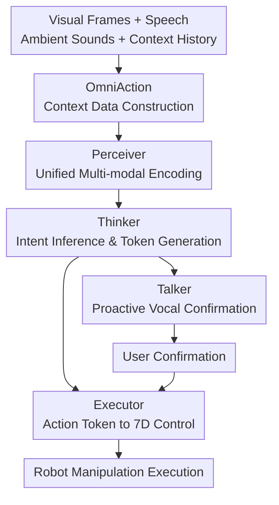

# RoboOmni: Proactive Robot Manipulation in Omni-modal Context

**Conference**: ICLR2026  
**OpenReview**: [https://openreview.net/forum?id=OJh7oBCYhL](https://openreview.net/forum?id=OJh7oBCYhL)  
**Code**: https://github.com/OpenMOSS/RoboOmni  
**Area**: Robot Manipulation / Omni-modal VLA / Proactive Human-Robot Interaction  
**Keywords**: Proactive Robot Manipulation, Cross-modal Contextual Instructions, Speech-Vision-Action Model, Environmental Sound, Human Confirmation  

## TL;DR
RoboOmni integrates speech, environmental sounds, visual observations, and robot actions into a unified omni-modal LLM framework, enabling robots to proactively infer user intentions from implicit household contexts, provide vocal confirmation, and execute 7-DoF manipulation actions.

## Background & Motivation
**Background**: Existing VLA models in robot manipulation, such as OpenVLA, π0, and NORA, map visual observations and linguistic commands to actions. These models typically assume that users provide relatively clear text or speech instructions. In standard benchmarks, this setup is natural: a user says "put the Coke on the table," and the robot perceives the image, understands the language, and outputs end-effector actions. However, in real household collaboration, humans do not always issue explicit tasks. Intentions are often embedded in dialogue, tone, environmental sounds, and object states.

**Limitations of Prior Work**: The first category of limitations is that instruction types are too explicit. Existing VLAs mainly process direct or slightly complex but still clear instructions. While some work explores inferential text instructions, they remain focused on text-based reasoning. The second category is the narrowness of input sources. Many systems pass speech to an ASR model first and then feed the transcribed text to the VLA. This process loses paralinguistic cues such as tone, emphasis, emotion, speaker identity, overlapping speech, and non-verbal sounds. For instance, if "Hmm... this orange juice..." is spoken with a negative tone, it likely means "I don't want orange juice," but ASR text rarely preserves such signals stably.

**Key Challenge**: Proactive robot collaboration requires "hearing the scene" rather than just "reading commands." Speech semantics convey what is said, paralinguistic cues convey how it is said, environmental sounds suggest what is happening, and visual observations determine which objects and actions are feasible. These signals are complementary, but cascaded systems (ASR, planner, controller) suffer from information loss at each interface.

**Goal**: The authors define a new robot manipulation setting: cross-modal contextual instruction. In this setting, the robot receives visual frames, natural speech, environmental sounds, and dialogue history to recover latent intentions. If the intention is uncertain, the robot should proactively confirm with the user rather than executing immediately or waiting for an explicit command. After confirmation, the system must output executable robot actions.

**Key Insight**: Omni-modal LLMs can already establish unified representations across speech, vision, and text, but they usually stop at language or speech output without entering embodied action. Conversely, VLA models output actions but rarely handle raw audio contexts directly. Thus, the authors bridge the two: using an omni-modal LLM for end-to-end perception, reasoning, speaking, and execution.

**Core Idea**: A unified Perceiver-Thinker-Talker-Executor framework replaces the ASR+VLA cascaded pipeline. This allows the robot to infer implicit intentions directly from raw audio and visual contexts and generate confirmation utterances alongside action tokens autoregressively.

## Method
### Overall Architecture
The input to RoboOmni is not a clean text command but time-varying visual observations $V_{1:T}$, audio signals $S_{1:T}$, and dialogue history $C$. The audio contains human speech, speaker identity, emotions, overlapping speech, doorbells, kitchen appliance sounds, and background noise. The model encodes these heterogeneous inputs into a unified token space, uses an LLM backbone to reason about user intent, generates confirmation speech when necessary, and finally decodes action tokens into 7D robotic control commands.

Regarding training data, the authors first constructed **OmniAction**, extending atomic trajectories from Open-X into multi-modal episodes with context. Each sample can be viewed as $(C,V,A)$: dialogue context $C$, visual sequence $V$, and expert action trajectory $A=\{a_t\}_{t=1}^{T}$, where action $a_t\in\mathbb{R}^7$ represents end-effector displacement, rotation, and gripper control. OmniAction covers 141,162 episodes, 112 skills, 748 objects, 5,096 speaker voices, 2,482 types of non-verbal sounds, and 640 types of environmental backgrounds.

The model consists of four roles. The **Perceiver** encodes vision, audio, and dialogue history into unified representations. The **Thinker** is an omni-modal LLM backbone responsible for reasoning and generation in a unified token space. The **Talker** converts the Thinker’s semantic representations and text tokens into natural speech for confirmation or response. The **Executor** maps action tokens back to robotic control commands. This framework treats hearing, seeing, interacting, and acting as a single autoregressive modeling problem.

### Key Designs
**1. Cross-modal Contextual Instruction: Turning "Unspoken Needs" into Robotic Tasks**
The paper expands task definitions from explicit commands to cross-modal contextual instructions. In traditional VLA, tasks are defined by explicit goals. RoboOmni handles interactions where a user might say "I'm a bit thirsty," while someone else notes "There's orange juice and Coke in the fridge," accompanied by juicer sounds and a negative tone regarding orange juice. The robot must synthesize these cues to infer "The user likely wants Coke" and ask, "Would you like me to get you a Coke?" This requires preserving paralinguistic info, grounding sounds/vision in the same scene, and initiating confirmation.

**2. OmniAction Data Construction: Supervision for Proactive Intent Inference**
A core contribution is the training data. Starting from Open-X trajectories, the authors filtered samples with low visual information and used GPT-4o to rewrite atomic instructions into household multi-turn dialogues, including robot confirmations and user replies. These were converted to real audio: multi-speaker speech via TTS and voice cloning, overlapping voices, non-verbal event sounds at semantic anchors, and background noise at various SNR levels. Human verification confirmed a 98.7% consistency rate in intent recoverability.

**3. Perceiver-Thinker-Talker-Executor: Unified Token Space for Understanding, Confirmation, and Execution**
At timestep $t$, the visual encoder yields $v_t=f_v(V_t)$, the audio encoder $s_t=f_s(S_t)$, and dialogue history $c_t=f_c(C_t)$, combined into $X_t=[v_t;s_t;c_t]$. The Thinker generates text tokens, speech representations, and action tokens on this unified representation. Action generation uses FAST+-style discrete tokens. Continuous actions $a_t\in\mathbb{R}^7$ are represented as discrete sequences $r_t \subset A$, where $A$ is an action vocabulary of 2048 tokens. The Thinker performs autoregressive generation over the union of text and action vocabularies $V \cup A$.

**4. End-to-End Audio-Action Learning: Avoiding Semantic Drift and Latency**
Cascaded systems (e.g., Qwen2.5-Omni for intent + OpenVLA for control) suffer from semantic drift because the planner isn't co-trained with the controller. The planner might generate commands the controller cannot execute or compress fine-grained intent (identity, emotion) into vague text. RoboOmni also improves speed; on an RTX 4090, RoboOmni's latency is $0.49\times$ compared to $1.00\times$ for ASR+OpenVLA, effectively halving inference time by removing the transcription bottleneck.

### Loss & Training
The training objective is unified as autoregressive maximum likelihood. For dialogue:
$$
L_{chat}(\theta)=-\mathbb{E}\sum_{\ell=1}^{L}\log p_\theta(y_\ell\mid X_t,y_{<\ell}).
$$
For action tokens:
$$
L_{act}(\theta)=-\mathbb{E}\sum_{i=0}^{N}\log p_\theta(r_{t+i}\mid X_t,r_{t:t+i-1}).
$$
The full objective interleaves these in the same sequence:
$$
L(\theta)=L_{chat}(\theta)+L_{act}(\theta)
=-\mathbb{E}\sum_{k=1}^{K}\log p_\theta(z_k\mid X_t,z_{<k}),\quad z_k\in V\cup A.
$$
Pre-training utilized 64 A100 GPUs for 10 days (15,360 A100-hours) with a batch size of 512 and a learning rate of $5\times10^{-5}$.

## Key Experimental Results

### Main Results
On OmniAction-LIBERO-TTS, RoboOmni achieved a success rate of 85.6%, significantly higher than the strongest baseline (ASR+NORA at 25.9%).

| Benchmark / Setup | Metric | RoboOmni | Best Baseline | Gain |
|--------|------|------|----------|------|
| OmniAction-LIBERO-TTS Overall | Success Rate | 85.6% | 25.9% (ASR+NORA) | +59.7 pts |
| Goal Avg | Success Rate | 85.8% | 16.3% (ASR+NORA) | +69.5 pts |
| Object Avg | Success Rate | 84.0% | 13.8% (ASR+NORA) | +70.2 pts |

In real-world WidowX 250S robot experiments, RoboOmni reached a 73.9% success rate, outperforming the best ASR+VLA baseline (52.2%).

### Ablation Study
Ablations show that performance stems from multi-modal complementarity.
- **W/O Audio**: Accuracy drops to 11.11%, as most task semantics are lost.
- **W/O Vision**: Accuracy drops to 58.89%, as the model cannot ground intentions to specific objects.
- **W/O Paralinguistics**: Accuracy drops to 50.56%, demonstrating that tone and identity are crucial for disambiguation.

### Key Findings
- **Raw Audio is Essential**: ASR introduces recognition errors and strips away emotional/contextual cues necessary for intent inference.
- **Vision is Required for Grounding**: Without vision, the model cannot map "that pot" or "the doorbell event" to actionable objects.
- **Real-world Failures**: 57.4% of failures on the physical robot were due to execution (grasping, pose drift) rather than intention errors, indicating that low-level control remains a bottleneck.

## Highlights & Insights
- **Proactive Loop**: RoboOmni formalizes "proactivity" as a trainable loop of inference, vocal confirmation, and execution.
- **Unified Token Space**: Treating "speaking" and "acting" as continuous parts of the same autoregressive process simplifies the architecture.
- **ASR Deficiency**: The paper proves ASR is an insufficient interface for robotics when tasks depend on *how* things are said or *what* environmental events occur.

## Limitations & Future Work
- **Synthetic Gap**: Despite large-scale data and human verification, a distribution shift between synthetic and real household dialogue remains.
- **Low-level Execution**: 57.4% of real-world failures were execution-related, highlighting the need for more robust low-level foundations.
- **Confirmation Overhead**: The study doesn't extensively cover the policy of when *not* to ask to avoid user annoyance.
- **Privacy**: Processing household audio and identity signals raises significant ethical and security requirements.

## Related Work & Insights
- **vs OpenVLA / π0**: These focus on command following. RoboOmni focuses on context following and proactive interaction.
- **vs Cascaded Pipelines**: RoboOmni halves latency and avoids semantic drift by removing the transcription bottleneck.
- **vs Qwen2.5-Omni / GPT-4o**: While general LLMs can see and hear, RoboOmni maps these capabilities directly into robotic 7-DoF actions within a single generation space.

## Rating
- **Novelty**: ⭐⭐⭐⭐⭐ (Integrates proactive confirmation into the VLA loop).
- **Experimental Thoroughness**: ⭐⭐⭐⭐⭐ (Real-world robot, ASR comparison, and extensive ablations).
- **Writing Quality**: ⭐⭐⭐⭐ (Clear structure, informative charts).
- **Value**: ⭐⭐⭐⭐⭐ (Provides a new dataset and a strong baseline for proactive household robotics).

<!-- RELATED:START -->

## Related Papers

- [\[ICLR 2026\] Abstracting Robot Manipulation Skills via Mixture-of-Experts Diffusion Policies](abstracting_robot_manipulation_skills_via_mixture-of-experts_diffusion_policies.md)
- [\[CVPR 2026\] ProFocus: Proactive Perception and Focused Reasoning in Vision-and-Language Navigation](../../CVPR2026/robotics/profocus_proactive_perception_and_focused_reasoning_in_vision-and-language_navig.md)
- [\[ICLR 2026\] Ctrl-World: A Controllable Generative World Model for Robot Manipulation](ctrl-world_a_controllable_generative_world_model_for_robot_manipulation.md)
- [\[NeurIPS 2025\] HiMaCon: Discovering Hierarchical Manipulation Concepts from Unlabeled Multi-Modal Data](../../NeurIPS2025/robotics/himacon_discovering_hierarchical_manipulation_concepts_from_unlabeled_multi-moda.md)
- [\[ICLR 2026\] On Robustness of Vision-Language-Action Model against Multi-Modal Perturbations](on_robustness_of_vision-language-action_model_against_multi-modal_perturbations.md)

<!-- RELATED:END -->
