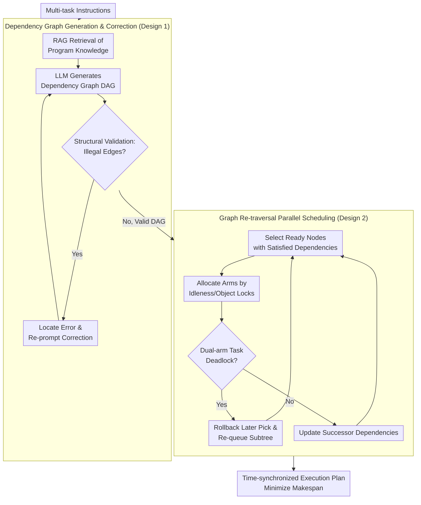

# RoboPARA: Dual-Arm Robot Planning with Parallel Allocation and Recomposition Across Tasks

**Conference**: ICLR 2026  
**arXiv**: [2506.06683](https://arxiv.org/abs/2506.06683)  
**Code**: [https://github.com/AiDuanshiying/RoboPARA](https://github.com/AiDuanshiying/RoboPARA)  
**Area**: Robotics / Task Planning  
**Keywords**: Dual-arm Robots, Parallel Task Planning, DAG Dependency Graph, LLM Planning, Multi-task Scheduling

## TL;DR
The RoboPARA framework is proposed to optimize task parallelism for dual-arm robots through a two-stage process of dependency graph construction and graph re-traversal. It achieves a 30-50% reduction in execution time and a 34% improvement in success rate across multi-scenario benchmarks compared to existing methods.

## Background & Motivation

**Background**: LLM-driven task planning for dual-arm robots (e.g., RoCo, FLTRNN) has made progress. However, these methods primarily optimize task success rates and completion times, often producing plans that execute sequentially with a single arm.

**Limitations of Prior Work**: Existing methods neglect the potential for parallelism between the two arms—when one task requires only one arm, the other remains idle. This leads to underutilized collaborative potential and low execution efficiency.

**Key Challenge**: Parallel planning for dual arms requires simultaneously managing inter-task dependencies (where certain steps must be ordered) and identifying parallel opportunities (where independent steps can be assigned to both arms). This represents a complex combinatorial optimization problem.

**Goal**: Maximize parallel utilization of both arms and minimize execution time while ensuring task correctness.

**Key Insight**: Drawing inspiration from human daily activities—such as brushing teeth while boiling water—task dependencies are modeled using Directed Acyclic Graphs (DAGs). A graph traversal scheduling algorithm is then employed to maximize concurrency.

**Core Idea**: Decouple dual-arm task planning into two stages: "LLM-generated dependency graph → Scheduling algorithm to maximize parallelism." This allows the LLM to focus on understanding task semantics rather than directly planning parallel execution.

## Method

### Overall Architecture
**Mechanism**: RoboPARA formalizes dual-arm parallel planning as a "dual-arm collaborative scheduling problem" and divides it into two steps. First, the LLM translates multi-task instructions into a Directed Acyclic Graph (DAG) that characterizes dependencies and performs self-correction. Second, a deterministic graph re-traversal algorithm allocates parallelizable steps to the left and right arms based on the graph. This allows the LLM to focus on "which steps must follow which," while leaving the combinatorial optimization of "how to arrange steps to minimize total execution time" to the graph algorithm. This pipeline requires no parameter training. To measure this parallelism, the authors also constructed the X-DAPT dataset as an evaluation foundation.

### Key Designs

**1. Dependency Graph Generation & Correction: Structuring Task Semantics for Scheduling**

A primary challenge in parallel planning is ensuring LLM-generated plans are both correct and parallelizable. RoboPARA uses RAG (Retrieval-Augmented Generation) to retrieve task-related knowledge from a hybrid memory system—containing both short-term observations (object states) and long-term execution history (task package knowledge base). Environment constraints, dependency rules, parallel guidelines, and format examples are combined into structured prompts. This guides the LLM to encode multi-task instructions into a DAG: nodes represent atomic operations (pick / use / place / open-close / complete), and edges $(u \rightarrow v)$ indicate step $v$ must wait for $u$. This structure inherently favors parallel scheduling; nodes with satisfied dependencies can execute immediately. To address illegal dependencies often generated by LLMs, a structural validation routine detects three typical errors: (1) a `use/place` incorrectly depending on another object's `place`; (2) a `place` in a `pick-use-place` sequence depending directly on `pick` instead of the intermediate `use`; and (3) a node depending on an irrelevant object's `use`. Errors trigger iterative re-generation until a valid DAG is produced.

**2. Graph Re-traversal Parallel Scheduling: Maximizing Parallelism on Valid Graphs**

With a correct dependency graph, the next step is determining arm actions at each timestamp. Optimal parallel arrangement is NP-hard; thus, RoboPARA employs a deterministic graph re-traversal algorithm for an approximate solution. The goal is to minimize the makespan $C_{\max} = \max_{v}\big(\sigma(v) + t_v\big)$, where $\sigma(v)$ is the start time and $t_v$ is the duration of step $v$. The algorithm maintains a dynamic ready queue $\mathcal{Q}$ containing nodes $\texttt{Ready}(v)$ whose predecessors are scheduled. Nodes are allocated based on arm availability, task type (single-arm $\delta_v{=}1$ or dual-arm $\delta_v{=}2$), and object lock consistency. Single-arm tasks are assigned to idle arms, while dual-arm collaborative tasks require both arms to be idle and synchronized. Correctness is ensured by four categories of constraints: dependency constraints ($\sigma(v) \ge \max_{u \in \text{pred}(v)}(\sigma(u)+t_u)$), non-overlapping arm occupancy, arm locks (ensuring `pick-use-place` for one object is handled by the same arm), and deadlock prevention. Deadlocks—where a dual-arm task is ready but arms are locked by different objects—are resolved by rolling back the later `pick` in the conflicting chains, allowing the earlier chain to finish.

**3. X-DAPT Benchmark: Quantifying Parallelism as an Evaluation Dimension**

Existing dual-arm benchmarks focus on success rates and completion times but fail to measure the extent of arm collaboration. RoboPARA introduces X-DAPT (Cross-Scenario Dual-Arm Parallel Task), the first dataset specifically for evaluating dual-arm parallelism. It spans 10 scenarios (e.g., kitchen, hospital, disaster relief) with three difficulty levels, totaling 1,000+ task packages. Four metrics are introduced: TEI (Time Efficiency Index), TFR (Task Failure Rate), PPR (Parallel Position Ratio—ratio of parallel steps to total steps), and APR (Average Parallelism Ratio). PPR and APR directly characterize the degree of simultaneous arm operation, serving as the core dimensions to measure efficiency gains.

### Loss & Training
No training required—the entire framework is built upon zero-shot/few-shot prompting of LLMs (GPT-4o / DeepSeek V3) and deterministic scheduling algorithms, involving no parameter updates.

## Key Experimental Results

### Main Results

| Method | TEI ↑ | TFR ↓ | PPR ↑ | APR ↑ | Scenario |
|------|-------|-------|-------|-------|------|
| RoboPARA | 0.953 | 0.033 | 0.543 | 0.283 | Kitchen |
| Embodied TaPA | 0.859 | 0.200 | 0.000 | 0.080 | Kitchen |
| RoCo | 0.836 | 0.067 | 0.008 | 0.041 | Kitchen |
| ChatGPT-Prompts | 0.817 | 0.081 | 0.000 | 0.010 | Kitchen |
| LLM-Planner | 0.858 | 0.200 | 0.000 | 0.077 | Kitchen |

### Ablation Study

| Configuration | PPR | APR | Description |
|------|-----|-----|------|
| RoboPARA (Full) | 0.543 | 0.283 | Full Framework |
| w/o Graph Correction | ~0.35 | ~0.18 | DAG generation may contain cycles/redundancies |
| w/o RAG Retrieval | ~0.40 | ~0.20 | Decrease in task decomposition quality |

### Key Findings
- RoboPARA achieves more than 4.5× the parallel and collaborative steps of baselines, reducing execution time by 30-50%.
- In the most complex task combinations, RoboPARA's success rate is on average 34% higher than other methods.
- Parallel steps for all baseline methods are near zero (PPR ≈ 0), confirming that existing methods almost entirely ignore parallelism.
- Deployment on real humanoid robots demonstrates behaviors closely mimicking human activity patterns.

## Highlights & Insights
- **Decoupled Planning-Scheduling Design**: Assigning task semantic understanding and dependency modeling to the LLM, while leaving the NP-hard scheduling problem to a deterministic algorithm, represents an effective division of labor.
- **Parallelism as an Evaluation Dimension**: By establishing parallelism as a core metric for dual-arm robots, the PPR/APR metrics can be extended to multi-robot collaboration scenarios.

## Limitations & Future Work
- DAG generation still relies on the reasoning capabilities of the LLM, which may fail in cases of complex cross-task dependencies.
- The scheduling algorithm uses heuristics rather than global optimization, potentially missing the absolute optimal parallel solution.
- The framework assumes that the execution time of each atomic operation is known or estimable, which may not hold in practice.
- Dynamic re-planning during execution (e.g., recovery strategies after a step fails) is not yet considered.

## Related Work & Insights
- **vs RoCo**: RoCo uses agents to decompose and assign tasks through dialogue negotiation, but the resulting plans are still largely sequential. RoboPARA explicitly optimizes parallelism.
- **vs FLTRNN**: FLTRNN employs an RNN structure for long-term planning, focusing on task decomposition and memory management rather than dual-arm parallelism.

## Rating
- Novelty: ⭐⭐⭐⭐ The first system to focus on dual-arm parallelism within an LLM planning framework.
- Experimental Thoroughness: ⭐⭐⭐⭐ Extensive baseline comparisons and multi-scenario evaluations.
- Writing Quality: ⭐⭐⭐⭐ Clear motivation and comprehensive methodological description.
- Value: ⭐⭐⭐⭐ Practical significance for multi-arm and multi-robot task scheduling.

<!-- RELATED:START -->

## Related Papers

- [\[CVPR 2025\] RoboTwin: Dual-Arm Robot Benchmark with Generative Digital Twins](../../CVPR2025/robotics/robotwin_dual-arm_robot_benchmark_with_generative_digital_twins.md)
- [\[ICLR 2026\] Experience-based Knowledge Correction for Robust Planning in Minecraft](experience-based_knowledge_correction_for_robust_planning_in_minecraft.md)
- [\[ICLR 2026\] ExoPredicator: Learning Abstract Models of Dynamic Worlds for Robot Planning](exopredicator_learning_abstract_models_of_dynamic_worlds_for_robot_planning.md)
- [\[ICLR 2026\] REI-Bench: Can Embodied Agents Understand Vague Human Instructions in Task Planning?](rei-bench_can_embodied_agents_understand_vague_human_instructions_in_task_planni.md)
- [\[ICLR 2026\] Memory, Benchmark & Robots: A Benchmark for Solving Complex Tasks with Reinforcement Learning](memory_benchmark_robots_a_benchmark_for_solving_complex_tasks_with_reinforcement.md)

<!-- RELATED:END -->
