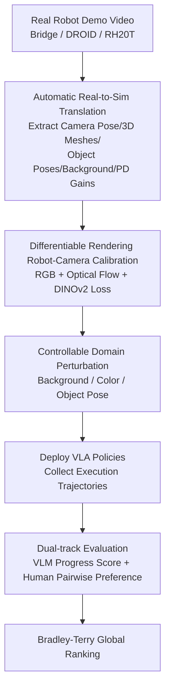

# RobotArena ∞: Scalable Robot Benchmarking via Real-to-Sim Translation

**Conference**: ICLR 2026  
**OpenReview**: [https://openreview.net/forum?id=OutljIofvS](https://openreview.net/forum?id=OutljIofvS)  
**Code**: https://robotarenainf.github.io (Project page; environment and evaluation code will be open-sourced)  
**Area**: Robotics / Embodied AI  
**Keywords**: Robot Benchmarking, Real-to-Sim, VLA Policy, Human Preference Ranking, Differentiable Rendering

## TL;DR
This paper proposes RobotArena ∞, a scalable evaluation framework that **automatically translates real robot demonstration videos into simulation digital twins**. It deploys VLA policies within these simulations and uses a dual-track scoring system (VLM progress scores + crowdsourced human pairwise preferences). Based on over 8,500 preference pairs, it compares 6 VLAs from global laboratories, revealing that current policies exhibit weak cross-dataset generalization and high sensitivity to perturbations.

## Background & Motivation

**Background**: As the capabilities of generalist robot policies (especially Vision-Language-Action, VLA models) grow rapidly, achieving **fair, reproducible, and scalable** evaluation has become a bottleneck. While NLP and CV benefit from rapid iteration through standard benchmarks like ImageNet or LMArena, the robotics field lacks an equivalent.

**Limitations of Prior Work**: Real-world evaluation is inherently non-scalable, requiring manual scene setup, object resetting, safety supervision, and manual success determination—all of which are slow, expensive, unsafe, and difficult to reproduce. For instance, evaluating a policy might require **manually resetting a T-shaped object to 20 preset initial poses** for every baseline. This reset step cannot be parallelized, creating a massive bottleneck. While centralized physical benchmarks (e.g., Amazon Picking Challenge) remain the gold standard, their cost limits frequency to once a year at most.

**Key Challenge**: Defining "success" in robotics often relies on **nuanced human judgment** of execution quality, which cannot be automatically calculated as a scalar metric like in classification tasks. However, deep human involvement is the root cause of non-scalability. Evaluation requires human judgment but is hindered by human intervention—this is the fundamental tension.

**Goal**: Transform the human role from "tedious scene setup, resetting, and safety supervision" to "lightweight preference comparison," while moving the entire evaluation into a massively parallelizable simulation. This is divided into two sub-problems: (1) How to **automatically** create physically consistent simulation twins from single-view real videos; (2) How to **scalably** score execution trajectories within the simulation.

**Key Insight**: Inspired by LMArena—which relies on crowdsourced pairwise comparisons of model responses to the same prompt to aggregate Elo rankings—the authors ask: what should a robotics version of LMArena look like? The answer lies in using real-to-sim to transform a video into a simulation as the "same prompt," and then having humans vote on preferences between two execution videos.

**Core Idea**: Replace "manual real-world evaluation" with "automated real-to-sim translation + in-sim VLM/human pairwise evaluation." This transforms one-off, non-reproducible physical tests into a continuously evolving, reproducible, and scalable benchmark.

## Method

### Overall Architecture

RobotArena ∞ addresses how to automatically transform real videos into simulation environments capable of running policies and scoring. The pipeline consists of two main stages: **the first half translates a single-frame real video into a simulation environment** (extracting camera pose, object meshes and poses, clean backgrounds, and controller gains), while applying controllable perturbations. **The second half deploys the VLA policies under test and performs dual-track scoring** (automated VLM progress scores + human pairwise preferences), finally aggregating global rankings using a Bradley-Terry model. Except for the robot joint trajectory annotations provided by the demonstration videos, the entire process **requires no additional manual supervision**, and its modular design allows each component to be upgraded as real-to-sim technology advances.

### Key Designs

**1. Automated Real-to-Sim Translation Pipeline: Restoring Simulation-Ready Digital Twins from Single RGB Images**

This step addresses the pain point of manual scene setup. Given a demonstration video with a language task description and frame-by-frame joint angles, the method extracts **five elements**: the 6-DoF camera pose relative to the robot base, 3D mesh reconstruction of task-relevant objects, object orientation/size/material, a clean background image, and proportional-derivative (PD) control gains. The object reconstruction pipeline uses Gemini for segmentation, InvSR for super-resolution of crops, and Hunyuan-3D to generate textured 3D meshes in a canonical coordinate system. To recover true 3D poses, reconstructed meshes are rendered into multiple 2D views, and MINIMA is used for correspondence matching. MoGE monocular depth (aligned with simulation ground truth depth to calculate a **metric scale factor**) is used to back-project masked pixels into metric-scale point clouds, followed by SVD on 3D–3D correspondences to solve for poses. Backgrounds are inpainted using LaMa to remove the robot and objects, and PD gains are calibrated by aligning simulated end-effector trajectories with the real video via system identification.

Unlike existing real-to-sim methods (e.g., Phone2Proc, Re3Sim) that rely on **multi-view capture, curated object libraries, or fiducial markers**, RobotArena ∞ requires only a **single RGB image** from a static camera and does not require human-in-the-loop segmentation or specialized calibration trajectories like RialTo, enabling scalability to large datasets like Bridge/DROID/RH20T.

**2. Differentiable Rendering for Robot-Camera Calibration: Solving Unknown Extrinsics with Alignment Losses**

Robot demonstration videos are typically "uncalibrated"—the camera pose relative to the robot is unknown, which is essential for simulation setup. The method uses URDF and differentiable rendering to construct a **joint-angle-conditioned 3D Gaussian robot model** (following DR-Robot). Given video with frame-by-frame joint angles, the Gaussian model is rendered, and the camera's 3D translation and rotation are optimized by minimizing a composite alignment loss: (i) RGB loss for pixel-level appearance; (ii) Optical flow loss to enforce consistency between the rendered motion field and video flow; (iii) Feature loss to align DINOv2 embeddings. When calibration metadata exists (e.g., DROID), it serves as initialization; otherwise, a robust coarse-to-fine grid search (like in BridgeV2) provides a starting point. These losses constrain extrinsics from complementary perspectives—appearance, motion, and semantics—allowing reliable extrinsic estimation from single-view video.

**3. Controllable Domain Perturbation: Systematic Stress Testing of Generalization and Robustness**

Scoring in the "original environment" is insufficient. The authors systematically test policy fragility under distribution shift by applying three types of controlled perturbations: **Background Change ($\Delta$BG)** replaces the background with textures from diverse datasets to isolate context dependence; **Color Shift ($\Delta$Color)** modifies RGB channel configurations (e.g., RGB$\rightarrow$BGR) in ~33% increments from 0% to 100% to test low-level color robustness; **Object Pose Change ($\Delta$ObjPose)** randomly permutes object positions. Since these perturbations are built in simulation, they can be applied independently along each axis while keeping other variables constant—a feat nearly impossible in the real world.

**4. Dual-track Evaluation: Complementing VLM Progress Scores with Human Preferences**

Evaluation involves absolute and relative tracks. **Absolute evaluation (VLM progress score)**: Ordered video frames are fed to Gemini 2.5 Pro along with privileged simulation states (object/robot status, with the initial state as a zero-progress reference) to generate a per-frame progress score. The trajectory-level score is the **average of the final 30% of frames**, as the terminal stage best reflects success or failure. This metric shows high correlation with manual progress scores. **Relative evaluation (Human preference)**: Double-blind pairwise comparisons are performed on two policy execution videos in the same environment and initial conditions. Annotators provide preference labels (A better / Tie / B better) and free-text justifications, which improves engagement and accuracy. Finally, the Bradley–Terry model aggregates these: each policy $\pi_i$ is assigned a latent capability $\theta_i > 0$, where $P(\pi_i \succ \pi_j) = \frac{\theta_i}{\theta_i + \theta_j}$. Maximum likelihood estimation is performed using non-tie comparisons to derive the global ranking $R$, with confidence intervals provided via sandwich variance estimation.

## Key Experimental Results

The initial benchmark aggregated **over 8,500 preference pairs** (8,749 for BridgeSim) across 100 nominal environments and hundreds of perturbations. It compared **6 VLAs** from independent labs: Octo, RoboVLM, SpatialVLA, CogAct, X-VLA, and $\pi$0. Three environment sets were used: BridgeSim (70 environments from BridgeV2), DROIDSim (DROID, often excluded from pre-training due to noise), and RH20TSim (RH20T).

### Main Results

| Dimension | Observation | Implication |
| :--- | :--- | :--- |
| Human vs. VLM Ranking | Rankings are **completely consistent** ($\pi$0, X-VLA > CogAct/RoboVLM/Octo/SpatialVLA) | Automated VLM evaluation is highly aligned with human judgment and can be used for scaling. |
| Cross-Dataset Generalization | Performance drops significantly on environments derived from non-training datasets (DROID/RH20T). | Current VLAs are not true generalists and excel only within their training distributions. |
| Comparison with SIMPLER | VLA scores on SIMPLER (only 4 environments) are significantly **higher** than on BridgeSim (70 environments). | SIMPLER **overestimates** policy performance due to its small environment set and biased scene selection. |

### Key Findings

| Perturbation Axis | Observation | Interpretation |
| :--- | :--- | :--- |
| **Color Shift $\Delta$Color** | Policies with stronger backbones are more resistant to color changes. | Stronger backbones rely on invariant structural cues rather than surface appearance; weaker models like Octo are easily disrupted. |
| **Background $\Delta$BG** | Universal performance drop across all policies. | Policies heavily rely on fixed environmental cues, indicating overfitting to training visual layouts. |
| **Object Pose $\Delta$ObjPose** | Explicit 3D modeling provides some resistance but performance still declines. | 3D structure helps but is insufficient for true semantic generalization. |

- **"Spatial Paradox"**: $\pi$0 and X-VLA, which lack explicit 3D inductive biases like SpatialVLA, are actually more robust. The authors hypothesize that cross-view consistency learned from multi-view wrist-camera pre-training data provides stronger spatial representations than explicit 3D priors.
- **Model Choice Differentiability**: BridgeSim and its perturbations clearly distinguish $\pi$0 and X-VLA as the strongest; however, this advantage is not universal—on RH20TSim, RoboVLM reached 19.05% (far exceeding others), while X-VLA dropped to 0.00%.
- **Ranking Stability**: Despite drops in absolute performance due to distribution shifts, the relative rankings of models remain consistent across conditions.
- **Initial Real-Sim Consistency**: On a "Put the carrot in the plate" task, RoboVLM/SpatialVLA succeeded in both real and sim, while Octo failed in both, matching conclusions.

## Highlights & Insights
- **Shifting Human Roles**: Changing humans from "scene-setting labor" to "preference judges" is a brilliant perspective shift—it retains nuanced judgment while removing non-scalable physical labor (resetting, supervision).
- **VLM Progress Score Trick**: Averaging the "last 30% of frames" is a simple but effective technique to focus on the terminal stage where success/failure is manifest.
- **Quantifying Benchmark Bias**: Comparing 70 environments (BridgeSim) vs. 4 (SIMPLER) quantifies the optimistic bias of small benchmarks, serving as a warning to the community.
- **Modular Upgradability**: Every sub-module (segmentation/3D generation/depth/inpaint) can be replaced by stronger models, allowing the benchmark fidelity to improve iteratively.

## Limitations & Future Work
- Current evaluated policies **do not use wrist cameras**, limiting the fidelity for fine manipulation; the pipeline is being extended to support full 3D interactive environments with multi-view observations.
- Simulators still struggle to faithfully model **fine-grained contact dynamics** (e.g., inserting a charger into a socket).
- Sim-to-real ranking consistency across diverse tasks lacks large-scale evidence; VLM scoring currently relies on privileged simulation states, which might limit reliability in state-free scenarios.
- Evaluators are end-users rather than robotics experts; while this aligns with the goal of serving end-users, it may introduce noise in professional quality judgments.

## Related Work & Insights
- **vs. SIMPLER**: SIMPLER relies on manual high-fidelity replication of 4 real Bridge scenes and manual reward design. RobotArena ∞ **automates** scene generation and task evaluation, covering far more tasks and quantifying the performance overestimation in small benchmarks.
- **vs. BEHAVIOR**: BEHAVIOR relies on extensive manual asset creation; Ours automates this via real-to-sim + generative models for better scalability.
- **vs. LMArena**: Directly adopts the crowdsourced pairwise preference + BT ranking ideology, replacing "same prompt" with "same real-to-sim environment."

## Rating
- **Novelty**: ⭐⭐⭐⭐⭐ The combination of automatic real-to-sim translation and in-sim human preferences is a first for scalable robotics benchmarking.
- **Experimental Thoroughness**: ⭐⭐⭐⭐⭐ Evaluation of 6 independent VLAs across three datasets and hundreds of perturbations with 8,500+ preference pairs.
- **Writing Quality**: ⭐⭐⭐⭐ Clear motivation and pipeline explanation; some calibration details require checking the appendix.
- **Value**: ⭐⭐⭐⭐⭐ Addresses the critical lack of standard benchmarks in robotics; potential to become core community infrastructure.

<!-- RELATED:START -->

## Related Papers

- [\[ICLR 2026\] D-REX: Differentiable Real-to-Sim-to-Real Engine for Learning Dexterous Grasping](d-rex_differentiable_real-to-sim-to-real_engine_for_learning_dexterous_grasping.md)
- [\[ICLR 2026\] Latent Adaptation of Foundation Policies for Sim-to-Real Transfer](latent_adaptation_of_foundation_policies_for_sim-to-real_transfer.md)
- [\[ICLR 2026\] Real-Time Robot Execution with Masked Action Chunking](real-time_robot_execution_with_masked_action_chunking.md)
- [\[CVPR 2026\] VIRAL: Visual Sim-to-Real at Scale for Humanoid Loco-Manipulation](../../CVPR2026/robotics/viral_visual_sim-to-real_at_scale_for_humanoid_loco-manipulation.md)
- [\[CVPR 2026\] Opening the Sim-to-Real Door for Humanoid Pixel-to-Action Policy Transfer](../../CVPR2026/robotics/opening_the_sim-to-real_door_for_humanoid_pixel-to-action_policy_transfer.md)

<!-- RELATED:END -->
