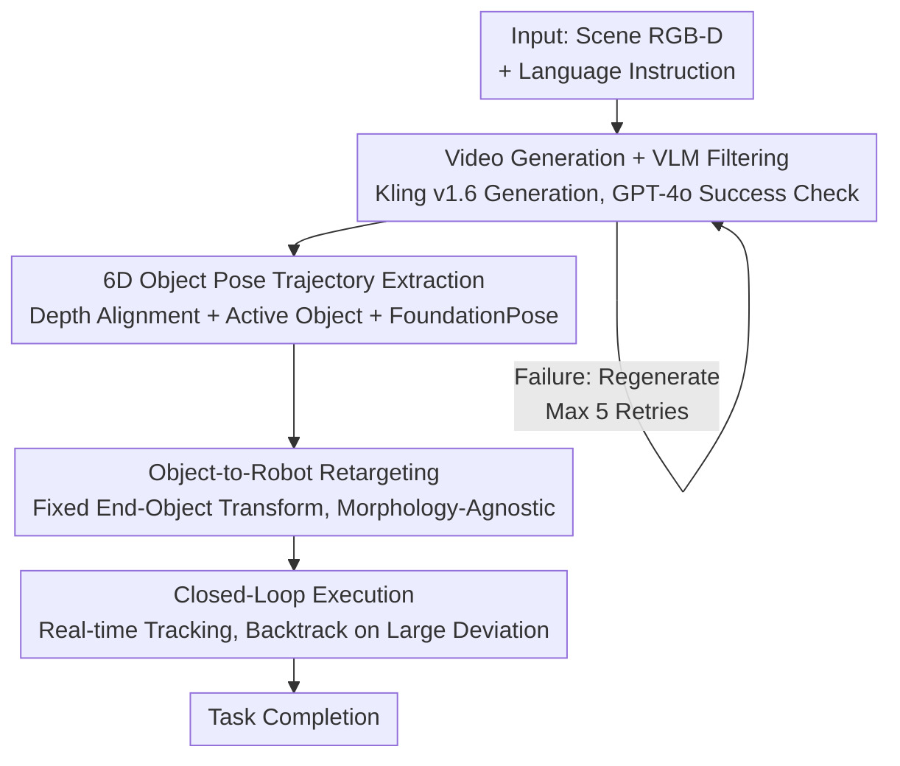

# Robotic Manipulation by Imitating Generated Videos Without Physical Demonstrations

**Conference**: ICLR 2026  
**OpenReview**: [https://openreview.net/forum?id=tv0Sz8A9Tc](https://openreview.net/forum?id=tv0Sz8A9Tc)  
**Paper**: [Project Page rigvid-robot.github.io](https://rigvid-robot.github.io/)  
**Code**: See project page  
**Area**: Robotics / Embodied AI  
**Keywords**: Robotic Manipulation, Video Generation, Imitation Learning, 6D Pose Tracking, Zero-shot demonstration

## TL;DR
RIGVid enables robots to perform manipulation tasks such as pouring water and sweeping trash using only "AI-generated videos." Given a language instruction and a scene image, the method uses a video diffusion model to generate demonstration videos, filters failed generations with a VLM, tracks 6D pose trajectories of objects from the video, and retargets them for execution by a robotic arm. This process requires no real demonstrations or robot training data, achieving performance comparable to real human demonstration videos.

## Background & Motivation

**Background**: Using video to supervise robotic manipulation primarily follows two paths: learning affordances (contact points, motion trajectories) from large-scale real video datasets, or imitating specific demonstration videos collected under controlled conditions that are highly aligned with the execution environment.

**Limitations of Prior Work**: Large-scale datasets suffer from domain gaps and require adaptation to specific robot morphologies and tasks. Collecting specialized demonstration videos involves tedious data collection, ensuring that viewpoints, morphologies, and interaction modes strictly match the target task. Both paths rely on the bottleneck of "real data," making large-scale deployment difficult.

**Key Challenge**: Video generation models (e.g., SORA, Kling) can already generate realistic videos from language and images, theoretically allowing for "on-demand generation" of demonstrations matching the current scene and task. However, generated videos often contain geometric distortions, physically implausible interactions, and unrealistic scene dynamics, leaving the question of whether "generated videos can truly be used as supervision" without a convincing proof. Previous works integrating video generation into robotics still rely on additional supervision (task-specific training or fine-tuning on offline robot trajectories).

**Goal**: Can a single generated video—precisely matching the input environment and task description at the time of generation—serve as the **sole** source of supervision for robotic manipulation, without any additional supervision or task-specific training?

**Key Insight**: The authors observe that the unreliability of generated videos can be "filtered post-hoc." VLMs can judge with high precision whether a generated video successfully executes an instruction. Furthermore, rather than predicting sparse high-level abstractions (such as keypoint constraints), it is more effective to preserve the dense pixel information of the video and accurately extract object motion using robust 6D pose tracking.

**Core Idea**: Generated video → VLM filtering → 6D object pose trajectory extraction → Retargeting to the robotic arm in an "object-centric, morphology-agnostic" manner, directly transforming "generated videos" into "executable trajectories."

## Method

### Overall Architecture

The input to RIGVid (Robots Imitating Generated Videos) consists of an RGB image of the initial scene, its corresponding depth map, and a free-form language instruction (e.g., "pour water on the plant"). The output is a 6DoF trajectory for the robot's end-effector. The pipeline converts "language + image" into "executable trajectories" step by step: first, a video diffusion model generates candidate demonstration videos, and a VLM filters out generations that fail to follow the instruction; then, depth is estimated frame-by-frame for the passed videos, the manipulated object is localized, and a 6D pose tracker extracts the object's pose trajectory; finally, the object trajectory is retargeted into an end-effector trajectory, and after grasping the object, execution proceeds in a closed loop—tracking the object pose in real-time and backtracking to retry if disturbances occur.

### Key Designs

**1. Video Generation + VLM Automatic Filtering: Converting "Unreliable Generation" into "Usable Supervision"**

The primary obstacle to using generated videos as supervision is that they often fail to follow instructions (e.g., objects not moving, water pouring from the top of the pot instead of the spout, or changes in objects/viewpoints). The authors' solution uses GPT-4o for automatic filtering—stitching 4 uniformly sampled frames vertically into a "video summary image" for the VLM to judge if the action described in the instruction was successfully executed by a visible hand. If judged as a failure, the system regenerates up to 5 times. This filtering is crucial because it transforms the fundamental issue of "unstable generation quality" into a "post-hoc selection" problem; VLM errors are almost exclusively false negatives (occasionally discarding usable videos) and rarely let incorrect videos pass. The authors verified that the Pearson correlation coefficient between GPT o1 queries and human judgment reaches $0.84$ (on average), far exceeding automated metrics in VBench++ like video-text consistency ($0.34$) and I2V subject consistency ($0.37$), indicating that existing video quality metrics are unsuitable for filtering and semantic judgment by VLMs is necessary. Kling v1.6 was chosen as the generator (best instruction following and physical plausibility), while Sora was nearly unusable due to frequent changes in layout/objects.

**2. 6D Object Pose Trajectory Extraction: Preserving Details for Execution via Dense Tracking**

Videos passing the filter must be converted into precise object motions. First, a monocular depth estimator (Ke et al.) predicts depth frame-by-frame. Since predicted depth is only relative (possessing scale-shift ambiguity), the first frame's predicted depth is aligned with the real depth map near the active object to solve for an affine scale-and-shift transform, which is then applied to the entire video to anchor depth to real-world units. Next, the active object is localized: GPT-4o infers the most likely object category from the initial image and instruction, Grounding DINO generates a bounding box, and SAM-2 refines it into a segmentation mask. With masks and scaled depth, the FoundationPose tracker tracks the object's 6D pose throughout the video (requiring an object mesh, pre-reconstructed using BundleSDF from a short RGBD video rotating around the object; the appendix also validates that mesh-free solutions are feasible but currently too slow for real-time inference). Persisting with 6D pose extraction rather than more compact representations is motivated by experimental evidence: compared to VLM-predicted keypoint constraints or sparse point tracking/optical flow, structured 6D trajectories from dense tracking are significantly more robust to object rotation, occlusion, and rapid depth changes.

**3. Object-to-Robot Retargeting: Leveraging "Object-End Effector Fixed Transform" for Cross-Morphology Transfer**

After obtaining the object trajectory, a grasp is performed first—using AnyGrasp to select the highest-scoring grasp near the object mask. Once grasped, retargeting is performed: since the object is held firmly, a fixed rigid body transformation is assumed between the end-effector and the object. This transform is composed of the object's pose relative to the gripper at the moment of grasping and the gripper's offset relative to the end-effector. Applying this fixed "end-effector-to-object" transform to each pose in the object trajectory yields the end-effector trajectory, ensuring the robot follows the object’s motion while maintaining a stable grasp. The beauty of this design is that it is naturally robot-agnostic: to change robots or grippers, only this single "end-effector-to-object" transform needs to be updated to reflect the new configuration; the object trajectory itself remains unchanged, facilitating easy cross-platform migration.

**4. Closed-loop Execution: Real-time Tracking + Deviation Backtracking for Robustness**

Executing trajectories in a one-time open-loop fashion is fragile. In deployment, RIGVid uses FoundationPose for continuous real-time tracking of the object's 6D pose to update the end-effector trajectory. If the object deviates from the precomputed trajectory due to external disturbances (a person pushing the robot or slippage after grasping), the system detects the deviation by comparing the current pose with the precomputed trajectory. If the deviation exceeds thresholds of $3\text{cm}$ in position or $20°$ in orientation, the robot backtracks to the last successfully executed trajectory point and resumes. This recovery mechanism allows the method to re-align and complete tasks under disturbance, serving as a critical patch for using "static generated trajectories" in the real physical world.

## Key Experimental Results

Evaluation was conducted on an xArm7 robotic arm with an Orbbec Femto Bolt camera across four daily manipulation tasks: pouring water, lifting a pot lid, placing a spatula, and sweeping trash (covering diverse challenges like depth changes and slender/partially occluded objects).

### Main Results

| Comparison Dimension | Configuration | Avg. Success Rate | Description |
|----------------------|---------------|-------------------|-------------|
| vs VLM Abstraction | **Ours** | **85%** | Average across four tasks |
| vs VLM Abstraction | ReKep (VLM Keypoint Constraints) | 50% | Failure due to inaccurate keypoint prediction |
| Trajectory Extraction | **Ours** (6D Object Pose) | **85.0%** | This work |
| Trajectory Extraction | Gen2Act (Generated Goal + Point Tracking) | 67.5% | Point loss during occlusion/rotation |
| Trajectory Extraction | 4D-DPM (Feature Fields) | 35.0% | Unstable tracking |
| Trajectory Extraction | AVDC (Optical Flow) | 32.5% | Flow error accumulation across frames |
| Trajectory Extraction | Track2Act (Point Tracking) | 7.5% | Poor generalization of tracking network |

### Ablation Study

| Configuration | Key Finding | Description |
|---------------|-------------|-------------|
| Before vs After Filtering (Kling v1.6) | Pour 80→100, Lid 60→80, Spatula 50→90, Trash 20→70 | VLM filtering significantly improves reliability |
| Increasing Gen Quality | Sora 0% → Kling v1.5 → Kling v1.6 (Highest) | Success rate correlates positively with video quality |
| Filtered Kling v1.6 vs Human Video | Roughly Equal | Generated videos can now replace real demonstrations |
| Filtering Metric Comparison | GPT o1 Corr 0.84 > video-text 0.34 / I2V 0.37 | Only VLM semantic judgment is reliable |

### Key Findings
- **Filtering is a Performance Amplifier**: Without filtering, Sora videos lead to a 0% success rate. Using GPT-4o filtering, Kling v1.6 success in the difficult sweeping task jumped from 20% to 70%, showing that "generation + filtering" is more effective than solely improving generation quality.
- **6D Pose Tracking is the Source of Robustness**: The harder the task (slender objects, heavy occlusion, rapid depth changes), the greater the advantage of RIGVid over other trajectory extraction methods—performing 20–25% better than the second-best baseline in spatula placement and sweeping. Dense 6D trajectories are more stable under occlusion than sparse points or optical flow.
- **Failures are Mostly from Depth Estimation**: When using filtered Kling v1.6, except for one instance of an object slipping from the gripper, all failures were attributed to trajectory inaccuracies caused by monocular depth estimation errors. Since human videos suffer from the same issue, the bottleneck lies in the depth model itself rather than the video generation.

## Highlights & Insights
- **"Unreliable Generation" as "Post-hoc Filterable"**: The core insight is to not demand that every generated video be correct, but to acknowledge their unreliability and use high-precision VLM filtering, decoupling the problem into "Selection + Tracking," which is immediately practical.
- **Dense Information vs. Compression to Abstractions**: The authors counter-intuitively argue that "generating full video pixels" is not a waste—compact abstractions generated by VLMs (keypoints/constraints) lack the rich details required for execution. Higher computational costs for more reliable supervision are preferred.
- **Object-Centric + Fixed Transform = Cross-Morphology**: Defining trajectories on the object, with the robot requiring only an "end-to-object" transform, allows zero-cost transfer between robots—a design pattern reusable in other video-to-manipulation works.
- **Generative Progress Translates to Manipulation Ability**: Success rates scale monotonically with generation quality, implying that every upstream advancement in video generation will automatically enhance robotic capabilities, an attractive "ride the coat-tails" trend.

## Limitations & Future Work
- **High Computational Overhead**: Video generation is inherently expensive, which remains the primary drawback of this paradigm.
- **Reliance on Pre-reconstructed Meshes**: FoundationPose requires pre-reconstructing object meshes with BundleSDF (requiring a video recorded around the object), limiting use in scenarios where meshes cannot be precomputed; mesh-free alternatives are feasible but currently lack real-time inference speeds.
- **Bottlenecked by Depth Models**: Major failures stem from monocular depth estimation errors, locking the system’s precision to the performance ceiling of current depth models.
- **Limited Task/Scene Scale**: Evaluations were limited to four tabletop tasks under fixed initial configurations; complex long-horizon tasks and multi-object interactions remain unverified.

## Related Work & Insights
- **vs ReKep (VLM Keypoint Constraints)**: ReKep uses VLMs to generate relational keypoint constraints to solve for 6D trajectories, while this work generates full videos to extract 6D poses. The difference is that dense videos preserve execution details; the 85% vs 50% result suggests compression into sparse abstractions loses critical information.
- **vs Gen2Act (Generated Goal + Point Tracking)**: Also utilizes generated videos but relies on sparse point tracking, which fails during occlusion or large rotations. RIGVid uses 6D pose tracking, outperforming it by 17.5% on difficult tasks.
- **vs Liang et al. (Tracking End-effector Tools)**: The most similar work tracks robot end-effector tools but requires 1,822 human-collected robot demonstrations and is limited to tool-based tasks. RIGVid tracks the objects, requires no robot data, and covers a broader range of tasks.
- **vs Large-scale Video Affordance Learning (Bahl et al.)**: These learn contact maps/trajectory waypoints from internet videos but suffer from domain gaps. This work does not predict affordances; instead, it generates task- and scene-specific videos for imitation, bypassing the domain gap.

## Rating
- Novelty: ⭐⭐⭐⭐⭐ First to prove pure generated videos can serve as the sole supervision for robotic manipulation; clear paradigm.
- Experimental Thoroughness: ⭐⭐⭐⭐ Solid real-robot evaluations across four tasks and multiple baselines, though task count is relatively small and long-horizon tasks are missing.
- Writing Quality: ⭐⭐⭐⭐⭐ Motivation, pipeline, and comparative logic are clear; honest failure analysis.
- Value: ⭐⭐⭐⭐⭐ Directly links "video generation progress" to "robot capability" without data collection; high practical value.

<!-- RELATED:START -->

## Related Papers

- [\[CVPR 2026\] Spatial-Aware VLA Pretraining through Visual-Physical Alignment from Human Videos](../../CVPR2026/robotics/spatial-aware_vla_pretraining_through_visual-physical_alignment_from_human_video.md)
- [\[ICLR 2026\] MoMaGen: Generating Demonstrations under Soft and Hard Constraints for Multi-Step Bimanual Mobile Manipulation](momagen_generating_demonstrations_under_soft_and_hard_constraints_for_multi-step.md)
- [\[ICLR 2026\] When would Vision-Proprioception Policies Fail in Robotic Manipulation?](when_would_vision-proprioception_policies_fail_in_robotic_manipulation.md)
- [\[CVPR 2026\] AffordGen: Generating Diverse Demonstrations for Generalizable Object Manipulation with Affordance Correspondence](../../CVPR2026/robotics/affordgen_generating_diverse_demonstrations_for_generalizable_object_manipulatio.md)
- [\[ICLR 2026\] Actions as Language: Fine-Tuning VLMs into VLAs Without Catastrophic Forgetting](actions_as_language_fine-tuning_vlms_into_vlas_without_catastrophic_forgetting.md)

<!-- RELATED:END -->
