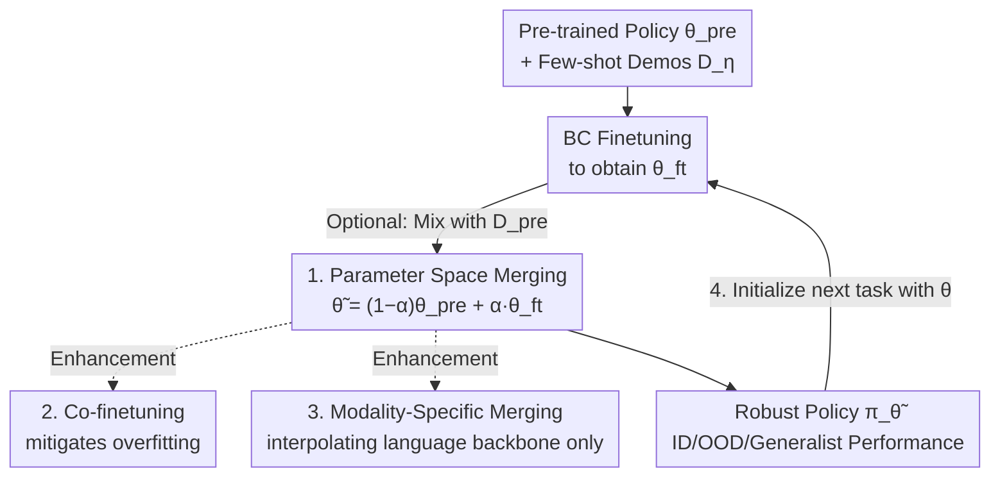

# Robust Finetuning of Vision-Language-Action Robot Policies via Parameter Merging

**Conference**: ICLR 2026  
**OpenReview**: [https://openreview.net/forum?id=uWJwQ5SZoM](https://openreview.net/forum?id=uWJwQ5SZoM)  
**Paper**: [Project Page](https://retain.yajatyadav.com)  
**Code**: To be open-sourced (Authors promised sharing during review and public release)  
**Area**: Robotics / Embodied AI / VLA / Model Merging  
**Keywords**: VLA Policy, Robust Finetuning, Weight Interpolation, Model Merging, Continual Learning

## TL;DR
To address the issues of generalization loss and overfitting when few-shot finetuning generalist robot policies, this paper proposes RETAIN. It performs linear interpolation between the pre-trained and finetuned policies directly in **parameter space**. With no additional training or inference overhead, it enables a single policy to robustly complete various out-of-distribution (OOD) variants of new skills while retaining pre-trained general capabilities. The average OOD success rate on real robots is approximately 40% higher than the previous best methods.

## Background & Motivation
**Background**: Generalist policies trained on large-scale diverse robot data (e.g., π0, π0-FAST-DROID) have demonstrated strong generalization across scenes, viewpoints, objects, and language instructions. However, for specific downstream tasks, the standard practice remains behavioral cloning (BC) finetuning using a small batch of task-specific demonstration data (typically < 100 demos, a few hours of data).

**Limitations of Prior Work**: In such "small-data finetuning" scenarios, existing methods suffer from severe overfitting to the small demo set. Not only do they lose pre-trained general capabilities (performing worse on non-target tasks), but they also fail to generalize on the target task itself—achieving 70–80% success locally (ID) while dropping to 30–50% success when object instances, positions, backgrounds, or viewpoints change (OOD). Worse, prolonged training can even cause ID performance to degrade.

**Key Challenge**: A trade-off exists between general capability and task specialization. Gradient descent finetuning shifts weights toward the direction of the small dataset, overwriting the generalization knowledge inherent in the pre-trained model. The issue is not the "absence of generalization knowledge," but that "finetuning washes away existing generalization knowledge."

**Goal**: To obtain a single policy that robustly generalizes new skills to unseen variants while preserving broad pre-trained capabilities, and to further support lifelong learning by "merging" multiple skills into the same backbone sequentially.

**Key Insight**: Research in Vision/Language fields suggests that interpolating weights of pre-trained and finetuned models (model souping, task arithmetic) improves robustness to distribution shift. The authors apply this idea to robot VLA policies for the first time, adapting it for "multimodal" and "continual learning" characteristics.

**Core Idea**: Instead of using the finetuned policy directly, the weights of the **pre-trained generalist policy** and the **finetuned policy** are linearly interpolated. A merging coefficient $\alpha$ is used to slide between "retaining generality" and "task mastery" to find the optimal point.

## Method

### Overall Architecture
The input to RETAIN (Robust finE-tuning wiTh pArameter mergINg) is a pre-trained generalist policy $\pi_{\theta_{\text{pre}}}$ and a small set of target task demonstrations $D_\eta$; the output is a merged policy $\pi_{\tilde\theta}$. The process is straightforward: first, the generalist policy is finetuned via BC on the target task to obtain $\theta_{\text{ft}}$, then $\theta_{\text{pre}}$ and $\theta_{\text{ft}}$ are linearly interpolated in the weight space by coefficient $\alpha$ to obtain the final weights $\tilde\theta$. Three optional enhancements are layered: mixing pre-trained data during finetuning (co-finetuning), modality-specific merging (e.g., only merging the language backbone), and iterative merging for continual skill acquisition.

### Key Designs

**1. Parameter Space Linear Interpolation: Reconciling Generality and Specialization**

This is the core of RETAIN, targeting the loss of pre-trained generalization knowledge. Given pre-trained weights $\theta_{\text{pre}}$ and finetuned weights $\theta_{\text{ft}}$, the final weights are calculated as:

$$\tilde\theta = (1-\alpha)\cdot\theta_{\text{pre}} + \alpha\cdot\theta_{\text{ft}}$$

where $\alpha\in[0,1]$ is the merging coefficient: $\alpha=0$ recovers the pre-trained model, and $\alpha=1$ recovers the finetuned model. The advantage is that this step requires no additional training or inference overhead—it is a weighted average of two weight sets. Analysis (Fig. 10) shows that OOD performance follows an inverted U-shape relative to $\alpha$: as long as the merged model is not too biased toward the pre-trained end (which lacks task knowledge), an intermediate range exists that achieves ID performance close to the finetuned model while significantly improving OOD and maintaining generalist task performance. In other words, the "task-learning" direction and the "generalization" direction can coexist via interpolation in weight space. Choosing $\alpha$ is lightweight: one OOD scene is used as a validation set (selecting from $\{0.25, 0.5, 0.75\}$ on DROID), and the value is applied to other OOD scenes without further tuning.

**2. Co-finetuning: Reducing Overfitting at the Finetuning Source**

While merging is effective, if the finetuned endpoint $\theta_{\text{ft}}$ is derived from pure task-FT on tiny data, it is already heavily overfitted. Even if pulled back toward pre-trained weights, it's harder to recover general capabilities. Therefore, when pre-trained data $D_{\text{pre}}$ (or its subset) is available, the authors mix $D_\eta$ and $D_{\text{pre}}$ during finetuning (RETAIN-co-FT). Co-finetuning and model merging play **complementary** roles in regularization: co-finetuning prevents the finetuned endpoint from overfitting the small target set, but it does not actively "invoke" pre-trained knowledge for new task generalization. Weight merging explicitly pulls pre-trained knowledge back in. Combined, RETAIN-co-FT almost always outperforms RETAIN-task-FT on generalist evaluations and most OOD tasks.

**3. Modality-Specific Merging: Interpolating the Language Backbone Only**

Robot VLA is inherently multimodal: a vision encoder $v$, a language model backbone $l$, and an action expert $a$. The paper decomposes the single $\alpha$ into modality-specific coefficients:

$$\begin{bmatrix}\tilde\theta_v\\ \tilde\theta_l\\ \tilde\theta_a\end{bmatrix} = \left(1-\begin{bmatrix}\alpha_v\\ \alpha_l\\ \alpha_a\end{bmatrix}\right)\odot\begin{bmatrix}\theta_{\text{pre},v}\\ \theta_{\text{pre},l}\\ \theta_{\text{pre},a}\end{bmatrix} + \begin{bmatrix}\alpha_v\\ \alpha_l\\ \alpha_a\end{bmatrix}\odot\begin{bmatrix}\theta_{\text{ft},v}\\ \theta_{\text{ft},l}\\ \theta_{\text{ft},a}\end{bmatrix}$$

Grid search revealed a counter-intuitive finding: OOD performance is most sensitive to $\alpha_l$ (language) (highest color gradient, optimal at $\alpha_l=0.8$), while $\alpha_v$ and $\alpha_a$ are best near 1 (using finetuned weights). The optimal setting is $\alpha_v=\alpha_a=1$. This suggests that **only the language backbone needs interpolation** ($\alpha_l<1$); the vision encoder and action expert can retain finetuned values. Comparative experiments confirm that "merging only language parameters" performs nearly identically to "merging all parameters," suggesting that the "source" of generalization and robustness primarily resides in the language backbone.

**4. Sequential Merging: Iterative Skill Acquisition**

Since RETAIN preserves general capabilities on the pre-trained distribution, it is naturally suited for continual learning. By using the merged result of the previous stage as the initialization for the next task’s finetuning, new skills can be iteratively "welded" into the backbone:

$$\tilde\theta_n = (1-\alpha)\cdot\tilde\theta_{n-1} + \alpha\cdot\theta_{\text{ft},n},\quad n\in\{1,\dots,N\}$$

where $\theta_{\text{ft},n}$ are weights finetuned on the $n$-th task. Unlike traditional continual learning which focuses on "preventing forgetting of old skills," the goal here is to inherit and pass down the **generalization capability** of the pre-trained model to learn new tasks robustly. Experiments learning plates → whiteboard sequentially show that the final policy outperforms the strong co-FT baseline on ID/OOD for both tasks.

### Loss & Training
The finetuning endpoint uses a standard BC objective for policy $\pi_\theta$ and demo set $D$:

$$\mathcal{L}_{\text{BC}}(\theta;D) = -\frac{1}{|D|}\sum_{(s_t,a_t,T)\in D}\log\pi_\theta(a_t\mid s_t,T)$$

Two finetuning settings are used: task-FT (only target $D_\eta$, suitable when pre-trained data is unavailable) and co-FT (mixed $D_\eta$ and $D_{\text{pre}}$). The merging coefficient $\alpha$ is not learned but fixed after selection via an OOD validation scene. Pre-trained policies include π0 (flow-based action expert for LIBERO) and π0-FAST-DROID (autoregressive next-token for real-world DROID).

## Key Experimental Results

### Main Results
Evaluation was conducted on 5 finetuning tasks: two real-world DROID tasks (whiteboard wiping, plates into rack; ~50/100 demos) and three simulated LIBERO tasks (pot-on-stove, mugs-on-plates, items-into-basket; ~45 demos each). Performance was measured across ID (same distribution), OOD (changes in object/position/background/lighting/view), and Generalist (other tasks in pre-trained distribution; 44 tasks for DROID, 20 for LIBERO).

| Setting | Evaluation Scene | Baseline Finetuning | RETAIN | Description |
|------|----------|--------------|--------|------|
| DROID Real-world | OOD (test) | 30–50% | plates >60% / whiteboard ~80% | OOD avg. ~40% higher than best baseline |
| DROID Real-world | ID | 70–80% | Comparable to baselines | No sacrifice in ID fitting |
| DROID Real-world | Generalist | Significant drop | On par with pre-trained model | Almost no loss in generality |
| LIBERO Sim | ID | Near perfect | Near perfect | Sim tasks are easier |
| LIBERO Sim | OOD | Lower | Better than baselines (lower gain than DROID) | Small gain due to weaker base generality |

Baselines included: Task-FT, Co-FT, LoRA, Freeze-FT (freeze language backbone, update vision/action), and Scratch. RETAIN-task-FT and RETAIN-co-FT led significantly in OOD; specifically, OOD success on "whiteboard" nearly matched ID, indicating the skill was completed regardless of scene changes.

### Ablation Study

| Configuration | Key Finding | Description |
|------|---------|------|
| $\alpha$ Scanning | OOD is an inverted U-shape w.r.t. $\alpha$ | Too close to pre-trained → lack of task knowledge, ~0 success |
| RETAIN-co-FT vs RETAIN-task-FT | co-FT almost always better on Generalist, mostly better on OOD | Merging and co-FT regularization are complementary |
| Modality Grids ($\alpha_v,\alpha_l,\alpha_a$) | $\alpha_l$ most impactful, optimal $\alpha_l=0.8$; $\alpha_v=\alpha_a=1$ is best | Only language backbone requires merging |
| language-partition vs all-partition | Nearly identical performance | Source of generalization concentrated in language backbone |
| Pre-training Data Scale (20k / 76k / Full+PI) | OOD gain increases with more data | RETAIN scales with pre-trained generality |
| Continual Learning (plates→whiteboard) | Outperforms co-FT on both tasks' ID/OOD | Sequential merging preserves previous skills |

### Key Findings
- **Generalization "Source" Locatable to Language Backbone**: Modality grid search revealed OOD performance is most sensitive to $\alpha_l$, while using finetuned weights for vision/action is best. This narrows the mechanism of "why merging works" to language parameters and simplifies practical use (tuning only $\alpha_l$).
- **Stronger Pre-training Base, Larger Merging Gains**: Using DROID pre-trained policies of three different sizes, OOD gains rose monotonically with pre-training data. The smaller gains in LIBERO were attributed to the base model's lack of inherent generality; merging "transports" pre-trained knowledge, so a stronger base allows for more transport.
- **Merging and Co-finetuning are Additive, Not Substitutes**: Co-FT prevents overfitting but doesn't actively invoke pre-trained knowledge; merging explicitly recovers pre-trained knowledge in parameter space. Their mechanisms are complementary.

## Highlights & Insights
- **Zero-Overhead Robust Finetuning**: The core method is a weighted average of two weight sets. No changes to the training pipeline, no inference cost, yet it raises real-world OOD success by ~40%—a "surprisingly simple" but effective trick that is easy to deploy.
- **Generalization as a Transportable Asset**: The most profound insight is that a pre-trained policy's generalization capacity can be "inherited and passed down" via interpolation, rather than being an inevitable sacrifice of finetuning. It systemsatizes the intuition of CV/NLP "model souping" for robot VLA.
- **Transferability of Modality-Specific Merging**: The discovery that "only merging the language backbone" suffices is transferable to any VLA finetuning scenario, reducing expensive multimodal parameter tuning to a single language coefficient.
- **Merging as Continual Learning**: Iterative merging serves as an interface for lifelong learning, "welding" new skills without losing old ones, a concept transferable to other foundation policies requiring incremental skill additions.

## Limitations & Future Work
- **Lack of Mechanistic Explanation**: Authors acknowledge they do not fully understand "why parameter merging brings such strong generalization"; only hypotheses were provided in the appendix. The theory remains an open question.
- **Manual $\alpha$ Hyperparameter**: While robust on real robots, it still requires lightweight tuning. Developing a heuristic for selecting coefficients without an OOD validation scene is a clear future direction.
- **Reliance on Strong Base Models**: Gains are noticeably smaller when the base generality is weak (e.g., LIBERO). The method is essentially "transporting" pre-trained generalization.
- **OOD Evaluation Scope**: The coefficient is tuned on one OOD scene and applied to others. The generalization conclusions are based on specific variants tested (object/position/background/lighting/view); whether they hold for more extreme distribution shifts remains to be verified.

## Related Work & Insights
- **vs. Standard Task-FT / Co-FT**: These use finetuned weights directly, which suffer from heavy overfitting (OOD 30–50%). RETAIN adds a weight interpolation step to pull back pre-trained knowledge, significantly boosting OOD without sacrificing ID.
- **vs. LoRA / Freeze-FT**: These limit trainable parameters to "preserve" pre-trained capability, but excessive constraints can hinder adaptation to new tasks (e.g., slightly worse ID on whiteboard). RETAIN allows full finetuning and reconciles weights post-hoc.
- **vs. CV/NLP Model Merging**: Those works interpolate pre-trained and finetuned models for robustness in single-modality tasks. This paper extends it to multimodal robot VLA and discovers that "merging only the language backbone" is effective.
- **vs. Traditional Continual Learning (e.g., EWC)**: Traditional methods focus on not forgetting old skills. RETAIN's goal is to inherit the **generalization capability** of the pre-trained model to learn new tasks robustly, implemented via simpler iterative interpolation.

## Rating
- Novelty: ⭐⭐⭐⭐ While the technique is known in CV/NLP, its systematic application to VLA robotics—and findings like language-specific merging and sequential scaling—provide valuable new insights.
- Experimental Thoroughness: ⭐⭐⭐⭐⭐ Real DROID + Sim LIBERO with 5 tasks, 3 evaluation types, 5 baselines, plus extensive ablations on $\alpha$, modalities, data scale, and continual learning.
- Writing Quality: ⭐⭐⭐⭐ Clear motivation and thorough mechanism analysis. Minor OCR issues in some formulas.
- Value: ⭐⭐⭐⭐⭐ Zero overhead, easy to replicate, and +40% real-world OOD success makes it highly practical for deploying generalist robot policies.

<!-- RELATED:START -->

## Related Papers

- [\[CVPR 2026\] Boosting Vision-Language-Action Finetuning with Feasible Action Neighborhood Prior](../../CVPR2026/robotics/boosting_vision-language-action_finetuning_with_feasible_action_neighborhood_pri.md)
- [\[CVPR 2026\] MergeVLA: Cross-Skill Model Merging Toward a Generalist Vision-Language-Action Agent](../../CVPR2026/robotics/mergevla_cross-skill_model_merging_toward_a_generalist_vision-language-action_ag.md)
- [\[ICLR 2026\] VLM4VLA: Revisiting Vision-Language-Models in Vision-Language-Action Models](vlm4vla_revisiting_vision-language-models_in_vision-language-action_models.md)
- [\[ICLR 2026\] UniVLA: Unified Vision-Language-Action Model](unified_vision-language-action_model.md)
- [\[ICLR 2026\] Hybrid Training for Vision-Language-Action Models](hybrid_training_for_vision-language-action_models.md)

<!-- RELATED:END -->
