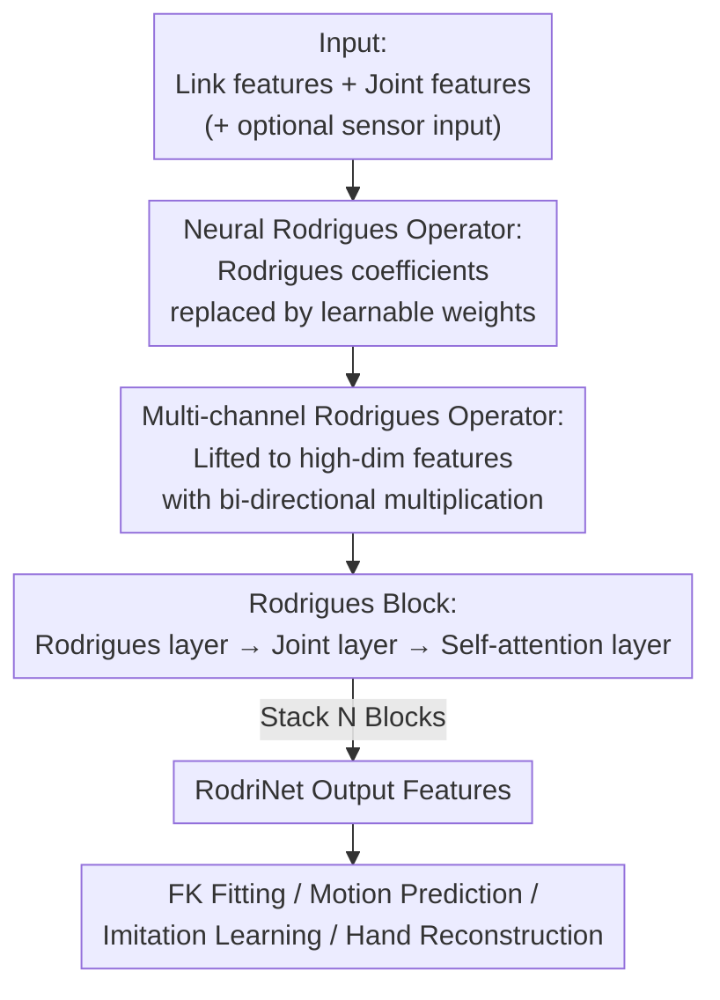

# Rodrigues Network for Learning Robot Actions

**Conference**: ICLR 2026  
**OpenReview**: [https://openreview.net/forum?id=IZHk6BXBST](https://openreview.net/forum?id=IZHk6BXBST)  
**Code**: None  
**Area**: Robotics / Embodied AI / Neural Network Architecture  
**Keywords**: Articulated robots, forward kinematics, inductive bias, Rodrigues' rotation formula, imitation learning

## TL;DR
This paper transforms the classical Rodrigues' rotation formula into a learnable Neural Rodrigues Operator and constructs RodriNet, an architecture that explicitly encodes joint kinematic structures. RodriNet significantly outperforms general backbones like MLP, GCN, and Transformer across four categories of tasks: forward kinematics fitting, motion prediction, robot arm imitation learning, and single-image hand reconstruction.

## Background & Motivation
**Background**: The "actions"—poses, movements, and control commands—of articulated systems (robot arms, dexterous hands, quadrupeds, humanoids, animation characters, and human hands) are essentially sets of values associated with joints, naturally carrying a kinematic tree structure. However, mainstream action learning networks mostly adopt MLPs and Transformers from vision or language domains, treating actions as a collection of unstructured tokens.

**Limitations of Prior Work**: MLPs and Transformers lack the inductive bias reflecting joint relationships. Some works attempt to introduce structural priors via graph convolutions (based on link connectivity) or masked attention. However, these methods only capture topological connectivity (which links are adjacent) without embedding the **kinematic computation pattern** itself—how joint angles drive sub-link movements via rotation—into the network.

**Key Challenge**: Directly inserting analytical Forward Kinematics (FK) as a differentiable layer (e.g., Villegas et al.) introduces kinematic awareness but constrains the model to fixed FK calculations, losing flexibility for high-level feature learning. Conversely, adding Cartesian-space losses after the network output does not change the architecture and is orthogonal to this paper's goal. Designing an architecture that preserves kinematic structural priors without sacrificing expressive flexibility remains a challenge.

**Goal**: To design a network architecture that embeds joint kinematics as an inductive bias into neural computation while maintaining representational capacity.

**Key Insight**: The authors draw an analogy to CNNs in computer vision. Low-level image features are local and translation-equivariant. Classical vision utilized manual filters (Canny edge, Harris corner) to exploit this structure. CNNs turned filters into learnable parameters, added non-linearity, and increased channel dimensions, thus preserving structural properties while learning semantic features. The authors suggest that kinematics has a similar "base filter"—the Rodrigues' rotation formula, which is the core operator for articulated FK.

**Core Idea**: Relax the fixed coefficients in the Rodrigues' rotation formula that depend only on structure into learnable weights, and generalize joint angles into abstract features. This results in a "Learnable FK Operator," which is used as a building block for a deep kinematic-aware network similar to a CNN.

## Method

### Overall Architecture
RodriNet addresses the problem of encoding, understanding, and predicting movements given action features attached to joints/links (plus optional perceptual inputs) while explicitly utilizing the kinematic tree structure. The core pipeline upgrades the "classical Rodrigues formula" into "deep network modules": first, the single-joint formula is transformed into a learnable single-channel operator, then extended to a multi-channel operator. This operator serves as the component for a Rodrigues Block (consisting of three layers: Link Update, Joint Update, and Global Attention). Finally, multiple Blocks are cascaded into a full network, followed by task-specific heads.

### Key Designs

**1. Neural Rodrigues Operator: Relaxing Fixed Coefficients into Learnable Weights**

The issue with inserting analytical FK into a network is that it locks the model. The authors' breakthrough comes from an observation of the Rodrigues formula $R(\hat\omega, \theta) = I_3 + \sin\theta\,[\hat\omega] + (1-\cos\theta)\,[\hat\omega]^2$: every element is a linear combination of $1$, $\cos\theta$, and $\sin\theta$, where coefficients are determined solely by the rotation axis $\hat\omega$, a **state-independent** structural quantity. Thus, the pose transformation from parent to child link $P_{c_j} = P_{p_j}(T_j\tilde R(\hat\omega_j,\theta_j))$ can be rewritten as:

$$P_{c_j} = P_{p_j}(A_j + B_j\cos\theta_j + C_j\sin\theta_j)$$

where $A_j, B_j, C_j \in \mathbb{R}^{4\times4}$ depend only on the robot structure. The key step is replacing these fixed coefficient matrices with learnable weights $W^{bias}, W^{cos}, W^{sin}$, and generalizing the scalar joint angle into abstract joint features $\Theta$:

$$F^{out} = F^{in}(W^{bias} + W^{cos}\cos\Theta + W^{sin}\sin\Theta)$$

This design is effective due to its "dual identity": when $\Theta=\theta_j$ and weights match real coefficients, the operator degenerates into exact FK. Once weights are learnable, it spans a functional space larger than FK, capable of encoding high-level features beyond simple joint angles or link poses. Usefully, it preserves kinematic inductive bias while regaining expressive flexibility.

**2. Multi-channel Operator: Lifting to High-Dimensional Features and Bi-directional Multiplication**

A single-joint operator acting on 1D joint features and $4\times4$ link features has limited capacity. The authors expand link features to $F\in\mathbb{R}^{C_L\times4\times4}$ and joint features to $\Theta\in\mathbb{R}^{C_J}$, with weights lifted to multi-channel tensors. The single-joint transformation kernel becomes:

$$U[i,j] = W^{bias}[i,j] + \sum_{c=1}^{C_J}\Big(W^{cos}[i,j,c]\cos(\Theta[c]) + W^{sin}[i,j,c]\sin(\Theta[c])\Big)$$

The output is aggregated across input channels. To further enhance expressivity, a conjugate kernel $\bar U$ is learned, allowing the input link features to be multiplied from both the left and right:

$$F^{out}[j] = \sum_{i=1}^{C_L}\Big(F^{in}[i]\,U[i,j] + \bar U[i,j]\,F^{in}[i]\Big)$$

Bi-directional multiplication is used because rotation matrices in homogeneous transformations can act as left operators (changing subsequent frames) or carry right-side context. Bi-directional multiplication allows the operator to express more symmetric and complex transformation combinations. This complete operator, denoted as $F^{out}=\text{Rodrigues}(F^{in}, W^*, \Theta)$, is the fundamental component for all subsequent layers.

**3. Rodrigues Block: Link Layer, Joint Layer, and Self-attention Layer**

A Rodrigues Block sequentially executes three layers to propagate information along the kinematic tree. The **Rodrigues Layer** applies the multi-channel operator across the tree: each joint $J_j$ possesses its own Rodrigues kernel $W^*_j$, transforming parent link features $F^{in}_{p_j}$ to child links with normalization—$F^{out}_{c_j}=\text{LayerNorm}(F^{in}_{c_j}+\text{Rodrigues}(F^{in}_{p_j}, W^*_j, \Theta^{in}_j))$. This is a "joint-to-link" hierarchical message passing. The **Joint Layer** operates in reverse, "link-to-joint": each joint takes its child link features, applies a joint-specific linear transformation, and adds it back—$\Theta^{out}_j=\text{Linear}_j(\text{Flatten}(F^{in}_{c_j}))+\Theta^{in}_j$. These layers utilize local spatiality along the tree. Finally, a **Self-attention Layer** is added: link features are projected into tokens, enabling interaction between all links via multi-head self-attention. An optional **global token** $G$ is introduced for task-level information independent of specific joints (e.g., base pose prediction for free-floating robots).

### A Complete Example
Using the LEAP dexterous hand (16 joints, 17 links, free-floating base) for FK fitting: the input is the configuration $(T, R, \theta)$, and the goal is to predict the pose matrices of all 17 links. Information propagates from the palm root along the tree in the Rodrigues layer—at each joint, the learnable Rodrigues kernel rotates parent features based on current angles and aggregates them into child features. The joint layer feeds link information back into joint features, while the self-attention layer allows distant fingertips to communicate with the palm root to correct cumulative errors. Multiple blocks result in significantly lower fingertip pose error compared to MLP/GCN, as the latter fails to model how errors propagate joint-by-joint along kinematic chains.

## Key Experimental Results

### Main Results

Forward Kinematics Fitting (LEAP Hand, MSE↓): The network built solely with Rodrigues layers significantly out-performs all general backbones with faster convergence and higher data efficiency.

| Backbone | MSE |
|----------|-----|
| MLP      | 6.32e-04|
| GCN      | 5.07e-04|
| BoT      | 5.37e-06|
| Transformer | 5.26e-06|
| **Rodrigues (Rodrigues Layer only)** | **2.82e-07** |

Cartesian Motion Prediction (UR5, trainset=$10^5$): Ours achieves the best results across all metrics. Its **test MSE is lower than the training MSE of all baselines**, indicating better fitting and stronger generalization without overfitting.

| Backbone | ErrorT (mm) | ErrorR (°) | Errorθ (°) | MSE (1e−6) |
|----------|-------------|------------|------------|------------|
| MLP      | 3.49        | 0.46       | 0.17       | 22.52      |
| GCN      | 3.55        | 0.48       | 0.17       | 18.52      |
| BoT      | 2.92        | 0.46       | 0.15       | 15.72      |
| Transformer | 2.89      | 0.41       | 0.14       | 12.86      |
| **Rodrigues** | **1.21**  | **0.16**   | **0.06**   | **2.56**   |

### Imitation Learning & Hand Reconstruction

Using RodriNet as the denoising backbone for Diffusion Policy (~17M parameters) on 5 Franka manipulation tasks in ManiSkill (Success rate, 5 seeds):

| Method | PushCube | PickCube | StackCube | PegInsertion | PlugCharger | Avg |
|--------|----------|----------|-----------|--------------|-------------|-----|
| Transformer-DP | 0.98 | 0.63 | 0.38 | 0.18 | 0.04 | 0.44 |
| UNet-DP | 1.00 | 0.85 | 0.37 | 0.56 | 0.13 | 0.58 |
| **Rodrigues-DP** | 1.00 | **0.94** | **0.44** | **0.58** | 0.10 | **0.61** |

Single-image 3D Hand Reconstruction (FreiHAND, replacing transformer in HaMeR): Surpassing SOTA while significantly reducing parameters (39.5M → 10.7M).

| Method | PA-MPJPE↓ | PA-MPVPE↓ | F@5↑ | F@15↑ |
|--------|-----------|-----------|------|-------|
| HaMeR  | 6.0       | 5.7       | 0.785| 0.990 |
| HaMeR (repro) | 6.2 | 5.9       | 0.774| 0.989 |
| **Ours** | **5.9**   | **5.6**   | **0.793**| **0.991** |

### Key Findings
- **Kinematic Inductive Bias benefits most when the network is the bottleneck**: Geometric control tasks like PickCube/StackCube show significant improvement (PickCube 0.85 → 0.94). Tasks involving complex contact dynamics like PegInsertionSide/PlugCharger, which lack tactile/force feedback, show limited improvement, suggesting gains are task-dependent.
- **FK fitting is a non-trivial task**: MLP/GCN exhibit cumulative error at fingertips, causing visible artifacts, confirming that the spatial and hierarchical dependencies of kinematic mapping must be explicitly modeled.
- **Structural priors provide data efficiency**: Rodrigues network leads consistently across various training set sizes, with test errors often lower than baseline training errors.

## Highlights & Insights
- **Treating classical control formulas as "Learnable Filters"**: The most elegant step is identifying the linear structure of "state-dependent terms ($\cos\theta, \sin\theta$) × structural coefficients" in the Rodrigues formula, only relaxing the latter into learnable weights. This approach parallels the evolution of CNNs from manual filters, showing high transferability.
- **Degeneration guarantee provides a theoretical anchor**: The operator can exactly degenerate into real FK with specific weights, meaning its hypothesis space is a strict superset of FK. This ensures the network will at least perform as well as analytical FK.
- **Cross-domain versatility**: The same architecture serves as a denoiser for Diffusion Policy and a replacement for Transformers in MANO hand reconstruction with parameter reduction, indicating it captures the essence of articulated systems rather than robot-specific traits.

## Limitations & Future Work
- **No modeling of link geometry**: The operator encodes joint kinematics but does not currently utilize link shape information, which could be detrimental in tasks requiring fine contact reasoning.
- **Rotation joints only**: The Neural Rodrigues Operator is currently restricted to 1-DoF revolute joints; prismatic joints are not yet incorporated.
- **Imitation focus**: Robot experiments are primarily in imitation learning settings; closed-loop performance in reinforcement learning remains to be verified.
- **Self-Observation**: In contact-intensive tasks (PlugCharger), while the backbone improves results, absolute success rates remain low, likely due to a lack of sensory inputs rather than backbone architecture.

## Related Work & Insights
- **vs. Graph Convolutions (GCN / ST-GCN)**: These use link connectivity to capture topological adjacency and spatial locality but do not explicitly include the kinematic computation mode; Ours derives operators from FK to embed "how rotation drives sub-links."
- **vs. Structured Transformers (Graph PE / Masked Attention)**: These provide structural hints to attention but do not fundamentally reshape it for kinematics. Ours delegates kinematic inductive bias to the Rodrigues operator and uses standard self-attention for capacity.
- **vs. Rigid FK Layers / Cartesian Loss**: Rigid FK layers introduce awareness but lose flexibility. Cartesian loss only modifies the objective, not the architecture. Ours achieves a balance between kinematic awareness and learnable high-level features.

## Rating
- Novelty: ⭐⭐⭐⭐⭐ Systematically transforming the classical Rodrigues formula into a learnable neural operator is a genuine innovation for action-oriented architectures.
- Experimental Thoroughness: ⭐⭐⭐⭐ Covers synthetic FK, imitation learning, and hand reconstruction; however, it lacks RL closed-loop and large-scale real-world robot validation.
- Writing Quality: ⭐⭐⭐⭐⭐ The CNN analogy makes the motivation clear, and the derivation from classical FK to neural operators is logically sound.
- Value: ⭐⭐⭐⭐⭐ Provides a reusable "kinematic-aware" module with direct utility for robot learning and computer graphics.

<!-- RELATED:START -->

## Related Papers

- [\[ICLR 2026\] ViPRA: Video Prediction for Robot Actions](vipra_video_prediction_for_robot_actions.md)
- [\[ICML 2026\] From Imagined Futures to Executable Actions: Mixture of Latent Actions for Robot Manipulation](../../ICML2026/robotics/from_imagined_futures_to_executable_actions_mixture_of_latent_actions_for_robot_.md)
- [\[ICLR 2026\] RAVEN: End-to-end Equivariant Robot Learning with RGB Cameras](raven_end-to-end_equivariant_robot_learning_with_rgb_cameras.md)
- [\[ICLR 2026\] DataMIL: Selecting Data for Robot Imitation Learning with Datamodels](datamil_selecting_data_for_robot_imitation_learning_with_datamodels.md)
- [\[ICLR 2026\] Cross-Embodiment Offline Reinforcement Learning for Heterogeneous Robot Datasets](cross-embodiment_offline_reinforcement_learning_for_heterogeneous_robot_datasets.md)

<!-- RELATED:END -->
