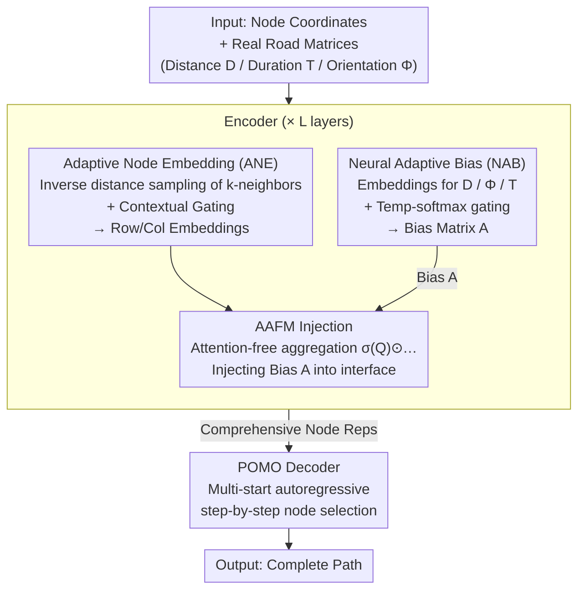

# RRNCO: Towards Real-World Routing with Neural Combinatorial Optimization

**Conference**: ICLR 2026  
**arXiv**: [2503.16159](https://arxiv.org/abs/2503.16159)  
**Code**: [https://github.com/ai4co/real-routing-nco](https://github.com/ai4co/real-routing-nco)  
**Area**: Combinatorial Optimization / Neural Routing  
**Keywords**: Neural Combinatorial Optimization, Vehicle Routing Problem, Asymmetric Routing, Sim-to-Real Gap, Attention-Free Module

## TL;DR

Ours proposes the RRNCO architecture, which jointly models asymmetric distance, duration, and orientation angles in a deep routing framework for the first time through two innovations: Adaptive Node Embedding (ANE) and Neural Adaptive Bias (NAB). A VRP benchmark dataset based on 100 real-world cities is constructed, significantly narrowing the sim-to-real gap for NCO methods.

## Background & Motivation

**VRP is the core of logistics optimization**: The Vehicle Routing Problem (VRP) is a class of NP-hard combinatorial optimization problems widely used in last-mile delivery, disaster relief, and urban mobility. With the global logistics market exceeding $10 trillion in 2025, improving routing efficiency offers immense cost-saving and environmental value.

**NCO methods perform well on synthetic data but lack realism**: Neural Combinatorial Optimization (NCO) automatically learns heuristic policies via reinforcement learning and has achieved impressive results on synthetic VRP instances. However, these methods primarily rely on simplified symmetric Euclidean distance data, failing to reflect the asymmetry of real-world road networks (e.g., one-way streets, traffic patterns, turn restrictions).

**Two roots of the Sim-to-Real Gap**:
   - **Data Level**: Synthetic datasets used for training and testing (e.g., TSPLIB, CVRPLIB) assume symmetric distances $d_{ij}=d_{ji}$, which contradicts reality.
   - **Architecture Level**: Existing NCO architectures based on node-level Transformers are inherently incapable of efficiently processing edge features (asymmetric distance/duration matrices).

**Limitations of Prior Work**: A few existing works rely on commercial APIs, are static (cannot be generated online), are slow, or are not public. Furthermore, they often lack travel duration information.

**Background**: Existing edge feature encoding methods like MatNet's row/column embeddings or GOAL's cross-attention only process a single cost matrix and fail to fuse multi-modal asymmetric features such as distance, duration, and orientation angles.

## Method

### Overall Architecture

RRNCO follows an encoder-decoder architecture. The encoder compresses node coordinates and real road matrices (distance, duration, orientation) into a set of comprehensive node representations. The decoder then autoregressively selects the next node in a POMO style to construct the complete path. All innovations targeting "real-world asymmetry" are concentrated in the encoder: Adaptive Node Embedding (ANE) injects distance information into node representations and derives row/column embeddings; Neural Adaptive Bias (NAB) learns a bias matrix from distance, duration, and orientation; finally, this bias is fed into the aggregation interface of the attention-free module (AAFM), ensuring the $L$-layer stacked encoder retains asymmetric priors regarding "edge quality."

### Key Designs

**1. Adaptive Node Embedding (ANE): Integrating real distance into node representations**

Real-world road distance matrices $\mathbf{D} \in \mathbb{R}^{N \times N}$ are asymmetric. Directly processing the full $N \times N$ matrix in the encoder leads to $O(N^2)$ complexity, while using only coordinates discards crucial "actual driving distance" information. ANE performs probability-weighted sampling based on inverse distance for each node, selecting only the $k$ most relevant neighbors: sampling probability $p_{ij} = \frac{1/d_{ij}}{\sum_{j} 1/d_{ij}}$. This preserves the primary structure of asymmetric neighborhoods at $O(Nk)$ cost. Sampled distances are projected into $\mathbf{f}_{\text{dist}}$ and coordinates into $\mathbf{f}_{\text{coord}}$, which are then fused via Contextual Gating: $\mathbf{g} = \sigma(\text{MLP}([\mathbf{f}_{\text{coord}}; \mathbf{f}_{\text{dist}}]))$. The fused result $\mathbf{h} = \mathbf{g} \odot \mathbf{f}_{\text{coord}} + (1 - \mathbf{g}) \odot \mathbf{f}_{\text{dist}}$ allows the model to learn when to trust coordinates versus distances. Finally, row embeddings $\mathbf{h}^r$ and column embeddings $\mathbf{h}^c$ are derived to encode outgoing and incoming directions separately.

**2. Neural Adaptive Bias (NAB): Learning a bias matrix from multi-modal features**

Attention-free modules like AAFM originally relied on a manual bias $A = -\alpha \cdot \log(N) \cdot d_{ij}$ to inject spatial structure. However, this formula only considers distance and ignores directional asymmetry (one-way streets) or non-linear relationships between duration and distance (e.g., traffic jams). NAB makes this bias data-driven by first embedding the three edge features: distance $\mathbf{D}$, orientation $\mathbf{\Phi}$, and duration $\mathbf{T}$ via two-layer ReLU projections:

$$\mathbf{D}_{emb} = \text{ReLU}(\mathbf{D}\mathbf{W}_D)\mathbf{W}'_D, \quad \mathbf{\Phi}_{emb} = \text{ReLU}(\mathbf{\Phi}\mathbf{W}_\Phi)\mathbf{W}'_\Phi, \quad \mathbf{T}_{emb} = \text{ReLU}(\mathbf{T}\mathbf{W}_T)\mathbf{W}'_T$$

The orientation $\phi_{ij} = \text{arctan2}(y_j - y_i, x_j - x_i)$ explicitly characterizes the heading of $i \to j$. The three embeddings are fused via a softmax gate with a learnable temperature $\tau$, assigning weights based on context. The final projection yields the scalar bias matrix $\mathbf{A} = \mathbf{H}\mathbf{w}_{out} \in \mathbb{R}^{B \times N \times N}$.

**3. AAFM Injection: Utilizing attention-free modules for asymmetric bias**

The encoder backbone is the AAFM proposed by Zhou et al. (2024a), defined as:
$$\text{AAFM}(Q,K,V,A) = \sigma(Q) \odot \frac{\exp(A) \cdot (\exp(K) \odot V)}{\exp(A) \cdot \exp(K)}$$
It bypasses the $O(N^2)$ softmax of standard attention using element-wise gating and weighted summation. RRNCO connects the learned $\mathbf{A}$ from NAB to this position, ensuring that node aggregation in every layer perceives the asymmetric priors of "edge traversability."

### Loss & Training

Training uses REINFORCE with a POMO baseline. The objective is to maximize the expected return $J(\theta) = \mathbb{E}_{\mathbf{x} \sim \mathcal{D}} \mathbb{E}_{\mathbf{a} \sim \pi_\theta(\cdot|\mathbf{x})} [R(\mathbf{a}, \mathbf{x})]$, where the reward $R$ is the negative of the total path cost. Multi-start sampling in POMO reduces variance and enhances solution diversity. Instances are generated online using the OSRM routing engine from 100 real cities, providing new instances with real distance/duration matrices, avoiding commercial API limitations and allowing the model to learn on distributions close to deployment.

## Key Experimental Results

### Main Results

Performance on the Real-World Routing Benchmark (ATSP task, 50 nodes):

| Method | In-Dist Cost | Gap (%) | OOD-City Cost | Gap (%) | Time |
| :--- | :--- | :--- | :--- | :--- | :--- |
| LKH3 | 38.387 | *(best) | 38.903 | *(best) | 1.6h |
| POMO | 51.512 | 34.19 | 50.594 | 30.05 | 10s |
| MatNet | 39.915 | 3.98 | 40.548 | 4.23 | 27s |
| GOAL | 41.976 | 9.35 | 42.590 | 9.48 | 91s |
| **Ours** | **39.078** | **1.80** | **39.785** | **2.27** | **23s** |

ACVRP Task (with capacity constraints):

| Method | In-Dist Cost | Gap (%) | OOD-City Cost | Gap (%) | Time |
| :--- | :--- | :--- | :--- | :--- | :--- |
| PyVRP | 69.739 | *(best) | 70.488 | *(best) | 7h |
| MatNet | 74.801 | 7.26 | 75.722 | 7.43 | 30s |
| AAFM | 76.663 | 9.93 | 77.811 | 10.39 | 11s |
| **Ours** | **72.145** | **3.45** | **73.010** | **3.58** | **26s** |

### Ablation Study

| Configuration | ATSP Gap (%) | ACVRP Gap (%) |
| :--- | :--- | :--- |
| Full RRNCO | 1.80 | 3.45 |
| w/o NAB (manual bias) | ~9.35 | ~9.93 |
| w/o ANE (coords only) | ~34.19 | ~23.16 |
| w/o Orientation $\Phi$ | Sig. Drop | - |
| w/o Duration $T$ | Sig. Drop | - |

### Key Findings

1. **RRNCO achieves SOTA among NCO methods** on all real-world tasks (ATSP/ACVRP/ACVRPTW) and distributions (In-Dist/OOD-City/OOD-Cluster).
2. **Minimal gap compared to traditional solvers**: Only an 1.8% gap compared to LKH3 on ATSP, while being ~250x faster (23s vs 1.6h).
3. **NAB is a critical innovation**: The gap for GOAL and AAFM using manual biases was 9.35% and 19.81%, whereas RRNCO achieved 1.80%.
4. **Joint modeling provides huge gains**: Removing distance, duration, or orientation leads to significant performance degradation.
5. **Strong generalization**: Only minor performance loss in OOD-City and OOD-Cluster scenarios.

## Highlights & Insights

1. **First joint multi-modal modeling of distance, duration, and orientation in NCO**: The NAB mechanism reveals how the coupling of these three features influences solution quality in real routing.
2. **Probability-weighted sampling is an elegant solution**: It avoids $O(N^2)$ full matrix processing while retaining key asymmetric neighborhood information.
3. **Value of open-source datasets**: 100-city real-world dataset + online sampling framework provides a standardized real-world benchmark for future NCO research.
4. **Universality of Contextual Gating**: The gating mechanisms in ANE and NAB can be generalized to other scenarios requiring fusion of heterogeneous features.

## Limitations & Future Work

1. **Static Routing Only**: Does not yet address dynamic traffic flows or real-time road condition changes.
2. **Limited Node Scale**: Experiments focused on 50-100 nodes; scalability to large-scale (1000+) real-world scenarios is unverified.
3. **Dataset Coverage**: While 100 cities is a significant step, road types in different regions (rural, highways) could be further expanded.
4. **Gap with Traditional Solvers**: The performance gap compared to LKH3/PyVRP might widen on larger instances.
5. **Multi-objective Optimization**: Real logistics requires simultaneous optimization of distance, time, and fuel consumption, while currently only a single cost function is optimized.

## Related Work & Insights

- **MatNet (Kwon et al., 2021)**: Introduced row/column embeddings for asymmetry; RRNCO's ANE improves this with distance sampling and gating.
- **AAFM (Zhou et al., 2024a)**: Provided the efficient attention-free framework but used manual biases; RRNCO's NAB upgrades this to data-driven learned biases.
- **GOAL (Drakulic et al., 2024)**: Used cross-attention for edge info but only processed a single cost matrix.
- **Insight**: The Sim-to-Real Gap is common in robotics and autonomous driving; RRNCO’s dual approach of data generation + architectural innovation is broadly applicable.

## Rating

- **Novelty**: ⭐⭐⭐⭐ — NAB mechanism jointly models three asymmetric features with an elegant implementation.
- **Experimental Thoroughness**: ⭐⭐⭐⭐⭐ — Multiple tasks, distributions, and baselines; complete ablation studies and convincing real-city datasets.
- **Writing Quality**: ⭐⭐⭐⭐ — Clear motivation, intuitive diagrams, and comprehensive tables.
- **Value**: ⭐⭐⭐⭐⭐ — Open-source dataset and code push the NCO field from toy problems toward real-world applications.

<!-- RELATED:START -->

## Related Papers

- [\[ICLR 2026\] WMPO: World Model-based Policy Optimization for Vision-Language-Action Models](wmpo_world_model-based_policy_optimization_for_vision-language-action_models.md)
- [\[ICLR 2026\] World-In-World: World Models in a Closed-Loop World](world-in-world_world_models_in_a_closed-loop_world.md)
- [\[ICLR 2026\] D-REX: Differentiable Real-to-Sim-to-Real Engine for Learning Dexterous Grasping](d-rex_differentiable_real-to-sim-to-real_engine_for_learning_dexterous_grasping.md)
- [\[ICLR 2026\] VER: Vision Expert Transformer for Robot Learning via Foundation Distillation and Dynamic Routing](ver_vision_expert_transformer_for_robot_learning_via_foundation_distillation_and.md)
- [\[NeurIPS 2025\] Real-World Reinforcement Learning of Active Perception Behaviors](../../NeurIPS2025/robotics/real-world_reinforcement_learning_of_active_perception_behaviors.md)

<!-- RELATED:END -->
