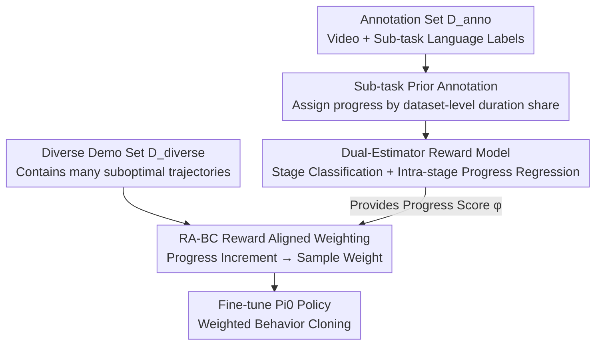

# SARM: Stage-Aware Reward Modeling for Long Horizon Robot Manipulation

**Conference**: ICLR 2026  
**OpenReview**: [https://openreview.net/forum?id=aemqAxScl9](https://openreview.net/forum?id=aemqAxScl9)  
**Paper**: [Project Website](https://qianzhong-chen.github.io/sarm.github.io/)  
**Code**: None (Project website only)  
**Area**: Robotics / Imitation Learning / Reward Modeling  
**Keywords**: Stage-aware reward model, long-horizon manipulation, deformable objects, imitation learning, behavior cloning

## TL;DR
For long-horizon, contact-rich deformable object manipulation (e.g., T-shirt folding), this paper proposes SARM—replacing "frame-index progress labels" with "semantically aligned progress labels" via natural language sub-task annotations. It trains a dual-estimator reward model for "stage estimation + sub-task progress estimation," which drives Reward-Aligned Behavior Cloning (RA-BC) to perform soft filtering and re-weighting of demonstrations. This approach increases the T-shirt folding success rate on real robots from 8%/0% (vanilla BC) to 83%/67%.

## Background & Motivation
**Background**: Robot Behavior Models (RBMs, such as Diffusion Policy, ACT, Pi0) integrate vision, action, and language into a single framework and can perform complex manipulation tasks. The dominant improvement strategy is "scaling data"—enlarging demonstration datasets.

**Limitations of Prior Work**: On long-horizon, contact-rich tasks—especially those involving deformable objects (T-shirts)—these models remain fragile: geometry changes over time, occlusions are severe, cloth forms vary, and multi-step planning is intolerant of errors. The scaling strategy ignores a crucial fact: **demonstration quality** matters more than quantity. Expert demonstrations are expensive and scarce, and large datasets are mixed with suboptimal, noisy trajectories from novice operators. Furthermore, "quality" is extremely difficult to quantify (it depends on hidden factors like contact stability, often proxied by coarse metrics like task duration).

**Key Challenge**: Utilizing reward models to measure progress/quality requires reliable progress labels. In long-horizon deformable tasks, **using frame indices as progress labels introduces severe noise**. The same "fully flattened T-shirt" state might have progress values fluctuating from 0.2 to 0.8 depending on the number of steps taken in the preceding flattening stage. Such contradictory labels make the reward model unstable. Moreover, existing VLM-based reward models often need to process entire trajectories to resolve temporal dependencies, incurring high computational/data overhead, while pure goal-distance rewards fail to characterize intermediate progress in multi-stage tasks.

**Goal**: (1) Develop a progress reward model robust to demonstration variance, generalizable to out-of-distribution (OOD) scenarios, and useful for downstream policies; (2) Use it to filter/down-weight suboptimal demonstrations to improve policy training performance.

**Key Insight**: Humans naturally decompose "T-shirt folding" into **semantic sub-tasks** such as grasp → flatten → fold → place. If progress is assigned based on the average duration share of sub-tasks across the dataset rather than absolute frame indices, the "flattening completed" semantic state will map to similar progress values across trajectories of different lengths, ensuring label consistency.

**Core Idea**: Use "semantic sub-task annotation + dataset-level duration priors" instead of "frame indices" to generate consistent progress labels. The reward model is split into two levels: "stage classification + intra-stage progress regression" to obtain stable rewards on variable-length demonstrations, which are then used for soft re-weighting in behavior cloning.

## Method

### Overall Architecture
The SARM pipeline consists of three stages: **(a) Data Processing**—transforming manual sub-task language annotations into consistent per-frame progress labels; **(b) Reward Model Training**—training a dual-head "stage estimator + sub-task estimator" model on these labels. Inputting any RGB frame (plus joint states) yields the current stage and fine-grained progress; **(c) Policy Training**—calculating "progress increments" for a diverse, unannotated demonstration set $D_{\text{diverse}}$ via the reward model, and using these to soft-weight every sample for behavior cloning (RA-BC) to fine-tune a Pi0 policy. Only the annotation set $D_{\text{anno}}$ is used for reward model training, while the massive $D_{\text{diverse}}$ containing suboptimal trajectories is used for policy training without requiring annotations.

### Key Designs

**1. Sub-task Prior Annotation: Eliminating progress label noise via semantic duration shares**

This step directly addresses the "frame index label contradiction" pain point. Annotators view top-down videos and segment each trajectory into $K$ semantic sub-tasks according to a predefined protocol, recording start/stop frames for each (trajectories with severe failures are excluded). Instead of per-frame labeling, the **average duration share of each sub-task across the dataset is used as a prior**. For sub-task $k$, the prior share is:

$$\bar{\alpha}_k = \frac{1}{M}\sum_{i=1}^{M}\frac{L_{i,k}}{T_i}, \qquad \bar{\alpha}_k \ge 0,\ \sum_{k=1}^{K}\bar{\alpha}_k = 1,$$

where $M$ is the number of trajectories, $L_{i,k}$ is the length of sub-task $k$ in trajectory $i$, and $T_i$ is the total length. For a frame $t$ within sub-task $k$ (local bounds $[s_k, e_k]$), the intra-stage normalized time is $\tau_t = \frac{t-s_k}{e_k-s_k} \in [0,1]$. With cumulative prior $P_k = \sum_{j=1}^{k}\bar{\alpha}_j$, the per-frame progress target is:

$$y_t = P_{k-1} + \bar{\alpha}_k\,\tau_t \in [0,1],$$

satisfying $y_{s_k} = P_{k-1}$ and $y_{e_k} = P_k$. Consequently, the "flattening completed" semantic boundary is pinned to the same progress value $P_k$ regardless of trajectory length. This binds "progress" to semantic milestones rather than elapsed time, ensuring label consistency—the foundation of the method's stability.

**2. Dual-Estimator Architecture: Coarse stage classification followed by fine-grained progress regression**

Instead of a single regression head fitting $[0,1]$, the reward model uses a shared backbone with two heads: the **Stage Model** outputs a probability distribution over discrete stages (coarse robot localization), and the **Sub-task Model** regresses continuous intra-stage progress conditioned on the stage prediction. They operate in series: the sub-task head uses the stage embedding as prior context. The pipeline is: (1) $N$ RGB frames pass through a frozen CLIP encoder; (2) visual embeddings and joint states are projected to a $d_{\text{model}}$ space, with an **explicit positional bias added only to the first frame** to prevent absolute time leakage (following ReWiND); (3) a Transformer encoder aggregates temporal and cross-modal interactions; (4) lightweight MLP heads output stage logits $\hat{\Psi}_{1:N} \in \mathbb{R}^{N\times k}$ and scalar progress $\hat{\tau}_{1:N} \in [0,1]^N$. The predicted stage $\hat{S}_t = \arg\max \Pi_{1:N}$ is used to reconstruct the final progress $\hat{y}_{1:N} = \hat{P}_{k-1} + \bar{\alpha}_k\hat{\tau}_{1:N}$. This design is more robust than pure similarity-based stages (which fail when sub-task descriptions are semantically close) or continuous regression alone.

**3. RA-BC Reward Aligned Behavior Cloning: Translating progress increments into soft weights**

RA-BC replaces the uniform prior of standard BC with **reward-aligned weights**. For each sample, the progress increment is calculated using the reward model $\phi(\cdot) \in [0,1]$ between the current window and the next window (after one action chunk):

$$\hat{r}_i = \phi(o_i^{t+\Delta}) - \phi(o_i^{t}).$$

This $\hat{r}_i$ signifies the "expected progress" of the step. It is then mapped to a weight $w_i \in [0,1]$ to minimize the normalized weighted objective:

$$L_{\text{RA-BC}}(\theta) = \frac{\sum_i w_i\,\ell(\pi_\theta(o_i),a_i)}{\sum_i w_i + \varepsilon}.$$

Weights are determined by tracking the mean $\mu$ and standard deviation $\sigma$ of progress increments via Welford’s algorithm. A soft mapping $\tilde{w}_i = \mathrm{clip}\big(\frac{\hat{r}_i-(\mu-2\sigma)}{4\sigma+\epsilon},0,1\big)$ is used, supplemented by a threshold $\kappa$ as a hard prior: $w_i=\mathbb{1}_{\{\hat{r}_i>\kappa\}}+\mathbb{1}_{\{0\le\hat{r}_i\le\kappa\}}\tilde{w}_i$. This effectively filters "stagnant/regressive" data while maintaining training stability.

## Key Experimental Results

### Main Results
Reward model evaluation (T-shirt folding, 70 trajectories; Demo L is validation MSE, Rollout $\rho$ is classification score on real policy rollouts $\rho = \frac{\#\text{correct} - \#\text{wrong}}{36}$):

| Method | Demo L ↓ | Rollout ρ ↑ | Description |
| :--- | :--- | :--- | :--- |
| GVL | 0.064 | -0.39 | VLM predicts progress from shuffled frames; overly pessimistic |
| VLC | 0.083 | -0.33 | Monotonic sorting fine-tuning; overly optimistic |
| LIV | 0.021 | 0.33 | EpicKitchens pre-trained feature distance |
| REDS | 0.036 | 0.16 | Stage-aware but semi-sparse step reward |
| VICtoR | 0.019 | 0.00 | Vision-text similarity for stages; overly pessimistic |
| ReWiND | 0.019 | 0.50 | Strongest baseline (rewind augmentation) |
| **SARM (Full Dual)** | **0.009** | **0.94** | >50% improvement on human demos; >80% on rollouts |

Policy Learning (T-shirt folding success rate, 12 trials per task):

| Steps | Difficulty | BC-All ($D_{\text{all}}$) | BC-2min ($D_{\text{2min}}$) | RA-BC-ReWiND | RA-BC-SARM |
| :--- | :--- | :--- | :--- | :--- | :--- |
| 20K | Medium | 0/12 | 4/12 | 1/12 | **7/12** |
| 20K | Hard | 0/12 | 1/12 | 1/12 | **6/12** |
| 40K | Medium | 1/12 | 7/12 | 6/12 | **10/12 (83%)** |
| 40K | Hard | 0/12 | 0/12 | 3/12 | **8/12 (67%)** |

### Ablation Study

| Configuration | Demo L ↓ | Rollout ρ ↑ | Description |
| :--- | :--- | :--- | :--- |
| SARM (Full) | 0.009 | 0.94 | Joint dense + sparse training |
| Dense Only | 0.027 | 0.11 | Single scheme, small diversity, poor OOD |
| Sparse Only | 0.013 | 0.78 | Single scheme, wide coverage but coarse labels |
| w/o R (No rewind) | 0.008 | 0.67 | Human demos unaffected, rollouts drop significantly |
| SARM (VB) | 0.015 | 0.78 | Robustness to brightness perturbations ±0.3 |

### Key Findings
- **Reward label consistency is critical**: Frame index labels cause "flattening completed" progress to jump between 0.2–0.8; SARM's prior labels fix this to a constant value.
- **Rewind augmentation is indispensable for real rollouts**: Without it, the model becomes "overly optimistic" and fails to recognize regressions or failures in real-time.
- **Reward model quality directly determines RA-BC upper bound**: Using the ReWiND reward model instead of SARM drops medium success from 83% to 50% and hard from 67% to 25%.
- **Dual-scheme > Single-scheme**: Combining dense (200 trajectories, fine labels) and sparse (500 trajectories, wide coverage) protocols out-performs either alone.

## Highlights & Insights
- **Computable annotation pipeline**: Leverages minimal semantic segmentation (start/stop frames) to generate consistent labels for entire trajectories, ensuring robustness to variable duration.
- **Decoupled "Coarse + Fine" estimation**: The stage classification + intra-stage regression structure is more reliable than pure similarity or distance metrics.
- **RA-BC as a plug-and-play BC replacement**: Modifies only weighting, not architecture, using online statistics to translate "progress increments" into soft weights.
- **Empirical proof of Quality > Quantity**: A 200-hour large dataset failed with vanilla BC and simple duration filtering; only reward-aligned filtering achieved 67% on hard tasks.

## Limitations & Future Work
- **Dependency on manual sub-task labels**: Requires predefined protocols and manual labeling of start/stop frames for each task.
- **Narrow evaluation scope**: Primarily validated on T-shirt folding and plate unloading; generalizability across wider deformable/contact tasks remains to be seen.
- **Fixed sub-task order assumption**: The protocol requires trajectories to follow a sequential set of sub-tasks, making it less flexible for unordered or skippable stages.

## Related Work & Insights
- **vs ReWiND**: Both use rewind augmentation and positional bias on only the first frame. SARM improves upon ReWiND by replacing frame-index labels with sub-task priors and dual estimators, yielding >80% relative improvement on rollouts.
- **vs REDS**: REDS uses image-text embedding similarity for semi-sparse rewards; SARM uses a dedicated stage network and continuous per-frame curves, providing denser and more accurate signals.
- **vs Offline RL Weighted BC**: Traditional methods assume full state feedback and a trained critic. RA-BC relies solely on a pre-trained visual reward model for $K$-step advantage estimation, which is more practical for real-world deployment.

## Rating
- Novelty: ⭐⭐⭐⭐ Solving frame-index label noise via "duration share priors + dual estimators" is a solid and practical contribution.
- Experimental Thoroughness: ⭐⭐⭐⭐ Real robot rollouts and comprehensive ablations were performed, though the task variety is somewhat limited.
- Writing Quality: ⭐⭐⭐⭐ Clear motivation and complete formulation.
- Value: ⭐⭐⭐⭐ Provides an actionable reward modeling + soft filtering paradigm for long-horizon deformable manipulation.

<!-- RELATED:START -->

## Related Papers

- [\[AAAI 2026\] ManiLong-Shot: Interaction-Aware One-Shot Imitation Learning for Long-Horizon Manipulation](../../AAAI2026/robotics/manilong-shot_interaction-aware_one-shot_imitation_learning_for_long-horizon_man.md)
- [\[AAAI 2026\] Actor-Critic for Continuous Action Chunks: A Reinforcement Learning Framework for Long-Horizon Robotic Manipulation with Sparse Reward](../../AAAI2026/robotics/actor-critic_for_continuous_action_chunks_a_reinforcement_le.md)
- [\[ICLR 2026\] Compositional Diffusion with Guided Search for Long-Horizon Planning](compositional_diffusion_with_guided_search_for_long-horizon_planning.md)
- [\[ICLR 2026\] CoNavBench: Collaborative Long-Horizon Vision-Language Navigation Benchmark](conavbench_collaborative_long-horizon_vision-language_navigation_benchmark.md)
- [\[CVPR 2026\] AGiLe: Learning Robust Long-Horizon Manipulation via Affordance-Grounded Bidirectional Latent Planning](../../CVPR2026/robotics/agile_learning_robust_long-horizon_manipulation_via_affordance-grounded_bidirect.md)

<!-- RELATED:END -->
