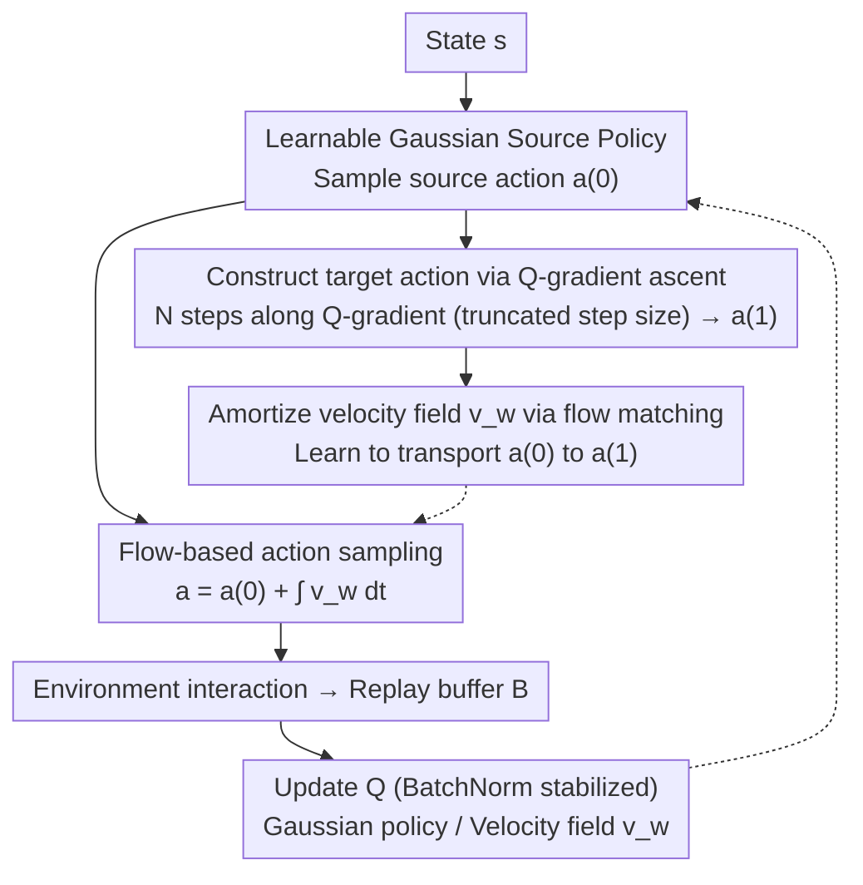

# Scalable Exploration for High-Dimensional Continuous Control via Value-Guided Flow

**Conference**: ICLR 2026  
**arXiv**: [2601.19707](https://arxiv.org/abs/2601.19707)  
**Area**: Reinforcement Learning/High-Dimensional Control  
**Keywords**: High-dimensional control, value-guided flow, probability flow exploration, musculoskeletal models, actor-critic

## TL;DR

Proposes Qflex (Q-guided Flow Exploration), an RL method for scalable exploration in high-dimensional continuous action spaces: actions are transported from a learnable source distribution along a probability flow induced by the Q-function $\to$ exploration is aligned with task-relevant gradients (rather than isotropic noise) $\to$ outperforms Gaussian and Diffusion RL baselines on various high-dimensional benchmarks, successfully controlling a full-body human musculoskeletal model with 700 actuators for agile and complex movements.

## Background & Motivation

**Background**: Controlling high-dimensional dynamical systems (such as full-body musculoskeletal or multi-legged robots) is a core challenge in RL. As the action space reaches hundreds of dimensions, standard Gaussian exploration fails sharply.

**Limitations of Prior Work**:
   - (1) Gaussian noise exploration $\to$ as dimensionality grows, coverage decreases exponentially $\to$ sample efficiency plummets.
   - (2) Dimensionality reduction methods (DynSyn/DEP-RL) $\to$ restrict policy expressiveness $\to$ sacrifice flexibility.
   - (3) Diffusion/Flow policies $\to$ used for multi-modality $\to$ but isotropic initial distributions remain inefficient in high dimensions.
   - (4) 700 muscle actuators $\to$ far exceeds the range of successful application for existing methods.

**Key Insight**: Probability flow guided by the Q-function $\to$ aligns exploration with task-relevant directions $\to$ maintains the original high-dimensional space.

## Method

### Overall Architecture

Qflex (Q-guided Flow Exploration) is integrated into a standard actor-critic framework: the critic learns a state-action value function $Q_\phi(s,a)$, while the policy is responsible for producing actions to interact and collect experience. The difference lies entirely in "how the policy generates actions." It no longer directly adds isotropic noise to a Gaussian mean like SAC; instead, it models the action as a **probability flow**: first sampling a source action $a^{(0)}$ from a learnable Gaussian initial policy $\pi^{(0)}_\theta$, then "transporting" it into the final action $a = a^{(0)} + \int_0^1 v_w(t,s,a^{(t)})\,dt$ along a learned velocity field $v_w$.

This velocity field is not learned from scratch but is trained to mimic a **target transport with clear direction**: during training, starting from $a^{(0)}$, $N$ steps of gradient ascent are performed along the critic's Q-gradient $\nabla_a Q$ to obtain a target action $a^{(1)}$ in a high-value region. Flow matching is then used so that $v_w$ learns to transport $a^{(0)}$ to $a^{(1)}$. The paper further proves that this flow along the Q-gradient is a valid policy improvement, so "exploration" itself moves in the direction of increasing returns—rather than blindly scattering noise in a 700-dimensional space.

### Key Designs

**1. Q-guided Probability Flow: Turning exploration into directional, provably improving transport**

The fundamental dilemma of high-dimensional continuous control is that most action perturbation directions are useless—using a planar kinematic chain as an example, the end-effector position variance decays at $O(1/|\mathcal{A}|)$ when isotropic noise is added to joint angles. When action dimensions reach hundreds, Gaussian exploration coverage collapses. Qflex solves this by "pointing the way" for exploration: defining a velocity field $v_Q^{(t)}(a;s) = M\nabla_a Q^{\pi_{\text{old}}}(s,a)$ induced by the Q-function (where $M$ is a positive definite preconditioning matrix, taken as Identity $I$ in the paper), the initial policy $\pi^{(0)}$ is transported toward an improved policy. The paper provides Proposition 1: under mild conditions such as $Q$ being differentiable and gradients being locally Lipschitz, the value advantage $F(t;s)$ of $\pi^{(t)}$ relative to $\pi^{(0)}$ is monotonically non-decreasing ($\frac{d}{dt}F(t;s)\ge 0$). This upgrades "exploration along the Q-gradient" from a heuristic to a mechanism with policy improvement guarantees—for every step along the flow, the expected return does not degrade, thus concentrating the exploration budget on truly useful subspaces.

**2. Q-gradient Ascent + Truncated Step Size for target action construction**

The theoretical velocity field requires the true $\nabla_a Q$. Qflex instantiates this during training as finite-step gradient ascent on actions: starting from the Gaussian source $a^{(0)}$, $N$ steps of $a^{(n/N)} \leftarrow a^{(n-1/N)} + \bar\eta\,\nabla_a Q_\phi(s,a^{(n-1/N)})$ are performed on the differentiable $Q_\phi$. The resulting $a^{(1)}$ is treated as a sample from the target distribution $\pi^{(1)}$. A difficulty is that Q-network gradients often behave abnormally outside the valid action domain $[-1,1]^{|\mathcal{A}|}$, where fixed steps might push actions out of bounds, causing training divergence. To address this, each step size is truncated according to the $\ell_2$ diameter of the action space: $\bar\eta = \min\!\big(\eta,\,\frac{2\sqrt{|\mathcal{A}|}}{\|\nabla_a Q_\phi\|}\big)$, thereby limiting single-step displacement and ensuring transport ends within a valid, stable range.

**3. Amortizing Velocity Field with Flow Matching and Learnable Gaussian Source**

Calculating $N$ Q-gradient steps for every action sample is computationally expensive and relies on Q-behavior outside boundaries. Qflex uses flow matching to **amortize** this transport into a neural velocity field $v_w$: with Gaussian source $a^{(0)}$ as the start and Q-ascended $a^{(1)}$ as the end, a conditional path $a^{(t)} = (1-t)a^{(0)} + t\,a^{(1)}$ and target velocity $v^{(t)} = a^{(1)} - a^{(0)}$ for Optimal Transport (OT) are specified. $v_w$ is then trained via regression to fit this. Consequently, at inference, one only needs to sample from the learnable Gaussian initial policy $\pi^{(0)}_\theta$ and integrate $v_w$ to obtain the action, avoiding repeated online Q-gradient calculations. The source distribution itself is a learnable Gaussian policy updated alongside policy improvement, biasing the starting point toward task-relevant regions and shortening the transport distance to high-value target actions. Additionally, Batch Normalization is used within the critic to stabilize training, allowing for the removal of target Q-networks and a lower update-to-data ratio for further efficiency.

## Key Experimental Results

### High-Dimensional Benchmarks (MuJoCo/Isaac)

| Environment | Action Dimension | Qflex vs SAC | vs Diffusion |
|------|---------|-------------|---------|
| Humanoid | ~23 | +15% | +10% |
| High-dim Variants | ~100 | +30% | +20% |
| **Full-body Musculoskeletal** | **700** | **Success (SAC fails)** | **Success (Diffusion fails)** |

### Full-body Musculoskeletal Control

- 600+ muscles $\to$ 700-dimensional action space.
- Complex movements (running/jumping/turning) $\to$ Qflex succeeds $\to$ all baselines fail.
- No dimensionality reduction $\to$ maintains full flexibility.

### Key Findings

- Q-guidance makes high-dimensional exploration very effective because most directions are useless $\to$ Q-guidance focuses on useful directions.
- Learnable source distributions are better than fixed Gaussians $\to$ the initial distribution also carries information.
- Higher dimensionality $\to$ larger gap between Qflex and baselines $\to$ validates scalability.

## Highlights & Insights

- **"The 'Impossible' 700-dimensional Task"**: No prior RL method succeeded in 700+ dimensional continuous spaces $\to$ Qflex breaks this barrier.
- **"Q-function = Exploration Compass"**: Not random trials $\to$ but trials in the Q-guided direction $\to$ every exploration has direction.
- **Value of maintaining the original space**: Dimensionality reduction $\to$ sacrifices flexibility $\to$ might miss optimal solutions $\to$ Qflex proves maintaining full dimensionality is worthwhile.
- **Biological Inspiration**: Human musculoskeletal control $\to$ the brain guides exploration through value-like signals $\to$ Qflex's flow is similar.

## Limitations & Future Work

- **Dependence on Critic Quality**: The direction of the entire flow is determined by the learned $Q_\phi$. If Q-estimation is inaccurate, the exploration direction will be biased. The paper relies on BatchNorm to stabilize Q and truncates gradient steps to mitigate this, but exploration efficiency remains fundamentally tied to critic accuracy.
- **Preconditioning Matrix Not Fully Leveraged**: In the velocity field $M\nabla_a Q$, $M$ can be any positive definite matrix. The paper only uses the identity matrix (steepest ascent). Using an $M$ better suited to action geometry (e.g., Fisher or curvature information) might further improve direction quality, which remains for future work.
- **Scalability Verified, Extrapolability Pending**: While 700-actuator musculoskeletal control provides strong evidence, the authors note that the mechanism can be cleanly embedded into various online RL frameworks and exploration settings. Migration to more high-dimensional tasks (e.g., dexterous hands, swarm control) still needs to be tested.

## Related Work & Insights

- **vs DynSyn**: Ours proposes a different technical route and achieves improvements across key metrics.

## Rating

- Novelty: ⭐⭐⭐⭐⭐ First proposal of Q-guided probability flow exploration + success in 700-dim.
- Experimental Thoroughness: ⭐⭐⭐⭐⭐ Multi-dimensional benchmarks + full-body musculoskeletal + comparisons with various baselines.
- Writing Quality: ⭐⭐⭐⭐ Clear methodological motivation.
- Value: ⭐⭐⭐⭐⭐ Fundamental breakthrough for high-dimensional RL.

<!-- RELATED:START -->

## Related Papers

- [\[ICLR 2026\] Hierarchical Value-Decomposed Offline Reinforcement Learning for Whole-Body Control](hierarchical_value-decomposed_offline_reinforcement_learning_for_whole-body_cont.md)
- [\[ICLR 2026\] CE-Nav: Flow-Guided Reinforcement Refinement for Cross-Embodiment Local Navigation](ce-nav_flow-guided_reinforcement_refinement_for_cross-embodiment_local_navigatio.md)
- [\[CVPR 2026\] FM-Steer: Enhance Generalist Policies with Value-Guided Cascaded Denoising](../../CVPR2026/robotics/fm-steer_enhance_generalist_policies_with_value-guided_cascaded_denoising.md)
- [\[ICLR 2026\] Action Chunking and Exploratory Data Collection Yield Exponential Improvements in Behavior Cloning for Continuous Control](action_chunking_and_data_augmentation_yield_exponential_improvements_in_behavior.md)
- [\[AAAI 2026\] Test-driven Reinforcement Learning in Continuous Control](../../AAAI2026/robotics/test-driven_reinforcement_learning_in_continuous_control.md)

<!-- RELATED:END -->
