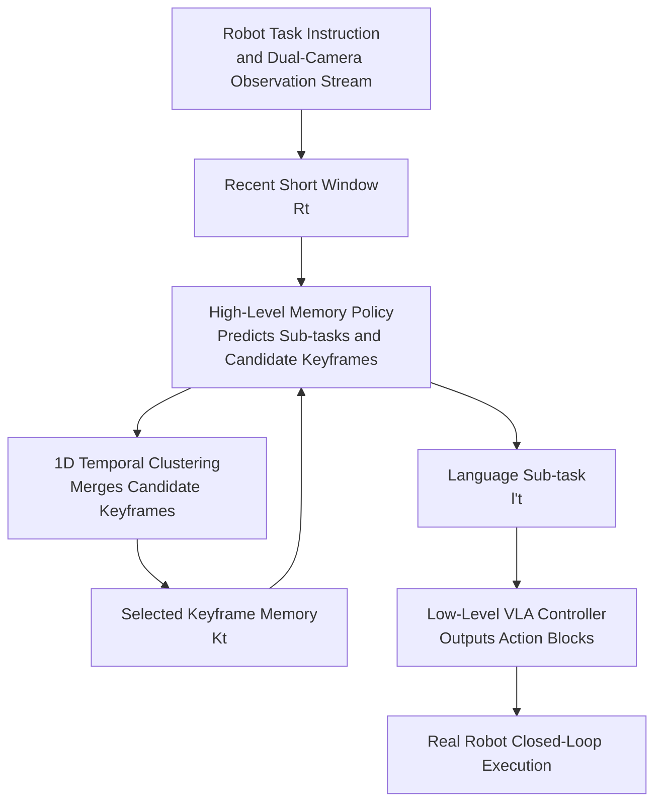

# Scaling up Memory for Robotic Control via Experience Retrieval

**Conference**: ICLR 2026  
**OpenReview**: [https://openreview.net/forum?id=1dH4ARGdwD](https://openreview.net/forum?id=1dH4ARGdwD)  
**Paper**: [Project Page](https://jen-pan.github.io/memer/)  
**Code**: See project page  
**Area**: Robotic Control / Memory Retrieval  
**Keywords**: Long-horizon robot manipulation, visual memory, keyframe retrieval, hierarchical policy, VLA  

## TL;DR
MemER decouples the task of "remembering the past" in long-horizon robotic tasks to a high-level VLM. It nominates task-relevant keyframes from recent observations, compresses them into stable visual memory via lightweight temporal clustering, and assigns current sub-tasks to a low-level VLA for execution, achieving performance close to human high-level strategies across three types of real-world long-horizon manipulation tasks.

## Background & Motivation
**Background**: General robotic policies in the last two years increasingly rely on VLA or hierarchical VLA. Low-level models output action blocks based on current images, language instructions, and joint states, while high-level models decompose complex instructions into shorter language sub-tasks. Although these methods handle many open instructions and long-horizon tasks, most still treat "what was recently seen" as the entire context.

**Limitations of Prior Work**: Real-world long-horizon manipulation is often partially observable. Information such as which box the robot searched, which shelf an object was originally placed on, or how many scoops have been served may only become useful again after tens of seconds or even minutes. If only the current frame is considered, the robot may repeat searches or forget progress. Conversely, naively feeding long video histories increases VLM inference latency and makes training susceptible to spurious correlations in expert trajectories.

**Key Challenge**: Robots require cross-minute visual memory without including every historical frame in the context. Full historical context imposes significant computational and memory pressure, while simple uniform sampling might fill the context with irrelevant angles, motion blur, and redundant frames, potentially drowning out truly useful information like "seeing inside a specific box," "completing a scoop," or "original object location."

**Goal**: The authors aim to add an extensible memory layer to existing VLAs, allowing robots to continuously decide which past frames are worth retaining during closed-loop control and retrieve these experiences when planning subsequent sub-tasks, while maintaining the use of proven general robotic policies for low-level action control.

**Key Insight**: Open-source video VLMs already possess strong video understanding priors but do not naturally understand "which frames are worth remembering" for robotic tasks. Therefore, rather than training an end-to-end long-context action model, it is more effective to have a high-level VLM specifically learn two outputs: the current low-level sub-task and the candidate keyframes from recent context that should enter memory.

**Core Idea**: By combining "high-level VLM selection of task-relevant keyframes" with "lightweight online clustering to merge redundant nominations," long video history is compressed into a compact set of visual experience memories. This drives a low-level VLA to complete robotic control tasks requiring minute-level recall.

## Method

### Overall Architecture
MemER is a hierarchical robotic control framework. The low-level policy $\pi_l$ is responsible for outputting action blocks based on the current image, joint state, and the language sub-task provided by the high-level policy. The high-level policy $\pi_h$ operates at a lower frequency to perform two tasks simultaneously: predicting the current sub-task $l'_t$ based on the recent $N$ frames and saved keyframes, and nominating candidate keyframes $J_t$ from the recent frames for future memory.

Unlike "directly concatenating long history into context," MemER does not retain the entire video stream. Instead, it clusters candidate frames nominated repeatedly by the high-level policy according to their temporal positions, selecting one representative frame per cluster to form a compact set of selected keyframes $K_t$. Consequently, each high-level model inference sees a "recent short window + a small number of cross-horizon key memories," enabling recall of distant states without linear growth in inference latency relative to task length.

Formally, standard language-conditioned robotic policies are often formulated as $\pi_l(A_t\mid I_t,q_t,l'_t)$, where $A_t$ is a short sequence of future action blocks, $I_t$ represents multi-camera images, $q_t$ is the proprioceptive state, and $l'_t$ is the current sub-task. The high-level policy in MemER is modeled as $\pi_h(l'_t,J_t\mid R_t,K_t)$, where $R_t=I_{t-N+1:t}$ is the recent short window and $K_t\subseteq I_{0:t-N+1}$ are the historical selected keyframes.

During deployment, high-level policy inference runs at approximately $1$ Hz and low-level policy inference at approximately $2$ Hz, operating asynchronously. The low-level policy continues to execute based on the most recent sub-task if a new one has not yet been provided by the high-level policy, preventing VLM inference latency from stalling action control.

### Key Designs
**1. Hierarchical Memory Policy: Separating "What to Recall" from Low-Level Action Control**

The hardest part of long-term memory is not seeing more frames, but knowing which past observations affect future decisions. MemER allows the high-level VLM to handle semantic-level memory and planning: it inputs task instructions, recent dual-camera frames, and saved keyframes to output executable language sub-tasks while nominating candidate keyframes from recent frames. The low-level $\pi_l$ does not need to understand history from minutes ago; it only needs to execute current sub-tasks like "check the left box," "scoop peanuts into the blue bowl," or "wipe the top shelf."

This division of labor leverages the strengths of two pre-trained models: Qwen2.5-VL-7B-Instruct has priors for video understanding and multimodal language reasoning, making it suitable for judging "if this frame is worth remembering," while $\pi0.5$ has action priors from the DROID environment, suitable for high-frequency continuous control. The authors attempted a unified model, but $\pi0.5$ lacks video memory reasoning, and Qwen2.5-VL proved unstable when learning actions and memory simultaneously, making a modular hierarchical design a practical choice.

**2. Experience Retrieval Visual Memory: Preserving Task-Relevant Past via Keyframes Rather Than Full History**

Memory in MemER is neither a text summary nor fixed-frequency video sampling, but a set of visual keyframes selected by the high-level policy. At each time step, the high-level policy only nominates candidate keyframes $J_t$ from the recent $N$ frames; subsequent inferences continually feed selected keyframes $K_t$ back into the high-level model. This allows the model to remember which box contained a tomato while searching or recall original object positions and which shelves have been wiped during a cleaning task.

Crucially, these frames are supervised by the robotic task rather than heuristic pixel changes or video compression. Training labels do not require frame-by-frame human tagging: the authors take boundary frames of adjacent sub-tasks and apply simple rules for each sub-task, such as whether to save the last frame of "check a box," "complete a scoop," or "finish wiping a shelf." Once rules are established, they are automatically applied to all demonstration trajectories, keeping annotation costs near a one-time configuration.

**3. 1D Temporal Clustering: Merging Redundant Nominations into a Stable, Low-Latency Memory Set**

If every candidate frame nominated by the high-level policy were saved directly, memory would bloat over time, and many similar frames would appear near the same event. MemER's filter considers only the temporal indices of candidate frames, aggregating all candidate indices into an ordered list $G_{0:t}$, retaining duplicates, and then using a single-linkage rule to merge indices within distance $d$ into a cluster $C_i$. The median index of each cluster is chosen as the representative frame, resulting in the final keyframe set $K_t$.

The advantage of this approach is its extreme efficiency. It requires no additional multimodal models for frame-by-frame scoring or expensive similarity computations; instead, repeated nominations stabilize the representative frame through median selection. For example, if candidate indices are $\{1,3,3,4,10\}$ and $d=5$, the first four indices are viewed as one event cluster, while the other forms a second, resulting in only two representative frames. For closed-loop robots, this simplicity is vital as the high-level policy must maintain a cadence close to $1$ Hz.

**4. Visual Memory Priority: Preventing Textual Sub-task Memory from Overshadowing Current Image Evidence**

An intuitive alternative is to convert executed sub-tasks into text memories (e.g., "just searched the left box," "already scooped one peanut"). Comparison shows that pure text memory and hybrid text-image memory are less stable than using only visual keyframes. This occurs because text sub-tasks often lack complete environment information: in Object Search, text can state which target is being sought but might not record other objects seen along the way. In Counting, if the low-level policy stalls or retries, text progress can easily desynchronize from the real environment.

Furthermore, when the high-level model is fed both text and image memory, it may over-rely on text tokens and ignore details in visual keyframes. MemER chooses visual keyframes as the primary memory form because judging "is it finished," "where was the object," and "what else was in the box" often requires re-examining the scene rather than just reading a historical action label.

### Loss & Training
The low-level policy uses a DROID pre-trained checkpoint of $\pi0.5$, fine-tuned on long-horizon trajectories of the three task types. Inputs include current images $I_t$, joint and gripper states $q_t$, and high-level sub-tasks $l'_t$; the output is action blocks $A_t$. The authors trained a strong low-level policy with only about 50 long-horizon demonstrations, plus 10-15 intervention demonstrations to handle recovery from failure states.

The high-level policy fine-tunes Qwen2.5-VL-7B-Instruct with supervision targets including both the current sub-task and candidate keyframe positions. During training, the vision encoder and projection layers are frozen, and only the LLM backbone is trained to retain visual priors and reduce costs. High-level training involves a learning rate of $6\times10^{-5}$, AdamW, batch size 256, 4500 gradient steps, and ~96 H200 GPU hours. Low-level training uses a learning rate of $2.5\times10^{-5}$, batch size 128, 18000 steps, and ~48 H200 GPU hours.

Before deployment, high-level fine-tuned weights are linearly interpolated with base Qwen2.5-VL weights: $\theta=(1-\alpha)\theta_{pre}+\alpha\theta_{ft}$ with $\alpha=0.8$. This parameter merging mitigates the fragility of the high-level model if it only sees expert demonstrations, allowing it to retain the base model's video understanding robustness even when the low-level policy stalls, retries, or produces non-smooth actions.

## Key Experimental Results

### Main Results
The paper evaluates MemER on a real Franka manipulator platform across three long-horizon tasks: Object Search, Counting Scoops, and Dust & Replace. All methods share the same low-level policy, differing only in the high-level context: No History (current frame only), Short History (recent 8 frames), Long History (recent 32 frames), MemER (recent 8 frames + retrieved keyframes), and Human HL (human-provided high-level sub-tasks).

| Method | Object Search Progress | Counting Progress | Dust & Replace Progress | Average Progress |
| :--- | :---: | :---: | :---: | :---: |
| No History | 48% | 10% | 26% | 28% |
| Short History | 58% | 35% | 64% | 52% |
| Long History | 73% | 55% | 58% | 62% |
| **MemER** | **97%** | **95%** | **96%** | **96%** |
| Human HL | 97% | 100% | 91% | 96% |

Detailed task metrics reveal that MemER's advantage stems from authentic memory rather than a stronger action module. In Object Search, MemER retrieved objects 59 times and took the optimal path 57 times out of 20 trials, nearly equal to Human HL (58/58). In Counting, it only had 1 error scoop, while Long History had 12. In Dust & Replace, all sub-goals were near perfect.

| Method | Object Retrieval ↑ | Optimal Path ↑ | Error Scoops ↓ | Wipe Bottom ↑ | Wipe Top ↑ | Restore Bottom ↑ | Restore Top ↑ |
| :--- | :---: | :---: | :---: | :---: | :---: | :---: | :---: |
| **MemER** | **59** | **57** | **1** | **20** | **19** | **18** | **20** |
| No History | 32 | 25 | 61 | 5 | 4 | 5 | 7 |
| Short History | 38 | 31 | 26 | 14 | 14 | 11 | 12 |
| Long History | 47 | 41 | 12 | 11 | 11 | 12 | 12 |
| Human HL | 58 | 58 | 0 | 19 | 19 | 18 | 17 |

### Ablation Study
The paper emphasizes comparisons with proprietary API VLMs, different memory modalities, single vs. multi-task training, and inference costs. API VLM evaluations are offline because GPT-5 and Gemini Robotics-ER 1.5 exhibit 10-15s latencies, preventing closed-loop deployment.

| Comparison | Result | Note |
| :--- | :--- | :--- |
| GPT-5 HL Offline Accuracy | Object 0.15 / Counting 0.43 / Dust 0.67 | Strong general models struggle with robot-specific keyframe selection. |
| Gemini Robotics-ER 1.5 HL Offline Accuracy | Object 0.21 / Counting 0.13 / Dust 0.19 | Specialized API models cannot replace fine-tuned high-level policies zero-shot. |
| Short History + Text | Object Retrieval 40, Optimal 28, Error Scoops 10 | Storing only text sub-tasks misses objects seen "on the way" and true completion states. |
| MemER + Text | Object Retrieval 59, Optimal 49, Error Scoops 13 | No Gain from hybrid text-image; Counting significantly degrades. |
| Multi-task MemER Generalization | Average 82% | Higher than the 59% of single-task versions, indicating learning of general "memory selection." |
| MemER Inference Cost | HL 0.787s, 15.93GB VRAM | 8 recent frames + 8 keyframes remains below the 1Hz deployment threshold. |

### Key Findings
- MemER achieves an average task progress of 96%, approximately 34 percentage points higher than Long History, proving "keyframe selection" is more effective than simply extending recent context to 32 frames.
- Long context baselines provide some help, but 32 frames already approach the 1s high-level inference latency limit; expanding the window further causes costs to exceed the acceptable range for closed-loop control.
- API VLMs are not a simple substitute. Even with image and task access, they over-nominate or nominate irrelevant keyframes in robotic trajectories, leading to inaccurate sub-task predictions and excessive latency.
- Visual memory beats text memory. Robotic execution involves retries, freezes, and non-expert trajectories where text sub-tasks can mislead the high-level policy, whereas keyframes retain environment evidence for re-evaluation.
- Multi-task training teaches the high-level policy "what state is worth saving" rather than memorizing task-specific object sets or fixed sub-task sequences.

## Highlights & Insights
- MemER's intelligence lies in not forcing the VLA to ingest the entire long video, but turning memory into a learnable selection problem for the high-level policy. This abstraction is ideal for robotics: truly useful long-term information resides in a few state-transition frames rather than the continuous video.
- 1D temporal clustering is simple but well-suited for closed-loop deployment. It delegates semantic selection to the VLM and redundancy compression to a simple algorithm, avoiding additional frame-wise models or complex retrieval systems.
- The negative results for text memory are valuable. Many embodied agent works instinctively try to convert history into language summaries, but this study shows that for re-identifying objects, counting, or judging completion, visual evidence is more reliable than words.
- The hierarchical design provides a transferable interface for existing VLAs: as long as the low-level policy can execute language sub-tasks, the high-level memory module can be attached without re-training a massive long-context action model.

## Limitations & Future Work
- Memory only accumulates and aggregates, with no explicit forgetting mechanism. Current experiments save ~8 keyframes, suitable for minute-level tasks; hour-long tasks or space navigation would require learning which memories to delete or compress.
- High-level keyframe annotation still depends on sub-task rules. While cost-effective, adding new tasks requires human judgment on which sub-task boundaries are worth saving; future work could explore automated memory supervision or RL-based memory management.
- Experiments are localized to a single Franka + dual-camera setup; cross-robot morphology, mobile manipulation, and multi-room navigation have not yet been validated.
- Modalities are currently limited to vision; no tactile, audio, or explicit spatial maps are used. For tasks involving occlusion or container interiors, pure visual keyframes may remain insufficient.
- Separate training of high and low levels increases engineering complexity. Unified models currently fail, but larger-scale VLA pre-training might eventually merge keyframe prediction and action control.

## Related Work & Insights
- **vs. Long-Context Robotic Policies**: Works like Torne et al. and Long-VLA attempt to expand policy history context, whereas MemER saves task-relevant keyframes. The distinction is that MemER's inference cost grows with key events rather than video length.
- **vs. SAM2Act / Memory-Augmented Visual Foundation Models**: These methods apply visual memory to perception or short-term history; MemER emphasizes long-horizon task progress, object locations, and experience retrieval for hierarchical control.
- **vs. Video VQA Keyframe Selection**: Video understanding often uses auxiliary models to score frames, but closed-loop control cannot afford per-frame costs. MemER has the high-level policy nominate keyframes while generating sub-tasks, avoiding extra retrieval models.
- **vs. Textual Episodic Memory**: Text is more compact and interpretable but may lose visual details or record incorrect progress during failed trajectories. This work suggests embodied memory shouldn't necessarily be verbalized first, especially if future decisions require re-observing evidence.

## Rating
- Novelty: ⭐⭐⭐⭐☆ Combines VLM keyframe selection, temporal clustering, and hierarchical VLA control naturally, hitting the real bottleneck of long-horizon robotic memory.
- Experimental Thoroughness: ⭐⭐⭐⭐☆ Solid evaluation across three real tasks, strong baselines, and modality/latency analysis; could be improved with more varied robot platforms.
- Writing Quality: ⭐⭐⭐⭐☆ Clear structure; task designs directly illustrate the need for memory; appendices provide training configurations and failure analysis.
- Value: ⭐⭐⭐⭐⭐ Highly relevant for those pushing VLA into long-horizon tasks, particularly the insight that visual keyframe memory scales better than textual summaries.

<!-- RELATED:START -->

## Related Papers

- [\[ICLR 2026\] MemoryVLA: Perceptual-Cognitive Memory in Vision-Language-Action Models for Robotic Manipulation](memoryvla_perceptual-cognitive_memory_in_vision-language-action_models_for_robot.md)
- [\[ICML 2026\] Scaling by Diversified Experience for Vision-Language-Action Models](../../ICML2026/robotics/scaling_by_diversified_experience_for_vision-language-action_models.md)
- [\[ICLR 2026\] Masked Generative Policy for Robotic Control](masked_generative_policy_for_robotic_control.md)
- [\[ICLR 2026\] Experience-based Knowledge Correction for Robust Planning in Minecraft](experience-based_knowledge_correction_for_robust_planning_in_minecraft.md)
- [\[ICML 2026\] RoboMME: Benchmarking and Understanding Memory for Robotic Generalist Policies](../../ICML2026/robotics/robomme_benchmarking_and_understanding_memory_for_robotic_generalist_policies.md)

<!-- RELATED:END -->
