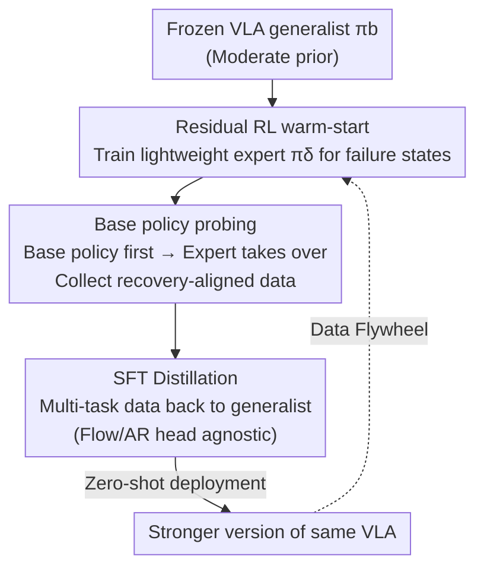

# Self-Improving Vision-Language-Action Models with Data Generation via Residual RL

**Conference**: ICLR 2026  
**OpenReview**: [https://openreview.net/forum?id=eUGoqrZ6Ea](https://openreview.net/forum?id=eUGoqrZ6Ea)  
**Code**: Project Page https://www.wenlixiao.com/self-improve-VLA-PLD  
**Area**: Robotics / Embodied AI / VLA / Reinforcement Learning  
**Keywords**: Vision-Language-Action Models, Residual RL, Self-improvement, Data Generation, Supervised Fine-Tuning

## TL;DR
This paper proposes **PLD (Probe-Learn-Distill)**, a three-stage post-training framework: it freezes the VLA backbone, uses lightweight residual RL to "take over" and train experts on states where the base policy fails, collects distribution-aligned recovery data via hybrid rollouts ("base policy first, then residual expert"), and finally distills this knowledge back into the base model using standard SFT. Without any additional human demonstrations, it approaches a 99% success rate on LIBERO, achieves over 50% improvement in SimplerEnv, and attains 100% success on real-world Franka/YAM tasks with 1 hour of continuous autonomous operation.

## Background & Motivation

**Background**: Supervised Fine-Tuning (SFT) has become the de facto post-training paradigm for large Vision-Language-Action (VLA) models—pre-training on massive heterogeneous robot/vision-language data and specializing the generalist model via SFT on a small amount of high-quality teleoperated demonstrations for target tasks. This "Pre-train + SFT" recipe borrowed from LLMs is widely adopted in models like OpenVLA and $\pi_0$.

**Limitations of Prior Work**: Porting this recipe to robotics presents a unique difficulty: high-quality robot demonstrations are expensive and labor-intensive, making them hard to scale. More critically, the teleoperation collection pipeline is **decoupled** from the deployed VLA policy; human operators intuitively anticipate and correct failure modes, but their demonstrations rarely reflect the actual state distribution the policy encounters during deployment. Consequently, SFT reliably improves performance on training tasks but leaves gains on new tasks or environments uncertain.

**Key Challenge**: Data collection should not "ignore the base policy." The data collection policy and the generalist model must interact so that exploration can leverage the generalist's prior knowledge and the collected data can align with its trajectory distribution. A natural idea is to use RL to train task experts for data guidance, but direct RL implementation faces two hurdles: ① Language-conditioned manipulation tasks have **sparse rewards**, making RL training unstable and sample-inefficient; ② Training experts independently from the generalist introduces **distribution mismatch**, and converged experts often exhibit singular behaviors, lacking the state coverage diversity required for SFT.

**Goal**: Enable VLAs to self-improve via RL-curated data with minimal human effort, such that this self-curated training matches or exceeds fine-tuning based on human expert (oracle) teleoperation data in both in-distribution and out-of-distribution scenarios.

**Key Insight**: Use a **frozen VLA generalist** as a prior to warm-start exploration, training only a lightweight **residual Gaussian policy** to "take over" failure states (ensuring ease of training without deviating too far from base behavior). During data collection, allow the base policy to act first before the expert takes over, pinning the data near the generalist’s deployment distribution and capturing recovery behaviors. Finally, distill via standard SFT—RL-generated, policy-aligned data can outperform pure teleoperated demonstrations.

## Method

### Overall Architecture

PLD is a plug-and-play three-stage post-training pipeline. The input is an **existing moderate-level VLA generalist** $\pi_b$ (e.g., $\pi_0$ or OpenVLA), and the output is a significantly stronger version of the same generalist on target tasks while preserving generalization. Three interconnected stages: **Probe → Learn → Distill**.

The first stage freezes the VLA backbone and trains a lightweight residual action policy $\pi_\delta$ for each task using sample-efficient off-policy RL, allowing it to "take over" the base policy at any state and push success rates above 99%—essentially using the expert to **probe the failure regions of the VLA generalist**. The second stage collects data via hybrid rollouts: the base policy runs for a random number of steps ("base policy probing"), followed by the residual expert taking over to complete the task. this biases residual interventions to **states frequently visited by the base policy**, alleviating distribution shift and capturing recovery behaviors from sub-optimal regions. The third stage distills these multi-task trajectories into the base model using standard SFT. This step is action-head agnostic, applying to both flow-matching and auto-regressive token heads. Finally, the fine-tuned generalist is deployed zero-shot across various tasks.

### Key Designs

**1. Residual RL + Policy Prior Warm-start: Replacing "Hard-to-train Base Policy" with "Easy-to-train Residual Gaussian Policy"**

Directly applying RL fine-tuning to expressive base policies (e.g., flow action heads) to maximize Q-values is extremely difficult and resource-intensive—OpenVLA-OFT requires ~62.5 GB VRAM on a single card with a batch size of 8 on LIBERO. This paper adopts a **decoupling** scheme: freeze $\pi_b$ and train only a lightweight residual action module $\pi_\delta(\cdot\,|\,s, a_b)$ conditioned on the base action $a_b\sim\pi_b$. The combined policy is $\bar\pi(\cdot|s)=\pi_b(\cdot|s)\,\pi_\delta(\cdot|s,a_b)$, executing $\bar a = a_b + a_\delta$. The residual is a simple Gaussian policy, easily trained with any off-policy RL algorithm.

To achieve sample efficiency under sparse rewards, the authors maintain offline and online replay buffers: the offline buffer $\mathcal{B}_{\text{offline}}=\{\tau_1,\tau_2,\dots\}$ is filled with **successful** rollouts of the base policy (acting as importance sampling). Training involves symmetric playback from both buffers, ensuring the value function consistently trains on high-value state-action pairs. The Q-function is updated via TD-learning: $Q_{\bar\pi}(s_t,\bar a_t)\leftarrow r(s,a)+\gamma\,\mathbb{E}_{s_{t+1}}[Q^{\text{target}}_{\bar\pi}(s_{t+1},\bar a_{t+1})]$. To prevent early deviation from $\pi_b$, the residual action magnitude is scaled to $[-\xi,\xi]$ ($\xi\in[0,1]$); pure $\pi_b$ rollouts are used for warm-up, and the Q-function is initialized with conservative targets (like Cal-QL) to mitigate forgetting. Notably, no explicit behavioral constraints are added to the policy loss, allowing the final expert $\bar\pi$ to be less hindered by base policy quality.

**2. Base Policy Probing Hybrid Rollouts: Pinning Data to Deployment Distribution with Recovery Behaviors**

If a trained RL expert is used directly for data collection, the data becomes "too optimal"—exhibiting decisive actions and shortest paths—which severely undersamples out-of-distribution and failure states. Simply stacking such expert data leads to overfitting on the generalist and harms robustness.

The solution is a **hybrid collection scheme**: the base policy rollouts for a random number of steps, then the residual RL expert takes over. The resulting trajectory $\tau_{\text{demo}}=\{(s_1,a_{b,1}),\dots,(s_{t-1},a_{b,t-1})\}\cup\{(s_t,a_{b,t}+\bar a_t),\dots\}$ starts with a path the base policy would actually take, followed by **expert recovery from sub-optimal regions**. This is "base policy probing." Furthermore, authors use the initial state distribution $s_0\sim p_0^{\pi_b}$ provided by this probing to train the RL expert, enhancing robustness. Longer probing horizons increase episode length and diversity between successful trajectories, leading to improved and eventually saturated fine-tuning performance. Intuitively, the data clusters around base policy attempts and includes recovery behaviors, leading to **less forgetting** during distillation.

**3. Architecture-Agnostic SFT Distillation: Reintegrating Expert Skills into the Generalist**

The third stage uses **standard SFT** to distill the multi-task hybrid trajectories back into the base model. This step is independent of the action head: for AR/token heads, the NLL loss $\mathcal{L}_{\text{AR}}(\theta)=-\mathbb{E}_{k}\,[\log p_\theta(u_k\,|\,u_{<k},x)]$ is used; for diffusion heads, score-matching MSE; for flow-matching heads, the L2 flow-matching loss. Consequently, OpenVLA (AR) and $\pi_0$ (flow-matching) can both be enhanced without altering the collection or distillation pipeline. The distilled generalist not only absorbs expert task capabilities but also **outperforms the average levels of individual experts** due to the recovery samples. After the three-stage loop, the stronger generalist can serve as the starting point for a new round of probing, creating a "data flywheel."

## Key Experimental Results

### Main Results

**LIBERO In-distribution Fine-tuning** (Table 1, 50 episodes/task evaluation):

| Base Model | Configuration | Spatial | Object | Goal | Avg |
|----------|------|---------|--------|------|-----|
| $\pi_0$ (flow) | Baseline SFT | 95.2 | 97.6 | 87.4 | 93.4 |
| $\pi_0$ (flow) | **Ours (PLD)** | 97.7 | 98.5 | 95.3 | **97.2** (+3.8) |
| OpenVLA (AR) | Baseline OFT | 92.9 | 99.1 | 83.25 | 91.8 |
| OpenVLA (AR) | **Ours (PLD)** | 99.5 | 99.1 | 98.9 | **99.2** (+7.4) |

PLD provides consistent absolute gains across both architectures and all suites **without any extra human demos**. The largest improvement is in the Goal suite ($\pi_0$ +7.9, OpenVLA +15.7), indicating higher benefits for tasks relying more on recovery behaviors. Combined with SimplerEnv, PLD yields over 50% overall performance gains.

### Ablation Study

| Dimension | Configuration | Key Finding |
|----------|------|---------|
| RL Algorithm | PLD vs RLPD (No base guidance) / WSRL (Offline init only) | PLD leads by a large margin on 8 tasks of LIBERO-90; high sample efficiency under low budgets. |
| Data Source | PLD vs Human vs base-policy rollout (0-1 REINFORCE) | With only 10% task coverage, PLD maintains 24.4% zero-shot success on unseen tasks; human-only is similar OOD but weaker in-distribution. |
| Probing | With probing vs RL Rollout vs Human | Real Franka cube picking: +PLD 30/30, +RLPD 16/30, +Human 10/30. |

### Key Findings

- **Probing is essential for generalization**: Human demos and RL rollouts never visit corner cases like "block pushed to the top-left and stuck." PLD explicitly probes the base policy to generate diverse trajectories covering these cases, enabling stable recovery (30/30) where other methods fail.
- **Expert data is not "more is better"**: Pure RL expert data is optimal but narrow; simply increasing its volume leads to overfitting and harms robustness. Hybrid probing data balances optimality and coverage.
- **PLD Data > Teleoperation Data**: Given the same data volume and training budget, RL-generated policy-aligned data matches or exceeds human oracle teleoperation data in both in-distribution and out-of-distribution scenarios, with zero human effort.
- **Long-horizon autonomy**: Real-world YAM dual-arm GPU insertion, driven by a four-stage state machine with reward classifiers, ran for **1 hour without human intervention**—individual stages aren't 100% successful, but the system recovers from failures.

## Highlights & Insights
- **"Residual Takeover" simplifies the problem**: RL fine-tuning of expressive VLA generalists is expensive and unstable. PLD trains a lightweight Gaussian residual to correct base actions, enabling the use of standard off-policy algorithms while remaining close to base behavior—a reusable paradigm of "small modules leveraging large models."
- **Alignment between collection and deployment distributions is central**: The "base policy first, then expert" trick forces training data to cover states the robot will actually encounter, filling the gap of recovery samples that neither humans nor pure experts typically provide.
- **Architecture-agnosticism**: Standard SFT distillation allows PLD to be applied to almost any existing VLA.
- **Self-improvement flywheel**: RL-generated aligned data outperforms teleoperation, and the stronger generalist can initiate the next round of probing, providing a scalable post-training path with minimal human labor.

## Limitations & Future Work
- **Dependency on a "reasonable" base policy**: Warm-start exploration requires $\pi_b$ to have a non-zero success rate on target tasks. For completely novel tasks where $\pi_b$ is at 0%, the starting point for residual takeover may not exist.
- **Reward engineering persists**: Real-world long-horizon tasks require reward classifiers to drive state machine coordination, necessitating task-specific design.
- **Hyperparameter tuning**: Parameters like probing horizon and residual magnitude $\xi$ require empirical determination, though performance tends to saturate with larger horizons.

## Related Work & Insights
- **vs ResiP / EXPO (Residual RL)**: While these use residual RL for single-task refinement, PLD uses the residual expert to **collect aligned data for distillation back into a generalist** without human intervention.
- **vs RLPD / WSRL (Sample-efficient RL)**: PLD adds **base policy prior guidance** to exploration, significantly leading in sample efficiency for sparse-reward manipulation.
- **vs ConRFT / Single-task RL fine-tuning**: These often sacrifice generalization; PLD preserves cross-task generalization by biasing data towards the base policy distribution (lower KL divergence, less forgetting).
- **vs Pure SFT ($\pi_0$, etc.)**: Pure SFT is limited by the scarcity and lack of coverage in teleoperation data; PLD uses RL to automatically fill these coverage gaps.

## Rating
- Novelty: ⭐⭐⭐⭐ The combination of "residual takeover + base policy probing for recovery data" effectively addresses the teleoperation-deployment decoupling.
- Experimental Thoroughness: ⭐⭐⭐⭐⭐ Covers multiple benchmarks (LIBERO/SimplerEnv), architectures ($\pi_0$/OpenVLA), and robots (Franka/YAM), with extensive ablation.
- Writing Quality: ⭐⭐⭐⭐ Clear three-stage narrative with good visualization of failure modes.
- Value: ⭐⭐⭐⭐⭐ Provides a scalable, architecture-agnostic VLA self-improvement recipe. 1-hour autonomous operation is highly convincing.

<!-- RELATED:START -->

## Related Papers

- [\[NeurIPS 2025\] DexFlyWheel: A Scalable Self-Improving Data Generation Framework for Dexterous Manipulation](../../NeurIPS2025/robotics/dexflywheel_a_scalable_and_self-improving_data_generation_framework_for_dexterou.md)
- [\[ICLR 2026\] VLM4VLA: Revisiting Vision-Language-Models in Vision-Language-Action Models](vlm4vla_revisiting_vision-language-models_in_vision-language-action_models.md)
- [\[ICLR 2026\] TwinVLA: Data-Efficient Bimanual Manipulation with Twin Single-Arm Vision-Language-Action Models](twinvla_data-efficient_bimanual_manipulation_with_twin_single-arm_vision-languag.md)
- [\[ICLR 2026\] Hybrid Training for Vision-Language-Action Models](hybrid_training_for_vision-language-action_models.md)
- [\[ICLR 2026\] RFS: Reinforcement Learning with Residual Flow Steering for Dexterous Manipulation](rfs_reinforcement_learning_with_residual_flow_steering_for_dexterous_manipulatio.md)

<!-- RELATED:END -->
