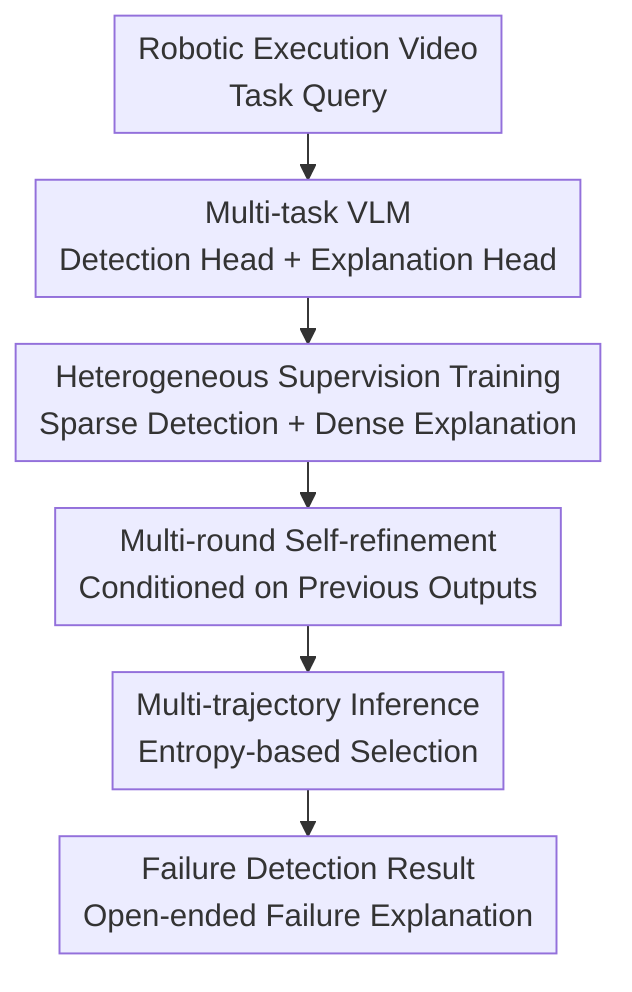

# Self-Refining Vision Language Model for Robotic Failure Detection and Reasoning

**Conference**: ICLR 2026  
**OpenReview**: [https://openreview.net/forum?id=jr9hGWQioP](https://openreview.net/forum?id=jr9hGWQioP)  
**Paper**: [OpenReview](https://openreview.net/forum?id=jr9hGWQioP)  
**Code**: Not provided in cache  
**Area**: Robotics / VLM Reasoning  
**Keywords**: Robotic Failure Detection, Vision-Language Model, Self-refinement, Heterogeneous Supervision, Open-ended Failure Explanation

## TL;DR
ARMOR decomposes robotic failure understanding into two collaborative tasks: binary detection and natural language explanation. By utilizing multi-round self-refinement, a hybrid of sparse/dense label training, and entropy-based trajectory selection, it simultaneously improves failure detection accuracy and explanation quality on both simulated and real-world warehouse robotic data.

## Background & Motivation
**Background**: Monitoring robot execution typically involves answering two questions: whether the task succeeded, and if it failed, what exactly happened. Traditional methods often treat this as a closed-set failure mode classification (e.g., "unstable grasp," "object spilled," or "end-effector offset"). Recent VLM approaches attempt to directly process images or videos to output both an explanation and a success/failure answer.

**Limitations of Prior Work**: Real-world robotic failures rarely fall neatly into fixed labels. For a warehouse manipulator, failure could stem from grasp pose, object damage, placement position, occlusion, container wall collisions, or a combination of these factors. Closed-set classification misses novel failure modes, while simply letting a VLM generate free-form text mixes "detection" and "explanation" into the same language modeling objective, often leading to inconsistent outputs where the explanation suggests success but the answer indicates failure.

**Key Challenge**: Data is also imbalanced. Binary success/failure labels can be obtained at scale from system logs or sensors, but natural language explanations for "why a failure occurred" require expensive human video annotation. Existing methods that assume complete explanation labels for every sample fail to scale to real-world deployments; conversely, simply mixing sparse and dense labels for SFT causes the model to over-fit to binary label formats, leading to a collapse in explanation capability.

**Goal**: The authors aim to train a VLM that can both accurately perform failure detection and provide open-ended failure reasoning. It must leverage large-scale sparse data with only binary labels while learning human-like causal descriptions from a small amount of dense data, all while correcting inconsistencies between detection and explanation during inference.

**Key Insight**: The paper views failure detection and explanation as a multi-task sequential decision process rather than a one-off text generation. In each round, the model observes the video, previous detection results, previous explanations, and task prompts to output updated detections and explanations. This allows the detection head to maintain reliability using extensive binary supervision while the explanation head aligns progressively based on the detection outcome.

**Core Idea**: Replace single-round free-text SFT with a "multi-task head + multi-round self-refinement + heterogeneous supervision imitation learning" framework, allowing strong supervision signals from robotic failure detection to guide the generation of open-ended explanations.

## Method

### Overall Architecture
The input to ARMOR consists of the robot execution video $x$ and a task query; the output includes a binary detection result $l$ (success/failure or Yes/No) and a natural language explanation $e$. The method adds a lightweight detection classification head to a generative VLM (such as Qwen2.5-VL) while retaining the original language decoding head for explanation generation. Training involves an offline imitation warm-up followed by online refinement using the model's own multi-round rollouts. During inference, multiple refinement trajectories are sampled, and the most credible result is selected using a self-certainty score derived from detection entropy and explanation token entropy.

Formally, the paper represents the state as $s_t=[x,l_{t-1},e_{t-1},p_t]$ and the action as the current round's output $a_t=(l_t,e_t)$. The initial state has no historical output. In each subsequent round, the previous detection and explanation are fed back into the prompt, forming $(l_t,e_t)\sim \pi_\theta(\cdot\mid[x,l_{t-1},e_{t-1},p_t])$. This modeling ensures that "detecting failure" and "explaining why" are no longer squeezed into a single string; instead, the two heads share visual and linguistic representations while correcting each other through historical outputs.

### Key Designs
**1. Multi-task Prediction Head: Decoupling Binary Detection from Free-text Parsing**

Prior methods like AHA often require the model to generate `<think>...</think><answer>Yes/No</answer>` in one go, optimizing via next-token prediction and extracting answers using regex. This is awkward for failure detection: a binary classification should optimize a clear decision boundary rather than be compressed into a language modeling loss. Once the model fails to follow the format, detection is penalized, and explanations may contradict the final answer.

ARMOR retains the language model head for explanations but adds an extra lightweight binary classification head for detection. Implementation-wise, it extracts mean-pooled features from the intermediate representations of the first four LM decoder layers, which are then cross-attended with a learnable `[CLS]` token and passed through an MLP to output binary logits. Detection uses BCE loss, while explanation uses NTP loss. Consequently, sparse data can continue to supervise the detection head even without explanations, while dense data trains both, allowing tasks to share a visual semantic foundation while optimizing via appropriate objectives.

**2. Heterogeneous Supervision Path: Preventing Sparse Labels from Erasing Explanation Capability**

The paper addresses the reality of robot deployment where "detection labels are abundant, but explanation labels are scarce." Let sparse data be $D_{sparse}=\{(x_i,l_i)\}$ and dense data be $D_{dense}=\{(x_i,l_i,e_i)\}$. The training objective does not force empty explanations for all samples; instead, it calculates loss only for available labels in each round: detection is supervised on both datasets, while explanation is supervised only on dense data.

This design avoids a common failure in naive SFT-S+D: if the explanation fields for sparse samples are empty or template placeholders, the model learns that giving short, meaningless, or empty explanations is a high-frequency correct behavior. While ARMOR generates explanations on sparse data as context for the next round, it applies no erroneous supervision to them; dense samples provide genuine natural language failure causes, pulling the explanation head toward the semantic space of human annotations.

**3. Offline Imitation and Online Refinement: Learning Correct States and Self-Error Recovery**

Training consists of two phases. Phase one is offline imitation: the model learns initial predictions without historical output, followed by conditional transitions on dense data that teach it to "remain correct given expert detection/explanations." To prevent the model from simply copying ground truth from the prompt, the authors randomly mask ground truth inputs (e.g., masking the ground truth explanation while keeping the detection input) to force the model to learn cross-task information and utilize visual evidence.

Phase two is online refinement: starting from an empty history, the model performs $rollouts$ for $T$ rounds using the current policy, feeding its own previous outputs back in and calculating losses for available labels. The core benefit is mitigating the distribution shift in imitation learning: offline expert states are "too clean," whereas during real inference, the model encounters its own previously generated—sometimes incorrect or ambiguous—detections/explanations. The online phase allows the model to practice error correction within these self-generated states, better matching the behavior distribution at test time.

**4. Self-certainty Based Multi-trajectory Inference: Selecting Answers without External Reward Models**

During inference, ARMOR does not run a single deterministic trajectory but samples $M$ refinement trajectories. Each round of each trajectory yields detection and explanation outputs, from which an uncertainty score is calculated: detection entropy $H_{det}$ measures the classification head's oscillation between success/failure, while explanation entropy $H_{reason}$ measures the average uncertainty of generated tokens. These are combined into $C^{(m)}=H^{(m)}_{det}+\lambda H^{(m)}_{reason}$.

Refinement terminates early when the optimal trajectory score no longer drops below the historical minimum by more than a tolerance threshold $\epsilon$. The trajectory with the lowest $C$ is chosen as the final output. This mechanism is ideal for this setting because no external oracle reward model is trained. The model uses its own probability distribution for "confidence" estimation to decide both when to stop and which candidate to select. In the paper, $\lambda=0.1$, giving higher weight to detection entropy since the detection head is supervised by more sparse labels and is generally more reliable.

### Loss & Training
The detection head uses binary cross-entropy, and the explanation head uses next-token prediction. The accumulated loss per round in the online phase can be summarized as:

$$
\mathcal{L}=\sum_{t=1}^{T}\left[\mathrm{BCE}(l_t,l)+\mathbf{1}[x\in D_{dense}]\,\mathrm{NTP}(e_t,e)\right]
$$

The paper uses Qwen2.5-VL 7B as the default backbone and reports 32B scaling experiments. In training, the global batch size for video data is 16, and 64 for tiled multi-view image data. The offline phase lasts 3 epochs, and the online phase lasts 10 epochs. The refinement horizon is $T=3$, with a maximum inference refinement $T_{refine}=4$ and $M=3$ sampled trajectories. Learning rates are $1\times10^{-5}$ for the LM decoder and classification heads, and $2\times10^{-6}$ for the vision encoder, using AdamW with 0.1 weight decay and a cosine schedule with 0.03 warmup ratio.

## Key Experimental Results

### Main Results
The paper evaluates on four datasets: RLBench-Fail, Maniskill-Fail, Sparrow-Fail, and ARMBench. The first two involve simulated tabletop manipulation, and the latter two involve real warehouse robots. Maniskill and ARMBench also include cross-environment transfer settings ($R\rightarrow M$ and $S\rightarrow A$).

| Dataset | Metric | ARMOR | Strongest Baseline | Gain |
| :--- | :--- | :--- | :--- | :--- |
| RLBench | Detect Acc. | 0.917 | SFT-S+D 0.726 | +0.191 |
| RLBench | LLM Fuzzy | 0.718 | Claude-3.7 3-shot 0.473 / SFT-S+D 0.550 | +0.168 vs SFT-S+D |
| Sparrow | Detect Acc. | 0.733 | Claude-3.7 3-shot 0.650 | +0.083 |
| Sparrow | LLM Fuzzy | 0.503 | Claude-3.7 3-shot 0.407 | +0.096 |
| Maniskill ($R\rightarrow M$) | Detect Acc. | 0.990 | SFT-D 0.788 | +0.202 |
| Maniskill ($R\rightarrow M$) | LLM Fuzzy | 0.673 | SFT-D 0.644 | +0.029 |
| ARMBench ($S\rightarrow A$) | Detect Acc. | 0.725 | Claude-3.7 3-shot 0.650 / SFT-D 0.640 | +0.075 vs Claude |
| ARMBench ($S\rightarrow A$) | LLM Fuzzy | 0.698 | Claude-3.7 3-shot 0.685 | +0.013 |

A key observation is that general open-source VLMs are near-random on these failure detection tasks; for instance, Qwen2.5-VL achieves only 0.376 detection accuracy on RLBench and 0.453 on Sparrow. Claude-3.7 few-shot is stronger but remains inferior to ARMOR in most settings. Ours significantly outperforms SFT-S+D, which suffers from explanation quality collapse in cross-domain settings (e.g., Maniskill $R\rightarrow M$ LLM Fuzzy drops from 0.644 for SFT-D to 0.177).

### Ablation Study
| Configuration | Training / Inference Component | Detection / Reasoning | Description |
| :--- | :--- | :--- | :--- |
| Multitask Prediction | Offline warmup + multi-task head, no refinement | 0.897 / 0.460 | Detection is strong, but reasoning is insufficient |
| Refinement Only | Warmup + inference refinement | 0.803 / 0.488 | Refinement only at test time improves explanation but hurts detection |
| Offline Imitation Only | Warmup + expert-conditioned + inference refinement | 0.853 / 0.658 | Conditioned expert states significantly improve consistency |
| Online Imitation Only | Online rollout + inference refinement | 0.850 / 0.683 | Learning from self-generated states helps explanation most |
| ARMOR | All components | 0.917 / 0.718 | Best performance in both detection and explanation |

### Key Findings
- Multi-task heads primarily resolve detection reliability. Multitask Prediction alone reaches 0.897 detection accuracy on RLBench, but reasoning remains at 0.460, suggesting separate heads don't automatically guarantee good explanations.
- Benefits of refinement require exposure to refinement states during training. Applying refinement only during inference drops detection to 0.803. Incorporating imitation yields 0.658 / 0.683 reasoning scores.
- Gains from multi-round refinement concentrate in the early rounds. LLM Fuzzy reasoning improves from $0.475\pm0.016$ in Round 0 to $0.717\pm0.002$ in Round 3, showing diminishing returns but stabilizing variance.
- Inference overhead is moderate. On 8×A100 GPUs, Round 0 takes 7.95s (3.48GB/GPU), while Round 3 takes 10.95s (6.31GB/GPU), adding roughly 1 second per round.
- ARMOR is resilient to sparse/dense imbalance. In Sparrow→ARMBench, with a sparse/dense ratio of 30, reasoning remains viable, though it performs best when the ratio is closer to 2.

## Highlights & Insights
- **Treating Detection as Classification and Explanation as Generation**: This simple separation is crucial for robotic failure understanding. "Right/Wrong" detection needs stable discriminative boundaries, while explanations require open-ended linguistic expression.
- **Realistic Handling of Heterogeneous Supervision**: The paper acknowledges that binary logs are cheap while causal annotations are expensive. This setting mirrors real-world deployment better than "full dense annotation" assumptions and explains why naive SFT-S+D fails.
- **Refinement as Part of the Training Distribution**: Unlike simple prompt tricks that only work at inference, ARMOR trains the model to experience its own previous outputs. This ensures it learns how to recover from its own error states.
- **Self-certainty Selection for Reward-less Scenarios**: It is difficult to get online rewards for failure reasoning. Using detection and explanation entropy for candidate selection avoids the overhead of training external reward models.
- **Transferability to Other Diagnostic Tasks**: This paradigm can extend to safety violation identification, recovery strategy suggestion, or root cause analysis. Whenever there is a cheap discrete label backed by an expensive natural language explanation, multi-task refinement is applicable.

## Limitations & Future Work
- Explanations can still drift. Example cases in ARMBench showed the model maintaining correct detection but misidentifying "torn book cover" as a collision, indicating low entropy does not guarantee semantic truth.
- Supervision is primarily visual. Real failures often require torque, joint states, vacuum pressure, or system logs; vision alone may miss excessive force or internal system errors.
- Explanation evaluation still relies on LLM fuzzy matching and ROUGE-L. While better than regex, these metrics might favor fluent explanations over strictly verified causal chains.
- Online training costs are high due to multi-round rollouts on 8×H100/A100 clusters.

## Related Work & Insights
- **vs AHA**: AHA uses a single text format and relies more on complete failure mode labels. ARMOR decouples tasks and handles sparse/dense hybrid training, making it more robust under label imbalance.
- **vs off-the-shelf VLM**: General models like Qwen2.5-VL have visual common sense but lack alignment with robotic failure boundaries, resulting in near-random detection. ARMOR demonstrates that task-specific fine-tuning is essential for safety and diagnostic tasks.
- **vs RISE / Self-Refine**: ARMOR adapts recursive self-improvement to video VLMs in robotics, replacing oracle rewards with imitation learning and internal entropy signals.

## Rating
- Novelty: ⭐⭐⭐⭐☆ Combines multi-task heads, heterogeneous supervision, and self-refinement into a clear new pipeline for robotic failure reasoning.
- Experimental Thoroughness: ⭐⭐⭐⭐☆ Covers simulation and real warehouse data, cross-domain transfer, and extensive ablations.
- Writing Quality: ⭐⭐⭐⭐☆ Clear logic and well-explained components.
- Value: ⭐⭐⭐⭐⭐ Highly relevant to practical failure diagnosis in robotic deployment, especially regarding the sparse log/expensive annotation reality.

<!-- RELATED:START -->

## Related Papers

- [\[ICLR 2026\] OneTwoVLA: A Unified Vision-Language-Action Model with Adaptive Reasoning](onetwovla_a_unified_vision-language-action_model_with_adaptive_reasoning.md)
- [\[ICLR 2026\] Vlaser: Vision-Language-Action Model with Synergistic Embodied Reasoning](vlaser_vision-language-action_model_with_synergistic_embodied_reasoning.md)
- [\[NeurIPS 2025\] SAFE: Multitask Failure Detection for Vision-Language-Action Models](../../NeurIPS2025/robotics/safe_multitask_failure_detection_for_vision-language-action_models.md)
- [\[ICLR 2026\] Embodied-R1: Reinforced Embodied Reasoning for General Robotic Manipulation](embodied-r1_reinforced_embodied_reasoning_for_general_robotic_manipulation.md)
- [\[CVPR 2026\] AwareVLN: Reasoning with Self-awareness for Vision-Language Navigation](../../CVPR2026/robotics/awarevln_reasoning_with_self-awareness_for_vision-language_navigation.md)

<!-- RELATED:END -->
