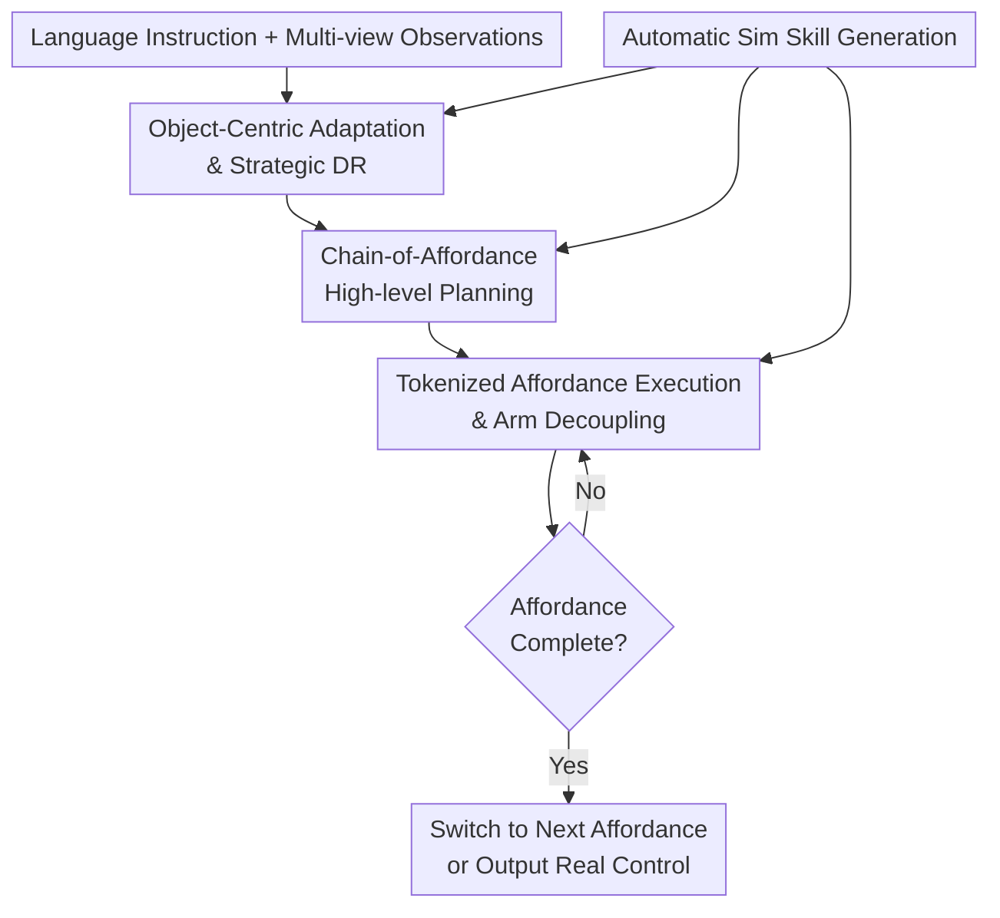

# Sim2Real VLA: Zero-Shot Generalization of Synthesized Skills to Realistic Manipulation

**Conference**: ICLR 2026  
**OpenReview**: [https://openreview.net/forum?id=H4SyKHjd4c](https://openreview.net/forum?id=H4SyKHjd4c)  
**Code**: https://github.com/DexForce/EmbodiChain  
**Area**: Robotics / VLA Manipulation  
**Keywords**: Sim2Real, Vision-Language-Action, Robot Manipulation, affordance, synthetic data

## TL;DR
Sim2Real-VLA employs a dual-system VLA architecture consisting of "high-level affordance chain planning + low-level tokenized action execution" to transfer manipulation skills generated purely in simulation to real robots in a zero-shot manner, significantly narrowing the Sim2Real gap in bimanual, dexterous, and long-horizon tasks.

## Background & Motivation
**Background**: Vision-Language-Action (VLA) models have become a mainstream approach for general robot control, integrating visual observations, language instructions, and robot actions into a unified policy learning framework. Models such as OpenVLA, RDT, $\pi_0$, and GR00T have demonstrated the potential of this route, but they typically rely on large amounts of real robot data or require fine-tuning on target robots and tasks.

**Limitations of Prior Work**: Real robot data is expensive, slow to collect, and difficult to scale. Consequently, many works have turned to high-performance simulation and automatic skill generation. However, policies learned in simulation encounter the Sim2Real gap when deployed in the real world: lighting, backgrounds, material textures, camera perspectives, and contact dynamics often differ from the training distribution. Traditional approaches attempt to make simulations more photorealistic or perform large-scale domain randomization, but failures in long-horizon manipulation often stem from the policy attending to task-irrelevant visual details rather than the "unrealism" of the images.

**Key Challenge**: Robot manipulation fundamentally requires structural information related to objects, contacts, and end-effector motion. Standard end-to-end VLAs simultaneously process a vast amount of irrelevant domain variances, such as table textures, backgrounds, and lighting. Greater simulation complexity does not necessarily guarantee better transfer; if the architecture treats all visual changes as equally important, scaling synthetic data may still lead to the learning of fragile correlations.

**Goal**: The authors aim to solve "how to train a VLA using only simulation data that can be deployed zero-shot in real manipulation scenarios" rather than collecting more real data. Specifically, the system must complete multi-step tasks such as single-arm pouring, bimanual pouring, tableware rearrangement, hand-over, and basket pick-and-place on real robots while resisting variations in background, object appearance, and table texture.

**Key Insight**: Long-horizon manipulation can be abstracted into a sequence of affordances. Each step does not require perfect replication of all real-world pixels and dynamics; it only requires knowing "which object/part to act upon, which key pose the end-effector should move toward, and whether the step is complete." If VLA reasoning and execution revolve around affordances, the model can filter out manipulation-irrelevant factors and anchor the geometric information, masks, and key poses available in simulation as cross-domain stable supervision signals.

**Core Idea**: Use object-centric affordance chains as high-level plans and a tokenized action space for execution and verification of each affordance. This architecture anchors "scene understanding" and "control generation" to key manipulation dynamics rather than relying on photorealism to bridge the Sim2Real gap.

## Method

### Overall Architecture
The Sim2Real-VLA workflow consists of three stages: first, projecting real tasks into scalable scenes and trajectories in simulation; second, training an object-centric high-level planning system to predict affordance chains; and finally, using a low-level acting system to convert each affordance into robot actions while performing real-time completion checks. The training phase uses only simulation-rendered observations, object masks, key poses, and action trajectories. Deployment uses real robot sensor observations and language instructions directly without fine-tuning on real demonstrations.

The core of this design is transforming the policy learning process into a structured "identify manipulation-relevant objects and key poses, then generate actions" sequence. Object masks, affordance keypoints, decoupled bimanual control, and action tokenization together form a filter: while backgrounds and textures vary, the task-critical objects, contact points, and end-effector motions remain stable.

The four nodes correspond to the following key designs: Object-Centric Adaptation and Strategic DR provide cross-domain visual representations; Chain-of-Affordance planning decomposes language tasks into executable key pose sequences; Tokenized Execution and Arm Decoupling ground plans into low-level control; and Automatic Sim Skill Generation provides masks, affordances, and action supervision.

### Key Designs
**1. Object-Centric Adaptation & Strategic DR: Recovering Targets while Randomizing Appearance**

Sim2Real-VLA does not train the policy to learn all variations on raw RGB directly. Instead, it converts visual observations into object-centric representations. Since the simulation knows the spatial, physical, and semantic attributes of each object, it can render object masks $m_t^i$ and train a recovery model $p^R_\theta(m_t^i \mid o_t^\xi, \ldots, o_{t-H}^\xi)$ to predict target masks from observation history. This process minimizes the negative log-likelihood of object recovery:

$$
L(\theta)=\mathbb{E}\left[-\sum_{t=0}^{T}\sum_{i=0}^{I}\log\left(p^R_\theta(m_t^i\mid o_t^\xi,\ldots,o_{t-H}^\xi)\cdot p_d(o_t^\xi\mid \hat{o}_t,\xi)\right)\right].
$$

Here, $p_d$ is not standard data augmentation but task-aware domain randomization (DR). The authors divide DR features into scene-level and robot-level: lighting, table textures, backgrounds, distractors, object status, as well as camera parameters and initial robot poses. The system uses a Vision-Language Model to select features and sampling ranges that are most relevant to the task. For example, in a pouring task, the relative positions and shapes of cups and bottles are more critical than background textures.

**2. Chain-of-Affordance High-level Planning: Key Pose Sequences over Natural Language Reasoning**

The output of the high-level planner is not a natural language Chain-of-Thought, but a sequence of affordances $q=[q_0,\ldots,q_K]$. Each $q_k$ corresponds to a set of geometrically structured keypoints, representing target end-effector poses or key interaction positions. A pouring task is decomposed into "grasp bottle," "move above cup," "rotate bottle," and "place bottle back."

The affordance prediction is modeled as a conditional distribution $p^A_\phi(q_{k,t},\ldots,q_{K,t}\mid \hat{m}_t,o_t^\xi,\ldots,o_{t-H}^\xi,l)$, decomposed into step-wise conditional predictions during training:

$$
L(\phi)=\mathbb{E}\left[-\sum_{t=0}^{T}\sum_{k=1}^{K}\log p^A_\phi(q_{k,t}\mid q_{k-1,t},\hat{m}_t,o_t^\xi,\ldots,o_{t-H}^\xi,l)\cdot p_d(o_t^\xi\mid \hat{o},\xi)\right].
$$

This anchors "task understanding" into the geometric layer executable by the robot. The affordance chain makes intermediate states explicit, allowing the high-level planner to express task sequences while providing trackable targets for the low-level actor.

**3. Tokenized Affordance Execution & Arm Decoupling: Local Target Tracking**

The low-level acting system receives the current affordance $q_k$, target masks $\hat{m}_t$, and observation history to output a sequence of actions $a_t,\ldots,a_{t+M}$. It repeatedly executes the current affordance and uses a verification model to judge completion. This closed-loop is vital for long-horizon tasks, as it prevents errors from early steps from catastrophically affecting subsequent ones.

For action representation, actions are transformed into the frequency domain via Discrete Cosine Transform (DCT), quantized, and compressed into action tokens $a^{DCT}$ using BPE. For bimanual tasks, Sim2Real-VLA splits the policy into independent left-arm $\pi^l_\omega$ and right-arm $\pi^r_\omega$ components. While they collaborate, each controller only attends to its relevant camera views and affordance targets to reduce cross-arm interference.

**4. Automatic Sim Skill Generation: Scalable Supervision**

The system utilizes a Real2Sim projection pipeline that extracts static scene info and dynamic trajectories from real task descriptions or human videos to initialize simulations. Subsequently, Generative Scene Scaling samples scene-level and robot-level configurations. A workspace analyzer ensures that sampled object poses are within the reach of the robot's inverse kinematics (IK). Finally, an automatic skill acquisition pipeline uses action banks and task agents to generate executable trajectories, providing affordance keypoints, joint angles, and rendered masks for training.

### Loss & Training
The training target comprises three levels: the mask recovery loss $L(\theta)$, the affordance prediction loss $L(\phi)$, and the low-level action model training. The action model fuses masked visual observations, language instructions, proprioception, and affordances to predict tokenized action chunks.

Implementation details: The vision encoder uses DINOv2; the language encoder uses T5-XXL. The action expert has approximately 200M parameters (8-layer transformer). Training uses cosine annealing with a max learning rate of $1\times 10^{-5}$ for 40,000 epochs, taking about 36 GPU hours.

## Key Experimental Results

### Main Results
Sim2Real-VLA was evaluated on an Agilex CobotMagic robot across six long-horizon tasks. All baselines were fine-tuned using the same simulation data and deployed zero-shot.

| Task | Metric | Sim2Real-VLA | Best Baseline | Gain |
|------|------|--------------|---------------|------|
| Single-Arm Water Pouring | Real Success | 17/20 | 11/20 ($\pi_0$-FAST) | +6 |
| Dual-Arm Water Pouring | Real Success | 16/20 | 8/20 ($\pi_0$-FAST) | +8 |
| Table Rearrangement | Real Success | 16/20 | 7/20 ($\pi_0$-FAST) | +9 |
| Items Hand-Over and Place | Real Success | 8/20 | 4/20 ($\pi_0$) | +4 |
| Basket Pick-and-Place | Real Success | 9/20 | 3/20 ($\pi_0$-FAST) | +6 |
| Pan Open and Place | Real Success | 7/20 | 3/20 ($\pi_0$-FAST) | +4 |

Sim2Real-VLA achieved an average real-world success rate of $60.8\%$, an absolute improvement of over $35\%$ compared to the strongest baseline. The performance gap is most pronounced in long-horizon tasks where ACT and Diffusion Policy largely failed.

### Ablation Study
- **Affordance chain length $K$**: Experiments comparing $K=1, 2, 3$ found $K=1$ to be optimal. Excessively long chains introduced redundancy and prediction errors; the current target is sufficient for guiding low-level control.
- **Arm Decoupling**: In bimanual hand-over tasks, success increased from $0.15$ (joint learning) to $0.40$ (decoupled), proving that separating arm control mitigates attention confusion.
- **Perception Gap**: Object mask recovery achieved a mean IoU of $0.69 \sim 0.82$ against SAM pseudo-ground truth on real images, confirming the effectiveness of simulation-based randomized training.

### Key Findings
- The affordance-driven dual-system is the primary contributor to performance. Even with identical simulation data, end-to-end models struggle with real-world deployment due to lack of stable structural interfaces.
- Strategic DR and object-centric adaptation effectively downweight background textures, making the policy robust to visual domain shifts.
- The system maintains stability across various domain gaps (background, object appearance, table texture), with success rates remaining consistent even under multiple simultaneous gaps.

## Highlights & Insights
- The design shifts the burden of bridging the Sim2Real gap from "photorealistic simulation" to "structural model architecture."
- Affordances serve as a functional interface across the entire pipeline—supervision, planning, and verification—rather than just an interpretability tool.
- Decoupling left and right arm control is a practical engineering solution to the attention-mixing problem in bimanual VLA models.
- The automated simulation pipeline, particularly workspace-aware scene scaling, ensures that synthetic data is both diverse and kinematically feasible.

## Limitations & Future Work
- Tasks remain focused on tabletop manipulation in laboratory settings; it does not yet cover mobile robotics or highly dynamic human-robot interaction.
- The "zero-shot" definition relies on a Real2Sim prior; while the weights aren't updated on real data, real demos are used to set up the simulation.
- Affordance quality depends on simulation object geometry; cases with heavy occlusion or complex contacts may require stronger 3D or tactile representations.
- Absolute success rates for the most complex tasks ($35\sim45\%$) are not yet sufficient for reliable production-grade deployment.

## Related Work & Insights
- **vs Foundation Models (OpenVLA, $\pi_0$, etc.)**: While foundation models rely on massive pre-training and real-world fine-tuning, Sim2Real-VLA offers a path to zero-shot deployment through affordance-based structural interfaces.
- **vs Domain Randomization**: Instead of brute-force DR, this work uses task-aware DR and mask-based filtering to focus on manipulation-invariant features.
- **vs Embodied CoT**: While natural language CoT aids reasoning, Chain-of-Affordance acts as a "robot-executable CoT," binding high-level steps directly to geometric end-effector targets.

## Rating
- **Novelty**: ⭐⭐⭐⭐☆ Anchoring Sim2Real VLA to a planning-execution affordance interface is a distinct and effective strategy.
- **Experimental Thoroughness**: ⭐⭐⭐⭐☆ Extensive real-robot testing and ablation studies across six tasks, though within tabletop constraints.
- **Writing Quality**: ⭐⭐⭐⭐☆ Clear logic and well-supported by figures/appendices.
- **Value**: ⭐⭐⭐⭐⭐ Provides a significant reference for scaling robot policies using simulation, emphasizing structural design over pure simulation fidelity.

<!-- RELATED:START -->

<!-- RELATED:END -->

## Related Papers

- [\[ICLR 2026\] VITA: Zero-Shot Value Functions via Test-Time Adaptation of Vision–Language Models](vita_zero-shot_value_functions_via_test-time_adaptation_of_visionlanguage_models.md)
- [\[NeurIPS 2025\] Zero-Shot Context Generalization in Reinforcement Learning from Few Training Contexts](../../NeurIPS2025/robotics/zero-shot_context_generalization_in_reinforcement_learning_from_few_training_con.md)
- [\[ICLR 2026\] From Seeing to Doing: Bridging Reasoning and Decision for Robotic Manipulation](from_seeing_to_doing_bridging_reasoning_and_decision_for_robotic_manipulation.md)
- [\[ICLR 2026\] Abstracting Robot Manipulation Skills via Mixture-of-Experts Diffusion Policies](abstracting_robot_manipulation_skills_via_mixture-of-experts_diffusion_policies.md)
- [\[ICLR 2026\] VLBiMan: Vision-Language Anchored One-Shot Demonstration Enables Generalizable Bimanual Robotic Manipulation](vlbiman_vision-language_anchored_one-shot_demonstration_enables_generalizable_bi.md)

<!-- RELATED:END -->
