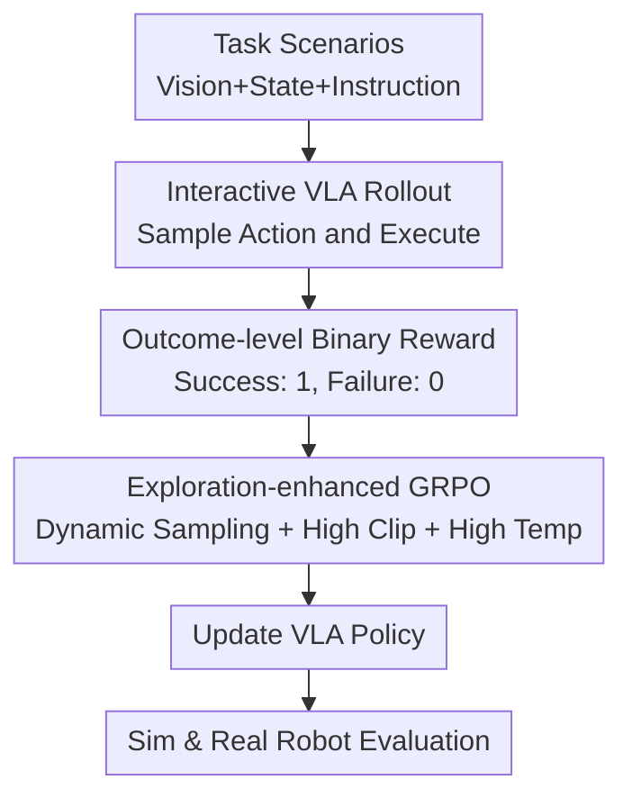

# SimpleVLA-RL: Scaling VLA Training via Reinforcement Learning

**Conference**: ICLR2026  
**OpenReview**: [https://openreview.net/forum?id=TQhSodCM4r](https://openreview.net/forum?id=TQhSodCM4r)  
**Code**: [https://github.com/PRIME-RL/SimpleVLA-RL](https://github.com/PRIME-RL/SimpleVLA-RL)  
**Area**: Robotics / VLA Reinforcement Learning  
**Keywords**: VLA, Robot Manipulation, Online RL, GRPO, Sparse Rewards  

## TL;DR
SimpleVLA-RL adapts outcome-driven online RL from the LLM domain into a closed-loop robotic training framework suitable for Vision-Language-Action (VLA) models. By utilizing interactive trajectory sampling, binary success rewards, and exploration-enhanced GRPO, it significantly improves data efficiency, generalization, and success rates for long-horizon manipulation across LIBERO, RoboTwin, and real-world robotic tasks.

## Background & Motivation
**Background**: Vision-Language-Action (VLA) models have become a primary route for general-purpose robotic manipulation. The mainstream paradigm involves pre-training on vision-text, video, and large-scale robotic datasets, followed by supervised fine-tuning (SFT) on high-quality robotic trajectories. This allows the model to map visual observations, language instructions, and action outputs into a single policy. Works like OpenVLA, π0, RDT, and OpenVLA-OFT follow this path, assuming that "more and better demonstration trajectories lead to stronger manipulation capabilities."

**Limitations of Prior Work**: The issue is that robotic trajectories are not as easily scalable as text or images. Each high-quality demonstration requires physical or simulated environments, objects, robotic arms, operators, and safety constraints, making them costly and limited in coverage. Consequently, SFT easily learns fixed manipulation patterns in specific scenes: if a model sees "pick up a can and place it by the pot" during training, it tends to replicate that exact path. Once the target, object position, task combination, or visual background changes, small errors in long-horizon tasks accumulate, resulting in failure.

**Key Challenge**: Robotic VLAs need to learn generalizable skills from limited demonstrations, but pure SFT only imitates offline trajectories and lacks a mechanism for "discovery through trial and error." While traditional robotic RL allows for interactive exploration, it often relies on task-specific dense rewards, which are difficult to scale across many open-ended manipulation tasks. In other words, SFT is bottlenecked by data, while traditional RL is bottlenecked by reward design.

**Goal**: The authors aim to verify a more lightweight question: can VLA models improve step-by-step action planning via online RL using only outcome-level rule-based rewards, similar to reasoning LLMs like DeepSeek-R1? If successful, robotic policies could be enhanced through simulation interaction without collecting additional large-scale demonstration trajectories.

**Key Insight**: The paper focuses on token-based VLAs because these models output probability distributions over action tokens, making them naturally compatible with policy gradient algorithms that require action log-probs, such as PPO or GRPO. Based on the veRL framework, the authors extend the training-inference infrastructure—originally designed for LLM text rollouts—into a closed-loop system integrating training, VLA inference, and environment rendering. They specifically address robotic interaction, parallel simulation, and exploration issues under sparse rewards.

**Core Idea**: Replace "more offline demonstration trajectories" with "multiple interactive robotic trajectories + binary outcome rewards (success/failure) + exploration-enhanced GRPO." This enables the VLA to learn more robust, generalized, and even novel manipulation strategies not present in the demonstrations through environmental feedback.

## Method

### Overall Architecture
The input to SimpleVLA-RL is a batch of robotic task scenarios (current visual observations, proprioception, and language instructions), and the output is an updated VLA policy. The overall process does not generate text in one go like an LLM. Instead, the VLA iteratively observes, samples action tokens, executes actions, and refreshes states in a simulated environment until success or the maximum step count is reached, yielding a set of complete trajectories. A 0/1 reward is assigned based on task completion for each trajectory, and the GRPO loss is calculated using intra-group relative advantages to update the policy.

The framework provides three key contributions: first, adapting rollouts into VLA-oriented closed-loop interactive sampling; second, compressing complex robotic rewards into scalable outcome-level binary rewards; and third, introducing exploration-enhanced strategies to prevent GRPO from being limited by homogeneous trajectories and low-probability actions in sparse reward, high-dimensional spaces. At the infrastructure level, the authors expanded veRL into a unified system for multi-environment rendering, parallel inference, and distributed training.

### Key Designs
**1. Interactive VLA Rollout: Converting Text-Generation RL to Closed-Loop Robotic Interaction**

LLM rollouts involve autoregressive token sampling given a prompt, where the state is essentially the "prompt + generated tokens." VLA is fundamentally different: every action changes the tabletop, objects, and arm pose. The next action must be determined based on new camera images and proprioception. Thus, SimpleVLA-RL transforms the veRL rollout into an environmental closed loop: for each task input, $G$ trajectories are sampled. At each step, the policy outputs an action token distribution based on the current state $s_t=(o_t^{vis}, o_t^{prop}, l_{task})$, an action $a_t$ is randomly sampled and executed, and the environment returns the new state $s_{t+1}$.

The key here is acknowledging the causal structure of robotic action sequences: an action is an intervention that changes subsequent observations, not just a label in an offline sequence. Only closed-loop rollouts can expose compounding errors in long-horizon tasks, allowing the model to learn true task-relevant preferences between failed and successful paths. The choice of token-based VLAs like OpenVLA-OFT allows the action token probability $\pi_\theta(a_{i,t}\mid s_{i,t})$ to be used directly in the GRPO importance ratio, avoiding the complexities of policy gradient calculations for diffusion or MLP heads.

**2. Outcome-level Binary Rewards: Moving Robotic RL Beyond Task-Specific Reward Engineering**

Traditional robotic RL often requires designing dense rewards involving distance to targets, contact states, pose errors, or grasp stability. These formulas are fragile and hard to transfer. SimpleVLA-RL instead asks only one question: did the trajectory finish the task? Successful trajectories receive $R=1$, and failed ones receive $R=0$. This trajectory-level reward is uniformly distributed to the action tokens within that trajectory:

$$
R(a_{i,t}\mid s_{i,t}) =
\begin{cases}
1, & \text{trajectory } i \text{ succeeds},\\
0, & \text{otherwise}.
\end{cases}
$$

While this sacrifices precision in credit assignment, it provides extreme scalability. The framework can train on any task where success can be judged, eliminating the need to hand-write rewards for "placing a cup in a bowl" or "ringing a bell." Crucially, outcome rewards do not dictate the process, allowing the model to discover paths not seen in demonstrations. A typical example in the paper is "pushcut": while the SFT demonstration involves picking up an object and moving it, the RL-trained model discovers that pushing it to the target also succeeds. Since the reward only cares about the outcome, this new strategy is not penalized.

**3. Exploration-enhanced GRPO: Addressing Trajectory Homogeneity in Sparse Reward VLA**

Online RL for VLA is more prone to exploration bottlenecks than LLM reasoning. Action spaces are high-dimensional, rewards are sparse, and SFT trajectories are often homogeneous, causing the model to repeatedly sample similar pick-and-place paths. If all $G$ trajectories in a group are completely successful or completely failed, the intra-group normalized advantage becomes zero, and the gradient disappears. SimpleVLA-RL introduces dynamic sampling: it only retains groups containing both successes and failures, requiring $0 < |\{\tau_i:\text{success}(\tau_i)\}| < G$ to ensure non-zero relative advantages.

Two other exploration enhancements affect policy updates and trajectory sampling. The authors increased the GRPO clipping upper bound from the typical $1.2$ to $1.28$ (corresponding to $\epsilon_L=0.2, \epsilon_H=0.28$), allowing low-probability but effective action tokens to increase in probability faster under positive advantage. They also raised the rollout temperature from $1.0$ to $1.6$ to actively increase trajectory diversity. These are not isolated tricks; temperature generates diverse trajectories, dynamic sampling ensures learnable contrasts, and high clipping allows the policy to absorb successful but rare action patterns.

**4. Integrated Training-Inference-Rendering: Scaling Online VLA RL Across Multiple Environments**

The primary cost of online VLA RL is not the loss calculation, but the continuous environment execution, image rendering, large VLA inference calls, and trajectory synchronization. The engineering extensions to veRL address this: initializing multiple environments in parallel, repeatedly sampling trajectories for each task, synchronizing steps and rendering in environment process pools, and organizing action log-probs, rewards, and lengths into GRPO training batches.

The paper also removes the KL regularization, meaning no reference model needs to be loaded during training, and reference policy probabilities do not need to be calculated. The authors report a ~10% reduction in training time with no degradation in stability or performance on LIBERO-Long. This choice aligns with exploration goals: KL constraints pull the policy back to a fixed reference model, potentially inhibiting new action patterns. In VLA tasks, if the initial model has some success rate, outcome rewards and clipping provide sufficient constraint.

### Loss & Training
SimpleVLA-RL utilizes a modified GRPO objective. For the same initial state, $G$ trajectories are sampled with rewards $R_i\in\{0,1\}$. Advantages are normalized intra-group:

$$
\hat A_i = \frac{R_i - \mathrm{mean}(\{R_i\}_{i=1}^G)}{\mathrm{std}(\{R_i\}_{i=1}^G)}.
$$

The importance ratio for each action token is:

$$
r_{i,t}(\theta)=\frac{\pi_\theta(a_{i,t}\mid s_{i,t})}{\pi_{\theta_{old}}(a_{i,t}\mid s_{i,t})}.
$$

The optimization objective uses PPO-style clipping with asymmetric bounds:

$$
J(\theta)=\mathbb{E}\left[\frac{1}{G}\sum_{i=1}^{G}\frac{1}{|a_i|}\sum_{t=1}^{|a_i|}\min\left(r_{i,t}(\theta)\hat A_i,\mathrm{clip}(r_{i,t}(\theta),1-\epsilon_L,1+\epsilon_H)\hat A_i\right)\right],
$$

where $\epsilon_L=0.2$ and $\epsilon_H=0.28$. Full-parameter training is performed on 8× A800 80GB GPUs with a learning rate of $5\times10^{-6}$, training batch size of 64, sampling count $G=8$, mini-batch size 128, and rollout temperature $T=1.6$. The action chunk size is 8 for LIBERO and 25 for RoboTwin; maximum interaction steps are 512 for LIBERO and 200–800 for RoboTwin depending on the task.

## Key Experimental Results

### Main Results
The paper evaluates SimpleVLA-RL on LIBERO, RoboTwin 1.0/2.0, and real-world tasks. The pipeline involves SFT on OpenVLA-OFT followed by SimpleVLA-RL. Baselines include Octo, OpenVLA, Nora, π0, UniVLA, RDT, DP/DP3, etc. The table highlights overall success rates.

| Dataset / Setting | Metric | OpenVLA-OFT SFT | SimpleVLA-RL (Ours) | Strong Baseline | Gain |
|--------|------|------:|------:|------:|------:|
| LIBERO Average | Success Rate | 91.0 | 99.1 | UniVLA 95.2 / π0 94.2 | +8.1 |
| LIBERO-Long | Success Rate | 86.5 | 98.5 | π0 85.2 | +12.0 |
| RoboTwin 1.0 Average | Success Rate | 39.8 | 70.4 | DP3 58.1 | +30.6 |
| RoboTwin 2.0 Average | Success Rate | 38.3 | 68.8 | π0 52.7 / RDT 33.3 | +30.5 |
| Real-world Average | Success Rate | 17.5 | 38.5 | RDT 23.5 | +21.0 |

On LIBERO, the results approach a perfect score, with Spatial/Object/Goal/Long reaching 99.4, 99.1, 99.2, and 98.5 respectively. RoboTwin better demonstrates the difficulty of long-horizon bimanual manipulation: in RoboTwin 2.0, short-horizon tasks improved from 21.3 to 64.9, mid-horizon from 47.1 to 72.5, and long/extra-long from 46.5 to 69.0, indicating that RL gains are not restricted to simple horizons.

Real-world experiments utilized simulation-only training with no real-world demonstrations. The average success rate across four tasks improved from 17.5 (OpenVLA-OFT) to 38.5, surpassing RDT's 23.5. Stack Bowls rose from 38.0 to 70.0, and Click Bell from 30.0 to 60.0. Pick Bottle, which requires high precision, went from 0.0 to 14.0, demonstrating the value of online RL for sim-to-real transfer.

### Ablation Study
| Configuration | Key Metric | Description |
|------|---------:|------|
| Full-Trajectory SFT on LIBERO | 91.0 | SFT using the full demonstration suite |
| Full-Trajectory SFT + RL | 99.1 | Significant improvement on a strong SFT baseline |
| One-Trajectory SFT on LIBERO | 48.9 | SFT with only 1 demonstration per task; Long at 17.3 |
| One-Trajectory SFT + RL | 96.9 | Average +48.0; Long increased from 17.3 to 91.7 |
| w/ Dynamic Sampling | +~15 on LIBERO-Long | Filters zero-advantage groups |
| w/ Clip Higher | +~10 on LIBERO-Long | Accelerates probability growth for rare successful actions |
| w/ Higher Temperature | +~15 on LIBERO-Long | Increases likelihood of sampling diverse paths |
| w/o KL constraint | Comparable/Better | Faster training (~10%) and removes constraints on new behaviors |

Failure mode analysis reveals that SimpleVLA-RL does not create capability from scratch. In RoboTwin 2.0, if 0-trajectory SFT success is 0%, RL results remain 0%. With 100 demonstrations, SFT (7.3%) improves to RL (25.4%). With 1000 demonstrations, SFT (28.2%) improves to RL (50.4%). Thus, outcome reward RL requires the initial model to occasionally succeed.

### Key Findings
- **RL drastically mitigates data scarcity**: One-Trajectory SFT + RL (96.9%) outperforms Full-Trajectory SFT (91.0%), supporting the use of interactive trial-and-error to scale VLA training.
- **Robust generalization compared to SFT**: In unseen goal/object/spatial tasks, SFT often drops to 0% success while improving seen tasks; RL maintains or improves unseen task performance.
- **Exploration components are essential**: Dynamic sampling, higher clipping, and higher temperature each provide 10-15 point gains on LIBERO-Long.
- **Threshold for initial policy capability**: If the model never completes a task, outcome rewards stay at zero and GRPO learns nothing, limiting RL to "post-training" deployment.

## Highlights & Insights
- **Adapting LLM RL's simplicity to robotics while respecting modality differences**: The authors didn't just apply GRPO; they re-architected rollouts, environment interaction, and token probabilities into a closed-loop system.
- **Binary outcome rewards liberate policy space**: Unlike dense rewards or SFT that dictate paths, outcome rewards allow the model to discover "shortcuts" like pushing objects instead of picking them up (the "pushcut" phenomenon).
- **Impactful data efficiency**: Achieving 91.7% from 17.3% on LIBERO-Long with just one demonstration per task is a significant result for reducing robot demonstration requirements.
- **Transferable post-training recipe**: Dynamic sampling, high-temp rollouts, and asymmetric clipping are general strategies that can likely be applied to other token-based VLA frameworks.

## Limitations & Future Work
- **Reliance on non-zero initial capability**: Future work could introduce curriculum learning, weak dense rewards, or video-prediction rewards to help low-success tasks cross the cold-start threshold.
- **Task success must be verifiable**: The framework requires a reliable success detector, which may be difficult to define for household chores or semantically vague goals.
- **Preference for token-based VLA**: Current support is best for models outputting probabilities. Adaptations are needed for diffusion policies or continuous MLP regression VLAs.
- **Safety concerns with novel strategies**: While discovering new paths (like pushing) is a highlight, "unintended" behaviors in real robots could pose safety risks, necessitating collision detection or human preference alignment.

## Related Work & Insights
- **vs OpenVLA / OpenVLA-OFT**: While OpenVLA focuses on pre-training and SFT, SimpleVLA-RL uses them as building blocks to improve long-horizon success through environment feedback rather than imitation.
- **vs π0 / RDT**: These models emphasize architecture and scale; SimpleVLA-RL provides a post-training framework that can achieve higher success rates with fewer demonstrations.
- **vs DeepSeek-R1 / GRPO for LLM**: Both use rule-based outcome rewards and group advantages. The difference lies in the VLA's need for closed-loop execution and visual state updates during rollout.

## Rating
- Novelty: ⭐⭐⭐⭐ — Successfully adapts outcome-driven RL to VLA interaction with clear domain contributions.
- Experimental Thoroughness: ⭐⭐⭐⭐⭐ — Extensive coverage across benchmarks, data scarcity, and real-world validation.
- Writing Quality: ⭐⭐⭐⭐ — Clear motivation and logic, though engineering details are somewhat decentralized.
- Value: ⭐⭐⭐⭐⭐ — Very practical for scaling robotic policies and reducing demonstration dependency.

<!-- RELATED:START -->

## Related Papers

- [\[ICLR 2026\] From Seeing to Experiencing: Scaling Navigation Foundation Models with Reinforcement Learning](from_seeing_to_experiencing_scaling_navigation_foundation_models_with_reinforcem.md)
- [\[NeurIPS 2025\] The Impact of Scaling Training Data on Adversarial Robustness](../../NeurIPS2025/robotics/the_impact_of_scaling_training_data_on_adversarial_robustness.md)
- [\[ICLR 2026\] On Entropy Control in LLM-RL Algorithms](on_entropy_control_in_llm-rl_algorithms.md)
- [\[CVPR 2026\] Training One Model to Master Cross-Level Agentic Actions via Reinforcement Learning](../../CVPR2026/robotics/training_one_model_to_master_cross-level_agentic_actions_via_reinforcement_learn.md)
- [\[ICLR 2026\] Scaling up Memory for Robotic Control via Experience Retrieval](scaling_up_memory_for_robotic_control_via_experience_retrieval.md)

<!-- RELATED:END -->
