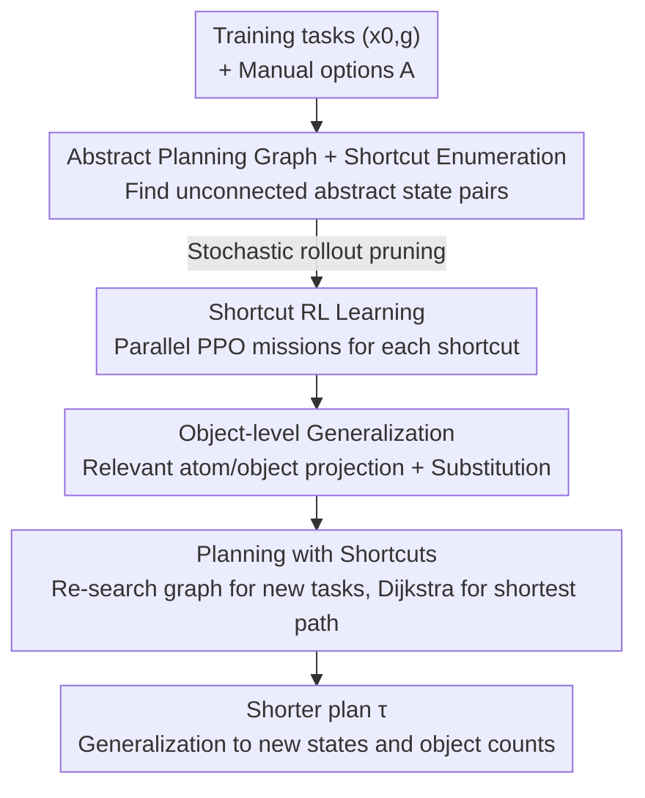

# SLAP: Shortcut Learning for Abstract Planning

**Conference**: ICLR 2026  
**OpenReview**: [https://openreview.net/forum?id=enprG5H9aD](https://openreview.net/forum?id=enprG5H9aD)  
**Code**: https://github.com/isabelliu0/SLAP  
**Area**: Robotics / Task and Motion Planning / Reinforcement Learning  
**Keywords**: Abstract Planning, TAMP, Option Discovery, Reinforcement Learning, Long-horizon Manipulation  

## TL;DR
SLAP automatically learns a set of "shortcut options" (e.g., a "slap" that pushes aside an obstacle tower) using model-free RL on an abstract planning graph induced by existing TAMP skills (pick/place/move). During evaluation, the planner treats these shortcuts as new edges to search for shorter paths, reducing execution length by over 50% in four simulated robotic environments while surpassing the success rates of both pure planning and pure RL.

## Background & Motivation
**Background**: Long-horizon robot decision-making with sparse rewards and continuous state/action spaces remains a difficult problem. Task and Motion Planning (TAMP) is a classic model-based solution that performs hierarchical planning across abstract (symbolic) and low-level (continuous motion) levels. It relies on manually defined "options/skills" (e.g., pick, place, move) to transition between abstract states.

**Limitations of Prior Work**: These skills are manually programmed, restricting agents to actions predefined by engineers. More critically, underlying TAMP assumptions—such as robots only making fingertip contact and skills only affecting a small set of specified objects (STRIPS assumption)—exclude many fast and "unconventional" solutions. For instance, to clear a stack of obstacles before placing a target block, TAMP painstakingly unstacks them one by one, resulting in a plan that, while satisfying constraints, is long and inefficient.

**Key Challenge**: Pure planning (TAMP) possesses long-range reasoning and generalization capabilities but is limited by manual skills and redundant solutions; pure RL / Hierarchical RL is flexible and creative but rarely succeeds in long-horizon manipulation tasks with sparse rewards (where rewards are only given upon completion). Both approaches have complementary strengths that have not been effectively unified.

**Goal**: In a practical setting where "a small set of manual skills is already available," the goal is to automatically discover new skills that shorten overall execution time (steps) without sacrificing success rates or requiring additional user input.

**Key Insight**: The authors observe that existing skills induce an "abstract planning graph" in the abstract state space. If two abstract states are not connected by an existing option, a potential "shortcut" may exist between them. Rather than learning skills from scratch (tabula rasa HRL often fails in long-range manipulation), RL can be specifically used to learn these shortcuts, guided by the high-level structure of the planning graph.

**Core Idea**: Use model-free RL to learn "shortcut options" within the abstract planning graph and integrate these shortcuts back into the option set for the planner to use. SLAP thus slides automatically between "pure planning" and "pure RL": if a shortcut is too difficult to learn, it reverts to pure planning; if the task is simple enough, the entire plan collapses into a single shortcut, effectively becoming pure RL.

## Method

### Overall Architecture
SLAP addresses the problem of "automatically learning shorter execution plans given a set of manual options." The process consists of two stages: **Offline training** builds the abstract planning graph on training tasks, enumerates candidate shortcuts, prunes them, and runs RL to learn a policy for each surviving shortcut independently. **Online evaluation** incorporates these shortcut policies into the original option set and re-searches the graph for new tasks. The planner automatically selects shortcuts if they reduce the plan length; failed shortcut edges are pruned. This pipeline is "plug-and-play" for users looking to improve the efficiency of an abstract planner.

In the formal setup, the environment is fully observable and deterministic, with continuous states $x \in X$ and actions $u \in U$. The transition function $f: X \times U \to X$ is known (e.g., a simulator). Tasks are goal-oriented $(x_0, g)$, and the solution is a trajectory $\tau$. The objective is to minimize $|\tau|$ (step count). The agent has access to an abstract state space $S$. Options $a$ are characterized by a triplet of initial abstract state $s^a_{\text{init}}$, terminal abstract state $s^a_{\text{term}}$, and policy $\pi_a$. The given set of options $A$ is assumed to be sufficient to solve the tasks (though solutions are often suboptimal).

### Key Designs

**1. Abstract Planning Graphs and Shortest Path Solving: Transforming Execution Time Optimality into a Searchable Graph Problem**

To find the shortest execution path, SLAP organizes planning into a two-level graph. Top-level nodes are abstract states $s$ and edges are options $a$; low-level nodes are environment states $x$ and edges are environment actions $u$. The two levels are coupled because a sequence of low-level actions corresponds to one high-level option. The graph is built starting from $x_0$ and $\text{abstract}(x_0)$ by simulating options and expanding via breadth-first search until a goal-satisfying node appears. Once meat-graph is constructed, running Dijkstra on the low-level nodes yields the solution with the minimum execution time. This structure allows SLAP to explicitly represent path weights, providing a framework to insert shortcut edges.

**2. Shortcut RL Learning and Stochastic Rollout Pruning: Directing RL to Promising Paths**

A shortcut is defined as an option $\hat{a} = \langle s_{\text{init}}, \pi_\theta, s_{\text{term}} \rangle$, where $(s_{\text{init}}, s_{\text{term}})$ is a pair of abstract states **not currently connected by any existing option**. The "slap" in Figure 1 is such a shortcut: it moves from "holding target block" directly to "target area cleared," bypassing the redundant path of moving obstacles one by one. Each shortcut corresponds to an episodic MDP where rewards are $R(x) = -1$ per step to minimize duration, terminating at $s_{\text{term}}$. The initial state distribution is sampled from states encountered in the training planning graph. Policies are learned using PPO.

Since the number of potential shortcuts is $O(|S|^2)$, pruning is essential. The authors propose a simple but effective heuristic: before training, run $N_{\text{rollout}}$ stochastic rollouts of length $T_{\text{rollout}}$. If $s_{\text{term}}$ is not reached in at least $K_{\text{rollout}}$ rollouts, the shortcut is pruned. This reduces candidates from quadratic scale to a trainable amount (e.g., from thousands to 92 in Obstacle Tower).

**3. Planning with Shortcuts and the Planning-Learning Spectrum: Automatic Adjustment to Capability**

During evaluation, the planner incorporates learned shortcut policies into the option set $A \cup \hat{A}$. Since shortcut policies might fail on new tasks, the planner verifies if a shortcut reaches the target abstract state within $T_{\text{eval}}$ steps; if it fails, the edge is pruned. This allows SLAP to adapt: if shortcuts are too difficult or existing options are already optimal, it reverts to pure planning. If a shortcut can solve the task from the start, the plan collapses into pure RL. Generalization is achieved through the robustness of the RL policies and the planner re-searching for each new goal.

**4. Object-level Generalization: Mapping via Relevant Atom Projection and Substitution**

TAMP usually assumes states are defined by objects and relations. SLAP uses this inductive bias for object-count generalization. A state $x$ is defined by a set of objects $O$ and feature vectors $\alpha(o, x)$. Abstract states are defined by atoms (discrete relations like $\text{on}(B,C)$ or $\text{holding}(A)$). For a shortcut $\hat{a}$, define $\text{rel}(\hat{a})$ as the set of objects involved in the changed atoms between $s_{\text{init}}$ and $s_{\text{term}}$. During training, the policy uses a state projection $\text{proj}_{\hat{a}}(x) = \alpha(o_1, x) \circ \cdots \circ \alpha(o_k, x)$, making it invariant to irrelevant objects. During evaluation, the agent finds an injective mapping $\sigma$ that maps objects in the new task to those in the training shortcut based on types and relations.

### Loss & Training
The reward for shortcut MDPs is a dense -1 penalty per step, which is equivalent to minimizing step count. All PPO policies (shortcuts, pure RL, HRL) share the same network architecture and hyperparameters, although the RL baseline is given more training steps and a higher entropy coefficient to aid exploration. Each policy is trained for 500,000 steps using stable-baselines3, with results averaged over 5 random seeds.

## Key Experimental Results

Evaluations were conducted across four simulated environments: Obstacle 2D, Obstacle Tower, Cluttered Drawer, and Cleanup Table (the latter three involve 7-DoF Franka Panda arms in PyBullet with Objaverse objects).

### Main Results

| Environment | Method | Success Rate | Plan Length | Relative Path Length |
|------|------|--------|---------|------|
| Obstacle 2D | SLAP (Ours) | 100% | 17.6 | ↓32% |
| Obstacle 2D | Pure Planning | 100% | 25.9 | 0% |
| Obstacle 2D | PPO / SAC+HER | 0% | 100 (cap) | N/A |
| Obstacle Tower | SLAP (Ours) | 100% | 79.2 | ↓68% |
| Obstacle Tower | Pure Planning | 100% | 245.8 | 0% |
| Obstacle Tower | Hierarchical RL / SOL | 0% | 500 (cap) | N/A |
| Cluttered Drawer | SLAP (Ours) | 100% | 165.8 | ↓53% |
| Cluttered Drawer | Pure Planning | 100% | 352.1 | 0% |
| Cleanup Table | SLAP (Ours) | 100% | 115.2 | ↓73% |
| Cleanup Table | Pure Planning | 100% | 431.8 | 0% |

SLAP maintains a 100% success rate across all environments while reducing plan length by up to 73% compared to pure planning. Pure RL baselines (PPO, SAC+HER) failed completely due to sparse rewards. While HRL/SOL can utilize predefined skills, the large number of grounded skill instances (216 in Obstacle Tower) makes high-level selection difficult, leading to failure in most environments except the simplest.

### Ablation Study

| Configuration | Observation | Explanation |
|------|------|------|
| Training Steps (Q3) | Steps↑ → Shortcuts↑, Length↓ | Plan length decreases as more shortcuts are mastered over 500k steps. |
| Independent (Default) | Shortest plans | Learning a separate policy for each shortcut is most effective. |
| Abstract Subgoals | Longer than Independent | Sharing a single policy with multi-hot goal encoding underperforms. |
| Abstract HER | Longer than Independent | Combining shared goals with hindsight relabeling does not improve performance. |
| Object Gen. (Q4) | Stable with more objects | Execution length remains short even as object counts increase. |

### Key Findings
- **Pruning is critical for scalability**: Compressing $O(|S|^2)$ candidates to dozens or hundreds makes parallel RL training feasible.
- **Independent learning outperforms shared policies**: While shared representations seem efficient, Independent consistently outperformed shared subgoals. The authors suspect joint training wastes resources on unlearnable shortcuts.
- **Object-level generalization is effective**: Shortcuts learned on 3 obstacles generalized to different counts and physical properties (mass/friction), while pure planning's length scaled linearly with obstacle count.

## Highlights & Insights
- **"Digging shortcuts" vs. "Building skills from scratch"**: By reframing option discovery as "filling gaps in a graph," SLAP leverages TAMP's long-range reasoning while allowing RL to excel at local improvisation, bypassing the traditional bottlenecks of HRL.
- **Planning-RL Spectrum**: The method allows an agent to adapt to task difficulty without manual tuning—relying more on planning for hard tasks and more on RL for easy ones.
- **Relational Inductive Bias for Skill Transfer**: Utilizing TAMP-style symbolic mechanisms (atoms and substitution) for skill transfer allows continuous RL policies to achieve strong combinatorial generalization.

## Limitations & Future Work
- **Dependency on user decomposition**: SLAP improves the execution of a given decomposition but cannot change the high-level task structure itself.
- **Simplified Planners**: Small abstract spaces were used to isolate the effects of shortcut learning; scaling to larger spaces would require more advanced planning techniques.
- **Simulator Reliance**: Currently requires a simulator for training. Future work could involve learning shortcuts in approximate simulators reconstructed from real-world data.

## Related Work & Insights
- **vs. TAMP / Accelerated TAMP**: Unlike prior work that learns abstractions or heuristics to speed up the planning process, SLAP focuses on learning **new low-level behaviors** to reduce the execution time of the resulting plan.
- **vs. Recovery Policies**: While recovery policies pull robots back into a plan after deviation, SLAP focuses on improving the efficiency of the plan itself.
- **vs. Hierarchical RL (MAPLE/SOL)**: HRL struggles with high-level selection when the number of grounded skills is large. SLAP delegates high-level sequence selection to a search-based planner, requiring RL only for individual shortcuts.

## Rating
- Novelty: ⭐⭐⭐⭐⭐ The first method to learn low-level skills specifically to optimize the execution time of an abstract planner using a "shortcut" framework.
- Experimental Thoroughness: ⭐⭐⭐⭐ Extensive evaluations across environments and baselines, though focused on simulation.
- Writing Quality: ⭐⭐⭐⭐⭐ Clear motivations and a comprehensive algorithmic description.
- Value: ⭐⭐⭐⭐⭐ Provides a general, plug-and-play paradigm for enhancing the efficiency of TAMP systems.

<!-- RELATED:START -->

## Related Papers

- [\[ICLR 2026\] ExoPredicator: Learning Abstract Models of Dynamic Worlds for Robot Planning](exopredicator_learning_abstract_models_of_dynamic_worlds_for_robot_planning.md)
- [\[ICLR 2026\] Planning with an Embodied Learnable Memory](planning_with_an_embodied_learnable_memory.md)
- [\[ICLR 2026\] Compositional Diffusion with Guided Search for Long-Horizon Planning](compositional_diffusion_with_guided_search_for_long-horizon_planning.md)
- [\[ICLR 2026\] MomaGraph: State-Aware Unified Scene Graphs with Vision-Language Models for Embodied Task Planning](momagraph_state-aware_unified_scene_graphs_with_vision-language_models_for_embod.md)
- [\[ICLR 2026\] Experience-based Knowledge Correction for Robust Planning in Minecraft](experience-based_knowledge_correction_for_robust_planning_in_minecraft.md)

<!-- RELATED:END -->
