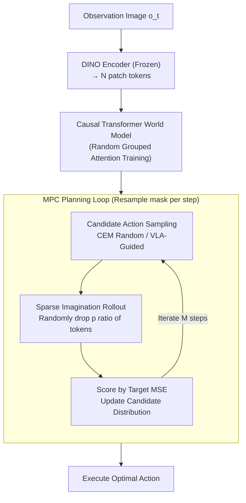

# Sparse Imagination for Efficient Visual World Model Planning

**Conference**: ICLR 2026  
**arXiv**: [2506.01392](https://arxiv.org/abs/2506.01392)  
**Code**: None (based on DINO-WM framework)  
**Area**: Robotics  
**Keywords**: world model, sparse tokens, MPC, DINO, VLA, token dropout, planning efficiency

## TL;DR
This paper proposes Sparse Imagination, which achieves significant inference acceleration (reducing planning time by ~50% at a 50% dropout rate) in ViT patch token-based world model planning through random token dropout and random grouped attention training. A key finding is that simple random dropout outperforms complex token selection methods because static importance ranking suffers from a "blind spot problem" in dynamic planning scenarios.

## Background & Motivation

**Background**: World model-based planning makes decisions by "imagining" future trajectories and has significantly improved performance in complex control tasks. Methods like DINO-WM (Zhou et al. 2024) use ViT patch tokens (DINO features) rather than short CLS tokens or pixels to represent visual states. This preserves fine-grained spatial information, which is advantageous for precise manipulation tasks.

**Limitations of Prior Work**: Model Predictive Control (MPC) requires repeated world model runs for a large number of candidate trajectories at each planning step—costing $K \times M \times H$ forward passes, which grows quadratically with the number of tokens. While full patch tokens are informative, this quadratic overhead makes real-time deployment nearly impossible, especially in embedded robotic scenarios with severely limited computational resources.

**Key Challenge**: There is a conflict between the spatial precision provided by patch tokens and the high computational cost they incur. The goal is to retain the advantages of fine-grained visual world models while compressing planning computation. Fortunately, ViT representations exhibit known redundancy (as proven by Raghu et al., Pan et al., Kim et al., etc.), suggesting that not all patches are equally important for downstream tasks.

**Key Insight**: Existing token reduction methods (attention ranking, learned selection, token merging, training-time dropout) are mostly validated on **static** tasks like classification. They have not been tested in **iterative dynamic** planning scenarios like MPC—where this paper finds that conclusions from static scenarios fail to hold.

## Method

### Overall Architecture

This paper addresses the inefficiency of ViT patch token world model planning. The workflow involves a frozen pre-trained DINO encoder that encodes each image frame into patch tokens $z_t \in \mathbb{R}^{H_p \times W_p \times D}$ (totaling $N=H_p\times W_p$ tokens). Subsequently, a causal Transformer world model predicts future states in the token space. The training objective is a per-token MSE prediction loss $\mathcal{L}_{wm} = \frac{1}{N}\sum_{i=1}^N \|\hat{z}_{t+1,i} - z_{t+1,i}\|^2$. The core modifications include **Random Grouped Attention Training** to adapt the model to incomplete inputs, **Sparse Imagination** during planning to cut computational costs, and **VLA-guided planning** for long-horizon tasks.

### Key Designs

**1. Sparse Imagination: Reducing Overhead via Random Dropout**

The computational bottleneck of MPC stems from running the world model across $K$ candidates, $M$ rounds of CEM optimization, and $H$ steps of the horizon. Attention overhead grows quadratically with the number of tokens. This work avoids complex token selection and instead randomly generates a dropout mask with ratio $p$ at each planning step, keeping only $(1-p)N$ tokens for the world model rollout. When $p=0.5$, planning time is nearly halved. The core finding is that naive random sampling outperforms "smart" methods like attention or learned ranking. Static importance measures contain "blind spots" during iterative optimization—a patch seemingly irrelevant at the current state might become critical when evaluating a specific candidate action sequence. Independent resampling of the mask at each step ensures unbiased coverage and avoids systematic omissions.

**2. Random Grouped Attention Training: Learning from Arbitrary Token Subsets**

A world model trained only on full tokens suffers severe performance degradation when tokens are removed during inference (ablation shows PushT success drops from 70% to 35% at $p=0.5$). To address this, patch tokens for each frame are randomly split into two groups during training. Within the Transformer layers, interaction is restricted to tokens within the same group using an attention mask, while causal alignment is maintained across the temporal dimension. This forces the model to learn predictive dynamics under partial visibility. Consequently, the model can extrapolate stably regardless of which or how many tokens are dropped during inference. Grouped attention is a necessary prerequisite for Sparse Imagination.

**3. VLA-Guided Planning: Policy-Guided Candidate Sampling**

For long-horizon tasks (LIBERO, Meta-World, real robot), blind random sampling in action space via CEM is slow and unlikely to hit effective trajectories. Instead, $K$ candidate action sequences are sampled from a pre-trained VLA (Vision-Language-Action) policy to replace CEM's random sampling. These are then rapidly evaluated and ranked by the sparse world model. The action prior from the VLA focuses candidates on reasonable regions, and when combined with the low-cost evaluation of Sparse Imagination, improves success rates by ~4–7% and reduces computation by ~40% in long-horizon tasks.

## Key Experimental Results

### Main Results

| Environment | Full (p=0) | Drop 30% | Drop 50% | CLS-token | Description |
|------|-----------|---------|---------|-----------|------|
| Pointmaze | 98.3% | 98.3% | **100%** | 96.7% | Sparse exceeds Full |
| Wall | 91.7% | 93.3% | 95.0% | 85.0% | Sparse better than Full |
| PushT | 75.0% | 61.7% | 70.0% | 43.3% | 50% drop near Full |
| Granular | 75.0% | **85.0%** | 60.0% | 20.0% | 30% drop exceeds Full |
| Rope | 63.3% | 70.0% | 73.3% | 36.7% | Sparse significantly better than CLS |
| Block Push | 22.0% | 18.0% | 20.0% | 16.0% | Small gap in hard tasks |

### Ablation Study

| Task | Full | Drop 50% | VLA-only | Time (Full→Drop) |
|------|------|---------|---------|----------------|
| PickPlace (Real) | - | **80%** | 60% | 19.1s→10.4s |
| Drawer (Real) | - | **70%** | 60% | 14.0s→10.6s |
| LIBERO-10 | 34% | 33% | 29% | 53.4s→29.7s |
| Meta-World | 48.8% | 47.7% | 42.7% | 3.63s→2.37s |

### Planning Speedup

| Environment | Full Time | Drop 50% Time | Gain (Speedup) |
|------|----------|-------------|--------|
| PushT | 173s/iter | 82s/iter | **52.6%** |
| Pointmaze | 184s/iter | 102s/iter | **44.6%** |
| Block Push | 297s/iter | 161s/iter | **45.8%** |

## Highlights & Insights
- Extremely elegant and simple: Substantial acceleration via random dropout without extra models.
- Deep analysis of the "blind spot problem"—explaining why random sampling outperforms complex token selection.
- High versatility: Validated across simple trajectory optimization, VLA-guided planning, and real-world robotics.
- The grouped attention strategy at the training stage can be seamlessly integrated into any Transformer-based world model.

## Ablation Study & Analysis

| Ablation/Analysis | Result |
|-----------|------|
| With vs. Without Grouped Attention | Severe degradation without it at 50% drop (PushT 70→35%); it is a necessary condition. |
| Random vs. Attention/Learned Ranking | Random sampling is competitive or superior; "blind spots" make static ranking fail. |
| Optimal Drop Ratio | 10-50% is the optimal range; performance degrades significantly above 70%. |
| VLA-Guided vs. CEM Random Sampling | VLA guidance improves success by ~4-7% and reduces computation by ~40% in long-horizon tasks. |
| Training vs. Inference Sparsity | Both are required: training sparsity ensures model adaptation, while inference sparsity provides acceleration. |

### Deep Dive: the "Blind Spot Problem"
- Static importance measures (e.g., attention weights, CLS token correlation) create systematic blind spots during the iterative optimization of MPC.
- Specifically, some patches seemingly unimportant in the current state may become critical when evaluating specific candidate action sequences.
- Random sampling avoids systematic omission via unbiased coverage—resampling the mask in each iteration ensures all regions have a probability of being covered.
- This finding contradicts common conclusions in token pruning literature where "learned selection is superior to random," highlighting the unique nature of planning scenarios.

## Limitations & Future Work
- The optimal drop ratio requires manual selection and lack an adaptive mechanism—a possible improvement is dynamic adjustment based on task complexity or state.
- The number of groups is fixed at 2; effects of more groups (e.g., 3-4) were not explored.
- Relies on the redundancy assumption of DINO features, which may not hold in information-dense scenarios (e.g., text-heavy interfaces).
- Real-world validation is limited to two relatively simple tasks (PickPlace + Drawer).
- Not combined with token merging methods (e.g., ToMe)—sparse selection plus merging might further improve efficiency.

## Related Work & Insights
- **vs. Dreamer Series (Hafner et al.)**: Dreamer imagines in a low-dimensional vector latent space, while this work imagines in a high-dimensional patch token space—preserving rich spatial information but costing more; Sparse Imagination bridges this gap.
- **vs. DINO-WM (Zhou et al. 2024)**: Built directly upon DINO-WM, solving its computational bottleneck via sparse imagination.
- **vs. ToMe (Bolya et al.)**: ToMe reduces computation via token merging; this work uses token dropout, which is simpler and requires no merging logic.
- **vs. SmolVLA (Shukor et al.)**: SmolVLA provides pre-trained policies for guided planning; Sparse Imagination accelerates the world model evaluation of such guidance.
- **Inspiration**: The Sparse Imagination concept can be extended to other scenarios requiring numerous forward passes—such as value network evaluation in MCTS or world simulation in multi-step reasoning.

## Rating
- Novelty: ⭐⭐⭐⭐ Simple but effective insight; blind spot analysis adds unique value.
- Experimental Thoroughness: ⭐⭐⭐⭐⭐ 8 simulation + 2 real-world tasks, extensive baselines and ablations.
- Writing Quality: ⭐⭐⭐⭐ Clear logic, high-quality visuals, and intuitive methodology diagrams.
- Value: ⭐⭐⭐⭐ Practical contribution easily integrated into any Transformer-based world model pipeline.

<!-- RELATED:START -->

## Related Papers

- [\[CVPR 2026\] ForeAct: Steering Your VLA with Efficient Visual Foresight Planning](../../CVPR2026/robotics/foreact_steering_your_vla_with_efficient_visual_foresight_planning.md)
- [\[ICLR 2026\] Ctrl-World: A Controllable Generative World Model for Robot Manipulation](ctrl-world_a_controllable_generative_world_model_for_robot_manipulation.md)
- [\[ICLR 2026\] WMPO: World Model-based Policy Optimization for Vision-Language-Action Models](wmpo_world_model-based_policy_optimization_for_vision-language-action_models.md)
- [\[CVPR 2026\] Chain of World: World Model Thinking in Latent Motion (CoWVLA)](../../CVPR2026/robotics/chain_of_world_world_model_thinking_in_latent_motion.md)
- [\[ICLR 2026\] WorldGym: World Model as an Environment for Policy Evaluation](worldgym_world_model_as_an_environment_for_policy_evaluation.md)

<!-- RELATED:END -->
