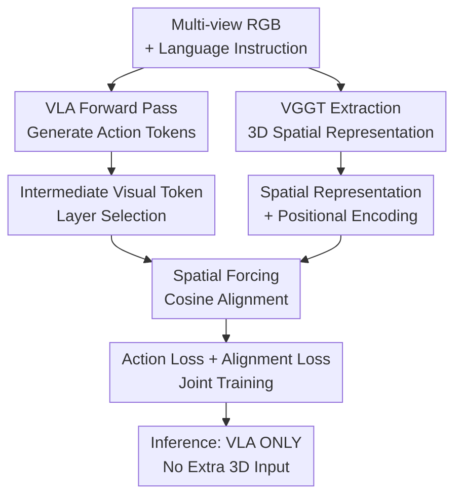

# Spatial Forcing: Implicit Spatial Representation Alignment for Vision-language-action Model

**Conference**: ICLR2026  
**OpenReview**: [https://openreview.net/forum?id=euMVC1DO4k](https://openreview.net/forum?id=euMVC1DO4k)  
**Paper**: [https://spatial-forcing.github.io/](https://spatial-forcing.github.io/)  
**Code**: No public repository  
**Area**: Robotics / VLA / Spatial Representation Alignment  
**Keywords**: VLA, Spatial Awareness, Robotic Manipulation, Representation Alignment, 3D Foundation Models  

## TL;DR
Spatial Forcing utilizes geometric latents from a pre-trained 3D foundation model (VGGT) to supervise the intermediate visual tokens of a VLA. This enables robotic policies to acquire stronger spatial understanding without requiring additional depth maps or point clouds during inference, leading to improved success rates, convergence speed, and data efficiency on LIBERO, RoboTwin, and real-robot tasks.

## Background & Motivation
**Background**: Recent Vision-Language-Action (VLA) models typically inherit image and language understanding capabilities from VLMs, outputting robotic actions through action tokenization, action experts, or flow matching heads. This approach transfers large-scale 2D vision-language pre-training to robotic control, but the visual backbones are mostly trained on 2D images, yielding semantically rich but geometrically unreliable representations.

**Limitations of Prior Work**: Robotic manipulation relies on relative positioning, height, occlusion, and contact relationships in a 3D world. Existing 3D VLAs often explicitly incorporate depth maps, point clouds, or estimated 3D cues at the input stage. However, real-world depth sensors are prone to noise, reflections, occlusions, and calibration errors. Furthermore, many existing robotic datasets lack depth information, limiting the scalability of explicit 3D inputs.

**Key Challenge**: Since VLA action tokens are generated conditioned on preceding visual and language tokens, the bottleneck for action precision is whether the intermediate visual tokens carry reliable spatial structures, rather than the model's high-level language comprehension. Explicitly adding 3D sensors provides geometric information at the cost of hardware generality; relying solely on 2D pre-training fails to guarantee control-relevant 3D cues in visual tokens.

**Goal**: The authors aim to find a more general training paradigm: leveraging external 3D priors during training to align VLA visual representations with spatial structures, while using only standard multi-view RGB images and language instructions during inference, without additional depth inputs or computational overhead.

**Key Insight**: A lightweight depth probing experiment revealed that unaligned visual embeddings from frozen VLAs struggle to recover meaningful spatial structures. However, embeddings subjected to spatial supervision can generate results much closer to ground-truth depth. This indicates that intermediate VLA layers are "shapeable" positions for spatial enhancement.

**Core Idea**: The Core Idea of Spatial Forcing is to use the 3D geometric representations of VGGT to align VLA intermediate visual tokens during training, and discard the 3D teacher during inference, retaining only the spatially-aware VLA.

## Method

### Overall Architecture
Spatial Forcing (SF) does not add an explicit 3D input branch. Instead, it treats intermediate visual tokens as supervisable scene representations during training. Given multi-view images and language instructions, the VLA generates actions normally. Simultaneously, the same images are fed into a pre-trained 3D foundation model (VGGT). The pixel-level spatial representations from VGGT serve as teacher signals to align the visual tokens of a specific VLA layer. During inference, only the VLA is executed, with no extra sensors or VGGT overhead.

In the VLA framework, the model encodes multi-view images into visual tokens $\{x_i^V\}_{i=1}^N$ and language instructions into language tokens $\{x_j^L\}_{j=1}^M$, then autoregressively generates action tokens: $x_t^A \sim p_\theta(x_t^A \mid \{x_i^V\}_{i=1}^N, \{x_j^L\}_{j=1}^M, x_{<t}^A)$. This formulation explains why the supervision is applied to intermediate visual tokens: the ability of an action expert to predict correct trajectories depends heavily on the reliability of the spatial structure read from these visual tokens.

### Key Designs
**1. Implicit 3D Teacher via VGGT Latents: Bypassing Depth Sensor Dependency**
SF selects VGGT (Visual Geometry Grounded Transformer) as the external spatial representation source. VGGT can predict 3D attributes such as camera parameters, point maps, and depth from a set of 2D images. Rather than feeding these explicit 3D outputs to the VLA, SF uses the latent representations of the VGGT transformer backbone as supervision. This ensures the VLA does not need depth maps or point clouds as inputs, while still receiving signals from a model that has learned multi-view geometric consistency. This "implicit" nature makes it suitable for diverse robotic datasets lacking depth data.

**2. Aligning Intermediate Visual Tokens: Positioning Spatial Information for Action Generation**
Instead of applying geometric constraints to the final hidden state, SF selects visual tokens $x_i^V$ after a specific causal attention layer. These tokens pass through batch normalization $\Gamma$ and a two-layer MLP for dimension adaptation before cosine alignment with VGGT spatial representations. The core loss is:
$$L_{align}=-\frac{1}{N}\sum_{i=1}^{N}S(MLP(\Gamma(x_i^V)), f_i^{3D}(I)+E)$$
where $f_i^{3D}(I)$ is the VGGT spatial representation at the corresponding pixel location and $E$ is additional positional encoding. Calibrating tokens ensures the action expert operates on a geometrically sound scene representation.

**3. Positional Encoding and Layer Selection**
Adding positional embedding $E$ to the VGGT target representation is crucial for long-horizon tasks. Since VLA visual tokens participate in action generation in a specific order within causal attention, losing positional information would make it difficult to represent constraints like "the bowl on the left." Layer selection experiments found that the 24th layer (out of 32 in the VLM backbone) performed best. Shallow layers lack global task-relevant representations, while the deepest layers involve modality fusion that diminishes visual specificity.

**4. Joint Action Training and Zero-overhead Inference**
The final objective is $L_{SF}=L_{action}+\alpha L_{align}$. The term $L_{action}$ is the standard robotic action loss (e.g., $L1$, cross-entropy, or flow matching). Experiments suggest an optimal $\alpha=0.5$. During deployment, the VGGT teacher is removed, and the VLA maintains its original input-output interface, requiring no depth sensors or additional point cloud processing.

### Loss & Training
For LIBERO experiments, OpenVLA-OFT was trained for $150k$ iterations. For RoboTwin, the model was based on $\pi_0$ and trained using LoRA for $30k$ iterations. SF is agnostic to the specific action expert as long as intermediate visual tokens are accessible. The default alignment target is the VGGT latent with positional embeddings.

## Key Experimental Results

### Main Results
On LIBERO, SF outperforms strong 2D VLA baselines and rivals or exceeds explicit 3D VLAs without using depth or point clouds. It shows significant gains in "Long" tasks, where spatial representation quality prevents error accumulation over long sequences.

| Category | Method | Spatial SR | Object SR | Goal SR | Long SR | Average SR |
|----------|------|------------|-----------|---------|---------|------------|
| 2D VLA | $\pi_0$ | 96.8 | 98.8 | 95.8 | 85.2 | 94.2 |
| 2D VLA | UniVLA | 96.5 | 96.8 | 95.6 | 92.0 | 95.2 |
| 2D VLA | OpenVLA-OFT | 97.6 | 98.4 | 97.9 | 94.5 | 97.1 |
| Explicit 3D VLA | GeoVLA | 98.4 | 99.0 | 96.6 | 96.6 | 97.7 |
| Explicit 3D VLA | 3D-CAVLA | 98.2 | 99.8 | 98.2 | 96.1 | 98.1 |
| **Ours** | **Spatial Forcing** | **99.4** | **99.6** | **98.8** | **96.0** | **98.5** |

On RoboTwin 2.0, SF achieved the highest average success rate, with more pronounced gains in "hard" settings featuring cluttered scenes and varied lighting. Real-robot experiments on an AgileX dual-arm platform confirmed that SF is more robust to changes in lighting, object instances, and table heights.

### Ablation Study
Ablations show that SF's value comes from both the alignment paradigm and the 3D geometric quality of VGGT. Replacing the teacher with SigLIP or DINOv2 yields lower performance than VGGT.

| Configuration | Spatial SR | Object SR | Goal SR | Long SR | Average SR |
|---------------|------------|-----------|---------|---------|------------|
| Baseline (no align) | 96.8 | 94.8 | 92.8 | 86.2 | 92.7 |
| SigLIP target | 95.2 | 94.8 | 94.0 | 91.8 | 94.0 |
| DINOv2 target | 93.4 | 95.2 | 93.8 | 93.8 | 94.1 |
| VGGT w/o PE | 97.8 | 100.0 | 96.6 | 84.4 | 94.7 |
| **VGGT + PE** | 97.2 | 99.2 | 96.8 | 94.2 | **96.9** |

Layer selection analysis:
- Layer 1: 94.6% Avg SR
- Layer 24: 96.9% Avg SR (Optimal)
- Layer 32: 94.8% Avg SR
- **Adaptive Selection**: **98.1% Avg SR** (Weighted mixture of layers further improves performance).

### Key Findings
- VGGT targets significantly outperform SigLIP/DINOv2, proving that VLA control lacks geometric structure rather than generic visual semantics.
- Positional Encoding (PE) is vital for long-horizon tasks, increasing Long SR from 84.4% to 94.2%.
- SF achieves $3.8\times$ faster convergence and significant data efficiency (reaching 75.8% SR with only 5% of training data).
- Probing analysis suggests SF aligns the relative structure of VLA features to the 3D teacher while preserving their modality identity.

## Highlights & Insights
- **Shifting 3D Information**: SF smartly moves 3D information from "input modality" to "training supervision," avoiding sensor reliability issues while utilizing 3D geometric priors.
- **Token-level Alignment**: By targeting intermediate visual tokens—the direct dependency for action generation—SF ensures the model operates on a grounded scene memory.
- **Latent vs. Explicit**: Higher-dimensional geometric latents from 3D foundation models may be superior to simple depth maps as teacher signals because they capture multi-view consistency.
- **Data Efficiency**: The ability to boost success rates with 1/20th of the data is a massive advantage for real-world robotics where demonstrations are expensive.

## Limitations & Future Work
- **Teacher Dependency**: SF relies on the quality of VGGT; geometric errors in the foundation model might propagate to the VLA.
- **Sensitivity**: Hyperparameters like $\alpha$ and layer index are sensitive and may require searching for different backbones.
- **Training Overhead**: Generating teacher representations during training increases computational costs, though inference remains at zero cost.
- **Future Work**: Potential for hybrid VLA models that combine explicit 3D sensors (when available) with implicit alignment.

## Related Work & Insights
- **vs. SpatialVLA**: SpatialVLA injects explicit depth-derived position encodings. SF requires no depth at inference, making it more flexible for RGB-only datasets.
- **vs. GeoVLA / 3D-CAVLA**: These models use explicit point clouds or depth. SF achieves comparable or better results through representation alignment.
- **vs. REPA**: REPA demonstrates that aligning hidden states helps generative models. SF adapts this to the 3D-spatial domain for robotic control.

## Rating
- Novelty: ⭐⭐⭐⭐☆
- Experimental Thoroughness: ⭐⭐⭐⭐☆
- Writing Quality: ⭐⭐⭐⭐☆
- Value: ⭐⭐⭐⭐⭐

<!-- RELATED:START -->

<!-- RELATED:END -->

## Related Papers

- [\[ICLR 2026\] From Spatial to Actions: Grounding Vision-Language-Action Model in Spatial Foundation Priors](from_spatial_to_actions_grounding_vision-language-action_model_in_spatial_founda.md)
- [\[ICLR 2026\] UniVLA: Unified Vision-Language-Action Model](unified_vision-language-action_model.md)
- [\[CVPR 2026\] Spatial-Aware VLA Pretraining through Visual-Physical Alignment from Human Videos](../../CVPR2026/robotics/spatial-aware_vla_pretraining_through_visual-physical_alignment_from_human_video.md)
- [\[ICLR 2026\] Spatially Guided Training for Vision-Language-Action Model](spatially_guided_training_for_vision-language-action_model.md)
- [\[ICML 2026\] Spatial Memory for Out-of-Vision Manipulation in Vision-Language-Action](../../ICML2026/robotics/spatial_memory_for_out-of-vision_manipulation_in_vision-language-action.md)

<!-- RELATED:END -->
