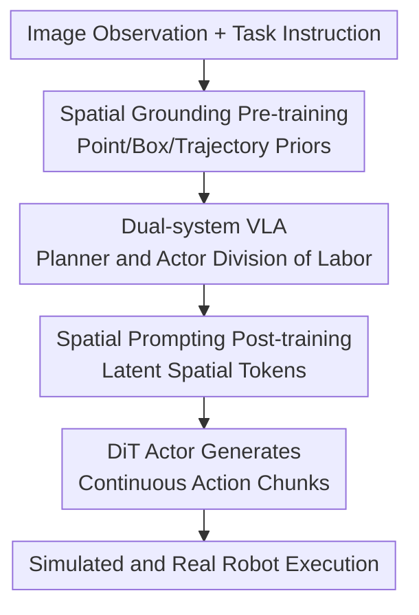

# Spatially Guided Training for Vision-Language-Action Model

**Conference**: ICLR2026  
**OpenReview**: [https://openreview.net/forum?id=eKhOrQWAVJ](https://openreview.net/forum?id=eKhOrQWAVJ)  
**Code**: https://internrobotics.github.io/internvla-m1.github.io  
**Area**: Robotics / VLA Training  
**Keywords**: Vision-Language-Action models, spatial grounding, robotic manipulation, spatial prompting, dual-system strategy  

## TL;DR

ST4VLA significantly mitigates the issues of "seeing but not moving" or "forgetting how to see after learning to move" in VLA training by first teaching the VLM spatial priors such as points, boxes, and trajectories, and then injecting these priors as implicit planning conditions into a DiT action expert via spatial prompts during the action post-training phase. It achieves stronger generalization in SimplerEnv, LIBERO, large-scale simulated pick-and-place, and real-world long-horizon robotic tasks.

## Background & Motivation

**Background**: Current general-purpose robotic policies roughly follow two paths. One is hierarchical robotic systems: they first use VLMs, detectors, segmenters, or 3D scene graphs for task decomposition and spatial localization, then pass intermediate results to low-level controllers. The other is data-driven VLA: images, language, and robot trajectories are trained end-to-end within the same model to predict actions directly from instructions.

**Limitations of Prior Work**: Hierarchical systems benefit from clear spatial structures (e.g., knowing which object to grasp and where to place it), but they often rely on manual rules, hand-written planners, or fixed task templates, making them costly to scale to complex tabletop scenes and long-horizon tasks. End-to-end VLAs are easier to scale but tend to "wash out" useful spatial reasoning capabilities inherent in pre-trained VLMs. Supervision from action data primarily comes from low-level control trajectories while text instructions are sparse, causing the model to sacrifice target localization, affordance understanding, and trajectory reasoning to fit action patterns.

**Key Challenge**: Robot control requires both continuous actions and highly transferable, discrete spatial priors. VLM pre-training learns vast vision-language knowledge, but standard VLA fine-tuning exposes this knowledge directly to action loss, leading to spatial grounding degradation. Simply mixing grounding and action data for joint training causes gradient conflicts between the two objectives, resulting in unstable perception and action.

**Goal**: The goal is to address the VLA training paradigm rather than a single controller architecture: how to preserve the VLM's spatial capabilities while learning robot actions, how to optimize spatial grounding and action policy objectives in the same direction, and how to make these spatial priors truly serve real-world manipulation and long-horizon tasks.

**Key Insight**: In robotic tasks, "where to act" and "how to act" should not be completely coupled. Spatial information like points, boxes, trajectories, and object relationships are general knowledge across tasks and embodiments. In contrast, joint increments, end-effector trajectories, and gripper states are embodiment-specific control knowledge. Decoupling these and connecting them via lightweight conditions during action training is more reasonable than forcing a single model to carry all objectives simultaneously.

**Core Idea**: Replace standard VLA fine-tuning with "spatial grounding pre-training + spatial prompt-guided action post-training." This allows a VLM Planner to continuously generate transferable spatial implicit plans, which a DiT Actor then converts into specific robot actions.

## Method

### Overall Architecture

ST4VLA is a dual-system VLA framework: System 2 is a slower but more reliable VLM Planner responsible for extracting semantic and spatial priors from images and instructions; System 1 is an action expert DiT Actor responsible for converting these priors and robot observations into continuous control actions. Training is divided into two steps: first, strengthening the VLM's spatial grounding capabilities; second, activating these capabilities via spatial prompts during action post-training and feeding VLM latent spatial embeddings to the action expert through a querying transformer.

The critical aspect of this framework is that spatial information is not forced into explicit boxes or points for a rule-based controller but enters the action expert as latent planning tokens. This preserves the end-to-end trainability of VLA while ensuring the action model "sees" target objects, spatial relationships, and potential trajectories during control signal generation.

### Key Designs

**1. Spatial Grounding Pre-training: Embedding robotic spatial common sense into the VLM**

Standard VLM vision-language pre-training possesses semantic knowledge but lacks the specific spatial signals required for robotics: target locations, empty slots, graspable regions, and approximate end-effector trajectories. The first stage of ST4VLA unifies web-scale multimodal grounding data and robot-related data into a QA format, allowing a Qwen2.5-VL style Planner to learn box, point, and trajectory outputs during supervised fine-tuning. Data sources include RefCOCO, LLaVA-OneVision, RoboRefIt, A0, MolmoAct, and an ST4VLA manipulation dataset constructed by the authors.

The value of this step is decoupling "spatial priors" from specific robot embodiments. For example, bounding box QA teaches the model to find objects based on language, point QA teaches it to point at targets or slots, and trajectory QA teaches it to describe manipulation trends via 2D trajectories. These capabilities determine which object or path the action expert should focus on. Experiments show that while general grounding data provides some improvement, adding robotic grounding data significantly boosts metrics on Where2Place, RoboRefit, A0 ManiSkill, and SimplerEnv.

**2. Dual-system VLA: Planner manages "where and what," Actor manages "how"**

Ours does not directly convert the VLM into a monolithic action model but adopts a dual-system structure. The VLM Planner (System 2) reads images and language to provide latent representations of semantics, targets, and spatial relationships. The action expert (System 1) uses a compact diffusion transformer and DINOv2 visual encoder to predict embodiment-specific actions. They are connected by a querying transformer (only 8.7 MB), which maps variable-length VLM tokens into a fixed number of learnable query tokens as conditions for the action expert.

This design avoids two extremes: explicit planning system regression into brittle task decomposition, and end-to-end action loss overriding VLM spatial representations. The querying transformer acts as a lightweight interface, extracting spatial latents needed by the action expert. Gradient decay is applied at this interface (e.g., scaling gradients from the Actor back to the VLM by $0.5$), allowing joint optimization without causing the VLM to forget multimodal knowledge.

**3. Spatial Prompting Post-training: Activating spatial priors via prompts instead of coordinate outputs**

The core of the second stage is not simple co-training but appending spatial prompts to action data. For instance, an instruction like "store all toys into the toy box" is expanded to "Identify all relevant toys and their spatial relationships to the container." A default unified prompt is "Figure out how to execute it, then locate the key object needed." This does not require the model to output explicit coordinates but induces the Planner to focus on target objects and spatial relations within its latent representations.

Ablations show that while Random Padding achieves only 58.5% average success rate (ruling out token length benefits), Box/Point/Trace prompting achieve 76.6%, 74.9%, and 73.9% respectively. However, the Unified Prompting reaches 77.9%, performed best. This suggests that spatial semantics must be activated but not necessarily compressed into fixed formats, as rigid constraints might limit the Planner's implicit reasoning.

**4. Gradient Alignment Diagnosis: Proving objective alignment via PSS**

The paper analyzes whether spatial grounding and action learning are consistent at the optimization level using Projection-Space Similarity (PSS). Given a spatial grounding batch and an action batch with gradient matrices $G_{spat}$ and $G_{act}$, projection matrices are constructed as $P_{spat}=G_{spat}G_{spat}^{+}$ and $P_{act}=G_{act}G_{act}^{+}$. Similarity is defined as $PSS(G_{spat},G_{act})=\frac{tr(P_{spat}P_{act})}{min(r_{spat},r_{act})}$. Higher values indicate less conflict when updating shared parameters.

Vanilla co-training shows a PSS of only 0.25, reflecting inconsistent optimization. ST4VLA increases PSS to 0.42. During training, Vanilla VLA perception performance drops to near-random, whereas ST4VLA retains ~70% of original RefCOCO-g capability while reaching success milestones faster on WidowX.

### Loss & Training

The first stage uses standard SFT-style next-token prediction to train the VLM Planner on unified QA formats covering VQA, box QA, point QA, and trajectory QA. No robotic action heads are trained here.

The second stage uses both action data and multimodal spatial grounding data. The action expert predicts continuous action chunks (chunk size 16 in SimplerEnv). The VLM receives primary images, instructions, and auxiliary spatial prompts. The action expert predicts actions conditioned on the Planner's latent tokens. Multimodal data follows the QA format loss, while action data uses robotic action loss. The total optimization is a weighted sum of both.

Loss weighting is crucial. Ablations on grounding vs. action loss weights reveal that $1:1$ or $1:5$ biases the model too much toward grounding, while $1:15$ or $1:20$ weakens spatial capabilities. The optimal ratio is approximately $1:10$, yielding success rates of 80.7/76.0 on Google Robot VM/VA and 71.7 on WidowX.

## Key Experimental Results

### Main Results

Experiments cover simulated benchmarks (SimplerEnv, LIBERO), large-scale Isaac-Sim pick-and-place, real Franka pick-and-place, and real long-horizon tasks. ST4VLA shows significant improvements over vanilla VLA and strong baselines in SimplerEnv.

| Benchmark / Track | Metric | Ours (ST4VLA) | Strong Baseline | Gain |
|--------|------|------|----------|------|
| SimplerEnv Google Robot Visual Matching | Avg SR | 84.6 | SpatialVLA 75.1 | +9.5 |
| SimplerEnv Google Robot Variant Aggregation | Avg SR | 75.9 | SpatialVLA 70.7 | +5.2 |
| SimplerEnv WidowX Visual Matching | Avg SR | 73.2 | GR00T N1.5 61.9 | +11.3 |
| LIBERO Average | Avg SR | 95.9 | π0.5-KI 94.3 | +1.6 |
| Real Pick-and-Place | Avg SR | 65 | GR00T N1.5 48 | +17 |

In SimplerEnv, ST4VLA achieved 97.3, 98.0, 65.3, and 77.8 in Pick Coke Can, Move Near, Open/Close Drawer, and Open Top Drawer & Place Apple respectively.

| Training Strategy | MME | RefCOCO-g IoU@0.5 | Where2Place point-Acc | Google Robot VM/VA | WidowX VM |
|------|---------|------|------|------|------|
| Vanilla VLA | - | - | - | 66.1 / 63.5 | 54.7 |
| Vanilla co-train | 1106 | 47.1 | 21.4 | 70.2 / 66.5 | 61.1 |
| + Spatially Guided | 1374 | 68.1 | 25.5 | 78.8 / 70.0 | 67.4 |
| + Spatially Pretrained | 1411 | 71.2 | 25.5 | 84.6 / 75.9 | 73.2 |

### Ablation Study

| Configuration | Key Metrics | Note |
|------|---------|------|
| No Additional Pretraining | Google VM/VA 66.1/63.5, WidowX 54.9 | Relying only on base Qwen2.5-VL |
| + General Grounding Data | Google VM/VA 72.6/70.3, WidowX 65.2 | Improves target recognition |
| + Robotic Grounding Data | Google VM/VA 84.3/75.9, WidowX 73.1 | Largest gain from robot-specific spatial data |
| Unified Spatial Prompt | Avg 77.9 | Most stable prompting strategy |

### Key Findings

- Spatial pre-training is the key factor determining the performance ceiling of VLA. Increasing spatial data from 0M to 3.0M improved metrics from 61.4 to 77.9.
- Simple co-training does not solve the perception-action conflict. Vanilla co-training has low PSS and oscillatory curves; ST4VLA increases PSS to 0.42, aligning the objectives.
- Real-world generalization is significantly improved. Ours achieved a 65% success rate in real pick-and-place, outperforming GR00T N1.5 (48%) and π0 (31%).
- In long-horizon tasks (sandwich making, sorting), ST4VLA leads, performing better under physical interference and task replanning scenarios.

## Highlights & Insights

- The ingenuity of ST4VLA lies in treating spatial grounding as a training objective for the VLM Planner and a latent condition for the Actor, rather than an external module. This retains end-to-end scalability while avoiding reliance on fixed detectors.
- The paper treats the collapse of spatial capabilities during VLA fine-tuning as an observable phenomenon (validated by PSS and RefCOCO-g curves) rather than just reporting success rates.
- Unified spatial prompting results suggest that robot policies do not necessarily need explicit chain-of-thought outputs; activating the correct latent space via language can provide sufficient information to the controller.

## Limitations & Future Work

- The training pipeline is heavy, requiring >3M spatial entries and large-scale demonstrations, posing a high reproduction barrier.
- Success is demonstrated mainly in tabletop scenarios. More complex contact-rich manipulation and tool use require further validation.
- Failure cases indicate that while the model locates targets, it can still fail in grasp pose or transition phases due to control precision limits.
- Future work could incorporate depth, proprioception, or 3D affordance maps into the Planner-Actor interface to handle uncertainty.

## Related Work & Insights

- **vs Monolithic VLAs (OpenVLA, RT-2)**: ST4VLA emphasizes establishing spatial grounding before action learning, which yields higher stability in unseen contexts.
- **vs Diffusion/Flow Policies (π0)**: While π0 focuses on action modeling, ST4VLA proves that VLM spatial reasoning as an independent training objective provides additional gains.
- **Insight**: Intermediate representations do not have to be explicit text or symbolic structures. "Trainable latent spatial plans" that constrain the action expert without limiting VLM reasoning are a promising direction.

## Rating

- Novelty: ⭐⭐⭐⭐☆ Combines grounding pre-training, spatial prompts, and dual-system VLA comprehensively.
- Experimental Thoroughness: ⭐⭐⭐⭐⭐ Extensive coverage across simulation and real-world benchmarks with solid ablation chains.
- Writing Quality: ⭐⭐⭐⭐☆ Clear main line and figures, though some details are dispersed in the appendix.
- Value: ⭐⭐⭐⭐⭐ Practical recipe for VLA training, particularly regarding the preservation of spatial priors.

<!-- RELATED:START -->

## Related Papers

- [\[ICLR 2026\] Spatial Forcing: Implicit Spatial Representation Alignment for Vision-language-action Model](spatial_forcing_implicit_spatial_representation_alignment_for_vision-language-ac.md)
- [\[ICLR 2026\] Hybrid Training for Vision-Language-Action Models](hybrid_training_for_vision-language-action_models.md)
- [\[ICLR 2026\] PixelVLA: Advancing Pixel-level Understanding in Vision-Language-Action Model](pixelvla_advancing_pixel-level_understanding_in_vision-language-action_model.md)
- [\[ICLR 2026\] UniVLA: Unified Vision-Language-Action Model](unified_vision-language-action_model.md)
- [\[ICLR 2026\] From Spatial to Actions: Grounding Vision-Language-Action Model in Spatial Foundation Priors](from_spatial_to_actions_grounding_vision-language-action_model_in_spatial_founda.md)

<!-- RELATED:END -->
