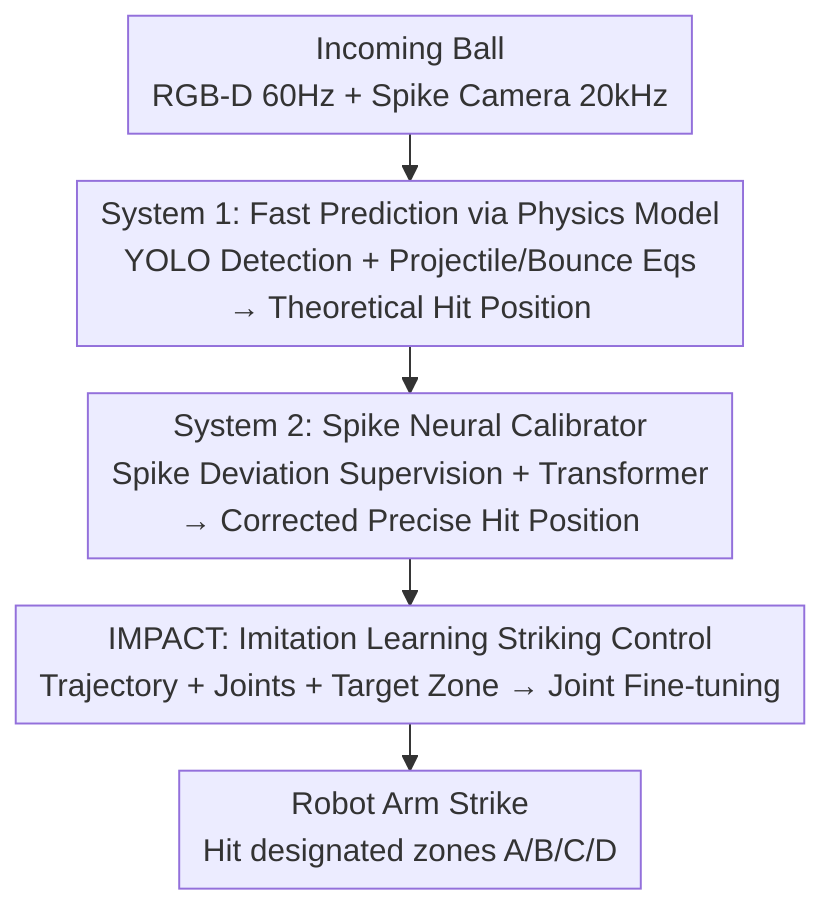

# SpikePingpong: Spike Vision-based Fast-Slow Pingpong Robot System

**Conference**: ICLR 2026  
**OpenReview**: [https://openreview.net/forum?id=d08yOXs1Dl](https://openreview.net/forum?id=d08yOXs1Dl)  
**Code**: Not yet public (promised to be open-sourced after acceptance)  
**Area**: Robotics / Embodied AI  
**Keywords**: Spike camera, Fast-slow dual system, Ping-pong robot, Imitation learning, High-speed manipulation

## TL;DR
SpikePingpong integrates the high-frequency vision of a spike camera into a "fast-slow dual-system" perception framework. System 1 utilizes a standard RGB-D camera combined with a physical model for rapid point-of-fall prediction, while System 2 employs a spike camera to train a neural calibrator for correcting physical errors. Combined with the IMPACT module for imitation learning to control the return zone, the system achieves a return hit rate of 92% in a 30cm area and 70% in a 20cm area on a real ABB robotic arm, significantly exceeding human averages.

## Background & Motivation

**Background**: Most research in robotic manipulation is confined to static or slow-moving objects, where tasks like tabletop grasping or slow placement involve simple dynamics and predictable behaviors. Table tennis is widely recognized as an ideal testbed for high-speed dynamic manipulation—it compresses millisecond-level perception, millisecond-level prediction, precise motor control, and real-time tactical planning into a seemingly simple game, representing a typical manifestation of Moravec’s paradox.

**Limitations of Prior Work**: Existing table tennis robots fall into two categories, each with critical flaws. Control-based methods (perception-prediction-control pipeline) rely on precise physical modeling and pre-calibration; while mathematically rigorous, they cannot adapt to real-world perturbations like ball spin or air resistance. Learning-based methods (Reinforcement Learning / Imitation Learning) are theoretically more flexible but suffer severely from the sim-to-real gap; policies trained in simulation often fail on real hardware, especially as subtle factors like spin and contact dynamics are difficult to replicate in simulation. Furthermore, both approaches typically require expensive high-precision vision systems, as ordinary RGB cameras produce significant motion blur with high-speed balls, leading to inaccurate position estimation and trajectory prediction.

**Key Challenge**: There is a fundamental trade-off between "speed" and "accuracy" in high-speed scenarios—pure physical models are fast but inaccurate (unable to model real perturbations), while pure neural networks are either slow or dependent on simulation, leading to sim-to-real failure. A single system struggles to balance millisecond response times with high precision.

**Goal**: To build a table tennis robot that achieves a high hit rate on real hardware and can target specific tactical zones without relying on expensive high-speed motion capture hardware or simulations.

**Key Insight**: The authors draw inspiration from Kahneman's dual-system cognitive theory (System 1 fast intuition + System 2 slow deliberate reasoning) to decouple perception into two layers. The fast system handles real-time coarse prediction, while the slow system performs fine calibration. Concurrently, a spike camera (20 kHz high frequency, no motion blur) is introduced as a "high-fidelity information source" for the slow system, but it is used only during training and not during deployment, thereby balancing accuracy and efficiency.

**Core Idea**: Replace a "single perception system" with "rapid prediction via physical modeling + a spike-vision-trained neural calibrator to correct residuals." This is followed by imitation learning using real-world data instead of simulation to learn end-to-end striking strategies on the real machine.

## Method

### Overall Architecture
SpikePingpong conceptually decomposes the table tennis task into two stages: **Interception** and **Striking**. The interception stage answers "where the ball will go and where to place the paddle," accomplished by the fast-slow dual-system framework. The striking stage answers "how to swing the paddle to hit the ball into a specific target zone," handled by the IMPACT imitation learning module.

The interception stage itself consists of two layers: System 1 uses an RGB-D camera (60 Hz) for real-time ball detection and a classic projectile physics model to predict the hittable position with millisecond response times. However, the physical model ignores real-world deviations like air resistance and ball spin. Thus, System 2—the "Spike-Oriented Neural Improvement Calibrator"—is introduced. It uses the "pixel deviation between the ball center and paddle center" observed by the spike camera at the moment of contact as a supervisory signal to learn the systematic residuals between the System 1 theoretical hit point and the true optimal interception point. Crucially, the spike camera is only used during System 2 training; once trained, System 2 acts as a lightweight neural predictor at deployment, regressing the deviation vector directly from trajectory features without requiring spike camera feedback.

Once the refined hitting position is obtained, the IMPACT module takes over: it encodes the incoming ball trajectory, robot joint configuration, and target zone into tokens, which are passed through a Transformer to output joint angle fine-tuning amounts, strategically hitting the ball into target zones A/B/C/D.

### Key Designs

**1. System 1 Physical Model Fast Prediction: Millisecond Coarse Prediction via Classic Projectile Equations**

This layer addresses the prerequisite that rapid response must precede high precision. It uses YOLOv4-tiny (lightweight, detection frequency up to 150 Hz) to extract ball pixel positions from the RGB-D stream, then converts image coordinates to 3D world coordinates using calibrated camera parameters. After obtaining the ball's 3D position, Exponential Moving Average (EMA) filtering is applied to get stable position $(x,y,z)$ and velocity $(v_x,v_y,v_z)$, which are fed into the physical model to predict the hittable position. Specifically, the time $t = \frac{y_{hit}-y}{v_y}$ for the ball to reach the hitting plane $y_{hit}$ is determined, allowing the x-coordinate $x_{hit} = x + v_x \cdot t$ to be calculated (if $x_{hit}$ is outside the robot's workspace, it is judged unhittable).

The z-coordinate involves two cases: if the ball does not touch the table before $y_{hit}$ (direct trajectory), $z_{hit} = z + v_z\cdot t + \frac{1}{2}g t^2$; if it bounces, $z + v_z\cdot t_{rb} + \frac{1}{2}g t_{rb}^2 = h_{table}$ is solved for the bounce time, then the coefficient of restitution $e$ is used to calculate post-bounce velocity $v_{z,in} = -\sqrt{-2g(z-h_{table})+v_z^2}$, $v_{z,out} = -e\cdot v_{z,in}$, followed by secondary bounce evaluation. This pure physical derivation is computationally cheap and extremely fast, serving as the real-time skeleton of the system; however, because it assumes ideal projectiles and ignores air resistance and spin, it has high error alone (MAE of 44.13 for System 1 Only).

**2. System 2 Spike Neural Calibrator: Learning Physical Model Residuals via Spike Vision**

This is the core innovation, addressing the "fast but inaccurate" pain point of System 1. Instead of rewriting a more complex physical model, the authors learn the "systematic deviation between theoretical and actual hit points." The brilliance of the training data lies in the supervisory signal: for each trial, the paddle center is placed at the theoretical optimal hit position predicted by System 1 using inverse kinematics. A spike camera (20 kHz, no motion blur) then captures the image at the moment of ball-paddle contact. The **pixel distance between the ball center and paddle center** in the image serves as the ground truth spatial deviation. An ordinary RGB camera would produce a blur at this instant—making the spike camera indispensable.

Architecturally, System 2 takes three modalities: historical positions $p_i \in \mathbb{R}^{K\times 3}$ and velocities $v_i \in \mathbb{R}^{K\times 3}$ from the last $K$ frames, and the physical model’s predicted hit position $h_i \in \mathbb{R}^3$. Each modality passes through an MLP with ReLU and dropout to extract features, which are concatenated and fed into a Transformer encoder to capture temporal dependencies. A regression head outputs the predicted deviation vector $\hat{D}_i \in \mathbb{R}^2$, trained with MSE: $L_{MSE}(\theta) = \frac{1}{N}\sum_{i=1}^N \|\hat{D}_i - D_i\|^2$, where $\hat{D}_i = f_\theta([p_i, v_i, h_i])$. The crucial engineering value is that the spike camera is only used for training data collection; once trained, System 2 is a lightweight predictor directly regressing deviation from trajectory features, **requiring no spike camera feedback during deployment**. This layer reduces the overall MAE from 44.13 to 12.34.

**3. IMPACT Imitation Learning Striking Control: Learning Tactical Placement from Real Demonstrations**

While interception puts the paddle in the right place, striking tactical zones requires controlling the swing. This is the role of IMPACT (Imitation-based Motion Planning And Control Technology). It addresses the "sim-to-real gap" by completely eschewing simulation in favor of real-world imitation learning. Data collection is clever: first, the fast-slow system predicts the hit position and positions the arm. Then, random angular perturbations are applied to three key joints before executing the swing. Only "successful" trials where the ball returns to the opponent's half are kept, recording the perturbed joint angles and actual hit zone as labels. Compared to teleoperation, this "automated positioning + random perturbation" approach is highly efficient and provides stable data quality.

The network uses a Transformer architecture, taking ball trajectory sequences, joint configurations, and target zones (one-hot) as inputs. Each modality is encoded as a token and concatenated for self-attention to capture cross-modal dependencies, outputting joint angle adjustments. The training objective is $L_{MSE}(\theta') = \frac{1}{N}\sum_{i=1}^N \|\hat{J}_i - J_i\|^2$, where $\hat{J}_i = f_{\theta'}([p_i, v_i, j_i, c_i])$, $j_i \in \mathbb{R}^6$ is the joint configuration, $c_i \in \mathbb{R}^4$ is the one-hot target zone, and $J_i \in \mathbb{R}^3$ is the ground truth adjustment vector. This allows the robot to dynamically adjust its strategy and precisely aim for target zones, upgrading the system from simply "getting the ball back" to "using tactics."

### Loss & Training
Both System 2 and IMPACT use MSE regression loss (supervising deviation vectors and joint adjustments, respectively). System 1 requires no training (pure physics + a two-stage trained YOLOv4-tiny detector: pre-trained on public datasets, then fine-tuned in-domain). The control system operates with multi-frequency coordination: trajectory processing at 60 Hz, joint configurations via IK at 20 kHz, IMPACT striking adjustments at 2.4 kHz, and commands sent to the EGM controller at 250 Hz. Hardware includes an ABB IRB-120 arm + standard paddle. The dataset contains 1k trajectory-deviation samples and 2k expert return demonstrations.

## Key Experimental Results

### Main Results
Hit position prediction error (lower is better); spike neural calibration reduces error to approximately half that of the RNN baseline:

| Method | Y-axis MAE | Z-axis MAE | Overall MAE | Overall RMSE |
|------|---------|---------|----------|-----------|
| System 1 Only | 53.65 | 34.62 | 44.13 | 50.62 |
| RNN-based | 24.10 | 21.50 | 22.80 | 23.73 |
| System 1 + System 2 (Ours) | 9.87 | 14.82 | **12.34** | **13.85** |

Single-target return hit rate (average for four zones, higher is better) and inference latency:

| Method | 30cm Hit Rate | 20cm Hit Rate | Inference Latency (ms) |
|------|------------|------------|--------------|
| Human Average | 53% | 33% | — |
| Diffusion Policy (w/o vision) | 6% | 2% | 25.18 |
| ACT (w/o vision) | 19% | 7% | 7.15 |
| SpikePingpong | **92%** | **70%** | **0.407** |

SpikePingpong not only crushes baselines and human performance in hit rate but also has an inference latency of only 0.407 ms—about 17x faster than ACT and 60x faster than Diffusion Policy—leaving ample time for the robot arm's physical execution. An interesting detail: ACT's performance increased from 12% to 19% when raw vision was removed, indicating that raw images introduced too much latency.

### Ablation Study
Ablation of trajectory prediction components (30cm threshold, average for four zones):

| Configuration | Single Target Hit | Sequential Hit | Note |
|------|-----------|-------------|------|
| System 1 + IMPACT | 23% | 15% | Physics only, high error |
| RNN + IMPACT | 67% | 52% | RNN instead of Spike calibration |
| SpikePingpong (Full) | **92%** | **78%** | Full fast-slow system |

### Key Findings
- **Spike neural calibration is the deciding factor for hit rate**: Removing System 2 (System 1 Only) causes the single-target hit rate to collapse from 92% to 23%; replacing it with an RNN only yields 67%. The full system outperforms the RNN by 25 percentage points because it can characterize "ball-paddle contact sensitivity"—subtle differences in contact position can produce wildly different trajectories for the same swing, and the spike camera's high-fidelity contact observation captures this perfectly.
- **Sequential tactical capability exceeds humans**: In a sequential task of 100 continuous returns, SpikePingpong maintains a 78% overall hit rate (humans 45%), proving it isn't just "good for one hit" but can sustain long-range tactics.
- **Robust generalization**: Moving the ball server to two off-center positions unseen during training (completely changing the distribution) still yields a 74% hit rate in a 30cm zone (vs 92% in-distribution), showing it learned an internal model of ball dynamics rather than just memorizing trajectory patterns.
- **Transferability to human opponents**: After fine-tuning on 100 demonstrations from a single human player, the system achieved a 47% hit rate against them; zero-shot testing against a completely new player yielded 31%, suggesting it captured generalizable features of human style rather than overfitting to individual habits.

## Highlights & Insights
- **"Spike camera only for training" is the most clever design**: Spike cameras are expensive and complex. The authors use them for high-fidelity contact supervision but distill that knowledge into a lightweight neural calibrator deployed without the camera. This secures the accuracy benefits while maintaining low cost and real-time performance.
- **Physics + Neural Residual Learning combo**: Rather than fighting the complex dynamics of the real world by rewriting a physics model, the authors let the physics model handle the "bulk" and the neural network handle the "residuals." This "physics foundation + learning correction" approach can be transferred to any high-speed manipulation scenario with an approximate but imperfect physical model.
- **Application of Kahneman’s dual-system theory**: The partitioning of System 1 (fast/coarse) and System 2 (slow/refined) is not just conceptual fluff; it directly corresponds to the functional division of "fast physics prediction + precise neural calibration."
- **Full real-world, zero simulation**: By using "automated positioning + random perturbation + success filtering," they efficiently collect real expert demonstrations, bypassing the sim-to-real gap—crucial for tasks like table tennis where contact dynamics are notoriously difficult to simulate.

## Limitations & Future Work
- **Code and datasets are not yet public** (promised after acceptance). Hardware barriers (spike camera + ABB arm) remain high, making reproduction costly.
- **Discrete target zones**: Target zones are currently just four discrete areas (A/B/C/D), representing coarse tactical control. Performance against adversarial human opponents requiring continuous landing points and real-time strategic play has not been fully verified.
- **Limited generalization to human play**: Zero-shot performance on new human players is only 31%, indicating a gap before practical competitive play. Complex ball types like heavy spin or slices are not deeply addressed.
- **Lack of public hardware baseline comparisons**: The authors admit there are no public hardware baselines, limiting comparisons to human data and learning methods like ACT/Diffusion Policy.
- Future directions: Replace discrete zones with continuous landing point regression; introduce opponent intention prediction for active gameplay; use high-frequency spike information to further model ball spin.

## Related Work & Insights
- **vs Control methods (Acosta / Mülling, etc.)**: These rely on precise physics and pre-defined control, which are mathematically rigorous but require exact calibration and lack adaptation to perturbations. This paper keeps the physical model as a skeleton but uses a neural calibrator to absorb real-world deviations.
- **vs Learning methods (i-Sim2Real / GoalsEye, etc.)**: Most rely on simulations and are hindered by the sim-to-real gap. Even GoalsEye relies on sim2real. This work uses purely real-world data for imitation learning, requiring no simulation.
- **vs ACT / Diffusion Policy (General IL strategies)**: IMPACT's inference takes only 0.407 ms with a 92% hit rate vs their 19%/6%, proving that domain-specific tokenization of trajectories, joints, and zones for high-speed tasks far outperforms off-the-shelf general strategy networks.

## Rating
- Novelty: ⭐⭐⭐⭐⭐ First to introduce spike cameras into a fast-slow dual system for ping-pong interception; the distillation design is clever.
- Experimental Thoroughness: ⭐⭐⭐⭐⭐ Real-world evaluation across single-target, sequential, OOD, and human-opponent dimensions; solid ablation and latency data.
- Writing Quality: ⭐⭐⭐⭐ Clear structure and complete formulas; some motivations are a bit grandiose, but limitations are addressed.
- Value: ⭐⭐⭐⭐⭐ Demonstrates superhuman hit rates and millisecond response times on real hardware, setting a strong example for high-speed temporal control tasks.

<!-- RELATED:START -->

## Related Papers

- [\[ICLR 2026\] Ground Slow, Move Fast: A Dual-System Foundation Model for Generalizable Vision-Language Navigation](ground_slow_move_fast_a_dual-system_foundation_model_for_generalizable_vision-la.md)
- [\[CVPR 2026\] Towards Open Environments and Instructions: General Vision-Language Navigation via Fast-Slow Interactive Reasoning](../../CVPR2026/robotics/towards_open_environments_and_instructions_general_vision-language_navigation_vi.md)
- [\[ICLR 2026\] Rodrigues Network for Learning Robot Actions](rodrigues_network_for_learning_robot_actions.md)
- [\[ICLR 2026\] RAVEN: End-to-end Equivariant Robot Learning with RGB Cameras](raven_end-to-end_equivariant_robot_learning_with_rgb_cameras.md)
- [\[ICLR 2026\] SARM: Stage-Aware Reward Modeling for Long Horizon Robot Manipulation](sarm_stage-aware_reward_modeling_for_long_horizon_robot_manipulation.md)

<!-- RELATED:END -->
