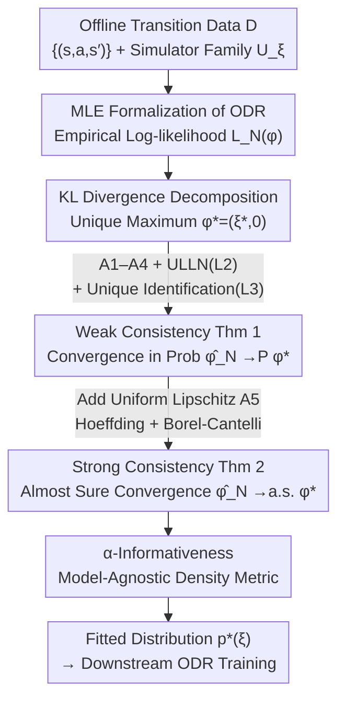

# Statistical Guarantees for Offline Domain Randomization

**Conference**: ICLR 2026  
**arXiv**: [2506.10133](https://arxiv.org/abs/2506.10133)  
**Code**: None  
**Area**: Robotics  
**Keywords**: Domain Randomization, sim-to-real transfer, maximum likelihood estimation, consistency, offline RL

## TL;DR

This work formalizes Offline Domain Randomization (ODR) as a Maximum Likelihood Estimation (MLE) problem over a parameterized family of simulators. Under mild regularity and identifiability assumptions, it proves weak consistency (convergence in probability) and, by adding a uniform Lipschitz continuity assumption, establishes strong consistency (almost sure convergence), providing the first theoretical foundation for the empirical success of ODR in sim-to-real transfer.

## Background & Motivation

**Background**: Reinforcement learning agents often suffer from performance degradation when deployed from simulation to the real world, a phenomenon known as the "sim-to-real gap." Domain Randomization (DR) is a mainstream solution—randomly sampling physical parameters (mass, friction, sensor noise, etc.) during training to construct a diverse family of simulators, making the policy robust to environmental variations. DR has achieved zero-shot transfer in tasks such as quadrotor flight, dexterous manipulation, and legged robotics.

**Limitations of Prior Work**:
   - **Inefficiency of Uniform DR (UDR)**: The standard practice applies a broad uniform prior to physical parameters, but theoretical analysis by Chen et al. (2022) shows that the sim-to-real gap of UDR scales with $O(M^3 \log(MH))$—performance guarantees deteriorate rapidly as the number of candidate simulators $M$ increases.
   - **Neglect of Available Real-World Data**: UDR fails to utilize offline data collected from the real system to guide the selection of parameter distributions.
   - **Lack of Theoretical Foundation**: While ODR methods (e.g., DROPO, DROID, BayesSim) show significant empirical advantages, it remains theoretically unknown (i) if the fitted distribution converges to the true dynamics as data grows and (ii) the magnitude of improvement over UDR.

**Key Challenge**: Empirical performance of ODR is superior, but statistical guarantees are lacking—it is unclear under what conditions offline data reliably guides the choice of domain randomization distributions.

**Goal**:
   - Prove weak consistency of the ODR estimator (convergence in probability to the true parameters).
   - Prove strong consistency of the ODR estimator (almost sure convergence).
   - Analyze the practicality of various assumptions and provide relaxation conditions.

**Key Insight**: Treat ODR as a Maximum Likelihood Estimation (MLE) over a family of parameterized simulators and establish rigorous convergence proofs using classical statistical tools (Uniform Laws of Large Numbers for Glivenko-Cantelli classes, Borel-Cantelli lemma, etc.).

**Core Idea**: ODR is essentially a parameterized MLE problem that possesses provable statistical consistency under mild assumptions, providing a solid theoretical basis for its empirical success.

## Method

### Overall Architecture

This paper does not propose a new algorithm but provides a proof for "why it converges" for the existing ODR paradigm. The objective is fundamental: given a set of offline transition triplets $\mathcal{D} = \{(s_i, a_i, s_i')\}_{i=1}^N$ (assumed i.i.d.) collected from a real environment $\mathcal{M}^*$, and a family of simulators $\mathcal{U} = \{\mathcal{M}_\xi : \xi \in \Xi \subset \mathbb{R}^d\}$ sharing the same state/action space but with transition probabilities controlled by physical parameters $\xi$. The goal is to fit a parameter distribution $p_\phi(\xi) = \mathcal{N}(\mu, \Sigma)$ such that the simulator family closely matches the real dynamics.

Fitting is performed by maximizing the mixture likelihood $\phi^* = \arg\max_\phi \sum_i \log \mathbb{E}_{\xi \sim p_\phi}[P_\xi(s_i' \mid s_i, a_i)]$, and the learned distribution $p^*(\xi)$ is used for downstream policy training $\pi_{\text{ODR}}^* = \arg\max_\pi \mathbb{E}_{\xi \sim p^*}[V_{\mathcal{M}_\xi}^\pi(s_1)]$. The theory answers whether $\phi^*$ converges to the true parameters as $N$ grows through a chain of "Formalization → Weak Consistency → Strong Consistency → Informativeness Metric."

### Key Designs

**1. MLE Formalization of ODR: Translating "Distribution Fitting" into Standard MLE**

While ODR works empirically, the theoretical objective of "fitting the distribution" was unclear. This paper formulates it as empirical log-likelihood $L_N(\phi) = \frac{1}{N}\sum_{i=1}^N \log q_\phi(s_i' \mid s_i, a_i)$, where $q_\phi(s'\mid s,a) = \int p_\xi(s'\mid s,a)\, p_\phi(\xi)\, d\xi$ is the transition kernel after mixing the simulator family according to $p_\phi$. A key step is the KL divergence decomposition of the population log-likelihood $L(\phi)$, proving its unique maximizer is $\phi^* = (\xi^*, 0)$—where the distribution collapses to the true parameter $\xi^*$ with zero variance. This allows the use of established statistical MLE tools.

**2. Weak Consistency (Theorem 1): Convergence in Probability**

The goal is to prove any measurable maximizer $\hat{\phi}_N$ converges in probability to $\phi^*$. The proof involves: using a Uniform Law of Large Numbers (ULLN) to show empirical likelihood uniformly approaches population likelihood $\sup_\phi |L_N(\phi) - L(\phi)| \to 0$ (Lemma 2); utilizing the unique maximizer property to show any parameter deviating from $\phi^*$ by more than $\epsilon$ incurs a uniform likelihood loss bound $\eta(\epsilon)$ (Lemma 3); and combining these to show the probability of $\hat{\phi}_N$ falling outside the $\epsilon$-neighborhood of $\phi^*$ vanishes as $N \to \infty$. This relies on four assumptions: Assumption 1 (Regularity), Assumption 2 (Compactness), Assumption 3 (Mixture Positivity $q_\phi \geq c > 0$), and Assumption 4 (Identifiability).

**3. Strong Consistency (Theorem 2): Almost Sure Convergence via Lipschitz Continuity**

Weak consistency only ensures convergence probability approaches 1, but deployment often requires almost sure convergence for a single trajectory. This requires summability of error probabilities. Thus, Uniform Lipschitz continuity (Assumption 5) is introduced: $|a(x,\phi) - a(x,\psi)| \leq L\|\phi - \psi\|$. By constructing an $\epsilon/L$-net over a compact parameter space and applying Hoeffding’s inequality at each net point, an exponential deviation bound $P(|L_N(\phi_i) - L(\phi_i)| > \epsilon) \leq 2\exp(-N\epsilon^2 / 2\tilde{M}^2)$ is obtained. The Borel-Cantelli lemma then implies $\sum_N P(\sup|L_N - L| > 2\epsilon) < \infty$, yielding $\hat{\phi}_N \xrightarrow{a.s.} \phi^*$.

**4. $\alpha$-Informativeness: A Model-Agnostic Metric for Concentration**

To measure the ability of an ODR algorithm to "concentrate information near the truth," the paper defines: an algorithm $\mathcal{A}$ is $(\alpha, \epsilon)$-informative if for $N \geq N_0$, the learned distribution $\hat{\phi}_N$ assigns at least $\alpha$ probability mass within an $\epsilon$-ball of $\xi^*$. Strong consistency implies Gaussian ODR satisfies this for any $\alpha < 1$. This definition is independent of the specific parameter distribution choice, allowing comparison of different ODR variants.

Practicality of assumptions:

| Assumption | Original Form | Relaxation | Applicability |
|------|----------|----------|--------|
| A1 Regularity | Bounded & Continuous density | None needed | Finite discrete and Gaussian transitions |
| A2 Compactness | Compact $\Phi$ | None needed | Physical parameters always have prior bounds |
| A3 Positivity | $q_\phi \geq c > 0$ | Log-tail condition $P(\inf_\phi q_\phi(X) \leq \epsilon) \leq 1/\log(1/\epsilon)^2$ | Covers light-tailed families like Gaussian |
| A4 Identifiability | Unique recovery of $\xi^*$ | Relax to convergence to identification set $\mathcal{Q}_\mu^*$ | Covers partial identification |
| A5 Uniform Lipschitz | $|a(x,\phi)-a(x,\psi)| \leq L\|\phi-\psi\|$ | $C^2$ kernel with bounded gradient (Lemma 7) | Smooth physical simulators |

## Key Experimental Results

### Theoretical Results Comparison

As a theoretical work, the core contribution is statistical guarantees.

| Method | Convergence Type | Sim-to-real gap | Data Requirement | Dependency on $M$ |
|------|----------|-----------------|----------|-----------------|
| UDR (Chen et al., 2022) | Non-adaptive | $O(M^3 \log(MH))$ | No offline data | Cubic growth |
| UDR (Ours, improved) | Non-adaptive | $O(M^3 \log(MH))$ | No offline data | Cubic growth |
| ODR Weak Consistency | Prob. $\to \phi^*$ | Converges to 0 | i.i.d. or ergodic | Related to identifiability |
| ODR Strong Consistency | a.s. $\to \phi^*$ | Converges to 0 | i.i.d. + Lipschitz | Lipschitz control |

### Hierarchical Guarantees

| Assumption Set | Guarantee Level | Convergence Mode | Key Tool |
|----------|----------|----------|----------|
| A1+A2+A3+A4 | Weak Consistency | $\hat{\phi}_N \xrightarrow{P} \phi^*$ | ULLN (Glivenko-Cantelli) |
| A1+A2+A3+A4+A5 | Strong Consistency | $\hat{\phi}_N \xrightarrow{a.s.} \phi^*$ | Hoeffding + Borel-Cantelli |
| A1+A2+A3 (No A4) | Set Consistency | $\text{dist}(\hat{\phi}_N, \mathcal{Q}_\mu^*) \xrightarrow{P} 0$ | Berge's Maximum Theorem |

### Key Findings

- **UDR gap bound improvement**: Refined the $O(M^3 \log^3(MH))$ bound from Chen et al. to $O(M^3 \log(MH))$ in Appendix A by tighter parameter selection.
- **Adaptive Advantage of ODR**: ODR avoids the $M^3$ amplification effect of UDR by concentrating distributions around the true parameters.
- **Sufficiency for Lipschitz**: Assumption 5 is satisfied if the transition kernel $p_\xi$ is $C^2$ in $\xi$ with bounded gradients ($|\nabla_\xi p_\xi| \leq G_1$, $|\nabla_\xi^2 p_\xi| \leq G_2$).

## Highlights & Insights

- **Elegant use of KL Decomposition**: Proving $\phi^* = (\xi^*, 0)$ is the unique maximizer via KL divergence properties naturally connects MLE with information theory.
- **Progressive Proof Strategy**: Developing guarantees from weak to strong consistency and then analyzing assumption relaxations provides a template for other statistical estimation problems in RL.
- **$\alpha$-Informativeness**: Provides a standard metric for ODR quality independent of Gaussian assumptions.
- **Identification Set**: Recognizes that under incomplete data coverage, point convergence generalizes to set convergence $\text{dist}(\hat{\phi}_N, \mathcal{Q}_\mu^*) \to 0$, which is information-theoretically optimal.

## Limitations & Future Work

- **Lack of Finite Sample Bounds**: The work proves asymptotic consistency ($N \to \infty$) but does not specify "how much data" is needed for a specific error tolerance.
- **No Experimental Validation**: Lacks verification on robotic platforms to correlate theoretical predictions with empirical performance.
- **Gaussian Parameterization**: While adaptable, the current proofs heavily leverage properties of Gaussian families (e.g., Lévy Continuity Theorem).
- **Hard-to-verify Identifiability**: Assumption 4 is difficult to verify a priori for complex simulator families.
- **Optimization Landscape**: Assumes global maximizers are found, ignoring the non-convexity of the MLE objective in practice.

## Related Work & Insights

- **vs UDR (Chen et al., 2022)**: ODR asymptotically eliminates the gap that scales with $M^3$ in UDR by leveraging data.
- **vs DROPO (Tiboni et al., 2023)**: Provides the theoretical bridge for empirical algorithms like DROPO.
- **vs BayesSim (Ramos et al., 2019)**: This frequentist MLE analysis complements Bayesian ODR approaches.
- **vs DROID (Tsai et al., 2021)**: MLE objectives used in this theory are arguably more grounded than L2 distance-based system identification.

## Rating

- Novelty: ⭐⭐⭐⭐ First statistical consistency guarantee for ODR.
- Experimental Thoroughness: ⭐⭐ Purely theoretical, lacks benchmarks.
- Writing Quality: ⭐⭐⭐⭐⭐ Clear structure and rigorous analysis of assumptions.
- Value: ⭐⭐⭐⭐ Strong theoretical foundation, though lacks finite sample analysis for direct practical guidance.

<!-- RELATED:START -->

## Related Papers

- [\[ICLR 2026\] Cross-Embodiment Offline Reinforcement Learning for Heterogeneous Robot Datasets](cross-embodiment_offline_reinforcement_learning_for_heterogeneous_robot_datasets.md)
- [\[ICLR 2026\] Hierarchical Value-Decomposed Offline Reinforcement Learning for Whole-Body Control](hierarchical_value-decomposed_offline_reinforcement_learning_for_whole-body_cont.md)
- [\[ICML 2026\] Dual Quaternion SE(3) Synchronization with Recovery Guarantees](../../ICML2026/robotics/dual_quaternion_se3_synchronization_with_recovery_guarantees.md)
- [\[ICLR 2026\] One Demo Is All It Takes: Planning Domain Derivation with LLMs from A Single Demonstration](one_demo_is_all_it_takes_planning_domain_derivation_with_llms_from_a_single_demo.md)
- [\[ICML 2026\] Towards Efficient and Expressive Offline RL via Flow-Anchored Noise-conditioned Q-Learning](../../ICML2026/robotics/towards_efficient_and_expressive_offline_rl_via_flow-anchored_noise-conditioned_.md)

<!-- RELATED:END -->
