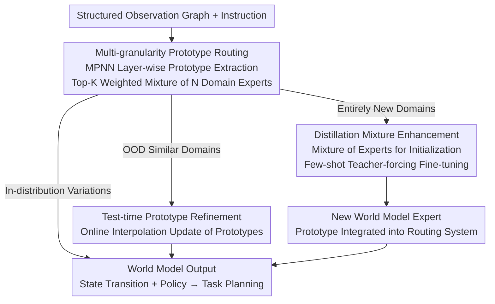

# Test-Time Mixture of World Models for Embodied Agents in Dynamic Environments

**Conference**: ICLR 2026  
**arXiv**: [2601.22647](https://arxiv.org/abs/2601.22647)  
**Area**: Robotics / Embodied AI

## Rating

⭐⭐⭐⭐

This paper extends the static routing of MoE to **test-time trainable routing**—a concept transfer that is inherently valuable. The three technical components (multi-granularity prototype routing, test-time refinement, and distillation enhancement) form a complete closed loop of "instant adaptation → online optimization → long-term expansion," covering different adaptation needs from similar domains to entirely new domains encountered after deployment. Experiments across three simulation benchmarks plus a real Franka robot show an average SR increase of 27% in zero-shot scenarios, which is highly persuasive. Practical limitations include: (1) dependence on structured graph observations, requiring additional perception modules for raw pixel inputs; (2) the relatively small scale of the underlying LLMs (Llama-3.2-1B/3B), which may result in a lower performance ceiling.

---

## Background & Motivation

Embodied agents based on language models are rapidly being deployed in homes, factories, and virtual environments. Existing representative solutions include Code as Policies, Language to Rewards, LLM + domain models (SayCanPay), and In-Context Learning (LLM-Planner). However, these methods face a **Key Challenge**:

> Real-world deployment environments vary continuously in time and space, yet the capabilities of agents are frozen after training. The only ways to adapt to new domains are full retraining (costly in computation and data) or in-context learning (leading to context window bloat during inference).

Although MoE architectures achieve structural modularity through expert modules, their routing functions are fixed after training, preventing the reconfiguration of expert combinations after deployment. The **Core Idea** of TMoW is to **make the routing function updatable at test time**—not by changing the expert weights themselves, but by changing "who is selected and in what proportion they are mixed."

---

## Method

### Overall Architecture

TMoW attaches $N$ domain adapters $\{m_j\}_{j=1}^N$ to a base model $M$ in the form of LoRA, where each adapter serves as a world model (state transition + policy) for a specific domain. For every frame of structured observation and instruction, an MPNN graph processor extracts **multi-granularity prototypes** layer-by-layer. At each layer, routing scores are calculated based on the similarity between the prototypes and current embeddings to select a top-K weighted mixture of experts—this is the TMoW "router." Unlike traditional MoE, this routing is not frozen; it follows two update paths depending on the familiarity of the domain: for OOD but related similar domains, it performs **online prototype refinement** to combine new expert ratios; for entirely unseen new domains, it use routing weights to **distill and mix** a brand-new expert into the system. These three mechanisms cover the entire adaptation spectrum from "in-distribution changes → OOD similar domains → entirely new domains" without ever modifying the expert weights or requiring retraining.

### Key Designs

**1. Multi-granularity Prototype Routing: Matching "Who is Selected" to Domain Knowledge at the Appropriate Granularity**

Traditional MoE uses a single global representation for routing. However, in embodied scenarios, "whether this drawer can be opened" is an object-level problem, while "whether this is a kitchen or a bedroom" is a scene-level problem. Single-granularity matching loses information. TMoW allows the MPNN to aggregate neighbors layer-by-layer on the observation graph $\mathcal{G}^{(o)}$. The prototype for each layer $l$ is obtained by taking the expectation over all observations in a mini-batch: $\boldsymbol{p}_j^{(l)} = \underset{(i,\vec{\tau})\in\mathcal{B}}{\mathbb{E}} \underset{(o,\cdot,\cdot)\in\vec{\tau}}{\mathbb{E}} [ f^{(l)}(\mathcal{G}^{(o)}, i) ]$. Thus, shallow prototypes encode local object accessibility, while deep prototypes encode global scene structure. Crucially, a context-aware edge matrix $\tilde{\boldsymbol{E}}^{(l)} = (\boldsymbol{A}+\boldsymbol{I}) \odot \boldsymbol{R} \odot f_\text{adj}^{(l)}(\boldsymbol{H}^{(l-1)}, i)$ is used during aggregation, where $f_\text{adj}$ utilizes cross-attention (interaction between observation node features and instruction embeddings) to let instructions dynamically regulate neighbor aggregation, making the router sensitive to "what the current task cares about." The final routing score for each layer is the cosine similarity between the current input embedding $\mathcal{E}^{(l)}$ and each prototype, followed by top-K sparsification and softmax normalization to obtain mixing weights $\bar{w}_j^{(l)} = \text{softmax}(\text{top}_K(\text{sim}(\mathcal{E}^{(l)}, \boldsymbol{p}_j^{(l)})/\tau))$. This naturally forms a division of labor: "high entropy in shallow layers sharing object knowledge, and low entropy in deep layers specializing in scene structure," which matches domains better than single-granularity routing.

**2. Test-time Prototype Refinement: Online Recovery of Unused Knowledge Fragments from Existing World Models**

When encountering unseen but related environments, fixed prototypes might misclassify the domain as an old one and use the wrong expert combination. TMoW allows prototypes to update online based on the embeddings $\mathcal{E}^{(l)}$ obtained during interaction: $\bar{\boldsymbol{p}}_j^{(l)} = (1 - \alpha s_j) \boldsymbol{p}_j^{(l)} + \alpha s_j \Delta \boldsymbol{p}_j^{(l)}$, where $s_j = \text{sim}(\mathcal{E}^{(l)}, \boldsymbol{p}_j^{(l)})$ is the similarity between the prototype and the new domain, $\alpha$ is the refinement rate, and the refinement term $\Delta \boldsymbol{p}_j^{(l)} = \sum_{k=1}^N \bar{r}_{j,k}^{(l)} \boldsymbol{p}_k^{(l)}$ is an interpolation of all prototypes weighted by their mutual similarity. Intuitively, prototypes closer to the new domain are moved more, and the direction is derived from the "neighborhood consensus" of other prototypes. This densifies and expands the prototype space toward high-frequency regions of the new domain, allowing the router to compose expert ratios that were never activated before—essentially synthesizing new knowledge from existing world models. This step adds only ~43ms of latency and does not modify expert weights.

**3. Distillation Mixture Enhancement: Distilling a New World Model from Existing Experts with Few-shot Data**

When a new environment is far from all seen domains and refinement is insufficient, a new expert must be grown. However, training from scratch is slow and data-intensive. TMoW uses the routing weights to create a weighted mixture of existing adapters as an initialization, then fine-tunes using a teacher-forcing loss on few-shot demonstrations $\mathcal{D}'$: $m'^{(l)} = \sum_{j=1}^N \bar{w}_j^{(l)} m_j^{(l)} - \eta \nabla_{m'^{(l)}} [ \mathbb{E}_{(\cdot,\vec{\tau}')\in\mathcal{D}'} \mathcal{L}_\text{TF}(M \oplus m', \vec{\tau}') ]$. Prototypes for the new model are extracted from the same few-shot data and integrated into the routing system while keeping the framework structure intact. Since the initialization already carries cross-domain shared knowledge, data requirements are reduced by 40% compared to training from scratch, and it becomes effective even with 1-shot.

---

## Key Experimental Results

### Experimental Settings

- **Environments**: VirtualHome (78 tasks × 20 scenes), ALFWorld (6 task categories × 4 scenes), RLBench (4 tasks × 6 scenes), real Franka Research 3 robot.
- **Baselines**: ZSP (Zero-shot), LLM+FT (Full Fine-tuning), LLM-Planner (In-context Learning), FLARE (Environment-aware Replanning), SayCanPay (Heuristic Cost Planning).
- **Models**: TMoW uses Llama-3.2-1B; baselines like ZSP/LLM-Planner/FLARE/SayCanPay use Llama-3.2-3B.
- **Metrics**: SR (Success Rate ↑), PS (Progress Steps/Steps to Completion ↓).

### Main Results: Zero-Shot Adaptation (Unseen Domains)

| Method | VirtualHome SR↑ | VirtualHome PS↓ | ALFWorld SR↑ | ALFWorld PS↓ | RLBench SR↑ | RLBench PS↓ |
|------|:-:|:-:|:-:|:-:|:-:|:-:|
| ZSP | 7.32% | 28.22 | 2.08% | 49.68 | 10.42% | 18.73 |
| LLM+FT | 44.24% | 21.00 | 39.61% | 41.24 | 15.63% | 17.44 |
| LLM-Planner | 36.05% | 22.93 | 8.46% | 43.54 | 19.79% | 17.19 |
| FLARE | 40.07% | 22.57 | 11.31% | 42.85 | 34.37% | 11.37 |
| SayCanPay | 49.53% | 18.55 | 42.04% | 40.64 | 38.54% | 10.76 |
| **Ours (TMoW)** | **80.16%** | **13.20** | **68.83%** | **37.44** | **62.75%** | **8.95** |

TMoW achieves an average SR improvement of **27.21%** across three benchmarks compared to the strongest baseline (SayCanPay) and reduces PS by **14.81%**. On the real Franka robot, the SR reaches 74.64% (compared to SayCanPay at 7.80% and FLARE at 36.04%), showing an even more significant gap. TMoW with a 1B model outperforms all baselines using 3B models, suggesting that structural adaptation is more effective than literal model scaling.

### Few-shot Expansion (VirtualHome Unseen Domains)

| Method | 1-shot SR↑ | 1-shot PS↓ | 5-shot SR↑ | 5-shot PS↓ |
|------|:-:|:-:|:-:|:-:|
| LLM+FT | 50.46% | 19.51 | 54.36% | 18.55 |
| LLM-Planner | 40.97% | 22.07 | 43.61% | 21.06 |
| FLARE | 42.17% | 22.19 | 46.64% | 20.67 |
| SayCanPay | 54.98% | 17.77 | 58.88% | 16.92 |
| **Ours (TMoW)** | **81.56%** | **13.20** | **83.61%** | **12.04** |

Distillation enhancement enables TMoW to reach an average SR of 82.59%, exceeding the strongest baseline by 25.66%. Notably, 1-shot TMoW outperforms the 5-shot versions of all baselines, demonstrating that distillation initialization significantly reduces data requirements.

### Ablation Study

| Variant | SR↑ | PS↓ | Analysis |
|------|:-:|:-:|------|
| TMoW-Object (Local only) | 65.25% | 16.72 | Loss of global scene structure leads to 15% SR drop. |
| TMoW-Scene (Global only) | 8.74% | 27.38 | No object-level matching is nearly equivalent to random. |
| TMoW-NoRefine (Without refinement) | 73.30% | 14.85 | Refinement contributes approx. 7% SR. |
| **Ours (TMoW)** | **80.74%** | **13.12** | Full framework. |
| TMoW-Scratch (From scratch) | 59.84% | 18.16 | Distillation vs. Random initialization. |
| **TMoW (Distill Mixed)** | **81.56%** | **13.20** | Distillation + FT significantly better than from-scratch. |

**Top-K Routing**: K=3 is optimal (80.16%); K=1 degrades to a single expert (65.43%); K=7 introduces noise (66.01%), showing an inverted-U curve.

**Hierarchical Routing Entropy**: The trend of "high entropy in shallow layers → low entropy in deep layers" confirms the design hypothesis of "shallow layers sharing object knowledge and deep layers specializing in scene structure." After refinement, entropy increases across layers, indicating the router learns to extract knowledge fragments from more world models.

**Continuous Expansion**: As new domains are added, performance in existing domains improves or remains stable (positive knowledge transfer), with no catastrophic forgetting. This is because prototype routing naturally isolates domain adapters, allowing old and new models to collaborate through prototype space expansion.

---

## Highlights & Insights

- Generalizes static MoE routing into test-time trainable routing, a simple yet profound concept offering a "third way" for continuous adaptation distinct from ICL and fine-tuning.
- Multi-granularity prototypes naturally correspond to local-to-global semantic gradients through hierarchical MPNN aggregation, aligning well with the inductive bias of graph structures.
- Three complementary mechanisms cover the adaptation spectrum: prototype routing for in-distribution variance, refinement for OOD similar domains, and distillation enhancement for entirely new domains.
- Experiments across simulation and real robots prove structural adaptation is highly efficient, allowing a 1B model to outperform 3B baselines.
- Distillation initialization is highly effective (1-shot TMoW > 5-shot SayCanPay), offering significant real-world deployment value.

## Limitations & Future Work

- Dependent on structured graph observations (object lists + relationships); requires an extra perception module for raw visual input, limiting end-to-end application.
- The base LLMs are limited to Llama-3.2-1B/3B; effects of combining with larger models remain unexplored.
- The refinement rate $\alpha$ requires manual tuning and is only effective when $\alpha \geq 0.5$; an adaptive adjustment mechanism is missing.
- In highly non-stationary environments like multi-agent systems, world model predictive accuracy might degrade rapidly; the paper only validates single-agent scenarios.

<!-- RELATED:START -->

## Related Papers

- [\[ICLR 2026\] World-In-World: World Models in a Closed-Loop World](world-in-world_world_models_in_a_closed-loop_world.md)
- [\[ICLR 2026\] Verifier-Free Test-Time Sampling for Vision-Language-Action Models](verifier-free_test-time_sampling_for_vision-language-action_models.md)
- [\[ICLR 2026\] VITA: Zero-Shot Value Functions via Test-Time Adaptation of Vision–Language Models](vita_zero-shot_value_functions_via_test-time_adaptation_of_visionlanguage_models.md)
- [\[ICML 2026\] Test-Time Training for Visual Foresight Vision-Language-Action Models](../../ICML2026/robotics/test-time_training_for_visual_foresight_vision-language-action_models.md)
- [\[ICLR 2026\] Empowering Multi-Robot Cooperation via Sequential World Models](empowering_multi-robot_cooperation_via_sequential_world_models.md)

<!-- RELATED:END -->
