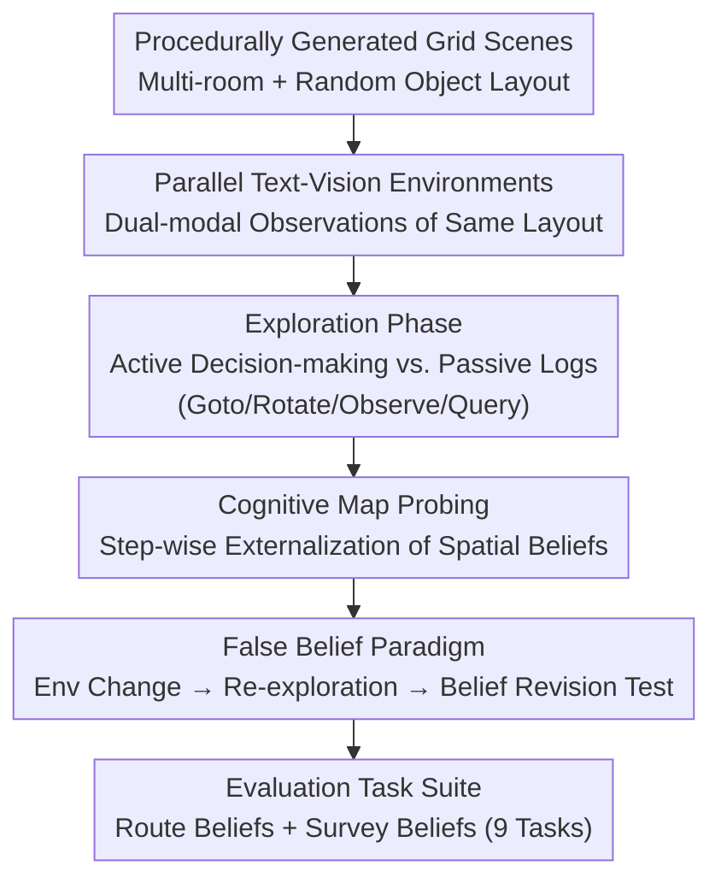

# Theory of Space: Can Foundation Models Construct Spatial Beliefs through Active Exploration?

**Conference**: ICLR 2026  
**arXiv**: [2602.07055](https://arxiv.org/abs/2602.07055)  
**Code**: [GitHub](https://github.com/mll-lab-nu/Theory-of-Space)  
**Area**: Spatial Intelligence / Embodied AI  
**Keywords**: Theory of Space, active exploration, spatial belief, cognitive map, partial observability, belief inertia

## TL;DR

The Theory of Space framework is proposed to systematically evaluate the ability of foundation models to construct and revise spatial beliefs through active exploration in both textual and visual environments. Utilizing cognitive map probing and the False Belief paradigm, the study reveals critical failure modes in current SOTA models, including the active-passive performance gap, exploration inefficiency, and belief inertia.

## Background & Motivation

**Background**: Multimodal foundation models (e.g., GPT-5.2, Gemini-3 Pro) excel in passive multimodal perception and reasoning. In spatial intelligence, existing benchmarks fall into two categories: (1) **Passive benchmarks** (spatial reasoning given complete observations), such as various VQA and spatial relationship datasets; (2) **Task-driven benchmarks** (e.g., "Find the red chair"), which evaluate specific goal completion. However, the core capability of spatial intelligence—**active and autonomous information acquisition to build a global spatial understanding** in partially observable environments—has not been systematically studied.

**Limitations of Prior Work**: Existing benchmarks cannot answer the critical question: "Does the model truly understand space?" Passive benchmarks bypass the challenge of information acquisition—the model does not need to decide "what to look at next." Task-driven benchmarks couple exploration and reasoning, making it impossible to diagnose specific causes of failure. Furthermore, there is no direct method to "open up" the internal spatial representation of a model to inspect the quality of its spatial beliefs, forcing reliance on indirect inference from task performance.

**Key Challenge**: Cognitive science research indicates that **active exploration** leads to significantly better spatial understanding than passive reception of the same information. Do foundation models possess this active exploration capability? Can they autonomously decide "where to look" under uncertainty and integrate serialized local observations into globally consistent spatial beliefs?

**Goal**: (1) Define and formalize "Theory of Space" as a capability dimension; (2) Construct a controllable benchmark that decouples exploration from reasoning; (3) Directly probe the quality of internal spatial beliefs rather than just task outcomes; (4) Test the ability to revise spatial beliefs in dynamic environments (benchmarking against False Belief in Theory of Mind).

**Key Insight**: Analogous to Theory of Mind (evaluating an agent's ability to model others' mental states), Theory of Space is proposed to evaluate an agent's ability to model unseen spatial structures. The core innovation is **Belief Probing**—requiring the model to externalize its internal spatial belief as a cognitive map at every step of exploration, enabling direct measurement of spatial model quality rather than black-box inference.

**Core Idea**: Directly evaluate the ability of foundation models to actively construct and dynamically revise spatial beliefs through cognitive map probing and the False Belief paradigm.

## Method

### Overall Architecture

Theory of Space redefines "spatial intelligence" as an active decision-making problem: an Agent does not passively receive complete observations but must decide "where to look next" in a partially observable environment and integrate local observations into a globally consistent spatial belief. This capability is decomposed into three operations: **Constructing** global beliefs, **Revising** beliefs after environmental changes, and **Exploiting** beliefs to complete tasks. The benchmark consists of two stages: In the **Exploration Stage**, the Agent actively collects information via movement, rotation, and observation; in the **Reasoning Stage**, it answers 9 types of spatial questions based on constructed beliefs. Parallel text and vision environments (sharing the same layout) are provided with two evaluation settings—Active (autonomous exploration) and Passive (scripted exploration logs)—to quantify the performance degradation caused by the exploration process.

### Key Designs

**1. Parallel Text-Vision Environments: Decoupling Visual Perception from Spatial Reasoning**
A major issue in single-modal evaluation is the inability to distinguish whether a model failed because it "couldn't see" or "couldn't reason." This work runs parallel text and vision environments on identical layouts. Scenes are procedurally generated $N \times M$ grids with multiple rooms and $n$ objects. The **Text World** discretizes observations into symbolic direction-distance descriptions (e.g., "chair is front-left and near"), stripping away perceptual noise to focus on pure spatial reasoning. The **Visual World** uses ThreeDWorld + Objaverse to render egocentric RGB images, forcing end-to-end perception and reasoning.

**2. Cognitive Map Probing: Measuring Belief Quality Directly**
Behavioral success can be deceptive—a model might find an object by luck while its internal belief is chaotic. This benchmark requires the model to externalize its cognitive map (estimated positions and orientations of all objects) at each step, scored across four dimensions: (D2-1) **Correctness** (composite accuracy of position/direction); (D2-2) **Perceptual Quality** (accuracy of converting single-step observations); (D2-3) **Self-Tracking** (accuracy of modeling its own pose); and (D2-4) **Stability & Consistency** (whether information degrades over time or local/global maps contradict). It also includes (D3) **Uncertainty Modeling**—checking if the model correctly identifies unobserved areas using F1 scores.

**3. False Belief Paradigm & Belief Inertia: Testing Belief Plasticity**
Real-world environments are dynamic. Borrowing from Theory of Mind, a False Belief test is implemented: after initial exploration, the environment is modified (objects moved/rotated). The agent must re-explore and identify changes. This revealed a key phenomenon—**Belief Inertia**: models often cling to outdated spatial priors even after observing new evidence, failing to overwrite stale beliefs with fresh sensory data, particularly in visual models.

**4. Route/Survey Dual-Tier Task System: Separating Navigation from Global Understanding**
Following cognitive science principles (Siegel & White), the reasoning stage is split into 9 tasks across two axes: **Route Beliefs** (egocentric, path-based understanding like perspective taking and direction inference) and **Survey Beliefs** (allocentric, global map representations like coordinate mapping and mental rotation). All tasks use open-ended Q&A to prevent guessing and ensure rigorous evaluation.

## Key Experimental Results

### Active Exploration Performance (Visual World)

| Model | Avg Steps | Route Avg | Survey Avg | Total Avg |
|------|---------|--------------|---------------|--------|
| GPT-5.2 | 17.2 | 44.2 | 48.0 | **46.0** |
| Gemini-3 Pro | 13.6 | 52.1 | 62.8 | **57.3** |
| Claude-4.5 Sonnet | 19.6 | 24.9 | 34.2 | **29.6** |
| Qwen3-VL | 16.3 | 19.6 | 23.3 | **21.3** |
| Human | 9.8 | — | — | **96.4** |

### Active-Passive Gap (Passive vs. Active, Visual World Total Avg)

| Model | Passive | Active | Gap |
|------|------|------|------|
| GPT-5.2 | 57.1 | 46.0 | **-11.1** |
| Gemini-3 Pro | 60.5 | 57.3 | **-3.2** |
| Claude-4.5 Sonnet | 43.1 | 29.6 | **-13.5** |
| Qwen3-VL | 24.9 | 21.3 | **-3.6** |

### Key Findings

- **Ubiquitous Active-Passive Gap**: All models perform worse during active exploration compared to receiving the same information passively. This indicates that exploration strategy itself is a bottleneck—models do not know "what to look at."
- **Extreme Exploration Inefficiency**: While rule-based agents reach target coverage in ~9 steps, foundation models require $\ge 14$ steps without achieving better belief accuracy, showing high redundancy by repeatedly observing known areas.
- **Perception is the Initial Bottleneck, Stability is the Persistent One**: In the visual world, perceptual accuracy is the first hurdle. However, even with correct perception, global beliefs degrade over time due to **lack of stability**—spatial information is "forgotten" or "overwritten" in subsequent steps.
- **Severe Belief Inertia in Visual Models**: In False Belief tests, visual models struggle to update their beliefs even after direct observation of changes, revealing a fundamental flaw in the plasticity of their spatial memory.
- **Large Text-Vision Gap**: GPT-5.2 scores 72.0 in the Text World active exploration but only 46.0 in the Visual World, quantifying the massive drag visual perception imposes on spatial understanding.

## Highlights & Insights

- **Conceptual Framework of Theory of Space**: Applying the logic of Theory of Mind to spatial intelligence provides a long-term paradigm for evaluating how agents model the physical world.
- **Direct Evaluation via Probing**: Moving beyond black-box task performance, the method externalizes internal beliefs for multi-dimensional diagnostic evaluation.
- **Discovery of Belief Inertia**: The discovery that models actively resist updating stale beliefs with new evidence highlights a critical limitation in current representation update mechanisms.
- **Parallel Text-Vision Design**: This setup allows precise isolation of "perceptual failure" versus "reasoning failure," providing a clear roadmap for future improvements.

## Limitations & Future Work

- **Simplified Grid Worlds**: The environment uses 2D grid layouts with discrete coordinates, which is significantly simpler than real-world 3D complexity.
- **Single-Agent Scope**: The study does not address multi-agent collaborative exploration or spatial belief alignment, which are core challenges in multi-robot systems.
- **Poor Open-Source Performance**: Models like Qwen3-VL perform poorly (14-21 points vs. 96 for humans), suggesting that the bottleneck for smaller models remains low-level visual-spatial perception.
- **Format Dependency**: The quality of externalized cognitive maps might be affected by the model's sensitivity to specific output formats (e.g., JSON vs. tables).

## Related Work & Insights

- **vs. Passive Spatial Reasoning (e.g., SpartQA)**: Passive benchmarks bypass the information acquisition process. Theory of Space shows that passive reasoning performance does not predict active exploration success.
- **vs. Task-Driven Navigation (e.g., ALFRED, ObjectNav)**: These focus on task completion rates but fail to diagnose the quality of internal representations. Theory of Space shifts the focus from "doing the task right" to "modeling the space correctly."
- **vs. Theory of Mind**: While ToM focuses on social/mental modeling, ToS focuses on physical/spatial modeling. Both emphasize reasoning about latent states not directly observable.

## Rating

- Novelty: ⭐⭐⭐⭐⭐ 
- Experimental Thoroughness: ⭐⭐⭐⭐⭐ 
- Writing Quality: ⭐⭐⭐⭐ 
- Value: ⭐⭐⭐⭐⭐

<!-- RELATED:START -->

## Related Papers

- [\[ICLR 2026\] From Spatial to Actions: Grounding Vision-Language-Action Model in Spatial Foundation Priors](from_spatial_to_actions_grounding_vision-language-action_model_in_spatial_founda.md)
- [\[ICLR 2026\] Policy Contrastive Decoding for Robotic Foundation Models](policy_contrastive_decoding_for_robotic_foundation_models.md)
- [\[ICML 2025\] SENSEI: Semantic Exploration Guided by Foundation Models to Learn Versatile World Models](../../ICML2025/robotics/sensei_semantic_exploration_guided_by_foundation_models_to_learn_versatile_world.md)
- [\[ICLR 2026\] From Seeing to Experiencing: Scaling Navigation Foundation Models with Reinforcement Learning](from_seeing_to_experiencing_scaling_navigation_foundation_models_with_reinforcem.md)
- [\[ICLR 2026\] Align-Then-stEer: Adapting the Vision-Language Action Models through Unified Latent Guidance](align-then-steer_adapting_the_vision-language_action_models_through_unified_late.md)

<!-- RELATED:END -->
