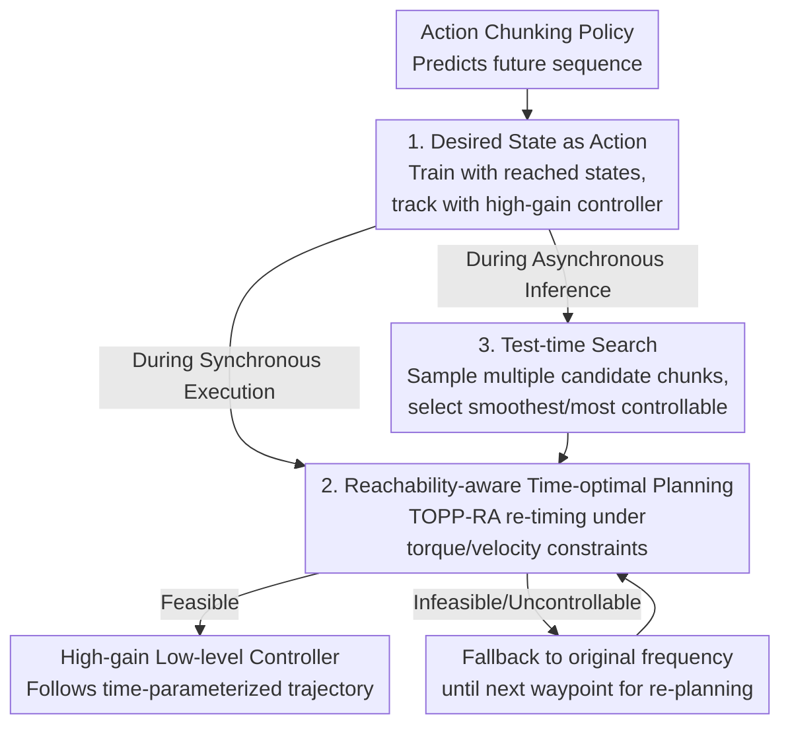

# Time Optimal Execution of Action Chunk Policies Beyond Demonstration Speed

**Conference**: ICLR 2026  
**OpenReview**: [https://openreview.net/forum?id=INsLvSCJ4z](https://openreview.net/forum?id=INsLvSCJ4z)  
**Project Page**: [https://clvrai.github.io/RACE/](https://clvrai.github.io/RACE/)  
**Code**: To be open-sourced (Paper promises release of full code and configurations)  
**Area**: Robotics / Imitation Learning / Action Chunking Acceleration  
**Keywords**: Imitation Learning, Action Chunking, Time-Optimal Path Parameterization, Asynchronous Inference, Test-time Search

## TL;DR
Addressing the issue where imitation learning (including VLA) execution speed is bottlenecked by demonstration speed, this paper proposes RACE: it redefines "actions" as desired states, performs reachability-aware time-optimal re-timing for each action chunk, and utilizes test-time search to select the smoothest and most controllable future chunks. It doubles execution speed compared to demonstrations and quadruples it compared to original policies without sacrificing success rates.

## Background & Motivation

**Background**: Modern robotic manipulation primarily relies on imitation learning — Transformer / Diffusion policies (e.g., ACT, Diffusion Policy) and large-scale pre-trained Vision-Language-Action (VLA) models. They commonly employ **action chunking**: the policy predicts a future sequence of actions at once, then executes several steps open-loop before re-inferring. This stabilizes temporal consistency, shortens the effective decision horizon, and improves precision and generalization.

**Limitations of Prior Work**: These methods have structural defects in terms of **speed**. Since they mimic the behavior of demonstration data, their execution speed is locked to the demonstration speed. Teleoperation interfaces are often unintuitive, leading to slow demonstrations, especially for high-precision tasks (e.g., peg-in-hole, furniture assembly), resulting in sluggish policy execution. In industrial throughput scenarios, speed is as critical as precision and generalization.

**Key Challenge**: Intuitively, increasing action execution frequency should accelerate performance, but naive frequency increases lead to immediate failure. First, **changing frequency alters the underlying transition dynamics**: low-level controllers (e.g., PD controllers) exert force based on the error between the current state and the command. When the execution time for each action is compressed, the controller fails to push the robot to the target state before switching to the next command, generating what the authors call "state error," which **accumulates progressively** within open-loop chunks. Meanwhile, high-speed motion may exceed joint torque/velocity limits, becoming physically unreachable. Second, when **asynchronous inference** is used to eliminate inference pauses, new action chunks are calculated based on "outdated robot states" — the robot has already moved during inference. This misalignment between the new plan and the actual state decreases controllability and further amplifies errors.

**Goal**: Accelerate imitation policies of arbitrary predicted action chunks to **exceed demonstration speeds** without sacrificing precision or generality, while simultaneously addressing "state errors caused by frequency changes" and "misalignment caused by asynchronous inference."

**Key Insight**: Instead of the heavy path of Reinforcement Learning for policy refinement through rollouts, the authors maintain the simplicity of pure imitation learning — keeping the learned action sequence content unchanged but altering "how to follow the sequence at higher speeds." The key observation is that errors stem from the "action command + fixed timing" interface. By replacing the imitation target with **desired states** and allowing **optimal control** to adaptively schedule timing, the transition dynamics become robust to execution timing.

**Core Idea**: Replace "action commands" with "desired states" as the imitation target, then use Time-Optimal Path Parameterization (TOPP-RA) to perform **adaptive re-timing** for each state chunk under physical constraints. Finally, use a test-time Best-of-N search to pick the smoothest and most controllable future chunk to combat asynchronous misalignment. Collectively, these form RACE (Reachability-aware Accelerated Chunk Execution).

## Method

### Overall Architecture
RACE solves "how to run a pre-trained imitation policy faster than demonstrations without dropping success rates." It does not re-learn action content but modifies the **imitation target, execution timing, and chunk selection** in a sequential pipeline. During training, the policy is trained to predict "desired state trajectories" instead of action commands. During inference, the current action chunk is interpolated into a geometric path, and TOPP-RA solves for the fastest time parameterization under torque/velocity constraints. When using asynchronous inference to eliminate pauses, test-time search selects the trajectory with the minimum curvature and highest controllability from multiple candidate chunks sampled by the policy for TOPP solving and execution. These three components sequentially address "frequency-induced failure → unreachability → asynchronous misalignment."

### Key Designs

**1. Desired States as Actions: Making Dynamics Robust to Timing**

This step targets the pain point where "increased frequency changes dynamics and accumulates state error." The root cause is that conventional imitation learning uses "action commands" as the target. These commands are inputs to low-level controllers, which require sufficient execution time to reach the corresponding state. When frequency increases, the force application time for PD controllers is insufficient, leaving the robot in a **state different from the desired one**, and errors snowball. RACE directly mimics the **actually reached states** from demonstrations — training or fine-tuning policies with (state, next state) pairs instead of (state, action) pairs. Predicted desired states are then used as commands for the low-level controller. This introduces a key degree of freedom: execution can **switch to a higher-gain controller** than the one used during teleoperation to precisely track desired states, as higher gains exert more force to pull the robot to the target pose in less time. This is not feasible during teleoperation (where high gain makes the robot twitchy) but is ideal for autonomous execution. Essentially, "desired state + high-tracking controller" changes transition dynamics from "timing-sensitive" to "timing-robust," building the foundation for acceleration.

**2. Reachability-aware Time-optimal Planning: Maximizing Speed per Chunk**

Simply switching to desired states is insufficient; as acceleration increases and desired states move further from the current state, high-gain controllers will hit torque constraints, becoming physically unreachable. RACE adaptively determines how much to accelerate each step. For a state chunk (sequence of waypoints) generated by the policy, it uses cubic spline interpolation for the geometric path $q(s) \in \mathbb{R}^n$ (where $s$ is the scalar path parameter, using current velocity as a boundary condition). TOPP-RA (Time-Optimal Path Parameterization via Reachability Analysis) is then applied. TOPP-RA projects the generalized second-order constraints $A(q)\ddot{q} + \dot{q}^\top B(q)\dot{q} + f(q) \in \mathcal{C}$ into phase space, expressed as path constraints using squared velocity $x=\dot{s}^2$ and pseudo-acceleration $u=\ddot{s}$:

$$a(s)u + b(s)x + c(s) \in \mathcal{C}(s),\quad a=Aq',\ b=Aq''+q'^\top Bq',\ c=f$$

The algorithm discretizes the path into $s_0,\dots,s_N$, performing **backward propagation** to recursively find the "controllable set $\mathcal{K}_i$" (states that can reach $\mathcal{K}_{i+1}$), then **forward propagation** starting from $\mathcal{K}_0$ to greedily select the highest possible $x$ in the next controllable set. This yields the **fastest** time parameterization under torque and velocity constraints. Boundary conditions are set as $\dot{s}_0^2=1$, $\dot{s}_{N,\min}^2=0$, and $\dot{s}_{N,\max}^2=1$. When the initial state is not in $\mathcal{K}_0$ (no feasible solution), RACE **falls back to the original control frequency** and continuously re-plans until a feasible solution appears, ensuring it does not lose control due to forced acceleration.

**3. Test-time Search: Best-of-N Selection for Asynchronous Misalignment**

Asynchronous inference eliminates pauses but introduces the challenge of predicting actions for uncertain future states. During the inference window, the robot drifts, and the actual state $x_{\text{current}}$ at the time the new chunk arrives might be **uncontrollable relative to the new trajectory** (instantaneous torque needed to merge exceeds limits). furthermore, generative policies are probabilistic; small variations in state or noise can cause the new chunk to be **topologically inconsistent** with the currently executing one, forming sharp discontinuities at hand-over points. RACE's insight is that the **path curvature $q''$** at the handover point is the dominant factor for feasibility. It uses Best-of-N sampling to generate multiple candidate chunks and scores them based on smoothness:

$$J(q(s)) = \frac{s_{\text{end}}}{\int_0^{s_{\text{end}}} \|q''\|^2 \, ds}$$

(The numerator $s_{\text{end}}$ provides length normalization; $q(s_{\text{end}})$ can target an intermediate action). Why does selecting minimal curvature work? Looking at constraint coefficients, $q''$ only appears in $b(s)$, the coefficient of $\dot{s}^2$. Multiple candidates are conditioned on the same initial state $(q(0), q'(0))$; within a short horizon, position $q$ varies little, so significant changes in tangent $q'$ necessarily require large $q''$. Thus, $q''$ is the most sensitive differentiator. Smaller curvature $\to$ smaller $|b(s)|$ $\to$ larger feasible control sets for each $\dot{s}^2$ $\to$ larger volume of the controllable set $\mathcal{K}_0$. This makes the robot's current state more likely to remain within the controllable set after drift, facilitating TOPP in finding high-speed solutions. While similar to MPC, RACE **uses the imitation policy itself as a generative sampler** (preserving the naturalness of human demos) and optimizes for "controllability volume" rather than random/gradient samples.

### Loss & Training
The only training change is replacing the imitation target "action command" with "reached state." Diffusion policies/VLAs are trained or fine-tuned on (state, next state) pairs. The loss follows the original policy's imitation objective and does not introduce RL rollouts. The inference components (TOPP-RA and Best-of-N search) are training-free and can be directly applied to any policy predicting action chunks, demonstrating its "policy-agnostic and task-agnostic" nature. For fair comparison, gripper speed was uniformly increased for both Ours and all baselines during accelerated execution.

## Key Experimental Results

### Main Results
Simulation utilized Robomimic’s Lift, Can, Square, and Tool Hang (the latter two requiring high-precision insertion). Policies were Diffusion Policies with a prediction horizon $T_p=32$, trained on 200 PH demos. Evaluation used Pareto curves of "success rate" vs "acceleration ratio relative to demos (average success duration / average demo duration)." Conclusion: RACE achieved Pareto optimality with or without inference latency, reaching up to 2× acceleration without success rate degradation. Advantage was particularly pronounced in precision tasks (Square, Tool Hang). Naive Action/State Fast-forward showed significant success rate drops due to state error accumulation. Direct comparison with the acceleration method SAIL (on Robomimic with torque constraints):

| Task | SAIL Succ. | SAIL Accel. | RACE Succ. | RACE Accel. |
|------|------------|------------|------------|------------|
| Lift | 0.930 | 2.520 | 0.995 | 2.068 |
| Can | 0.890 | 1.970 | 0.965 | 1.805 |
| Square | 0.750 | 1.620 | **0.805** | **1.819** |
| Tool Hang | 0.610 | 0.940 | **0.715** | **2.053** |

RACE surpassed SAIL in success rate across all tasks and achieved higher acceleration in precision tasks (improving Tool Hang from 0.94× to 2.05×). Unlike SAIL, which requires task-specific acceleration rate tuning and conditional model training, RACE adaptively selects acceleration rates task-agnostically during inference using TOPP and bypasses conditional models via test-time search.

Real-robot experiments further verified: on high-precision Door Insertion (FurnitureBench), RACE's completion speed **exceeded all baselines including 8× frequency increases**, maintaining original success rates. On throughput-intensive Fruit Packaging / Trash Cleaning (finetuned on π0.5), RACE achieved the highest cumulative success count, roughly **doubling VLA throughput**. In semi-dynamic Conveyor Picking (2.5× unseen speed), all baselines failed (0% success), while RACE maintained a success rate of 0.53 and an acceleration ratio of 2.02×.

### Ablation Study

| Configuration | Key Observation | Mechanism |
|------|---------|------|
| Action Fast-forward | Highest joint error, accumulates per chunk | Frequency increase only, open-loop state error accumulation |
| State Fast-forward | Slight error reduction, limited Pareto gain | Reached state representation only, lacks time-optimal planning |
| RACE (incl. TOPP) | Lowest joint error, highest succ./speed | Reachability re-timing is critical for precision tasks |
| RACE w/o TTS | Low smoothness/controllability, high error | Throughput drops under high inference latency |
| RACE (incl. TTS) | ↑Smoothness ↑Controllability ↑Consistency ↓Error | Test-time search combats asynchronous misalignment |

### Key Findings
- **Time-optimal planning is the decisive factor for precision tasks**: Simply switching to desired states (State Fast-forward) yields limited Pareto improvement. Reachability-aware TOPP re-timing is necessary to minimize errors and accelerate precision tasks, proving "state error" stems primarily from physical constraints rather than target representation.
- **TTS improves robustness via the "smoothness $\to$ controllability" link**: Test-time search simultaneously improves smoothness and controllable set ($\mathcal{K}_0$) volume. Larger controllability allows for more accurate trajectory tracking and lower joint errors, while **implicitly** promoting consistency between chunks (without explicit targets like inpainting), maintaining throughput even under 0.2s induced latency.
- **Precision tasks benefit most**: RACE shows the largest relative gains in Square, Tool Hang, and Door Insertion. The authors hypothesize this is because it constrains the robot to in-distribution states, avoiding OOD scenarios and reducing failures and sluggishness.

## Highlights & Insights
- **Frames "acceleration" as a "control feasibility" problem**: Instead of focusing on frequency increases, distillation, or parallel decoding, this work identifies the true bottleneck as "altered dynamics in short horizons + physical reachability," solving it with classical optimal control (TOPP-RA) rather than more data.
- **Ingenious Test-time Search objective**: Translates the abstract goal of "maximizing controllable set volume" into a directly computable path smoothness integral $J$ via the relationship between $b(s)$ and curvature $q''$, giving Best-of-N a physically grounded scoring function.
- **Policy-agnostic, task-agnostic, minimal training changes**: The only training change is the imitation target; inference components are plug-and-play and can be layered onto any action-chunking policy like Diffusion Policy or π0.5.
- **Transferable Trick**: The test-time alignment paradigm of "using generative policies as samplers + physical objective scoring" can be extended to other scenarios requiring selection of actions under physical constraints.

## Limitations & Future Work
- The method depends on the **modelability of physical constraints** (torque/velocity) and the solvability of TOPP-RA. Frequent uncontrollability of initial states causes fallbacks to original frequencies, diminishing acceleration gains.
- TTS introduces Best-of-N sampling, requiring multiple forwards and **introducing its own inference overhead**. While complementary to inference acceleration methods, the tradeoff between $N$ and total latency is not deeply explored.
- Desired states rely on the **ability to use high-gain controllers**, implying requirements for controller quality and robot torque margins; applicability to compliant or under-actuated robots remains uncertain.
- Evaluation is primarily on Robomimic and specific real-world tasks; the validity of the "desired state trajectory" paradigm in highly dynamic, contact-rich, or force-controlled tasks requires further verification.

## Related Work & Insights
- **vs SAIL**: Both use "state as action" to mitigate dynamic changes, but SAIL relies on a conditional model trained on geometric complexity to decide acceleration. RACE adaptively selects rates via TOPP and uses test-time search to replace conditional models, outperforming SAIL in both success and precision-task speed.
- **vs Real-Time Chunking / inpainting (RTC, Black et al. 2025)**: These use inpainting for consistency but do not explicitly guarantee physical feasibility. RACE ensures follow-ability at high speeds through "solvability" by minimizing curvature, with consistency being a byproduct of smoothness.
- **vs DemoSpeedup**: Accelerates during training via entropy-based downsampling. This is complementary to RACE and can be stacked for additional gains.
- **vs Inference Acceleration (few-step diffusion / parallel decoding)**: These reduce inference latency, but "fast inference" does not equal "fast execution." RACE targets execution speed directly; the two approaches are orthogonal and combinable.

## Rating
- Novelty: ⭐⭐⭐⭐⭐ Reframes acceleration as "state representation + optimal re-timing + test-time physical search," distinct from existing literature.
- Experimental Thoroughness: ⭐⭐⭐⭐ Simulation and real-robot coverage of precision, throughput, and semi-dynamic tasks, including direct SAIL comparison and ablations. Lacks systematic analysis of fallback frequencies and $N$.
- Writing Quality: ⭐⭐⭐⭐ Clear problem decomposition, with each component mapped to a specific challenge. Derivations (curvature to controllability) are thorough.
- Value: ⭐⭐⭐⭐⭐ Policy-agnostic, minimal training changes, stackable on VLAs. Directly addresses the speed bottleneck in imitation learning for industrial throughput.

<!-- RELATED:START -->

## Related Papers

- [\[ICLR 2026\] Real-Time Robot Execution with Masked Action Chunking](real-time_robot_execution_with_masked_action_chunking.md)
- [\[ICLR 2026\] Verifier-Free Test-Time Sampling for Vision-Language-Action Models](verifier-free_test-time_sampling_for_vision-language-action_models.md)
- [\[ICLR 2026\] Action Chunking and Exploratory Data Collection Yield Exponential Improvements in Behavior Cloning for Continuous Control](action_chunking_and_data_augmentation_yield_exponential_improvements_in_behavior.md)
- [\[ICLR 2026\] Robust Finetuning of Vision-Language-Action Robot Policies via Parameter Merging](robust_fine-tuning_of_vision-language-action_robot_policies_via_parameter_mergin.md)
- [\[ICLR 2026\] Contractive Diffusion Policies](contractive_diffusion_policies.md)

<!-- RELATED:END -->
## Related Papers

- [\[ICLR 2026\] Real-Time Robot Execution with Masked Action Chunking](real-time_robot_execution_with_masked_action_chunking.md)
- [\[ICLR 2026\] Verifier-Free Test-Time Sampling for Vision-Language-Action Models](verifier-free_test-time_sampling_for_vision-language-action_models.md)
- [\[ICLR 2026\] Robust Finetuning of Vision-Language-Action Robot Policies via Parameter Merging](robust_fine-tuning_of_vision-language-action_robot_policies_via_parameter_mergin.md)
- [\[ICLR 2026\] Action Chunking and Exploratory Data Collection Yield Exponential Improvements in Behavior Cloning for Continuous Control](action_chunking_and_data_augmentation_yield_exponential_improvements_in_behavior.md)
- [\[ICLR 2026\] Contractive Diffusion Policies](contractive_diffusion_policies.md)

<!-- RELATED:END -->
